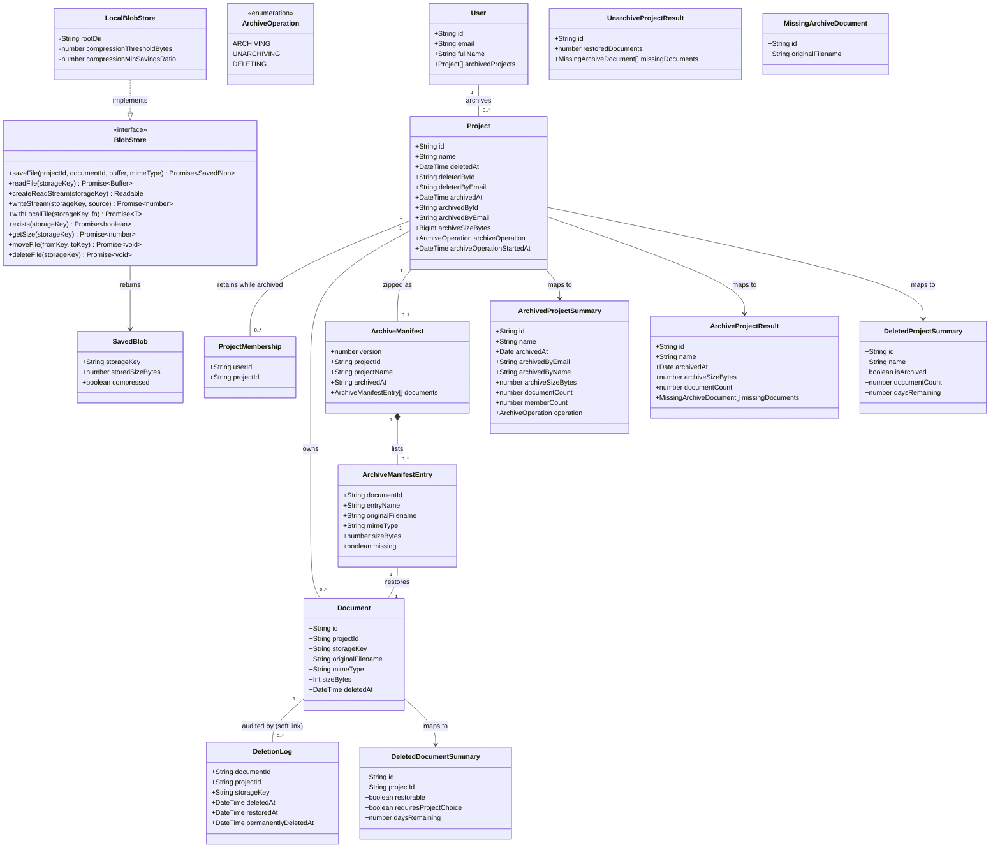

# Phase 4 – Project Archive & Project-Based Storage Structure

## Requirements

- Let admins archive a completed project into a single, self-describing zip. While a project is archived it is invisible in every main view and read-only for everyone. Restoring it (unarchive) is lossless: files, extracted text, filter values and memberships all come back unchanged.
- Give admins a real archive page. It lists archived projects with archived date and actor, zip size and document count, and offers download without unarchiving, restore (unarchive), and delete (to the recycle bin).
- Make deleting an archived project recoverable. It goes through the existing 30-day recycle bin, and a restore within the window returns the project to **Archived**, not Active.
- Reorganise blob storage under a root folder set by environment variable into `active/{projectId}/`, `archived/{projectId}.zip` and `deleted/{projectId}/`, on local disk only, so Phase 5 can map it 1:1 onto OneDrive. Migrate existing files and keys once, with an idempotent script.
- Add transparent, lossless compression at write time for files above a configurable threshold (default 5MB). Keep the compressed copy only if it saves a configurable minimum (default 10%). Every reader always receives the original bytes.
- Boundaries: no OneDrive API work, no job queue (operations run synchronously in the request), no archive history table, no member notifications, no runtime storage-root setting, and no changes to the 30-day retention rules.

## Entities

## Approach

1. **Project lifecycle & state model**
   - Extend `Project` (do not replace the soft-delete trio) with `archivedAt`, `archivedById`, `archivedByEmail`, `archiveSizeBytes`, plus a persisted in-progress marker, `archiveOperation` + `archiveOperationStartedAt`.
   - The lifecycle is derived from these fields. **Active**: `deletedAt` null, `archivedAt` null. **Archived**: `archivedAt` set, `deletedAt` null. **Deleted-from-Active**: `deletedAt` set, `archivedAt` null. **Deleted-from-Archived**: both set. Any non-null `archiveOperation` means an archive, unarchive or delete is in flight, so all writes are refused.
   - Keeping `archivedAt` set while an archived project sits in the recycle bin is what makes a recycle-bin restore return it to Archived, with no extra state.
   - All state changes use the claim-first pattern already used in `RecycleBinService`: a conditional `updateMany` claims the row, and `count === 0` means another actor won or the state is wrong.

2. **Archive mechanics (storage-agnostic)**
   - **Archive.** Claim the project (ARCHIVING). Stream every live document's original bytes (`BlobStore.createReadStream`) into an `archiver` zip written via `BlobStore.writeStream` to a temporary key, alongside a `manifest.json`. Verify the zip by re-reading it with `yauzl` and checking entry presence and sizes against the manifest. Move it to `archived/{projectId}.zip`, then flip the DB state in an interactive transaction. That transaction re-checks the document set, so an upload that slipped in aborts the archive. Only after the flip are the original blobs deleted. Finally release the marker.
   - **Unarchive.** Claim (UNARCHIVING). Read the manifest, then extract each listed entry and re-save it through `BlobStore.saveFile`, which re-applies the compression policy and returns the new key. Flip `Document.storageKey` values and clear the archive fields in one transaction, delete the zip, then release the marker.
   - **Download.** Stream the stored zip unchanged.
   - **Zip entries.** Entries use human-readable, sanitised and de-duplicated names under `files/`, so the admin download is useful outside the app. Restoration is driven solely by the manifest (`documentId → entryName`); entry names are never used as filesystem paths, which removes any zip-slip risk.
   - **Missing blobs (Q5).** A document whose blob is missing is recorded as `missing: true` in the manifest and returned to the admin as a warning; the archive still completes. On unarchive such documents keep their key with no file, exactly as before.
   - **Compression levels.** Use deflate level 6 for PDFs and the manifest, and `store: true` (no deflate) for JPEG/PNG, which are already compressed.

3. **Visibility & read-only enforcement**
   - Two shared Prisma predicates: `LIVE_PROJECT_WHERE = { deletedAt: null, archivedAt: null }` for reads, and `WRITABLE_PROJECT_WHERE = { ...LIVE_PROJECT_WHERE, archiveOperation: null }` for writes.
   - Apply them to every read and write path that currently checks only `Document.deletedAt`, including the admin bypass (Q4). That covers document list/search/details/text/status counts/delete, download/export, project list, upload, and recycle-bin restore destinations.
   - Archived projects are read-only (Q6). Rename, membership add/remove, and the normal project delete return `409 Conflict`. Documents in archived projects return `404`, consistent with the existing "don't leak scope" rule.

4. **Storage restructure & compression**
   - `LocalBlobStore` reads `STORAGE_ROOT` (default `./data`), `COMPRESSION_THRESHOLD_BYTES` (default `5242880`) and `COMPRESSION_MIN_SAVINGS_RATIO` (default `0.1`) from `ConfigService`. Invalid values fall back to the defaults with a warning.
   - Keys are built only by a new `storage-keys.ts` module. Formats: `active/{projectId}/{documentId}{ext}[.gz]`, `deleted/{projectId}/{documentId}{ext}[.gz]`, `archived/{projectId}.zip`, `archived/{projectId}.zip.partial`, and `deleted/{projectId}/archive.zip`.
   - **Soft delete** moves `active/P/f → deleted/P/f`. **Restore** moves the file to `active/{destinationProjectId}/f`, so a document restored into another project also lands in that project's folder. **Purge** only ever unlinks keys under `deleted/`.
   - **Compression** is decided inside `saveFile`. If the buffer exceeds the threshold, gzip it and keep the result only if `compressed.length <= original.length × (1 − ratio)`; the key then gets a `.gz` suffix. The `.gz` suffix is the compression marker, so no schema change is needed. `readFile` and `createReadStream` decompress transparently. No skip-list by mime type: the savings guard decides.
   - Remove the local-path leak: `getPath` and the unused `getFile` are deleted. Download and export read through `BlobStore`. Extraction and OCR run on the in-memory upload buffer.
   - **Migration (Q11).** A one-off idempotent script (`npm run storage:migrate [-- --dry-run]`) moves legacy `{userId}/…` and `deleted/{userId}/…` blobs to the project layout and rewrites `Document.storageKey`. `DeletionLog.storageKey` is **not** rewritten: the audit trail stays immutable, and restore no longer reads it.

5. **Recycle-bin integration (Q1)**
   - Deleting an archived project from the archive page:
     1. Claim it (DELETING).
     2. Move the zip `archived/{id}.zip → deleted/{id}/archive.zip`.
     3. In one transaction, soft-delete the project and its live documents with a shared timestamp and write one `DeletionLog` row per document. This is the same contract as `ProjectsService.deleteProject`, but with no per-document file moves.
   - `RecycleBinService` learns about **zip-backed deleted projects** (`archivedAt` and `deletedAt` both set):
     - **Restore** moves the zip back to `archived/` and clears `deletedAt` on the project and its swept documents, with no per-document moves. The project is then Archived again.
     - **Purge** and **permanent delete** remove the zip.
     - **Drill-down** flags swept documents `restorable: false`. Documents that were recycled individually before the project was archived remain individually restorable into a live project.

6. **Technical choices**
   - Add one dependency: `yauzl` plus `@types/yauzl`, for random-access zip reading. `archiver` (already present) is used for writing.
   - `BlobStore.withLocalFile` gives `yauzl` a real path without leaking paths into services. A future OneDrive store would download to a temp file there.
   - `archiveSizeBytes` is `BigInt` because Prisma `Int` is 32-bit and archives can exceed 2 GB. Services convert it with `Number(...)` before returning JSON.
   - Synchronous execution, consistent with "Synchronous Processing First". Node's HTTP server has no response timeout by default, and the persisted marker plus boot-time recovery (`OnApplicationBootstrap`) make a crash or disconnect safe.
   - Single-instance assumption, as for `PurgeTask`: boot-time recovery treats any in-flight marker as abandoned.

7. **Error handling**
   - Rely on Nest's built-in exception layer (`HttpException` subclasses from `@nestjs/common`, rendered as `{ statusCode, message, error }`). No custom global filter is introduced, consistent with the codebase.
   - Status mapping: `403 ForbiddenException` for non-admins on archive endpoints (same as `RecycleBinController`); `404 NotFoundException` when the project or archive file doesn't exist in the required state; `409 ConflictException` for a wrong lifecycle state, an operation already in progress, a read-only violation, or the project changing during archive; `400 BadRequestException` for invalid restore requests (e.g. per-document restore of a zip-backed document).
   - Filesystem errors are logged with keys and paths via `Logger`, but client messages never include filesystem paths.

## Structure

### Inheritance Relationships
1. `BlobStore` interface defines the storage contract (project-keyed save with compression, original-bytes reads, raw stream writes, local-file access, existence/size, move, delete).
2. `LocalBlobStore` implements `BlobStore`, provided under the `BLOB_STORE` injection token by `StorageModule`.
3. `ArchiveService` implements `OnApplicationBootstrap` to recover interrupted archive operations at startup.
4. All errors are standard Nest `HttpException` subclasses (`NotFoundException`, `ConflictException`, `ForbiddenException`, `BadRequestException`). No custom exception hierarchy.

### Dependencies
1. `ArchiveController` injects `ArchiveService`; guarded by `JwtAuthGuard` plus an inline admin check (403).
2. `ArchiveService` depends on `PrismaService` and `BlobStore` (`BLOB_STORE`), and uses the `archive-zip.ts` helpers, `storage-keys.ts` and `project-visibility.ts`.
3. `LocalBlobStore` depends on `ConfigService` (global `ConfigModule`) and `storage-keys.ts`.
4. `DocumentsService` depends on `PrismaService`, `ExtractionService` (now buffer-based) and `BlobStore`, and uses `project-visibility.ts` and `storage-keys.ts`.
5. `ExportsService` depends on `PrismaService` and `BlobStore`, and uses `project-visibility.ts`.
6. `ProjectsService` depends on `PrismaService` and `BlobStore`, and uses `project-visibility.ts` and `storage-keys.ts`.
7. `RecycleBinService` depends on `PrismaService` and `BlobStore`, and uses `storage-keys.ts`, `project-visibility.ts` and `deletion.constants.ts` (retention only).
8. `ArchiveModule` imports `PrismaModule` and `StorageModule`; `AppModule` imports `ArchiveModule`.
9. `migrate-storage-layout.ts` bootstraps `StorageMigrationModule` (`ConfigModule`, `PrismaModule`, `StorageModule`) via `NestFactory.createApplicationContext`.
10. Client: `AdminArchive`, `ArchiveProjectModal` → `api/archive.ts`; `AdminRecycleBin` → `api/recycleBin.ts` (extended types); `AdminProjects` → `ArchiveProjectModal`.

### Layered Architecture
1. Controller Layer: `ArchiveController` (new), plus the existing `ProjectsController`, `DocumentsController`, `ExportsController` and `RecycleBinController` (unchanged signatures). These handle auth/admin checks, route params, and streaming responses.
2. Service Layer: `ArchiveService` (lifecycle state machine, zip orchestration, recovery), plus `DocumentsService`, `ExportsService`, `ProjectsService` and `RecycleBinService` (updated for the visibility predicates, the new key rules and zip-backed projects).
3. Domain helpers: `storage-keys.ts` (key formats and safety), `project-visibility.ts` (lifecycle predicates), `archive-zip.ts` (manifest, entry naming, zip read and verify), `deletion.constants.ts` (retention only).
4. Persistence Layer: Prisma (`schema.prisma` + migration `add_project_archive`) over SQLite.
5. Storage Layer: `BlobStore` / `LocalBlobStore` under `STORAGE_ROOT`.
6. Exception Handling Layer: Nest's built-in exception filter rendering `HttpException`s.
7. Client Layer: `api/archive.ts`, `api/recycleBin.ts`, `AdminArchive`, `AdminProjects`, `ArchiveProjectModal`, `AdminRecycleBin`.

## Operations

### 1. Add dependency - yauzl
1. In `server/`, run `npm install yauzl` and `npm install --save-dev @types/yauzl`.
2. Completion: both appear in `server/package.json`, and `npm run build` still succeeds.

### 2. Update Persistence - `server/prisma/schema.prisma` + migration
1. Responsibility: persist archive state and the in-progress marker.
2. Changes:
   - Add enum `ArchiveOperation { ARCHIVING UNARCHIVING DELETING }`.
   - `Project` gets these fields:
     - `archivedAt DateTime?`: set on archive, cleared on unarchive.
     - `archivedById String?` plus relation `archivedBy User? @relation("ProjectArchivedBy", fields: [archivedById], references: [id], onDelete: SetNull)`.
     - `archivedByEmail String?`: denormalised so it survives user deletion.
     - `archiveSizeBytes BigInt?`: stored zip size.
     - `archiveOperation ArchiveOperation?`: the in-progress marker.
     - `archiveOperationStartedAt DateTime?`
     - `@@index([archivedAt])`
   - `User` gets `archivedProjects Project[] @relation("ProjectArchivedBy")`.
   - Add a `///` doc comment above the new `Project` fields explaining the four derived lifecycle states and that `archivedAt` stays set while an archived project is in the recycle bin.
3. Run `npm run db:migrate -- --name add_project_archive` in `server/`, then `npm run db:generate`.
4. Constraints: additive and nullable only; no data changes; existing rows become Active.

### 3. Create Domain Helper - `server/src/storage/storage-keys.ts`
1. Responsibility: the single source of truth for every storage key format.
2. Exports:
   - `ACTIVE_PREFIX = 'active/'`, `ARCHIVED_PREFIX = 'archived/'`, `DELETED_PREFIX = 'deleted/'`, `COMPRESSED_SUFFIX = '.gz'`
   - `extensionForMimeType(mimeType: string): string`: `application/pdf → '.pdf'`, `image/jpeg → '.jpg'`, `image/png → '.png'`; anything else throws `Error('Unsupported mime type: …')`. Moved from `LocalBlobStore`.
   - `documentFileName(documentId: string, extension: string): string` → `${documentId}${extension}`
   - `activeDocumentKey(projectId: string, fileName: string): string` → `active/${projectId}/${fileName}`
   - `deletedDocumentKey(projectId: string, fileName: string): string` → `deleted/${projectId}/${fileName}`
   - `archiveKey(projectId: string): string` → `archived/${projectId}.zip`
   - `archiveTempKey(projectId: string): string` → `archived/${projectId}.zip.partial`
   - `deletedArchiveKey(projectId: string): string` → `deleted/${projectId}/archive.zip`
   - `storageFileName(storageKey: string): string`: the last `/`-separated segment (keeps the extension and any `.gz`).
   - `isCompressedKey(storageKey: string): boolean` → `endsWith('.gz')`
   - `isDeletedAreaKey(storageKey: string): boolean` → `startsWith(DELETED_PREFIX)`
   - `assertSafeStorageKey(storageKey: string): void`: throws `Error('Unsafe storage key')` if the key is empty, starts with `/`, contains `\`, contains a `..` segment, or contains a NUL character.
3. Constraints: pure functions, no I/O, and no other module may build key strings by hand.

### 4. Update Domain Helper - `server/src/common/deletion.constants.ts`
1. Remove `DELETED_KEY_PREFIX`, `toDeletedStorageKey` and `toActiveStorageKey`. Their callers move to `storage-keys.ts` in Operations 8, 10 and 11.
2. Keep `DELETION_RETENTION_DAYS`, `getPurgeCutoff` and `getDaysRemaining` unchanged. Update the header comment to say key rules now live in `storage/storage-keys.ts`.

### 5. Update Interface - `server/src/storage/blob-store.interface.ts`
1. Responsibility: the storage contract used by every service; no local paths are exposed except through `withLocalFile`.
2. Definitions:
   - `export interface SavedBlob { storageKey: string; storedSizeBytes: number; compressed: boolean }`
   - `export interface BlobStore`:
     - `saveFile(projectId: string, documentId: string, buffer: Buffer, mimeType: string): Promise<SavedBlob>`: writes to `active/{projectId}/{documentId}{ext}`, adding `.gz` if compressed.
     - `readFile(storageKey: string): Promise<Buffer>`: returns the original bytes, decompressing `.gz` keys.
     - `createReadStream(storageKey: string): Readable`: original bytes, streamed; errors (including ENOENT) are emitted on the stream.
     - `writeStream(storageKey: string, source: Readable): Promise<number>`: raw write with no compression; resolves to the bytes written.
     - `withLocalFile<T>(storageKey: string, fn: (localPath: string) => Promise<T>): Promise<T>`: random-access local file for the duration of `fn`.
     - `exists(storageKey: string): Promise<boolean>`
     - `getSize(storageKey: string): Promise<number>`: stored (on-disk) size.
     - `moveFile(fromKey: string, toKey: string): Promise<void>`: creates destination directories; no-op if the keys are equal.
     - `deleteFile(storageKey: string): Promise<void>`: ignores a missing file.
   - Keep `export const BLOB_STORE = Symbol('BLOB_STORE')`.
3. Remove `getPath` and `getFile`.

### 6. Rewrite Implementation - `server/src/storage/local-blob-store.ts`
1. Responsibility: a local-disk `BlobStore` under a configurable root, with transparent compression.
2. Attributes:
   - `rootDir: string`: `path.resolve(config.get('STORAGE_ROOT') ?? './data')`
   - `compressionThresholdBytes: number`: from `COMPRESSION_THRESHOLD_BYTES`, default `5 * 1024 * 1024`. Must be a finite integer ≥ 0, otherwise use the default and `logger.warn`.
   - `compressionMinSavingsRatio: number`: from `COMPRESSION_MIN_SAVINGS_RATIO`, default `0.1`. Must be finite with `0 ≤ r < 1`, otherwise use the default and `logger.warn`.
   - `logger = new Logger(LocalBlobStore.name)`
3. Constructor: `constructor(config: ConfigService)` (`@Injectable()`; `ConfigModule` is global).
4. Methods:
   - `private resolvePath(storageKey: string): string`
     - Logic: `assertSafeStorageKey(key)`; `full = path.resolve(this.rootDir, key)`. If `full` doesn't start with `this.rootDir + path.sep`, throw `Error('Unsafe storage key')`. Return `full`.
   - `async saveFile(projectId, documentId, buffer, mimeType): Promise<SavedBlob>`
     - Logic:
       1. `baseKey = activeDocumentKey(projectId, documentFileName(documentId, extensionForMimeType(mimeType)))`.
       2. If `buffer.length > threshold`, gzip it with `promisify(zlib.gzip)` at the default level. If `gz.length <= buffer.length * (1 - ratio)`, write `gz` to `baseKey + '.gz'`, `logger.debug` the saving (original → stored bytes, %), and return `{ storageKey: baseKey + '.gz', storedSizeBytes: gz.length, compressed: true }`.
       3. Otherwise write `buffer` to `baseKey` and return `{ storageKey: baseKey, storedSizeBytes: buffer.length, compressed: false }`.
       4. Always `fs.mkdir(dirname, { recursive: true })` before writing.
   - `async readFile(storageKey)`: `fs.readFile(resolvePath(key))`, then gunzip if `isCompressedKey(key)`.
   - `createReadStream(storageKey): Readable`
     - Logic: `src = fs.createReadStream(resolvePath(key))`. If not compressed, return `src`. Otherwise create `gunzip = zlib.createGunzip()`, call `stream.pipeline(src, gunzip, (err) => { if (err) gunzip.destroy(err); })`, and return `gunzip`.
   - `async writeStream(storageKey, source): Promise<number>`: mkdir the destination; `await pipeline(source, fs.createWriteStream(path))` (from `stream/promises`); return `(await fs.stat(path)).size`.
   - `async withLocalFile(storageKey, fn)`: `return fn(this.resolvePath(storageKey))`.
   - `async exists(storageKey)`: `fs.access`; `true` on success, `false` on `ENOENT`; rethrow anything else.
   - `async getSize(storageKey)`: `(await fs.stat(resolvePath(key))).size`.
   - `async moveFile(fromKey, toKey)`: the existing logic (rename, with EXDEV copy+unlink fallback) using `resolvePath` for both keys.
   - `async deleteFile(storageKey)`: the existing logic (ignore ENOENT) using `resolvePath`.
5. Constraints: the only class that touches blob files with `fs` (the migration script's empty-folder cleanup is the single exception); no method returns a path except via `withLocalFile`.

### 7. Update Service - `server/src/documents/extraction.service.ts`
1. Replace `extractTextFromPdfPath(pdfPath)` with `extractTextFromPdfBuffer(buffer: Buffer): Promise<{ text: string; pageCount: number }>`. Same logic, minus `fs.readFile`.
2. Replace `extractTextFromImagePath(imagePath)` with `extractTextFromImageBuffer(buffer: Buffer): Promise<{ text: string }>`, calling `recognize(buffer, 'eng', { errorHandler: () => {} })`. Keep the existing JSDoc explaining why `errorHandler` is mandatory.
3. Remove the `fs` import.

### 8. Create Domain Helper - `server/src/projects/project-visibility.ts`
1. Exports:
   - `LIVE_PROJECT_WHERE = { deletedAt: null, archivedAt: null } satisfies Prisma.ProjectWhereInput`, with JSDoc: visible in main views (not in the recycle bin, not archived).
   - `WRITABLE_PROJECT_WHERE = { ...LIVE_PROJECT_WHERE, archiveOperation: null } satisfies Prisma.ProjectWhereInput`, with JSDoc: accepts changes (live, and no archive/unarchive/delete in flight).

### 9. Update Service - `server/src/documents/documents.service.ts`
1. Imports: drop `toActiveStorageKey`/`toDeletedStorageKey`; import `LIVE_PROJECT_WHERE`, `WRITABLE_PROJECT_WHERE`, `deletedDocumentKey` and `storageFileName`.
2. `uploadDocument(...)`:
   - Project lookup becomes `findFirst({ where: { id: projectId, ...WRITABLE_PROJECT_WHERE } })`; when not found, keep `BadRequestException('Invalid projectId')`.
   - Save with `this.blobStore.saveFile(projectId, document.id, file.buffer, file.mimetype)` and persist `storageKey` as today.
   - After persisting `storageKey`, re-check that the project still matches `WRITABLE_PROJECT_WHERE` (`count`). If it doesn't (an archive started meanwhile), `deleteFile(storageKey)`, delete the document row (`document.delete`, which cascades to filter values), and throw `ConflictException('This project is being archived. Please try again later.')`. This throw is outside the generic FAILED-marking path: rethrow directly, before the outer catch marks a deleted row.
   - Extraction: PDF → `extractionService.extractTextFromPdfBuffer(file.buffer)`; JPEG/PNG → `extractTextFromImageBuffer(file.buffer)`. Remove the `getPath` calls.
3. `getDocument`, `getDocumentText`, `searchDocuments`: add `project: LIVE_PROJECT_WHERE` to the `where`.
4. `buildDocumentsWhere`: push `{ project: LIVE_PROJECT_WHERE }` immediately after `{ deletedAt: null }`. This covers `listDocuments` and `getStatusCounts`.
5. `deleteDocument`:
   - Add `project: WRITABLE_PROJECT_WHERE` to the lookup (`404` otherwise).
   - Key derivation: `originalStorageKey = document.storageKey`; `deletedStorageKey = originalStorageKey ? deletedDocumentKey(document.projectId, storageFileName(originalStorageKey)) : ''`.
   - Move only when `originalStorageKey` is non-empty. The `DeletionLog.storageKey` written is `originalStorageKey`. Everything else is unchanged.
6. Constraints: no other behaviour changes; `bulkDeleteDocuments` inherits the change through `deleteDocument`.

### 10. Update Service - `server/src/exports/exports.service.ts`
1. `downloadDocument`: add `project: LIVE_PROJECT_WHERE` to the `where`, and replace `fs.readFile(getPath(...))` with `await this.blobStore.readFile(document.storageKey)`. If the key is empty or the read throws ENOENT, throw `NotFoundException('File not found')`.
2. `exportDocuments`: add `project: LIVE_PROJECT_WHERE`. For each document, `if (document.storageKey && await this.blobStore.exists(document.storageKey))`, append `this.blobStore.createReadStream(document.storageKey)` with `{ name: document.originalFilename }`; otherwise `Logger.warn` and skip (same tolerance as today). Replace `console.error` with a class `Logger`.
3. Remove the `fs` import.

### 11. Update Service - `server/src/projects/projects.service.ts`
1. `listProjects`: both branches use `where: { ...LIVE_PROJECT_WHERE, ... }`.
2. New `private async assertProjectEditable(id: string): Promise<{ id: string; name: string }>`:
   - `findFirst({ where: { id, deletedAt: null }, select: { id, name, archivedAt, archiveOperation } })`. If not found, throw `NotFoundException('Project not found')`.
   - If `archivedAt` or `archiveOperation` is set, throw `ConflictException('Archived projects are read-only')`.
3. `updateProjectName`, `addProjectMember`, `removeProjectMember`: call `assertProjectEditable(id)` first. `getProjectMembers` and `getProject` are unchanged (read-only).
4. `deleteProject`:
   - Lookup `where: { id, deletedAt: null }`, selecting `archivedAt` and `archiveOperation`. If either is set, throw `ConflictException('Archived projects can only be deleted from the archive page')`.
   - Key derivation per active document: `deletedStorageKey = document.storageKey ? deletedDocumentKey(id, storageFileName(document.storageKey)) : ''`. The log `storageKey` is `document.storageKey`. Update the import lines.
   - Also add `archiveOperation: null` to the final `project.update` where-condition by switching it to `updateMany` with `where: { id, deletedAt: null, archivedAt: null, archiveOperation: null }`. If `count === 0`, throw `ConflictException('Project changed while it was being deleted')`. Keep the returned shape by re-reading the project afterwards with `findUnique`.

### 12. Update Service - `server/src/recycle-bin/recycle-bin.service.ts`
1. Interfaces:
   - `DeletedProjectSummary` gets `isArchived: boolean`.
   - `DeletedDocumentSummary` gets `restorable: boolean` and `requiresProjectChoice: boolean`.
2. `listDeletedProjects`: select `archivedAt`; map `isArchived: project.archivedAt !== null`.
3. `getDeletedDocumentSummaries`: select `project: { select: { name, deletedAt, archivedAt } }`. Compute:
   - `zipBacked = !!project.archivedAt && !!project.deletedAt && doc.deletedAt.getTime() === project.deletedAt.getTime()`
   - `restorable = !zipBacked`
   - `requiresProjectChoice = project.deletedAt !== null || project.archivedAt !== null`
4. `restoreDocument(documentId, userId, targetProjectId?)`:
   - Select `project: { select: { deletedAt, archivedAt } }`. If zip-backed (same rule as above), throw `BadRequestException('This document is stored inside its project archive. Restore the whole project instead.')`.
   - Call `resolveRestoreDestinationProject(document.projectId, originalUnavailable, targetProjectId)`, where `originalUnavailable = project.deletedAt !== null || project.archivedAt !== null`.
5. `resolveRestoreDestinationProject(originalProjectId: string, originalProjectUnavailable: boolean, targetProjectId?: string): Promise<string>`:
   - The target is validated with `findFirst({ where: { id: targetProjectId, ...WRITABLE_PROJECT_WHERE } })`.
   - If unavailable with no target: `BadRequestException('The original project is no longer active. Choose a project to restore this document into.')`.
6. `restoreDocumentRow(documentId, currentStorageKey, destinationProjectId)`:
   - `restoredStorageKey = currentStorageKey ? activeDocumentKey(destinationProjectId, storageFileName(currentStorageKey)) : ''`. Drop the `DeletionLog` key lookup.
   - Claim, move and close logs exactly as today.
7. `restoreProject(projectId, userId): Promise<{ id: string; restoredDocuments: number; restoredTo: 'ACTIVE' | 'ARCHIVE' }>`:
   - Select `deletedAt`, `deletedById`, `deletedByEmail` and `archivedAt`. Claim as today.
   - If `archivedAt === null`: the existing per-document restore path; return `restoredTo: 'ACTIVE'`.
   - If `archivedAt !== null` (zip-backed):
     1. `await blobStore.moveFile(deletedArchiveKey(projectId), archiveKey(projectId))`.
     2. On failure, revert the claim (`project.update` restoring `deletedAt`/`deletedById`/`deletedByEmail`), `logger.error`, and throw `ConflictException('The project archive file is missing, so the project cannot be restored')`.
     3. Then, in one `$transaction`: `document.updateMany({ where: { projectId, deletedAt: cascadeDeletedAt }, data: { deletedAt: null } })`, and `deletionLog.updateMany` closing open rows for those document ids (`restoredAt: now`).
     4. Return `restoredDocuments = count`, `restoredTo: 'ARCHIVE'`.
8. `purgeDocument`: delete `storageKey` only when `isDeletedAreaKey(storageKey)`, otherwise skip the file. The rest is unchanged.
9. `purgeProject`:
   - Before the claim, select the project's `archivedAt`.
   - After a successful claim: if `archivedAt` is set, `deleteFile(deletedArchiveKey(projectId))`. Then, for each snapshotted document, delete its `storageKey` only if `isDeletedAreaKey`.
   - Log closing is unchanged.
10. Remove the imports of the removed deletion helpers; import from `storage-keys.ts` and `project-visibility.ts`.

### 13. Create Types & Helpers - `server/src/archive/archive.types.ts` and `server/src/archive/archive-zip.ts`
1. `archive.types.ts` exports:
   - `ARCHIVE_MANIFEST_VERSION = 1`, `ARCHIVE_MANIFEST_NAME = 'manifest.json'`, `ARCHIVE_FILES_DIR = 'files/'`
   - Interfaces `ArchiveManifestEntry` (`documentId`, `entryName: string | null`, `originalFilename`, `mimeType`, `sizeBytes`, `missing`), `ArchiveManifest` (`version`, `projectId`, `projectName`, `archivedAt` as an ISO string, `documents`), `MissingArchiveDocument`, `ArchivedProjectSummary`, `ArchiveProjectResult` and `UnarchiveProjectResult`, with the fields listed in the Entities diagram.
2. `archive-zip.ts` exports:
   - `sanitizeArchiveFileName(name: string): string`: replace characters in `/\\:*?"<>|` and control chars (`\u0000-\u001f`) with `_`, collapse whitespace, strip leading dots and spaces, and truncate to 180 characters while keeping the extension. If the result is empty, return `'file'`.
   - `toZipEntryName(originalFilename: string, usedNames: Set<string>): string`
     - Logic: `base = sanitizeArchiveFileName(name)`. If `usedNames` contains `base.toLowerCase()`, insert ` (2)`, ` (3)`, … before the extension until it is unique. Add the lowercase name to `usedNames` and return `ARCHIVE_FILES_DIR + candidate`.
   - `isStoredWithoutDeflate(mimeType: string): boolean` → `image/jpeg` or `image/png`.
   - `readArchiveManifest(localZipPath: string): Promise<{ manifest: ArchiveManifest; entrySizes: Map<string, number> }>`
     - Logic: `yauzl.open(path, { lazyEntries: true, autoClose: true })`. Iterate the entries, recording `entry.uncompressedSize` per `fileName`. For `manifest.json`, read the stream into a buffer and `JSON.parse` it. Reject with `Error('Archive manifest missing')` if absent, or `Error('Unsupported archive manifest version')` if `version !== 1`. Wrap the callback API in Promises.
   - `forEachArchiveEntry(localZipPath: string, entryNames: Set<string>, handler: (entryName: string, content: Buffer) => Promise<void>): Promise<void>`
     - Logic: `lazyEntries` iteration. For each entry whose `fileName` is in `entryNames`, open its read stream, collect it into a Buffer, `await handler(...)`, and only then `zipfile.readEntry()`. Skip all other entries. Propagate the first error and close the zipfile.
   - `verifyArchive(manifest: ArchiveManifest, entrySizes: Map<string, number>, expectedProjectId: string): void`
     - Logic: throw `Error('Archive belongs to a different project')` on a `projectId` mismatch. For every entry with `!missing`, require `entrySizes.get(entryName) === sizeBytes`, otherwise throw `Error('Archive verification failed for document <id>')`.
3. Constraints: no Prisma and no Nest DI, so the module is unit-testable in isolation.

### 14. Implement Service - `server/src/archive/archive.service.ts`
1. Declaration: `@Injectable() export class ArchiveService implements OnApplicationBootstrap`; `logger = new Logger(ArchiveService.name)`.
2. Dependency Injection: `PrismaService`, `@Inject(BLOB_STORE) blobStore: BlobStore`.
3. Core Methods:
   - `listArchivedProjects(): Promise<ArchivedProjectSummary[]>`
     - Business Logic: `project.findMany({ where: { archivedAt: { not: null }, deletedAt: null }, orderBy: { archivedAt: 'desc' }, select: { id, name, archivedAt, archivedByEmail, archivedBy: { select: { fullName } }, archiveSizeBytes, archiveOperation, _count: { select: { memberships: true, documents: { where: { deletedAt: null } } } } } })`.
     - Return Value: map to the summary, with `archiveSizeBytes: Number(p.archiveSizeBytes ?? 0n)` and `operation: p.archiveOperation`.
   - `archiveProject(projectId: string, actorId: string): Promise<ArchiveProjectResult>`
     - Input Validation: `claim(projectId, 'ARCHIVING', { deletedAt: null, archivedAt: null })`. On failure, `explainClaimFailure`.
     - Business Logic:
       1. Load the actor's email (`'unknown'` if missing) and the project name.
       2. `docs = document.findMany({ where: { projectId, deletedAt: null }, select: { id, storageKey, originalFilename, mimeType, sizeBytes }, orderBy: { uploadedAt: 'asc' } })`.
       3. Build manifest entries. Documents with an empty `storageKey` are excluded (nothing to archive). If `await blobStore.exists(storageKey)`: `{ entryName: toZipEntryName(...), missing: false }`. Else: `{ entryName: null, missing: true }`, with a `logger.warn`.
       4. Create `zip = archiver('zip', { zlib: { level: 6 } })`. Start `written = blobStore.writeStream(archiveTempKey(id), zip)`. Register `zip.on('warning', w => logger.warn(...))`. For each non-missing entry, `zip.append(blobStore.createReadStream(doc.storageKey), { name: entryName, store: isStoredWithoutDeflate(mimeType) })`. Append `Buffer.from(JSON.stringify(manifest, null, 2))` as `manifest.json`. Then `await zip.finalize(); const size = await written;`.
       5. Verify: `const { manifest: readBack, entrySizes } = await blobStore.withLocalFile(tempKey, readArchiveManifest); verifyArchive(readBack, entrySizes, projectId)`.
       6. `await blobStore.moveFile(tempKey, archiveKey(id))`.
       7. Flip in `prisma.$transaction(async (tx) => { ... })`. Inside, `const current = await tx.document.findMany({ where: { projectId, deletedAt: null }, select: { id } })`. If the id set differs from `docs`, throw `ConflictException('The project changed while it was being archived. Please try again.')`. Otherwise `tx.project.update({ where: { id }, data: { archivedAt: now, archivedById: actorId, archivedByEmail: email, archiveSizeBytes: BigInt(size) } })`. Set `flipped = true`.
       8. For each non-missing entry, `deleteFile(doc.storageKey)` (warn on error).
       9. `logger.log(\`Project ${id} archived by ${email}: ${docs.length} documents, ${missing.length} missing, ${size} bytes\`)`.
     - Exception Handling: wrap steps 1–8 in try/catch/finally. In `catch`, if `!flipped`, `deleteFile(tempKey)` and `deleteFile(archiveKey(id))` (ignoring errors), then rethrow. If a non-`HttpException` is raised before the flip, log it and throw `ConflictException('Archiving failed; the project was left unchanged')`. In `finally`, `releaseClaim(id)`.
     - Return Value: `{ id, name, archivedAt, archiveSizeBytes: size, documentCount: docs.length, missingDocuments }`.
   - `unarchiveProject(projectId: string, actorId: string): Promise<UnarchiveProjectResult>`
     - Input Validation: `claim(projectId, 'UNARCHIVING', { deletedAt: null, archivedAt: { not: null } })`, else `explainClaimFailure`.
     - Business Logic:
       1. `const { manifest, entrySizes } = await blobStore.withLocalFile(archiveKey(id), readArchiveManifest)`, then `verifyArchive(...)`.
       2. `docs = findMany({ where: { projectId, deletedAt: null }, select: { id, mimeType } })` → `docsById`.
       3. `toRestore = manifest.documents.filter(e => !e.missing && e.entryName && docsById.has(e.documentId))`; map `entryName → entry`.
       4. `newKeys = new Map<string, string>()`.
       5. `await blobStore.withLocalFile(archiveKey(id), (p) => forEachArchiveEntry(p, names, async (name, content) => { const e = byName.get(name)!; const saved = await blobStore.saveFile(projectId, e.documentId, content, docsById.get(e.documentId)!.mimeType); newKeys.set(e.documentId, saved.storageKey); }))`.
       6. If `newKeys.size !== toRestore.length`, throw `Error('Archive extraction incomplete')`.
       7. Flip in `prisma.$transaction([...newKeys].map(([docId, key]) => document.update({ where: { id: docId }, data: { storageKey: key } })).concat(project.update({ where: { id }, data: { archivedAt: null, archivedById: null, archivedByEmail: null, archiveSizeBytes: null } })))`. Set `flipped = true`.
       8. `deleteFile(archiveKey(id))`.
       9. Log the actor and counts.
     - Exception Handling: in `catch`, if `!flipped`, delete every key in `newKeys` (ignoring errors). Non-HTTP errors become `ConflictException('Restoring the archive failed; the project is still archived')`. In `finally`, `releaseClaim(id)`.
     - Return Value: `{ id, restoredDocuments: newKeys.size, missingDocuments: manifest.documents.filter(e => e.missing).map(e => ({ id: e.documentId, originalFilename: e.originalFilename })) }`.
   - `getArchiveDownload(projectId: string, actorId: string): Promise<{ stream: Readable; filename: string; sizeBytes: number }>`
     - Business Logic:
       1. `project.findFirst({ where: { id, archivedAt: { not: null }, deletedAt: null }, select: { name, archiveOperation } })`. If not found, `NotFoundException('Archived project not found')`. If `archiveOperation` is set, `ConflictException('This project is being processed. Please try again shortly.')`.
       2. If `!(await exists(archiveKey(id)))`, `NotFoundException('Archive file not found')`.
       3. `filename = \`${sanitizeArchiveFileName(name)}-archive.zip\``; `sizeBytes = await getSize(key)`; `stream = createReadStream(key)`.
       4. `logger.log` the download with the actor id.
   - `deleteArchivedProject(projectId: string, actorId: string): Promise<{ id: string }>`
     - Input Validation: `claim(projectId, 'DELETING', { deletedAt: null, archivedAt: { not: null } })`, else `explainClaimFailure`.
     - Business Logic:
       1. Load the actor's email and the project name.
       2. If `await exists(archiveKey(id))`, `moveFile(archiveKey(id), deletedArchiveKey(id))`; else `logger.warn` and continue.
       3. `docs = findMany({ where: { projectId, deletedAt: null }, select: { id, originalFilename, storageKey } })`; `deletedAt = new Date()`.
       4. `$transaction([document.updateMany({ where: { projectId, deletedAt: null }, data: { deletedAt } }), deletionLog.createMany({ data: docs.map(d => ({ documentId: d.id, projectId, projectName: name, originalFilename: d.originalFilename, storageKey: d.storageKey, actorId, actorEmail: email, deletedAt })) }), project.update({ where: { id }, data: { deletedAt, deletedById: actorId, deletedByEmail: email, archiveOperation: null, archiveOperationStartedAt: null } })])`.
       5. Log.
     - Exception Handling: if the transaction fails after the zip move, move the zip back (`deletedArchiveKey → archiveKey`, logging any error), `releaseClaim`, and rethrow as `ConflictException('Deleting the archived project failed; it is still archived')`.
     - Return Value: `{ id }`.
   - `async onApplicationBootstrap(): Promise<void>` → `await this.recoverInterruptedOperations()`, catching and logging any error so startup never fails.
   - `recoverInterruptedOperations(): Promise<void>`
     - Logic: for each `project.findMany({ where: { archiveOperation: { not: null } } })`:
       - **ARCHIVING, not flipped** (`archivedAt` null): delete the temp key and the final archive key, then release.
       - **ARCHIVING, flipped**: delete the `storageKey` of every `deletedAt: null` document whose key `startsWith(ACTIVE_PREFIX)`, then release.
       - **UNARCHIVING, not flipped** (`archivedAt` set): for every `deletedAt: null` document, delete `activeDocumentKey(id, documentFileName(docId, extensionForMimeType(mimeType)))` and the same key plus `.gz`, then release.
       - **UNARCHIVING, flipped**: delete `archiveKey(id)`, then release.
       - **DELETING** (`deletedAt` null): if `!exists(archiveKey)` and `exists(deletedArchiveKey)`, move it back; then release.
       - Log one line per recovered project.
   - Private helpers:
     - `claim(projectId, operation: ArchiveOperation, stateWhere: Prisma.ProjectWhereInput): Promise<boolean>` → `updateMany({ where: { id: projectId, archiveOperation: null, ...stateWhere }, data: { archiveOperation: operation, archiveOperationStartedAt: new Date() } })`, returning `count === 1`.
     - `releaseClaim(projectId): Promise<void>` → `updateMany({ where: { id }, data: { archiveOperation: null, archiveOperationStartedAt: null } })`.
     - `explainClaimFailure(projectId, expected: 'ACTIVE' | 'ARCHIVED'): Promise<never>` → load the project:
       - Missing, or `deletedAt` set: `NotFoundException('Project not found')`.
       - `archiveOperation` set: `ConflictException('Another archive operation is already running for this project')`.
       - Expected `ACTIVE` but archived: `ConflictException('Project is already archived')`.
       - Expected `ARCHIVED` but not archived: `NotFoundException('Archived project not found')`.
4. Transaction Management: only the DB flips are transactional. File operations are ordered so that originals are never removed before a verified archive is committed, and the archive is never removed before restored keys are committed.

### 15. Implement Controller - `server/src/archive/archive.controller.ts`
1. `@Controller('archive') @UseGuards(JwtAuthGuard)`; injects `ArchiveService`.
2. Routes (all require admin through `private requireAdmin(req): string`, copied from the `RecycleBinController` pattern: `400` if unauthenticated, `403` if not ADMIN):
   - `@Get()` `listArchivedProjects(@Request() req)` → `ArchivedProjectSummary[]`
   - `@Post(':id') @HttpCode(HttpStatus.OK)` `archiveProject(@Param('id') id, @Request() req)` → `ArchiveProjectResult`
   - `@Post(':id/restore') @HttpCode(HttpStatus.OK)` `unarchiveProject(...)` → `UnarchiveProjectResult`
   - `@Get(':id/download')` `downloadArchive(@Param('id') id, @Request() req, @Res() res: Response)`
     - Sets `Content-Type: application/zip`, `Content-Length: sizeBytes`, and `Content-Disposition: attachment; filename="<filename>"` (filename already sanitised).
     - Pipes with `stream.pipeline(stream, res, (err) => { if (err) { logger.error(...); if (!res.headersSent) res.status(500).end(); else res.destroy(err); } })`.
   - `@Delete(':id')` `deleteArchivedProject(...)` → `{ id }`

### 16. Create Module - `server/src/archive/archive.module.ts` and register it
1. `@Module({ imports: [PrismaModule, StorageModule], controllers: [ArchiveController], providers: [ArchiveService] }) export class ArchiveModule {}`
2. `server/src/app.module.ts`: add `ArchiveModule` to `imports`.

### 17. Create Migration Script - `server/src/scripts/migrate-storage-layout.ts`
1. Responsibility: a one-off, idempotent and resumable move from the legacy layout to the project layout.
2. `StorageMigrationModule` (in the same file): `imports: [ConfigModule.forRoot({ isGlobal: true, envFilePath: path.resolve(process.cwd(), '.env') }), PrismaModule, StorageModule]`.
3. `async function main(): Promise<void>`
   - Logic:
     1. `dryRun = process.argv.includes('--dry-run')`.
     2. `app = await NestFactory.createApplicationContext(StorageMigrationModule)`; get `PrismaService` and `BLOB_STORE`.
     3. `docs = document.findMany({ where: { storageKey: { not: '' } }, select: { id, projectId, storageKey, deletedAt } })`.
     4. For each document:
        - Skip if `storageKey.startsWith(ACTIVE_PREFIX)`, or if it starts with `deleted/${projectId}/`. Count these as `alreadyMigrated`.
        - Otherwise `target = deletedAt ? deletedDocumentKey(projectId, storageFileName(key)) : activeDocumentKey(projectId, storageFileName(key))`.
        - If `await exists(key)` → `moveFile(key, target)` (unless dry run) and count `moved`. Else if `await exists(target)` → count `resumed`. Else → `logger.warn` and count `missing`.
        - Unless dry run, `document.update({ where: { id }, data: { storageKey: target } })`.
     5. Unless dry run, remove empty legacy top-level directories under `STORAGE_ROOT`: every directory other than `active`, `archived` and `deleted`, plus empty sub-directories of `deleted` whose name isn't a project id. Use `fs.rmdir` non-recursively and ignore `ENOTEMPTY`/`ENOENT`.
     6. Log a summary `{ total, moved, resumed, alreadyMigrated, missing, dryRun }`, close the app, and set `process.exitCode = 1` if anything threw.
4. `server/package.json` script: `"storage:migrate": "ts-node --transpile-only src/scripts/migrate-storage-layout.ts"`.
5. Constraints: never touches `DeletionLog`; safe to re-run; the API server must be stopped while it runs (state this in the file's header comment).

### 18. Update Configuration - `server/.env.example`
1. Append a `# Storage` block with these values and comments:
   - `STORAGE_ROOT=./data`: root folder containing `active/`, `archived/` and `deleted/`.
   - `COMPRESSION_THRESHOLD_BYTES=5242880`: files larger than this are compressed if worthwhile.
   - `COMPRESSION_MIN_SAVINGS_RATIO=0.1`: keep the compressed copy only if it is at least 10% smaller.

### 19. Create Client API - `client/src/api/archive.ts`
1. `const API_URL = import.meta.env.VITE_API_URL || 'http://localhost:3000'`; `authHeaders()` and `readError()` helpers mirroring `api/recycleBin.ts`.
2. Types: `ArchiveOperation = 'ARCHIVING' | 'UNARCHIVING' | 'DELETING'`, plus `ArchivedProject`, `MissingArchiveDocument`, `ArchiveProjectResult` and `UnarchiveProjectResult`, mirroring the server shapes with dates as `string`.
3. Functions:
   - `getArchivedProjects(): Promise<ArchivedProject[]>` → `GET /archive`
   - `archiveProject(id: string): Promise<ArchiveProjectResult>` → `POST /archive/:id`
   - `unarchiveProject(id: string): Promise<UnarchiveProjectResult>` → `POST /archive/:id/restore`
   - `downloadProjectArchive(id: string, fallbackName: string): Promise<void>` → `GET /archive/:id/download`. Read the filename from `Content-Disposition` (fallback `${fallbackName}-archive.zip`), take `blob()`, then do the object-URL anchor download as in `api/exports.ts`.
   - `deleteArchivedProject(id: string): Promise<void>` → `DELETE /archive/:id`
   - Every function uses `encodeURIComponent(id)` and `credentials: 'include'`, and throws `Error(await readError(...))` on failure.

### 20. Update Component - `client/src/components/admin/ArchiveProjectModal.tsx`
1. Props: `isOpen`, `projectId: string`, `projectName`, `onClose`, `onArchived: (id: string) => void`.
2. State: `isArchiving`, `error`, `missingDocuments: MissingArchiveDocument[] | null`.
3. Confirm button → `archiveProject(projectId)`:
   - On success with no missing documents: `onArchived(projectId)`, then `onClose()`.
   - On success with missing documents: `onArchived(projectId)`, then switch the body to a warning listing the filenames ("Archived, but these files were missing from storage and are not in the archive") with a single "Done" button that calls `onClose`.
   - On error: show `error.message`.
4. While archiving, disable the buttons and backdrop close, and show a `progress_activity` spinner with the hint "Large projects can take a few minutes." Keep the existing visual style and copy.

### 21. Update Page - `client/src/pages/admin/AdminProjects.tsx`
1. Pass `projectId={archivingProject?.id ?? ''}` and `onArchived={handleArchived}` to `ArchiveProjectModal`.
2. `handleArchived = (id) => setProjects(prev => prev.filter(p => p.id !== id))`.

### 22. Rewrite Page - `client/src/pages/admin/AdminArchive.tsx`
1. State: `projects: ArchivedProject[]`, `isLoading`, `error`, `search`, `pendingAction: { type: 'restore' | 'delete'; project: ArchivedProject } | null`, `isActing`, `downloadingId: string | null`, `notice: string | null` (for missing-file warnings after restore).
2. `useEffect` load → `getArchivedProjects()`.
3. Filtering: `visible = projects.filter(p => p.name.toLowerCase().includes(search.trim().toLowerCase()))`. Client-side only, with no Filter button or pagination (Q8).
4. Table columns: Project Name (with `ID: {id}` below it), Archived (date plus "by {archivedByName || archivedByEmail || 'Unknown'}"), Size (`formatSize(archiveSizeBytes)`), Documents (`documentCount`), Actions.
   - Actions: Download (`download` icon; per-row spinner while `downloadingId === id`), Restore (`unarchive` icon), Delete (`delete` icon, title "Move to recycle bin").
   - Rows with a non-null `operation` show an "In progress" chip, and their actions are disabled.
5. A local `ConfirmModal` (same visual pattern as `AdminRecycleBin`):
   - Restore text: `"{name}" will be extracted and become visible again to its members.`
   - Delete text: `"{name}" will be moved to the recycle bin. It can be restored to the archive within {30} days, after which it is permanently deleted.`
   - Confirm: restore → `unarchiveProject` (remove the row; if `missingDocuments.length`, set `notice` listing the files); delete → `deleteArchivedProject` (remove the row).
6. Empty states: "No archived projects", and "No archived projects match your search". The footer shows `{visible.length} of {projects.length} archived projects`. Show an error banner using the existing error style.
7. Helpers `formatDate` and `formatSize` are defined locally (same as `AdminRecycleBin`).

### 23. Update Client API & Page - `client/src/api/recycleBin.ts`, `client/src/pages/admin/AdminRecycleBin.tsx`
1. `DeletedDocument` gets `restorable: boolean` and `requiresProjectChoice: boolean`; `DeletedProject` gets `isArchived: boolean`.
2. `renderDocumentsTable`:
   - Render the restore button only when `doc.restorable`. Otherwise render a disabled `restore` icon titled "Stored in the project archive – restore the whole project".
   - `requiresProjectChoice: options.requiresProjectChoiceOnRestore || doc.requiresProjectChoice`.
3. Project row and drill-down header: when `project.isArchived`, show an "Archived" chip next to the name.
4. Confirm text for restoring an archived project: `"{name}" will be returned to the archive. Its documents stay hidden until the project is unarchived.` The drill-down helper text for archived projects explains that swept documents can only be restored with the whole project.

### 24. Create Tests - Jest specs under `server/src`
1. `storage/storage-keys.spec.ts`:
   - Each key builder produces the documented format.
   - `storageFileName('active/p/d.pdf.gz') === 'd.pdf.gz'`.
   - `isCompressedKey` and `isDeletedAreaKey` work.
   - `assertSafeStorageKey` rejects `'../x'`, `'a/../b'`, `'/abs'`, `'a\\b'` and `''`.
   - `extensionForMimeType` throws for `text/plain`.
2. `storage/local-blob-store.spec.ts` (temp dir via `fs.mkdtemp(os.tmpdir())`; `ConfigService` stub with `STORAGE_ROOT=<tmp>`, `COMPRESSION_THRESHOLD_BYTES=1024`, `COMPRESSION_MIN_SAVINGS_RATIO=0.1`):
   - A small buffer is saved raw at `active/p1/d1.pdf`.
   - A 64 KB buffer of a repeated byte → `.gz` key with `compressed: true`, and `readFile` returns identical bytes.
   - 64 KB of `crypto.randomBytes` → raw key (the savings guard).
   - `createReadStream` on a `.gz` key yields the original bytes.
   - `writeStream` returns the byte count.
   - `moveFile`, `exists`, `deleteFile` (missing file is a no-op) and `getSize` behave correctly.
   - `readFile('../escape')` rejects.
   - Invalid config values fall back to the defaults.
3. `archive/archive-zip.spec.ts`:
   - `sanitizeArchiveFileName` strips `/\\:*?"<>|` and leading dots.
   - `toZipEntryName` de-duplicates `a.pdf`, `A.pdf`, `a.pdf` → `files/a.pdf`, `files/A (2).pdf`, `files/a (3).pdf`.
   - Round trip: build a zip with `archiver` into a temp file (two entries plus `manifest.json`); `readArchiveManifest` returns the manifest and sizes; `forEachArchiveEntry` yields exact buffers for the requested names only.
   - `verifyArchive` throws on a size mismatch, a missing entry, or a wrong `projectId`, and ignores `missing: true` entries.
4. `archive/archive.service.spec.ts` (Prisma mocked with `jest.fn()`s for `project.updateMany/findFirst/findMany/findUnique/update`, `document.findMany`, `user.findUnique` and `$transaction`; `BlobStore` replaced by an in-memory fake implementing the interface over a `Map<string, Buffer>`, with `withLocalFile` writing to a temp file):
   - `archiveProject` happy path: creates `archived/{id}.zip`, removes the active blobs, and calls the project update with `archivedAt` and `archiveSizeBytes`.
   - A missing blob produces `missingDocuments` and a `missing: true` manifest entry.
   - A failed claim on an already archived project gives `ConflictException`, and on an unknown project `NotFoundException`.
   - A document-set change inside the flip transaction gives `ConflictException`, removes the temp/final zip, and leaves the originals intact.
   - `unarchiveProject` restores byte-identical blobs to active keys and deletes the zip.
   - `deleteArchivedProject` moves the zip to `deleted/{id}/archive.zip` and writes `DeletionLog` rows.
   - `recoverInterruptedOperations` covers each of the five branches.
5. Completion: `npm test` in `server/` passes.

### 25. Update Documentation
1. `docs/architecture.md`:
   - Archive module ✅ built.
   - Project entity: list the archive fields.
   - Storage: the current key format becomes the project layout, plus compression (`.gz` marker, env thresholds) and `STORAGE_ROOT`.
   - `BlobStore` method list updated.
   - Add an "Archive recovery on startup" row next to Scheduled Work.
   - Authorization: Project archive ✅.
2. `docs/system-design.md`:
   - Archive Flow rewritten to cover the in-progress marker, manifest, missing-file warning, download, and delete-via-recycle-bin with restore-to-archive.
   - Fix the Project Management Flow (project delete goes to the recycle bin; archive implemented).
3. `docs/api-design.md`: document `GET /archive`, `POST /archive/:id`, `POST /archive/:id/restore`, `GET /archive/:id/download` and `DELETE /archive/:id` with response shapes and status codes; remove "Archive / unarchive endpoints (Phase 4)" from Not Yet Implemented; note the new recycle-bin fields (`isArchived`, `restorable`, `requiresProjectChoice`, `restoredTo`).
4. `docs/decisions.md`:
   - Archive deletion goes through the recycle bin and restores to the archive.
   - Storage root via env.
   - Compression: lossless, 5MB / 10%, `.gz` key marker.
   - Archived projects are read-only and hidden from admins.
   - Fix the "Soft Delete with 30-Day Recovery" status to implemented.
5. `docs/project-plan.md`: Phase 4 status complete with a table; remove stale technical notes (project delete hard-cascade, storage key format); update Current Position and Immediate Next Steps.
6. `docs/BACKLOG.md`: compression threshold resolved (5MB / 10%, configurable).
7. `README.md`: update the storage line about the project-based layout and list the new env vars.

### 26. Verify
1. `server/`:
   - `npm run db:migrate -- --name add_project_archive`, then `npm run build`, then `npm test`.
   - `npx eslint "src/**/*.ts"` (no `--fix` in CI-style verification).
   - `npm run storage:migrate -- --dry-run` against the dev DB, followed by a real run.
2. `client/`: `npm run build` and `npm run lint`.
3. Manual smoke test with the dev servers:
   1. Archive a project with 2 documents (one >5MB).
   2. Confirm it disappears from Projects, Documents and Search for both an admin and a member.
   3. Download the zip and check it contains readable files plus `manifest.json`.
   4. Restore it; the documents reappear and download byte-identically.
   5. Archive it again, delete it from the archive page, and confirm it appears in the recycle bin with an "Archived" chip and no per-document restore.
   6. Restore it from the recycle bin and confirm it is back on the archive page.

## Norms

1. **Nest conventions**: services are `@Injectable()`; controllers use `@Controller('<resource>')` + `@UseGuards(JwtAuthGuard)`; `BlobStore` is always injected with `@Inject(BLOB_STORE)` and typed via `import { BLOB_STORE, type BlobStore }`; each class has `private readonly logger = new Logger(ClassName.name)`.
2. **Dependency injection**: constructor injection only. No service instantiates `LocalBlobStore` or touches blob files with `fs`; all blob I/O goes through `BlobStore`.
3. **Exception handling**:
   - Throw `@nestjs/common` `HttpException` subclasses with short, user-safe messages:
     - `NotFoundException` (404): missing, or hidden by visibility.
     - `ConflictException` (409): wrong lifecycle state, operation in progress, read-only violation, or concurrent change.
     - `BadRequestException` (400): invalid request intent.
     - `ForbiddenException` (403): non-admin on archive endpoints.
   - Internal `Error`s from helpers are caught at the service boundary and converted. Their details (keys, paths, stack) go to `logger.error`/`warn` only.
   - No new global exception filter: Nest's default renders `{ statusCode, message, error }`, which the client's `readError()` already consumes.
4. **Concurrency pattern**: every state transition claims with a conditional `updateMany` and checks `count`, never a read-then-write. Releasing the in-progress marker always happens in `finally`.
5. **File/DB ordering**: write the new copy → verify → commit the DB → remove the old copy. Never the reverse.
6. **Data validation**: route `:id` params are opaque strings validated by lookup; there are no request bodies on archive endpoints. Storage keys are validated by `assertSafeStorageKey` and the root-containment check on every filesystem access. Config numbers are validated with a fallback and a warning.
7. **Logging**: `logger.log` once per completed archive, unarchive, download and archived-project delete (project id, actor email, counts, bytes), which is the Q7 audit trail. `logger.warn` for missing blobs and best-effort cleanup failures. `logger.error` for failed operations. Never log file contents.
8. **Code style**: Prettier (`singleQuote`, `trailingComma: all`), ESLint clean, TypeScript strictNullChecks. JSDoc on public service methods explaining *why* (matching the existing `RecycleBinService` style); no comments restating code.
9. **Prisma usage**: shared `where` fragments come from `project-visibility.ts`; `BigInt` fields are converted to `number` before leaving the service; multi-row DB changes for one logical step use `$transaction`.
10. **Client conventions**: fetch helpers live in `client/src/api/*.ts` with `authHeaders()`/`readError()`; pages use the existing Tailwind design tokens (`bg-surface-container-*`, `text-on-surface*`, `material-symbols-outlined`) and the modal pattern of `DeleteProjectModal`/`AdminRecycleBin`; buttons show the `progress_activity` spinner while busy and disable re-submission.
11. **Testing**: Jest `*.spec.ts` next to the code under `server/src`; filesystem tests use per-test temp directories cleaned up in `afterEach`; no test touches `server/data` or `dev.db`.

## Safeguards

1. **Functional constraints**
   - Archive only when the project is Active with no in-flight operation. Unarchive, download and delete-from-archive only when Archived (`archivedAt` set, `deletedAt` null) with no in-flight operation (download returns 409 while one is running).
   - Archived projects and their documents never appear in `GET /projects` (any scope), `GET /documents`, `/documents/search`, `/documents/status-counts`, `/documents/:id`, `/documents/:id/text`, `/documents/:id/download` or `POST /exports`, for admins included. They return 404, or are excluded from lists.
   - Uploads, document deletes, renames and membership changes against an archived or in-flight project are refused: upload 400/409, delete 404, rename/members 409.
   - Zip-backed documents cannot be restored individually (400). A recycle-bin restore of an archived project returns it to Archived (`restoredTo: 'ARCHIVE'`).
   - Unarchive restores every non-missing manifest entry byte-identically: the SHA of `readFile` after unarchive equals the SHA before archive.
2. **Performance constraints**
   - Never hold more than one document's bytes in memory at a time during archive or unarchive. The zip is produced and served as a stream.
   - Compression is attempted only for files larger than `COMPRESSION_THRESHOLD_BYTES` (default 5,242,880). The compressed copy is kept only if `stored ≤ original × (1 − COMPRESSION_MIN_SAVINGS_RATIO)` (default 0.1).
   - Zip deflate level 6; JPEG/PNG entries stored without deflate.
3. **Security constraints**
   - Every `/archive` endpoint requires a valid JWT and the ADMIN role (403 otherwise).
   - Every storage key passes `assertSafeStorageKey`, and the resolved path must stay inside `STORAGE_ROOT`.
   - Zip entry names are never used to build filesystem paths; extraction targets come only from `documentId` and `mimeType`.
   - `Content-Disposition` filenames are sanitised.
   - Error responses never include filesystem paths or stack traces.
4. **Integration constraints**
   - The `BlobStore` contract is the only blob access path (`getPath` and `getFile` are removed; no service imports `fs` for blobs).
   - Only `yauzl` and `@types/yauzl` are added.
   - Node 20 (per `.nvmrc`) and the existing NestJS 11 / Prisma 7 / SQLite stack.
   - Single API instance assumed for boot-time recovery (documented).
5. **Business rule constraints (stakeholder decisions 2026-10-02)**
   - Q1: delete-from-archive goes to the recycle bin (30 days); a restore returns the project to Archived.
   - Q2: storage root via `STORAGE_ROOT` only.
   - Q3: lossless compression at 5MB / 10%, configurable.
   - Q4: hidden from admins too.
   - Q5: missing blobs are recorded, warned about, and don't block.
   - Q6: archived projects are read-only.
   - Q7: audit is `archivedAt`/actor plus server logs; no history table.
   - Q8: the archive page has client-side name search, with no filter or pagination.
   - Q9: no notifications.
   - Q10: local disk only.
   - Q11: one-off idempotent migration.
   - The 30-day retention and purge semantics are unchanged.
6. **Exception handling constraints**
   - Every failure before a DB flip leaves the project exactly as it was: same lifecycle state, original blobs untouched, temporary files removed, marker released.
   - Every failure after a flip leaves at worst orphaned files, which boot-time recovery removes.
   - 404/409/400/403 as specified in Norms §3; messages are user-safe.
7. **Technical constraints**
   - No job queue and no OneDrive SDK.
   - `archiveSizeBytes` is `BigInt` in the DB and `number` in JSON.
   - `DeletionLog.storageKey` is never rewritten.
   - No changes to retention constants or `PurgeTask` scheduling.
8. **Data constraints**
   - The schema migration is additive (nullable columns, a new enum, an index); existing projects become Active with no data change.
   - The storage migration rewrites only `Document.storageKey`, only for legacy keys, and can be re-run safely (`--dry-run` supported).
   - The manifest is JSON v1 with one entry per live document that had a stored file.
9. **API constraints**
   - `GET /archive` → `200 ArchivedProjectSummary[]`
   - `POST /archive/:id` → `200 ArchiveProjectResult` | 404 | 409 | 403
   - `POST /archive/:id/restore` → `200 UnarchiveProjectResult` | 404 | 409 | 403
   - `GET /archive/:id/download` → `200 application/zip` stream with `Content-Length` and `Content-Disposition` | 404 | 409 | 403
   - `DELETE /archive/:id` → `200 { id }` | 404 | 409 | 403
   - Recycle-bin responses gain `isArchived` (projects), `restorable` and `requiresProjectChoice` (documents) and `restoredTo` (project restore). Existing fields are unchanged.
