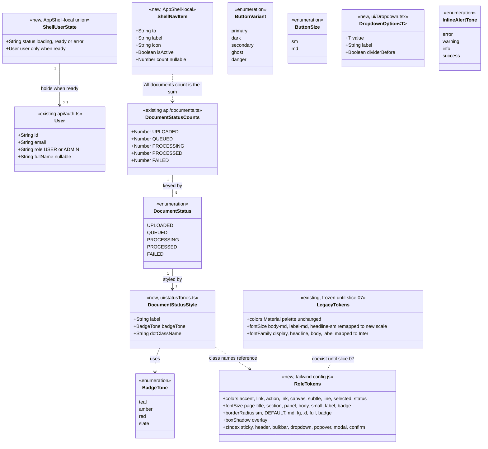

# UI Redesign — Slice 01: Design Tokens, First Shared Components and App Shell

## Change Summary

- **Database**: none.
- **Stored files**: none.
- **Backend**: none. No endpoint, DTO or request/response contract changes.
- **Frontend**:
  - `tailwind.config.js`: adds role-based colour, type, radius, shadow and z-index tokens. Legacy colour keys are unchanged. The legacy font sizes take the new scale, and every font family becomes Inter.
  - `index.html` / `index.css`: the title becomes "DocIndex Manager" and the Manrope font is removed. `mark` becomes an amber tint. The dark-mode and unused CSS rules are removed.
  - New `components/ui/`: Button/ButtonLink, IconButton, Badge, StatusBadge (moved from `common/`), Avatar, Dropdown, Input, Checkbox, Spinner, InlineAlert, plus an `index.ts` barrel.
  - `AppShell` is rebuilt: a 64px header (logo, search, Upload document, user block) and a 192px sidebar (Registers, collapsible Status filter).
  - `DocumentTable` and `DocumentDrawer` import the new `StatusBadge`, and their `dark:` classes are removed. The drawer's download `alert` becomes an `InlineAlert`.
  - `AdminLayout.tsx` and `UploadModal.tsx` are deleted. A "UI Rules" section is added to `.github/copilot-instructions.md`.
- **Behaviour users will notice**:
  - Everyone gets the new header and sidebar, and the user's name and role appear in the header.
  - Inter is used everywhere, and text on pages that haven't been restyled is slightly smaller.
  - Status badges have the new style. Status filters work from the keyboard, and the section can be collapsed.
  - A failed download in the search drawer shows an on-page error instead of a browser alert.
  - Admins see "Admin settings" (renamed from "Admin Console"). Everything else behaves as before.
- **Deploy steps**: none.

## Requirements

- Give the product a clear, consistent visual identity. Introduce the approved spreadsheet-style design system (Inter, teal accent, slate neutrals, flat 1px borders) as role-based Tailwind tokens that new and restyled UI uses exclusively. Pages that haven't been restyled must look the same, except for the accepted font changes.
- Start one shared component library in `client/src/components/ui/`. It contains only the components this slice uses, plus Dropdown and Checkbox by explicit request, so later slices build screens from one set of controls instead of one-off class strings.
- Rebuild the app shell (header and sidebar) on that library. Every signed-in user gets clear navigation, global search, a prominent upload action and a visible identity (name and role). Routing, search, status filtering and admin visibility behave exactly as they do today.
- Remove dead UI, and write the design rules down so later slices and contributors follow them.
- Boundaries:
  - Frontend only: no `server/` changes, no `client/src/api/` changes, no new npm packages.
  - No page bodies are restyled. Slices 02–06 do that.
  - Legacy colour tokens are frozen at their current values.
  - Every other shared component is built in the slice that first uses it.

## Entities



No Prisma model, DTO or API type changes. `types.ts` and every file in `client/src/api/` stay unchanged.

## Approach

1. **Design tokens (additive only)**:
   - Add the new design system to `tailwind.config.js` under role-based names that collide with nothing already in the code: `accent`, `accent-hover`, `link`, `action`, `action-hover`, `ink`, `ink-body`, `ink-muted`, `canvas`, `subtle`, `line`, `line-strong`, `selected` and a nested `status` palette. Add the font sizes `page-title`, `section`, `panel`, `body`, `small`, `label` and `badge`. Add a `badge` radius, an `overlay` shadow, and a named z-index scale.
   - Every existing colour key stays byte-for-byte unchanged, so pages that haven't been restyled keep their colours (R1). The legacy font sizes `body-md`, `label-md` and `headline-sm` take the new values (Q2). Every font family, including a new `sans`, becomes Inter. The unused legacy `display` font size is dropped.
   - `darkMode: 'class'` stays, because nothing adds the class (R3). Switching to `'media'` would turn on about 500 dormant `dark:` classes.
   - The names `scrim`, `border-subtle` and `text-muted` must never be defined. Classes already written in the code reference them, so defining them would change old pages. Defining `accent` switches on one dormant `hover:text-accent` in `JobsTable`; this is accepted.
   - Most values match Tailwind's default slate, teal, amber and red scales. Role tokens still wrap them, so a future tweak happens in one place.

2. **Component library (built on first use)**:
   - `components/ui/` holds presentational function components with no dependencies beyond React and react-router. Each one owns its styling and accessibility behaviour.
   - Slice 01 builds Button (plus ButtonLink for router links), IconButton, Badge, StatusBadge, Avatar, Dropdown, Input, Checkbox, Spinner and InlineAlert. That's what the shell and the two touched document components use, plus Dropdown and Checkbox by explicit request (R6, C1). Every other component in the requirement is built in its first-use slice.
   - Shared vocabularies live in `.ts` modules so `.tsx` files export only components, which keeps the react-refresh lint rule happy. `buttonStyles.ts` holds the button variant and size class builders. `statusTones.ts` holds the one status → label/tone/dot mapping that both `StatusBadge` and the sidebar use.
   - Dropdown is anchored in place at `z-dropdown`. Its Escape handling stops propagation, so the Modal built in slice 02 only ever sees Escape when no inner overlay is open (R4, R5).

3. **App shell**:
   - `AppShell` keeps all its data responsibilities and reuses the existing service calls: `authService.getMe` and `documentsService.getStatusCounts()` with no filters, re-run on pathname change as today. Only the markup changes, now composed from `components/ui`.
   - The `/auth/me` result is kept as a user-state union instead of a boolean. The header shows the name (or email) and role. The Admin settings link renders only when the role is confirmed as ADMIN. Closing the profile modal re-fetches `/auth/me` (Q3), which keeps the previous user if the call fails and does nothing when there's no token, for example after sign-out.
   - The header search mirrors `q` on `/search` routes using React's "adjust state when a prop changes" pattern (no effect). Navigation and the 2-character minimum are unchanged.
   - The status filter rows become real toggle buttons with `aria-pressed`, keeping the single-select `?status=` semantics.
   - The collapsed state is stored in `sessionStorage` under `shell:statusFilterCollapsed`, guarded by try/catch. When collapsed, only the active status row (if any) stays visible, so an active filter is never hidden.
   - Counts are shown only after a successful load, never a misleading "0".
   - The shell may or may not remount between routes: it's kept between non-admin routes and remounted when crossing into or out of `AdminGuard`. Nothing depends on which happens.

4. **Touched files and clean-up**:
   - `StatusBadge` moves to `components/ui`. `DocumentTable` and `DocumentDrawer` switch imports and lose every `dark:` class, with no other style edits (Q4).
   - `DocumentDrawer`'s download-failure `alert` becomes an `InlineAlert`, keyed by document id so a stale error never shows for another document (C1).
   - `AdminLayout.tsx` and `UploadModal.tsx` are deleted. Nothing imports them.
   - `index.css` loses the `.dark` rules and the unused `sticky-header` rule, and keeps `custom-scrollbar` and `spinner` (R9).

5. **Documentation**:
   - A "UI Rules" section in `.github/copilot-instructions.md`, outside the openspdd markers, records the tokens, z-index scale, component rules, overlay and focus behaviour, theme, copy rules, and the ban on copying exported design-tool HTML. It doesn't name the temporary design folder (R2).
   - The existing Frontend Rules lines about design tokens and component locations are updated to agree with it.

6. **Verification**:
   - `npm run build:full` from `server/` is the gate (R7).
   - Grep checks confirm no `dark:` classes, native dialogs, hex values or stale imports remain in the touched files.
   - A manual pass at 1280px and 1440px, as an admin and as a user, covers the shell and confirms that Documents, Upload, Search and every admin tab look unchanged apart from fonts (R8).

## Structure

### Interfaces and Implementations

1. `components/ui/buttonStyles.ts` defines the button vocabulary (`ButtonVariant`, `ButtonSize`) and the class builders `buttonClassName` and `iconButtonClassName`. `Button`, `ButtonLink`, `IconButton` and the `Dropdown` trigger implement it.
2. `components/ui/statusTones.ts` defines the single document-status mapping (`DOCUMENT_STATUS_ORDER`, `documentStatusStyles`). `StatusBadge` and the AppShell status filter consume it.
3. `components/ui/Badge.tsx` defines the badge tones (`BadgeTone`). `StatusBadge` specialises it for document statuses.
4. `components/ui/index.ts` is the public surface of the library. Code outside `components/ui/` imports only from it.

### Dependencies

1. `AppShell` depends on `authService.getMe` (`api/auth.ts`), `documentsService.getStatusCounts` (`api/documents.ts`), `ProfileSettingsModal`, and the `components/ui` barrel (`ButtonLink`, `IconButton`, `Input`, `Avatar`, `DOCUMENT_STATUS_ORDER`, `documentStatusStyles`).
2. `StatusBadge` depends on `Badge` and `statusTones`. `statusTones` depends only on types (`DocumentStatus` from `types.ts`, `BadgeTone` from `Badge`).
3. `Button` depends on `buttonStyles` and `Spinner`. `ButtonLink` also depends on react-router's `Link`. `IconButton` depends on `buttonStyles`.
4. `InlineAlert` depends on `IconButton`. `Dropdown` depends on `buttonStyles`.
5. `DocumentTable` depends on the barrel (`StatusBadge`). `DocumentDrawer` depends on the barrel (`StatusBadge`, `InlineAlert`).
6. Inside `components/ui/`, files import siblings directly (`./Badge`), never through `./index`, to avoid import cycles.

### Layered Architecture

1. Controller Layer: unchanged (no backend work).
2. Service Layer: unchanged.
3. Storage Layer: unchanged.
4. Client API Layer: unchanged. `api/auth.ts` (`getMe`) and `api/documents.ts` (`getStatusCounts`) are reused as they are.
5. UI Layer, from the bottom up:
   - Design tokens (`tailwind.config.js`, `index.css`)
   - Shared primitives (`components/ui/`)
   - App frame (`components/layout/AppShell.tsx`)
   - Pages and feature components, unchanged apart from the two touched document components

## Operations

Run these in order. Each task ends with its completion check.

### Update Config - Tailwind design tokens

1. File: `client/tailwind.config.js`
2. Responsibility: add the role-based tokens and remap the legacy type tokens. Leave every legacy colour unchanged.
3. Changes inside `theme.extend`:
   - `colors`: keep every existing entry exactly as it is (`primary` … `background-dark`). Append:
     ```js
     // Role-based tokens. New and restyled UI uses only these.
     accent: '#0f766e',
     'accent-hover': '#115e59',
     link: '#005c55',
     action: '#213145',
     'action-hover': '#0b1c30',
     ink: '#0f172a',
     'ink-body': '#334155',
     'ink-muted': '#64748b',
     canvas: '#ffffff',
     subtle: '#f8fafc',
     line: '#e2e8f0',
     'line-strong': '#cbd5e1',
     selected: '#f0fdfa',
     status: {
       'teal-bg': '#f0fdfa',
       'teal-text': '#0f766e',
       'teal-border': '#99f6e4',
       'amber-bg': '#fffbeb',
       'amber-text': '#b45309',
       'amber-border': '#fde68a',
       'amber-dot': '#d97706',
       'red-bg': '#fef2f2',
       'red-text': '#b91c1c',
       'red-border': '#fecaca',
       'red-dot': '#dc2626',
       'slate-bg': '#f8fafc',
       'slate-text': '#334155',
       'slate-border': '#e2e8f0',
     },
     ```
   - `fontFamily`: replace with
     ```js
     sans: ['Inter', 'ui-sans-serif', 'system-ui', 'sans-serif'],
     display: ['Inter', 'sans-serif'],
     headline: ['Inter', 'sans-serif'],
     body: ['Inter', 'sans-serif'],
     label: ['Inter', 'sans-serif'],
     ```
   - `fontSize`: replace with
     ```js
     'page-title': ['24px', { lineHeight: '32px', letterSpacing: '-0.02em', fontWeight: '600' }],
     section: ['18px', { lineHeight: '24px', letterSpacing: '-0.015em', fontWeight: '600' }],
     panel: ['15px', { lineHeight: '20px', letterSpacing: '-0.01em', fontWeight: '600' }],
     body: ['13px', { lineHeight: '18px', letterSpacing: '-0.005em' }],
     small: ['12px', { lineHeight: '16px' }],
     label: ['11px', { lineHeight: '14px', letterSpacing: '0.04em', fontWeight: '600' }],
     badge: ['11px', { lineHeight: '14px', letterSpacing: '0.02em', fontWeight: '500' }],
     // Legacy keys for pages not yet restyled. Removed in slice 07.
     'body-md': ['13px', { lineHeight: '18px' }],
     'label-md': ['13px', { lineHeight: '18px' }],
     'headline-sm': ['24px', { lineHeight: '32px' }],
     ```
     The old `display` font size has zero usages and is dropped.
   - `borderRadius`: replace with `sm: '0.125rem', DEFAULT: '0.25rem', md: '0.375rem', lg: '0.5rem', xl: '0.75rem', full: '9999px', badge: '3px'`.
   - `boxShadow`: add `overlay: '0 4px 6px -1px rgba(15, 23, 42, 0.08), 0 2px 4px -2px rgba(15, 23, 42, 0.04)'`.
   - `zIndex`: add `sticky: '10', header: '20', bulkbar: '30', dropdown: '40', popover: '40', modal: '50', confirm: '60'`.
4. Keep `darkMode: 'class'` with the comment `// Stays 'class' (inert) until the last dark: class is removed in slice 07. Never 'media'.` Keep `content` and `plugins` unchanged.
5. Constraints: do NOT add `scrim`, `border-subtle` or `text-muted` under any token group. Do not rename or re-value any existing colour key.
6. Done when: `git diff client/tailwind.config.js` shows no removed or changed lines inside the legacy `colors` entries.

### Update Page Shell - `index.html`

1. File: `client/index.html`
2. Changes: change `<title>` to `DocIndex Manager`. Delete the Manrope `<link>`. Keep the Inter and Material Symbols links unchanged.
3. Done when: `Manrope` appears nowhere under `client/` (excluding `node_modules`).

### Update Global Styles - `index.css`

1. File: `client/src/index.css`
2. Changes:
   - Replace the `mark` rule body with `@apply bg-status-amber-border text-ink font-semibold rounded-sm px-0.5;`.
   - Delete the `.dark mark` rule, the `thead.sticky-header th` rule and the `.dark thead.sticky-header th` rule.
   - Keep `.material-symbols-outlined`, every `.custom-scrollbar` rule, `@keyframes spin` and `.spinner` unchanged.
3. Done when: the file contains no `.dark` selector and no `sticky-header` selector.

### Create Style Module - `buttonStyles.ts`

1. File: `client/src/components/ui/buttonStyles.ts`
2. Responsibility: the one source of button classes, shared by `Button`, `ButtonLink`, `IconButton` and the `Dropdown` trigger.
3. Exports:
   - `export type ButtonVariant = 'primary' | 'dark' | 'secondary' | 'ghost' | 'danger';`
   - `export type ButtonSize = 'sm' | 'md';`
   - `buttonClassName(variant: ButtonVariant, size: ButtonSize, className?: string): string`
   - `iconButtonClassName(variant: ButtonVariant, size: ButtonSize, className?: string): string`
4. Logic. Join the non-empty parts with a single space.
   - Base: `inline-flex items-center justify-center gap-1.5 rounded text-body font-medium whitespace-nowrap transition-colors focus-visible:outline-none focus-visible:ring-2 focus-visible:ring-accent focus-visible:ring-offset-1 disabled:cursor-not-allowed disabled:opacity-50`
   - Text button sizes: `sm` → `h-7 px-2.5`; `md` → `h-8 px-3`.
   - Icon button sizes: `sm` → `size-7`; `md` → `size-8`.
   - Variants:
     - `primary` → `bg-accent text-white hover:bg-accent-hover`
     - `dark` → `bg-action text-white hover:bg-action-hover`
     - `secondary` → `bg-canvas text-ink-body border border-line hover:bg-subtle hover:border-line-strong`
     - `ghost` → `text-ink-body hover:bg-subtle`
     - `danger` → `bg-canvas text-status-red-text border border-line hover:bg-status-red-bg hover:border-status-red-border`
   - Every class must be a complete string literal inside `Record<ButtonVariant, string>` and `Record<ButtonSize, string>` maps, so Tailwind's scanner sees them.

### Create Component - `Spinner`

1. File: `client/src/components/ui/Spinner.tsx`
2. Props: `interface SpinnerProps { size?: 'sm' | 'md'; label?: string; className?: string }`. Default `size` is `'md'`.
3. Render: a `span` with `inline-block shrink-0 rounded-full border-2 border-current border-t-transparent animate-spin`, plus `size-3` (sm) or `size-4` (md), plus `className`.
   - With `label`: add `role="status"` and render `<span className="sr-only">{label}</span>` inside.
   - Without `label`: add `aria-hidden="true"`.

### Create Component - `Button` and `ButtonLink`

1. File: `client/src/components/ui/Button.tsx`
2. Props:
   - `interface ButtonProps extends ButtonHTMLAttributes<HTMLButtonElement> { variant?: ButtonVariant; size?: ButtonSize; icon?: string; loading?: boolean }`
   - `interface ButtonLinkProps extends LinkProps { variant?: ButtonVariant; size?: ButtonSize; icon?: string }`, where `LinkProps` comes from `react-router-dom`.
3. `Button` logic:
   - Defaults: `variant = 'secondary'`, `size = 'md'`, `type = 'button'`.
   - `disabled = disabled || loading`. Set `aria-busy` when `loading`.
   - Classes: `buttonClassName(variant, size, className)`.
   - Leading slot: when `loading`, `<Spinner size="sm" />`. Otherwise, if `icon` is set, `<span className="material-symbols-outlined text-[16px] leading-none" aria-hidden="true">{icon}</span>`. Then `children`.
   - Spread the remaining props onto `<button>`.
4. `ButtonLink` logic: renders react-router `<Link>` with `buttonClassName(variant ?? 'secondary', size ?? 'md', className)`, the same optional leading icon, and `children`. Spread the remaining `LinkProps`.
5. Constraint: this file exports only these two components. Types are exported with `export type` in the barrel.

### Create Component - `IconButton`

1. File: `client/src/components/ui/IconButton.tsx`
2. Props: `interface IconButtonProps extends Omit<ButtonHTMLAttributes<HTMLButtonElement>, 'children' | 'aria-label'> { icon: string; label: string; variant?: 'ghost' | 'secondary'; size?: ButtonSize }`. Defaults: `variant = 'ghost'`, `size = 'md'`, `type = 'button'`.
3. Render: `<button>` with `iconButtonClassName(variant, size, className)`, `aria-label={label}` and `title={label}`. Its content is `<span className="material-symbols-outlined text-[18px] leading-none" aria-hidden="true">{icon}</span>`. Spread the remaining props, which lets callers pass `aria-expanded`, `aria-controls` and `onClick`.
4. Constraint: `label` is required, so an icon-only button can't be built without an accessible name.

### Create Component - `Badge`

1. File: `client/src/components/ui/Badge.tsx`
2. Exports: `export type BadgeTone = 'teal' | 'amber' | 'red' | 'slate';` and `Badge`.
3. Props: `interface BadgeProps { tone?: BadgeTone; dot?: boolean; title?: string; className?: string; children: ReactNode }`. Default `tone` is `'slate'`.
4. Render: `<span title={title}>` with `inline-flex items-center gap-1.5 h-5 px-1.5 rounded-badge border text-badge whitespace-nowrap`, plus the tone classes, plus `className`. When `dot` is set, prepend `<span className={`size-1.5 shrink-0 rounded-full ${dotClass}`} aria-hidden="true" />`.
   - Tone classes:
     - `teal` → `bg-status-teal-bg text-status-teal-text border-status-teal-border`
     - `amber` → `bg-status-amber-bg text-status-amber-text border-status-amber-border`
     - `red` → `bg-status-red-bg text-status-red-text border-status-red-border`
     - `slate` → `bg-status-slate-bg text-status-slate-text border-status-slate-border`
   - Dot classes: `teal` → `bg-accent`; `amber` → `bg-status-amber-dot`; `red` → `bg-status-red-dot`; `slate` → `bg-ink-muted`.

### Create Style Module - `statusTones.ts`

1. File: `client/src/components/ui/statusTones.ts`
2. Responsibility: the single mapping from document status to label, badge tone and sidebar dot colour.
3. Exports:
   - `export interface DocumentStatusStyle { label: string; badgeTone: BadgeTone; dotClassName: string }`. Use `import type { BadgeTone } from './Badge'` and `import type { DocumentStatus } from '../../types'`.
   - `export const DOCUMENT_STATUS_ORDER: readonly DocumentStatus[] = ['UPLOADED', 'QUEUED', 'PROCESSING', 'PROCESSED', 'FAILED'];`
   - `export const documentStatusStyles: Record<DocumentStatus, DocumentStatusStyle>`:
     - `UPLOADED` → `{ label: 'Uploaded', badgeTone: 'amber', dotClassName: 'bg-line-strong' }`
     - `QUEUED` → `{ label: 'Queued', badgeTone: 'amber', dotClassName: 'bg-ink-muted' }`
     - `PROCESSING` → `{ label: 'Processing', badgeTone: 'amber', dotClassName: 'bg-status-amber-dot' }`
     - `PROCESSED` → `{ label: 'Processed', badgeTone: 'teal', dotClassName: 'bg-accent' }`
     - `FAILED` → `{ label: 'Failed', badgeTone: 'red', dotClassName: 'bg-status-red-dot' }`
4. Constraint: the dot classes are the sidebar colours from the requirement: slate-300 (`line-strong`), slate-500 (`ink-muted`), amber, teal and red.

### Move Component - `StatusBadge`

1. File: create `client/src/components/ui/StatusBadge.tsx`, and delete `client/src/components/common/StatusBadge.tsx`.
2. Props: unchanged, `interface StatusBadgeProps { status: DocumentStatus; errorMessage?: string }`.
3. Render: `const style = documentStatusStyles[status];` then `<Badge tone={style.badgeTone} dot title={status === 'FAILED' ? errorMessage : undefined}>{style.label}</Badge>`.
4. Done when: nothing under `client/src` imports `common/StatusBadge`.

### Create Component - `Avatar`

1. File: `client/src/components/ui/Avatar.tsx`
2. Props: `interface AvatarProps { fullName?: string | null; email?: string | null; size?: 'sm' | 'md'; className?: string }`. Default `size` is `'md'`.
3. Logic. A local, non-exported `getInitials(fullName, email): string`:
   - If `fullName?.trim()` is not empty, split it on whitespace: if 2 or more words, take the first letter of the first word plus the first letter of the last word; if 1 word, take its first letter. Uppercase the result.
   - Otherwise, if `email?.trim()` is not empty, take its first character, uppercased.
   - Otherwise, return `''`.
4. Render: `<span aria-hidden="true">` with `inline-flex shrink-0 items-center justify-center rounded-full bg-accent text-white font-semibold select-none`, plus `size-7 text-[11px]` (sm) or `size-8 text-small` (md), plus `className`.
   - Content: the initials, or `<span className="material-symbols-outlined text-[18px] leading-none">person</span>` when the initials are empty.
   - The avatar is decorative because the visible name sits next to it.

### Create Component - `Input`

1. File: `client/src/components/ui/Input.tsx`
2. Props: `interface InputProps extends Omit<InputHTMLAttributes<HTMLInputElement>, 'size'> { size?: 'sm' | 'md'; leadingIcon?: string; invalid?: boolean; ref?: Ref<HTMLInputElement> }`. Default `size` is `'md'`. `ref` is passed through as a React 19 prop.
3. Render:
   - Wrapper `<div className="relative">`. With `leadingIcon`, add `<span className="material-symbols-outlined pointer-events-none absolute left-2.5 top-1/2 -translate-y-1/2 text-[16px] leading-none text-ink-muted" aria-hidden="true">{leadingIcon}</span>`.
   - `<input>` classes: `block w-full rounded border bg-canvas px-2.5 text-body text-ink placeholder:text-ink-muted focus:outline-none focus:ring-1 disabled:bg-subtle disabled:text-ink-muted`.
     - Size: `h-7` (sm) or `h-[30px]` (md).
     - With an icon, add `pl-8`.
     - Normal state: `border-line focus:border-accent focus:ring-accent`.
     - `invalid` state: `border-status-red-text focus:border-status-red-text focus:ring-status-red-text`, plus `aria-invalid="true"`.
   - Spread the remaining props and `ref`.
4. Constraint: the classes must override the `@tailwindcss/forms` base styles (blue focus ring, gray border, 1rem font). Utilities win over the base layer, so the classes above are enough.

### Create Component - `Checkbox`

1. File: `client/src/components/ui/Checkbox.tsx`
2. Props: `interface CheckboxProps extends Omit<InputHTMLAttributes<HTMLInputElement>, 'type' | 'size'> { indeterminate?: boolean; label?: ReactNode }`
3. Render:
   - `<input type="checkbox">` with `size-3.5 shrink-0 rounded-sm border-line-strong bg-canvas text-accent cursor-pointer focus:ring-1 focus:ring-accent focus:ring-offset-0 disabled:cursor-not-allowed disabled:opacity-50`.
   - Set `ref={(el) => { if (el) el.indeterminate = Boolean(indeterminate); }}` with the comment `// indeterminate is a DOM property, not an attribute`.
   - With `label`, wrap it as `<label className="inline-flex items-center gap-2 text-body text-ink-body cursor-pointer">{input}{label}</label>`. Without `label`, render the input alone. The caller must then pass `aria-label`.
4. Note: Checkbox has no slice-01 consumer (an R6 exception). It is first used for table selection in slice 02.

### Create Component - `Dropdown`

1. File: `client/src/components/ui/Dropdown.tsx`
2. Exports: `export interface DropdownOption<T extends string> { value: T; label: string; dividerBefore?: boolean }` and `Dropdown`.
3. Props: `interface DropdownProps<T extends string> { label: string; value: T; options: DropdownOption<T>[]; onChange: (value: T) => void; footer?: ReactNode; align?: 'start' | 'end'; size?: ButtonSize; disabled?: boolean }`. Defaults: `align = 'start'`, `size = 'sm'`.
4. State and refs:
   - `isOpen`, plus `activeIndex` (the keyboard-highlighted option).
   - `rootRef`, `triggerRef`, `listRef`.
   - `const listId = useId();` and option ids `${listId}-option-${index}`.
5. Trigger: `<button type="button" ref={triggerRef}>`.
   - Classes: `buttonClassName('secondary', size, 'max-w-xs')`.
   - Attributes: `aria-haspopup="listbox"`, `aria-expanded={isOpen}`, `aria-controls={listId}`, `disabled`.
   - Content: `<span className="text-ink-muted">{label}:</span>`, then `<span className="truncate text-ink">{selectedLabel}</span>`, then the icon `expand_more` (16px, `text-ink-muted`, `aria-hidden`).
   - `selectedLabel` is the label of the option whose value equals `value`, or `''`.
6. Opening: a click toggles the menu. ArrowDown, ArrowUp, Enter or Space on the trigger opens it (with `preventDefault`). On open, `activeIndex` is the selected option's index, or 0. An effect focuses `listRef` when `isOpen` becomes true.
7. Menu, rendered only when open, inside `<div className="absolute top-full mt-1 z-dropdown min-w-full w-max max-w-xs rounded-md border border-line-strong bg-canvas shadow-overlay py-1">` with `left-0` (start) or `right-0` (end). The root is `<div ref={rootRef} className="relative inline-block">`.
   - `<ul id={listId} role="listbox" aria-label={label} tabIndex={-1} aria-activedescendant={activeOptionId}>`. Options are mapped inside a React `Fragment` so that option `<li id role="option" aria-selected={option.value === value}>` (with `flex items-center gap-2 h-7 px-2 mx-1 rounded text-body text-ink cursor-pointer` and `bg-subtle` when active) and any separator `<li role="separator" className="my-1 border-t border-line" />` remain direct children of the `ul`.
   - `footer`, when present, renders after the list in `<div className="mt-1 border-t border-line px-1 pt-1" onClick={close}>`.
8. Selecting: a click or Enter/Space on an option calls `onChange(option.value)`, closes the menu and focuses the trigger. Mouse hover sets `activeIndex`.
9. List keyboard:
   - ArrowDown / ArrowUp move `activeIndex`, clamped to the range.
   - Home / End jump to the first / last option.
   - Tab closes the menu without `preventDefault`.
10. Escape: the root's `onKeyDown` handles it while open by calling `event.stopPropagation()`, closing the menu and focusing the trigger. Outer overlays (the slice-02 Modal) therefore never receive it.
11. Outside click: while open, a `mousedown` listener on `document` closes the menu when the target is outside `rootRef`, without moving focus. The listener is removed when the menu closes or the component unmounts.
12. Note: Dropdown has no slice-01 consumer (an R6 exception). It is first used in the slice-02 toolbar. Action menus (the Export menu) are slice 02's decision.

### Create Component - `InlineAlert`

1. File: `client/src/components/ui/InlineAlert.tsx`
2. Exports: `export type InlineAlertTone = 'error' | 'warning' | 'info' | 'success';` and `InlineAlert`.
3. Props: `interface InlineAlertProps { tone?: InlineAlertTone; onDismiss?: () => void; className?: string; children: ReactNode }`. Default `tone` is `'error'`.
4. Render: `<div role={tone === 'error' || tone === 'warning' ? 'alert' : 'status'}>` with `flex items-start gap-2 rounded border px-3 py-2 text-body`, plus the tone classes, plus `className`.
   - Children: a leading icon (18px, `aria-hidden`), then `<div className="min-w-0 flex-1">{children}</div>`, then, when `onDismiss` is set, `<IconButton icon="close" label="Dismiss" size="sm" variant="ghost" onClick={onDismiss} className="-my-1 -mr-1" />`.
   - Tones:
     - `error` → `bg-status-red-bg border-status-red-border text-status-red-text`, icon `error`
     - `warning` → `bg-status-amber-bg border-status-amber-border text-status-amber-text`, icon `warning`
     - `info` → `bg-status-slate-bg border-status-slate-border text-status-slate-text`, icon `info`
     - `success` → `bg-status-teal-bg border-status-teal-border text-status-teal-text`, icon `check_circle`
5. Import `IconButton` from `./IconButton`, not from the barrel.

### Create Barrel - `components/ui/index.ts`

1. File: `client/src/components/ui/index.ts`
2. Content: named re-exports only (no `export *`):
   ```ts
   export { Avatar } from './Avatar';
   export { Badge } from './Badge';
   export type { BadgeTone } from './Badge';
   export { Button, ButtonLink } from './Button';
   export type { ButtonSize, ButtonVariant } from './buttonStyles';
   export { Checkbox } from './Checkbox';
   export { Dropdown } from './Dropdown';
   export type { DropdownOption } from './Dropdown';
   export { IconButton } from './IconButton';
   export { InlineAlert } from './InlineAlert';
   export type { InlineAlertTone } from './InlineAlert';
   export { Input } from './Input';
   export { Spinner } from './Spinner';
   export { StatusBadge } from './StatusBadge';
   export { DOCUMENT_STATUS_ORDER, documentStatusStyles } from './statusTones';
   export type { DocumentStatusStyle } from './statusTones';
   ```

### Update Component - `DocumentTable`

1. File: `client/src/components/documents/DocumentTable.tsx`
2. Changes:
   - Replace `import { StatusBadge } from '../common/StatusBadge';` with `import { StatusBadge } from '../ui';`.
   - Remove every class token starting with `dark:`. For example, `bg-slate-50/80 dark:bg-slate-800/50 sticky …` becomes `bg-slate-50/80 sticky …`. Collapse any double spaces left behind.
3. Constraints: no other class, markup or behaviour changes (Q4). The legacy `primary` and `blue-*` classes stay as they are (R1, Q6).
4. Done when: the file contains no `dark:`.

### Update Component - `DocumentDrawer`

1. File: `client/src/components/documents/DocumentDrawer.tsx`
2. Changes:
   - Replace the `StatusBadge` import with `import { InlineAlert, StatusBadge } from '../ui';`.
   - Add the state `const [downloadError, setDownloadError] = useState<{ documentId: string; message: string } | null>(null);`.
   - In `handleDownload`: call `setDownloadError(null)` before the request. In `catch`, replace `alert(...)` with `setDownloadError({ documentId: document.id, message: error instanceof Error ? error.message : 'Failed to download document' })`.
   - Render the alert directly above the Download/Share button row (`<div className="flex gap-3">`): `{downloadError?.documentId === document.id && (<InlineAlert tone="error" onDismiss={() => setDownloadError(null)}>{downloadError.message}</InlineAlert>)}`. Keying the error by document id means it never shows for a different document, and it needs no effect.
   - Remove every class token starting with `dark:`.
3. Constraints: no other markup, copy or behaviour changes. The placeholder fields and the Share button are slice 03's job.
4. Done when: the file contains no `dark:`, `alert(` or `confirm(`.

### Rebuild Layout - `AppShell`

1. File: `client/src/components/layout/AppShell.tsx`
2. Responsibility: the app frame for every signed-in route, with a 64px header and a 192px sidebar. Its data behaviour stays as it is today.
3. Imports:
   - `useEffect`, `useMemo`, `useRef`, `useState`, `type ReactNode` from `react`.
   - `Link`, `useLocation`, `useNavigate`, `useSearchParams` from `react-router-dom`.
   - `ProfileSettingsModal`.
   - `authService, type User` from `../../api/auth`.
   - `documentsService, type DocumentStatus, type DocumentStatusCounts` from `../../api/documents`.
   - `Avatar, ButtonLink, DOCUMENT_STATUS_ORDER, documentStatusStyles, IconButton, Input` from `../ui`.
   - Delete the local `statusOptions` array.
4. Module-level declarations:
   - `const STATUS_FILTER_COLLAPSED_KEY = 'shell:statusFilterCollapsed';`
   - `type ShellUserState = { status: 'loading' } | { status: 'ready'; user: User } | { status: 'error' };`
   - `function readStatusFilterCollapsed(): boolean`: in try/catch, return `sessionStorage.getItem(STATUS_FILTER_COLLAPSED_KEY) === 'true'`, or `false` on error.
   - `function formatCount(count: number): string`: `count.toLocaleString('en-GB')`.
   - A non-exported `ShellNavLink` component with props `{ to: string; label: string; icon: string; isActive: boolean; count?: number | null }`:
     - Renders `<Link to={to} aria-current={isActive ? 'page' : undefined}>` with `flex items-center gap-2 h-8 px-2 rounded text-body transition-colors`, plus `bg-selected text-ink font-medium` when active or `text-ink-body hover:bg-line/60` otherwise.
     - Content: an icon span (`material-symbols-outlined text-[18px] leading-none`, plus `text-accent` when active or `text-ink-muted` otherwise, `aria-hidden`), then `<span className="flex-1 truncate">{label}</span>`, then, when `count` is a number, `<span className="text-small tabular-nums text-ink-muted">{formatCount(count)}</span>`.
5. State and refs:
   - `userState: ShellUserState`, initialized lazily: if `!sessionStorage.getItem('accessToken')` returns `{ status: 'error' }`, otherwise `{ status: 'loading'}`. This avoids calling `setState` synchronously within the mount effect (satisfying ESLint `react-hooks/set-state-in-effect`).
   - `statusCounts: DocumentStatusCounts | null`, starting as `null`.
   - `searchQuery: string`, starting as `''`.
   - `isStatusFilterCollapsed: boolean`, initialised lazily with `readStatusFilterCollapsed`.
   - `isProfileSettingsOpen: boolean`.
   - `isMountedRef = useRef(false)`, set to true in a mount effect and to false in its cleanup.
6. Derived values:
   - `const isAdmin = userState.status === 'ready' && userState.user.role === 'ADMIN';`
   - `isDocumentsPage` = `pathname.startsWith('/documents')`; `isJobsPage` = `startsWith('/jobs')`; `isAdminPage` = `startsWith('/admin')`; `isSearchPage` = `startsWith('/search')`.
   - `selectedStatus`, using `useMemo` on `searchParams`: `DOCUMENT_STATUS_ORDER.find((status) => status === searchParams.get('status'))`.
   - `totalCount` = the sum of the five values in `statusCounts`, or `null` when `statusCounts` is `null`.
   - `visibleStatuses` = `DOCUMENT_STATUS_ORDER.filter((status) => !isStatusFilterCollapsed || status === selectedStatus)`.
7. Loading the user:
   - On mount, keep the existing pattern: an effect with an `isActive` flag.
     - With no `accessToken`, return early (state was already initialized to `{ status: 'error' }`).
     - Otherwise, `authService.getMe(token)` → `{ status: 'ready', user }`. On failure, `{ status: 'error' }`.
   - `refreshCurrentUser = async () => { … }`:
     - Return immediately when there's no `accessToken`, for example after sign-out.
     - Call `getMe`. On success, if `isMountedRef.current`, set `{ status: 'ready', user }`.
     - On failure, keep the current state. Never downgrade a ready user.
   - `handleProfileSettingsClose = () => { setIsProfileSettingsOpen(false); void refreshCurrentUser(); }`. Pass it as `ProfileSettingsModal`'s `onClose` (Q3).
8. Status counts: keep the existing effect keyed on `[location.pathname]`. It calls `documentsService.getStatusCounts()` with no filters (A1).
   - Success → `setStatusCounts(counts)`.
   - Failure → keep the current value and the existing `console.error('Failed to load document status counts', error)`.
9. Search prefill. Use the "adjust state when a prop changes" pattern during render, not an effect:
   ```ts
   const urlQuery = isSearchPage ? (searchParams.get('q') ?? '') : null;
   const [syncedUrlQuery, setSyncedUrlQuery] = useState<string | null>(urlQuery);
   if (urlQuery !== syncedUrlQuery) {
     setSyncedUrlQuery(urlQuery);
     if (urlQuery !== null) setSearchQuery(urlQuery);
   }
   ```
   Initialise `searchQuery` with `urlQuery ?? ''`. `handleSearch` is unchanged: trimmed length of 2 or more → `navigate(`/search?q=${encodeURIComponent(searchQuery.trim())}`)`.
10. Handlers: `handleStatusToggle` is unchanged. `toggleStatusFilterCollapsed` flips the state, then writes `String(next)` to `sessionStorage` inside try/catch and ignores errors.
11. Render:
    - **Root**: `<div className="h-screen flex flex-col overflow-hidden bg-canvas font-sans">`.
    - **Header**: `<header className="relative z-header h-16 shrink-0 flex items-center gap-6 px-4 bg-canvas border-b border-line">`, containing:
      - Brand (`flex items-center gap-2.5 shrink-0`):
        - `<div className="size-9 rounded-md bg-accent text-white flex items-center justify-center">` with the icon `lock` (20px, `aria-hidden`).
        - `<div><p className="text-panel text-ink">DocIndex Manager</p><p className="text-small text-ink-muted">Site document register</p></div>`.
      - Search: `<form role="search" onSubmit={handleSearch} className="flex-1 min-w-0 max-w-2xl"><Input type="search" leadingIcon="search" placeholder="Search files or document text…" aria-label="Search files or document text" value={searchQuery} onChange={(e) => setSearchQuery(e.target.value)} /></form>`. There is no ⌘K hint.
      - Actions (`ml-auto flex items-center gap-4 shrink-0`):
        - `<ButtonLink to="/upload" variant="dark" icon="add">Upload document</ButtonLink>`.
        - The user block: `<button type="button" aria-haspopup="dialog" onClick={() => setIsProfileSettingsOpen(true)}>` with `flex items-center gap-2.5 h-10 pl-2 pr-1 rounded hover:bg-subtle focus-visible:outline-none focus-visible:ring-2 focus-visible:ring-accent`. What it shows depends on `userState`:
          - `loading`: `<span className="sr-only">Account</span>`, a skeleton column (`flex flex-col items-end gap-1`: `h-3 w-24 rounded bg-line` and `h-2.5 w-12 rounded bg-line`, both `aria-hidden`), and `<span className="size-8 rounded-full bg-line" aria-hidden="true" />`.
          - `ready`: a text column (`flex flex-col items-end min-w-0 text-right`) with `<span className="max-w-[180px] truncate text-body font-medium text-ink">{user.fullName?.trim() || user.email}</span>` and `<span className="text-small text-ink-muted">{user.role === 'ADMIN' ? 'Admin' : 'User'}</span>`, followed by `<Avatar fullName={user.fullName} email={user.email} />`.
          - `error`: `<span className="text-body font-medium text-ink">Account</span>` and `<Avatar />`, which shows the person icon.
    - **Body**: `<div className="relative flex flex-1 overflow-hidden">`, holding the sidebar, then `{children}`.
    - **Sidebar**: `<aside aria-label="Sidebar" className="w-48 shrink-0 flex flex-col gap-6 overflow-y-auto bg-subtle border-r border-line px-3 py-4">`, containing:
      - `<nav aria-labelledby="shell-registers-heading">`:
        - `<h2 id="shell-registers-heading" className="px-2 mb-1.5 text-label uppercase text-ink-muted">Registers</h2>`.
        - `<ul className="space-y-0.5">` of `ShellNavLink` items:
          - All documents (`/documents`, icon `description`, `isDocumentsPage`, `count={totalCount}`).
          - Jobs (`/jobs`, icon `folder`, `isJobsPage`, no count).
          - Only when `isAdmin`: Admin settings (`/admin/projects`, icon `settings`, `isAdminPage`).
      - `<section aria-labelledby="shell-status-heading">`:
        - A heading row (`flex items-center justify-between pl-2 mb-1.5`): `<h2 id="shell-status-heading" className="text-label uppercase text-ink-muted">Status filter</h2>` and `<IconButton size="sm" icon={isStatusFilterCollapsed ? 'expand_more' : 'expand_less'} label={isStatusFilterCollapsed ? 'Expand status filter' : 'Collapse status filter'} aria-expanded={!isStatusFilterCollapsed} aria-controls="shell-status-list" onClick={toggleStatusFilterCollapsed} />`.
        - `<ul id="shell-status-list" className="space-y-0.5">` with one row per `visibleStatuses` item: `<li><button type="button" aria-pressed={isActive} onClick={() => handleStatusToggle(status)}>`.
          - Classes: `w-full flex items-center gap-2 h-7 px-2 rounded text-body text-left transition-colors`, plus `bg-selected text-ink font-medium` when active or `text-ink-body hover:bg-line/60` otherwise.
          - Content: a dot `<span className={`size-1.5 shrink-0 rounded-full ${documentStatusStyles[status].dotClassName}`} aria-hidden="true" />`, the label `<span className="flex-1 truncate">`, and, when `statusCounts` isn't null, `<span className="text-small tabular-nums text-ink-muted">{formatCount(statusCounts[status])}</span>`.
    - **Modal**: `<ProfileSettingsModal isOpen={isProfileSettingsOpen} onClose={handleProfileSettingsClose} />`, rendered after the root `div`, as today.
12. Constraints:
    - No `dark:` classes and no legacy tokens (`primary`, `background-*`, `font-display`, …) in this file.
    - No storage meter, no project codes, no ⌘K hint.
    - The Admin settings link is absent from the DOM unless `isAdmin`.
    - Routes and URLs are unchanged.

### Delete Dead Components

1. Files: delete `client/src/components/admin/AdminLayout.tsx` and `client/src/components/documents/UploadModal.tsx`.
2. Done when: `AdminLayout` and `UploadModal` appear nowhere under `client/src`.

### Update Documentation - project instructions

1. File: `.github/copilot-instructions.md`. Only edit content below the `<!-- openspdd:end -->` marker.
2. In "## Frontend Rules":
   - Replace `- Pages in \`client/src/pages/\`, reusable components in \`client/src/components/<feature>/\`, admin pages under \`pages/admin/\`.` with `- Pages in \`client/src/pages/\`, shared UI primitives in \`client/src/components/ui/\`, feature components in \`client/src/components/<feature>/\`, admin pages under \`pages/admin/\`.`
   - Replace `- Tailwind only, using the existing design tokens. No new UI libraries.` with `- Tailwind only. New and restyled UI uses the role-based tokens and shared components described in UI Rules. No new UI libraries.`
3. Insert a new section `## UI Rules` directly after "## Frontend Rules" (before "## Before Saying a Change Is Done"), with exactly this content:

   ```markdown
   ## UI Rules

   The frontend follows one spreadsheet-style design system. These rules apply to all new and restyled UI.

   ### Theme and type

   - Light theme only. Never add `dark:` classes. `darkMode: 'class'` stays in `tailwind.config.js` (nothing adds the class) until the last `dark:` class is removed. Never change it to `'media'`.
   - Inter is the only font (`font-sans`). Use `tabular-nums` for every number, date, size and count.
   - Type scale: `text-page-title` (24/32 semibold), `text-section` (18/24 semibold), `text-panel` (15/20 semibold), `text-body` (13/18), `text-small` (12/16), `text-label` (11/14 semibold, tracking 0.04em; add `uppercase` for column headers and form labels), `text-badge` (11/14 medium).

   ### Colour tokens

   Use only these role-based tokens in new or restyled UI:

   | Token | Value | Use |
   |-------|-------|-----|
   | `accent` / `accent-hover` | `#0f766e` / `#115e59` | Primary actions, active states, focus rings |
   | `link` | `#005c55` | Text links |
   | `action` / `action-hover` | `#213145` / `#0b1c30` | Dark action buttons (Upload, Apply, bulk bar) |
   | `ink` / `ink-body` / `ink-muted` | `#0f172a` / `#334155` / `#64748b` | High-emphasis, body and secondary text (column headers) |
   | `canvas` | `#ffffff` | Page and panel background |
   | `subtle` | `#f8fafc` | Sidebar, table header, sub-surfaces, row hover |
   | `line` / `line-strong` | `#e2e8f0` / `#cbd5e1` | 1px gridlines / stronger borders, popovers, modals |
   | `selected` | `#f0fdfa` | Selected rows and active navigation |
   | `status-{teal,amber,red,slate}-{bg,text,border}`, `status-{amber,red}-dot` | see `tailwind.config.js` | Badges, alerts and status dots |

   - Status labels, badge tones and dot colours come from `components/ui/statusTones.ts`. Don't redefine them.
   - The Material-style colour keys (`primary*`, `secondary*`, `tertiary*`, `error*`, `surface*`, `on-*`, `outline*`, `inverse-*`, `background*`) and the legacy type keys (`text-body-md`, `text-label-md`, `text-headline-sm`, `font-display`, `font-headline`, `font-body`, `font-label`) exist only for pages not yet restyled. Never use them in new or restyled UI. They are removed in the final clean-up.
   - Before adding a token, grep for its class names. A class already written in the code for a token that was never defined (for example `bg-scrim`, `border-border-subtle`, `text-text-muted`) would switch on and restyle old pages.
   - Never copy classes or Tailwind config from exported design-tool HTML (for example Stitch exports). Their token names clash with ours and mean different things.
   - No hard-coded hex values in components when a token exists.

   ### Shape, size and elevation

   - Radius: buttons and inputs `rounded` (4px); badges `rounded-badge` (3px); popovers and modals `rounded-md` (6px); table cells square.
   - Sizes: header `h-16`; sidebar `w-48`; buttons `h-7` (toolbar) or `h-8` (global); inputs `h-7` to `h-[30px]`; table header row `h-7`.
   - Flat surfaces with 1px borders. Popovers and modals use `border border-line-strong shadow-overlay`; the modal backdrop is `bg-slate-900/40`.
   - Layering uses only the named z-index scale: `z-sticky` (10, sticky table header), `z-header` (20, app header), `z-bulkbar` (30, floating bulk bar), `z-dropdown` / `z-popover` (40), `z-modal` (50, overlay and modal), `z-confirm` (60, confirm dialog over a modal).

   ### Components

   - Build screens from `client/src/components/ui/` and import from its barrel (`components/ui`). No one-off copies of button, input, badge, dropdown, table, modal or alert styles.
   - A shared component is built in the change that first needs it, inside `components/ui/`, and exported from `index.ts`. Inside `components/ui/`, import siblings directly, not through `index.ts`.
   - Keep helpers and constants in `.ts` files (for example `buttonStyles.ts`, `statusTones.ts`) so `.tsx` files export only components.
   - Modals and confirm dialogs render through `createPortal` to `document.body`. Dropdowns and popovers stay anchored to their trigger, and get a portal only if they are clipped.
   - Escape closes the innermost overlay only (stop propagation). Modals focus the first focusable element (or the panel) on open, trap Tab and Shift+Tab, and return focus to the trigger on close. Dropdowns also close on an outside click.
   - Icons are Material Symbols in a `span` with `aria-hidden="true"`. Icon-only buttons use `IconButton`, whose required `label` becomes the `aria-label`.
   - Row actions are always visible (no hover-only `opacity-0`).

   ### Behaviour and copy

   - Never use `window.confirm` or `window.alert`. Use `ConfirmDialog`, `InlineAlert` or a field error.
   - Features with no backend yet: render the control and route it to a named handler whose body is only `// TODO(backend): <what's needed>`. No "coming soon" text, toast or banner.
   - UK English, sentence case. Dates `12 Oct 2026`, date-times `12 Oct 2026 14:22` (en-GB).
   - Layouts must work at 1280px and 1440px. Mobile is out of scope.
   ```
4. Constraint: the section must not mention the `stitch_docindex_construction_document_manager/` folder or any file inside it.

### Verify - build, greps and manual pass

1. Build: from `server/`, run `npm run build:full`. It must exit 0. This runs the client's `tsc -b` with `noUnusedLocals` and `noUnusedParameters`, then `vite build`, then the Nest build.
2. Greps, each expected to return zero matches:
   - `dark:` in `client/src/components/layout/AppShell.tsx`, `client/src/components/documents/DocumentTable.tsx`, `client/src/components/documents/DocumentDrawer.tsx` and `client/src/components/ui/`.
   - `alert\(|confirm\(` in the same files.
   - `#[0-9a-fA-F]{3,8}\b` in `client/src/components/ui/` and `AppShell.tsx`.
   - `common/StatusBadge|AdminLayout|UploadModal` under `client/src`.
   - `Manrope` under `client/` (excluding `node_modules`).
   - `stitch_docindex` in `.github/copilot-instructions.md`.
3. Diff check: `git diff client/tailwind.config.js` shows no removed or changed legacy colour lines.
4. Manual pass with `npm run start:dev` in `server/` and `npm run dev` in `client/`, at 1280px and 1440px, signed in as an admin and then as a user:
   - The header shows the logo, "DocIndex Manager" and "Site document register". Search, the dark "Upload document" button, and the name and role with the initials avatar fit without overlap. A long name truncates.
   - Search: on `/search?q=pump` the input shows "pump". Pressing Enter with one character does nothing. Pressing Enter with "pu" navigates to `/search?q=pu`.
   - Status filter:
     - Clicking a status on `/documents` sets `?status=`, and clicking it again clears it.
     - Clicking a status on `/jobs` navigates to `/documents?status=X`.
     - Tab, Enter and Space operate the rows.
     - Collapsing hides the inactive rows and keeps the active one. The collapsed state survives navigation and a reload within the tab.
   - Counts: the sidebar counts and the "All documents" total use the `en-GB` thousands format. With the server stopped, counts are hidden rather than shown as 0.
   - Admin visibility: as a user, "Admin settings" is absent from the DOM (search the Elements panel). As an admin, it is present and active on every `/admin/*` tab.
   - Profile: changing the full name in the profile modal and closing it updates the header. Signing out from the modal reaches `/login` without errors.
   - Regression check: Documents, Upload, Search and every admin tab look unchanged apart from the Inter font and slightly smaller legacy text (R1, R8). Status badges use the new style.
   - Search drawer: a failed download (for example with the server stopped) shows a dismissible error InlineAlert, not a browser alert.

## Norms

1. **Component standards**:
   - Function components with named exports. Each component has a `XxxProps` interface declared above it.
   - No default exports in `components/ui/`.
   - Each `.tsx` file exports only components. `Button.tsx` holds both `Button` and `ButtonLink`.
   - Shell-only helpers (`ShellNavLink`, `formatCount`, `readStatusFilterCollapsed`) stay unexported inside `AppShell.tsx`.
2. **TypeScript**:
   - `verbatimModuleSyntax` is on, so types are imported and re-exported with `import type` / `export type`.
   - `erasableSyntaxOnly` is on, so there are no enums, namespaces or parameter properties. Use string-literal unions and `Record` maps instead.
   - Strict mode, with no unused locals or parameters.
   - React 19 `ref` is passed as a prop (`Input`), with no `forwardRef`.
3. **Styling**:
   - Tailwind utilities only. `components/ui/` and `AppShell` use only the role-based tokens: no legacy keys, no hex values, no `dark:`.
   - Class strings are complete literals, chosen through `Record` maps or ternaries, never built by string concatenation of partial names, because Tailwind scans for literal class names.
   - Numbers use `tabular-nums`.
   - Focus styling is `focus-visible:ring-2 focus-visible:ring-accent focus-visible:ring-offset-1` for buttons, and `focus:ring-1 focus:ring-accent` for form controls.
4. **Icons**: Material Symbols via `<span className="material-symbols-outlined …" aria-hidden="true">name</span>`. Sizes are `text-[16px]` in buttons and inputs, and `text-[18px]` in navigation, icon buttons and alerts.
5. **Accessibility**:
   - Icon-only buttons need `aria-label` (enforced by `IconButton`'s required `label`).
   - Disclosure buttons use `aria-expanded` and `aria-controls`.
   - Navigation uses `aria-current="page"`, and toggles use `aria-pressed`.
   - The listbox uses `role="listbox"`, `role="option"`, `aria-selected` and `aria-activedescendant`.
   - Escape handlers call `stopPropagation()`.
6. **Imports**: code outside `components/ui/` imports from the barrel (`'../ui'`, `'../components/ui'`). Inside `components/ui/`, siblings are imported directly. API calls go only through the existing `client/src/api/` services.
7. **Browser storage**: UI-preference keys are namespaced `area:key`, like the existing `documents:selectedProject`. Reads and writes are wrapped in try/catch, with a safe default.
8. **Copy**: UK English, sentence case. Exact strings:
   - "DocIndex Manager", "Site document register"
   - "Search files or document text…" (with the ellipsis character)
   - "Upload document", "Registers", "All documents", "Jobs", "Admin settings", "Status filter"
   - "Expand status filter", "Collapse status filter", "Account", "Admin", "User", "Dismiss"
9. **Comments**: only where the code isn't self-explanatory, for example why `darkMode` stays `'class'`, or why `indeterminate` is set through a ref. Match the existing comment style.

## Safeguards

1. **Functional constraints**:
   - Routes, URLs, the search behaviour (trimmed length 2 or more, `encodeURIComponent`), the single-select `?status=` toggle (replace, clear on second click, navigate to `/documents?status=X` from other routes) and opening the profile modal all behave exactly as they do today.
   - Sidebar counts stay unfiltered (A1).
   - When collapsed, the status filter still shows the active status.
2. **Performance constraints**:
   - No new polling.
   - Network calls are the same as today, plus one `/auth/me` call each time the profile modal closes.
   - The status-count reload trigger stays `location.pathname`.
3. **Security constraints**:
   - The Admin settings link is not rendered unless `/auth/me` returned `role === 'ADMIN'`. It's absent while loading and after an error.
   - `AdminGuard` and the server-side checks are unchanged.
   - Never log the access token.
4. **Integration constraints**:
   - No changes to `server/`, `client/src/api/*`, `client/src/types.ts`, `App.tsx`, `ProfileSettingsModal.tsx`, `client/package.json` or any page file.
   - Of the existing components, only `AppShell`, `DocumentTable` and `DocumentDrawer` change. The two dead files and the old `StatusBadge` are deleted.
   - Every legacy colour key in `tailwind.config.js` is unchanged byte-for-byte (R1).
   - `darkMode` stays `'class'` (R3).
5. **Business rule constraints**:
   - Badge tones: Processed is teal. Uploaded, Queued and Processing are amber. Failed is red, with the error message as the tooltip.
   - Sidebar dots: Uploaded is slate-300, Queued is slate-500, Processing is amber, Processed is teal and Failed is red.
   - The "All documents" count is the sum of the five status counts. Jobs has no count.
   - No storage meter, project codes, pinned sites or ⌘K hint.
6. **Error handling constraints**:
   - If `/auth/me` fails on mount, the user block shows "Account" with a generic avatar, the Admin link is absent, and the profile modal still opens. If a refresh fails, the existing user is kept.
   - If status counts fail, the counts are hidden (never shown as "0") and `console.error` is kept.
   - If a drawer download fails, an error `InlineAlert` shows the server message, or "Failed to download document". It never uses `alert`.
   - If `sessionStorage` fails, the filter defaults to expanded and the error is ignored silently.
   - No stack traces or internal details are shown to the user.
7. **Technical constraints**:
   - `npm run build:full` from `server/` passes.
   - No new npm packages.
   - No token named `scrim`, `border-subtle` or `text-muted`.
   - No `dark:`, `window.alert` or `window.confirm` in any file touched by this slice.
   - Dropdowns are anchored at `z-dropdown`. The header uses `z-header`.
   - Modal, ConfirmDialog, Popover, Chip, the table primitives, EmptyState, SummaryBar, TextAction, FormField, Select, PageHeader and Tabs are NOT built in this slice (R6).
8. **Data constraints**:
   - Counts are formatted with `toLocaleString('en-GB')`.
   - The role label maps `ADMIN` → "Admin" and `USER` → "User".
   - The display name is `fullName.trim()`, falling back to `email`.
   - Avatar initials come from the first and last words of the full name, falling back to the first letter of the email.
9. **API constraints**: no API changes. Reuse `authService.getMe(accessToken)` and `documentsService.getStatusCounts()` with no arguments, exactly as they are today.
10. **Layout constraints**:
    - At 1280px and 1440px the header doesn't overflow: the search input flexes and the name truncates at 180px.
    - The sidebar is exactly 192px wide (`w-48`).
    - Documents, Upload, Search and every admin tab show no layout breakage (R8).
