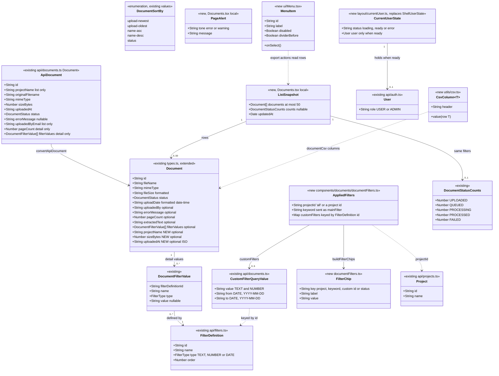

# UI Redesign — Slice 02: Documents Page

## Change Summary

- **Database**: none.
- **Stored files**: none.
- **Backend**: none. No endpoint, DTO or contract changes. The client file `api/exports.ts` switches its hard-coded base URL to `API_URL` (Q6).
- **Frontend**:
  - New in `components/ui/`: Modal, ConfirmDialog, Popover, Menu, Chip, Table primitives, EmptyState, SummaryBar, TextAction, FormField and Select. Button gains a `ref` prop and an `inverse` variant, and Dropdown's list scrolls.
  - New `utils/format.ts` (en-GB dates, sizes, counts) and `utils/csv.ts`. The UI `Document` type gains optional `projectName`, `sizeBytes` and `uploadedAt` fields.
  - The Documents page is rebuilt: toolbar, filter popover, chips, sortable table, summary bar, export menu, bulk bar, and the preview and ZIP modals.
  - `AppShell` shares the user it already loads through `CurrentUserContext`, with no visual change (Q4).
  - The UI Rules in `.github/copilot-instructions.md` gain rules for the new components and for date formatting.
- **Behaviour users will notice**:
  - The Documents page matches the approved design. Filters apply on "Apply filters" or Enter instead of on every keystroke. Column headers sort, and the shown or selected rows can be exported as CSV.
  - Dates read "12 Oct 2026 14:22". The preview shows the project, page count, custom fields and extracted text. The delete message says documents go to the recycle bin.
  - Opening a preview keeps the status filter, and changing filters or sort clears the selection.
  - Admins see "Manage projects" in the project menu. "Retry" and "Generate register PDF" are visible but do nothing until the backend supports them.
  - On the Search page, the bulk bar and ZIP dialog get the new look. Preview, download and ZIP export work wherever the API isn't at localhost:3000.
- **Deploy steps**: none.

## Requirements

- Rebuild the Documents page body so it matches the approved spreadsheet-style design: a dense, high-contrast register that's easy to scan, filter, sort and act on. Fetching, permissions and routes stay as they are.
- Make filtering deliberate and visible:
  - Edits in a filter popover are a draft until applied.
  - Every applied filter shows as a removable chip.
  - Sort is controlled from both the dropdown and the column headers.
  - The list's real limits are stated honestly: the 50-row cap, filtered totals and indexing progress.
- Give users the register outputs they need without backend work:
  - client-side CSV of the shown or selected rows
  - the existing ZIP download
  - visible but inert hooks for features that need a backend (retry processing, register PDF)
- Replace every native dialog on the page with accessible in-app dialogs whose copy is accurate. Deleting moves documents to the recycle bin; it isn't permanent.
- Build the shared components this page is the first to use, so later slices compose screens from them.
- Boundaries:
  - Frontend only. Nothing changes under `server/`, and in `client/src/api/` only `exports.ts`'s base URL changes (Q6). No new npm packages.
  - `Search.tsx` and `DocumentDrawer.tsx` aren't edited (A1).
  - `AppShell`'s appearance doesn't change. It only shares its loaded user (Q4).
  - The settled decisions in the analysis's Resolved Questions (Q1–Q6, A1–A5) apply as written.

## Entities



No Prisma model, DTO or request/response type changes. The only change to `types.ts` is three optional fields on `Document`. `api/documents.ts` is unchanged, and `api/exports.ts` changes only its base URL constant.

## Approach

1. **Shared components (built on first use)**:
   - Build the slice-02 set in `components/ui/` and export it from the barrel: Modal, ConfirmDialog, Popover, Menu (Q3), Chip, Table primitives, EmptyState, SummaryBar, TextAction, FormField and Select. Each component owns its styling and accessibility.
   - Small helpers live in `.ts` files: `textActionStyles.ts`, and `focusable.ts` for the shared focusable-element query. `.tsx` files export only components.
   - **Overlays follow the UI Rules:**
     - `Modal` and `ConfirmDialog` portal to `document.body` at `z-modal` and `z-confirm`. They focus the first focusable element, trap Tab and Shift+Tab, close on Escape and return focus to the previously focused element.
     - `Popover` stays anchored at `z-popover`. It closes on Escape, an outside click, or focus leaving it. `Menu` composes `Popover`.
     - Every handled Escape or Tab calls `stopPropagation()`. React events bubble through portals, so this stops an inner overlay's key handling from reaching an outer one.
   - **Extend instead of duplicating:**
     - Button gains a `ref` prop, which Popover triggers need.
     - Button and IconButton gain an `inverse` variant for the dark bulk bar.
     - Dropdown's list gets a maximum height and keeps the active option scrolled into view, for long project lists.

2. **Page state and data flow**:
   - **Who owns what:**
     - The URL owns `?status=`.
     - `sessionStorage` keeps owning the project, under the unchanged `documents:selectedProject` key.
     - Page state owns the applied keyword and custom filters, the sort, the selection and the list snapshot.
   - **One fetch cycle per change.** A change to the applied filters, URL status or sort (or a reload request) starts one fetch cycle.
     - The cycle requests `listDocuments` and `getStatusCounts` in parallel with the same inputs, and stores a single `ListSnapshot` with `updatedAt = now`.
     - A count failure is non-fatal (`counts = null`); a list failure is an error.
     - Responses from superseded cycles are ignored through an `isActive` guard.
   - **Clearing the selection.** The selection is cleared when the result key (applied filters, status, sort) changes. This uses React's "adjust state during render" pattern, as `AppShell` already does, so no extra effect is needed. A successful delete also clears it.
   - **Preview links keep the query string.** Opening the preview goes to `/documents/:id` with the current query string, and closing it returns to `/documents` with the same string (Q5). The `/documents` and `/documents/:id` routes render the same element tree, so page state survives the navigation.

3. **Filters**:
   - The popover panel mounts only while it's open and starts its draft from the applied values. Unmounting discards the draft, which gives "Escape or outside click discards" for free.
     - Apply or Enter submits the form and commits the normalised draft.
     - The popover's "Clear all" resets the project, keyword and custom filters (applied and draft) and leaves `?status=` alone (A3).
   - The toolbar's Project dropdown sets the applied project directly. The chips row's "Clear all" also clears `?status=` (A3).
   - Chips and the applied count are pure functions in `documentFilters.ts`. They use the definitions in `order` and ignore definitions that no longer exist.
   - DATE ranges are checked in the draft: when "to" is before "from", Apply is disabled and a field error is shown. Without this check the request would always return nothing.

4. **Table, sort and selection**:
   - `DocumentTable` composes the Table primitives in fixed layout:
     - Columns: checkbox | Document (name, with the size beneath) | Status | Uploaded by | Date uploaded | Actions.
     - Rows are at least 32px, and the two-line Document cell makes them about 40px (Q1). The header is 28px and sticky.
     - Gridlines are horizontal only, and selected rows use `bg-selected`.
   - **Sorting.** The headers and the Sort dropdown share the single `sortBy` value.
     - Document toggles between `name-asc` and `name-desc`. Date uploaded toggles between `upload-newest` and `upload-oldest`.
     - Status sets `status`, which has one direction ("ascending") because the backend sorts it one way only.
   - Row actions are always visible. Most rows show PREVIEW / DOWNLOAD. Failed rows show RETRY (danger; its handler is a TODO(backend) stub, per D6) and DOWNLOAD.
   - Clicking a row opens the preview. Clicks on the checkbox cell and the actions cell stop propagation.

5. **Totals, cap and indexing (Q2, A2)**:
   - `total` is the true matching count: `counts[status]` when a status filter is active, otherwise the sum of the counts. If counts are unavailable, it falls back to the number of rows.
   - `isCapped` is `total > 50`. Without counts it falls back to `rows.length === 50`.
   - The toolbar shows "Showing N documents", or the cap message.
   - **Summary bar:**
     - It shows "Total: N files", the size followed by "stored" (or "in the N shown" when capped), and "Updated HH:MM".
     - The indexing indicator counts Uploaded + Queued + Processing. It shows amber "Indexing N documents" when that's above zero, and teal "All documents indexed" only when there are no in-progress *and* no failed documents. This keeps the copy accurate.
     - A red "N failed" link sets `?status=FAILED`. It's plain text when that filter is already active.

6. **Export and bulk actions**:
   - **Export menu** (`Menu`): "Export shown as CSV (N)", "Export selected as CSV (n)", "Download selected as ZIP (n)" (opens `ExportModal`), a divider, then "Generate register PDF" (a TODO(backend) stub, per D7). The selection items are disabled when n is 0.
   - **CSV:** `utils/csv.ts` holds the generic RFC 4180 builder and the download helper. `components/documents/documentCsv.ts` maps documents to the required columns.
   - **Bulk bar:** dark and floating at `z-bulkbar`, with "N selected" | Download ZIP | Export CSV (optional prop) | Delete | ×. Space is reserved at the bottom of the page while it's visible.
   - **Delete:** opens a `ConfirmDialog` with the recycle-bin copy.
     - On success, the selection clears and the list and counts are re-read rather than trimmed locally, so documents beyond the cap move up.
     - A partial failure shows a warning `InlineAlert`.
     - A total failure shows an error `InlineAlert` and keeps the selection.

7. **Preview modal (A4)**:
   - Built on `Modal` (xl). The header shows the file name, the size and a `StatusBadge`. The footer has Close and Download.
   - The body has two columns: the file preview on the left (blob → `img` or `iframe`), and on the right:
     - a failed-processing `InlineAlert`
     - a key/value list: Project, Uploaded by, Date uploaded, Pages, then every custom filter definition in `order` ("—" when empty; DATE values as en-GB dates)
     - a scrollable extracted-text area
   - **Data sources:** the list row (project, uploader, date), `getDocument` (pages, custom values), `getDocumentBlob` (preview) and `getDocumentText` (full text).
     - The text is fetched only for Processed documents. A 404 means "No extracted text."
     - A deep link to a document outside the list shows "—" for Project and Uploaded by.

8. **Cross-cutting changes**:
   - **Current user (Q4):** `components/layout/currentUser.ts` defines `CurrentUserContext`, `useCurrentUser` and `useIsAdmin`. `AppShell` wraps its output in `<CurrentUserContext value={userState}>`, reusing its existing `/auth/me` state. The page renders the "Manage projects" footer only when `useIsAdmin()` is true.
   - **Export base URL (Q6):** `api/exports.ts` uses the same `API_URL` constant pattern as the other API files. Paths and behaviour are unchanged.
   - **Search compatibility (A1):** the new `Document` fields are optional. `BulkActionBar` keeps `selectedCount`, `onExport`, `onDelete` and `onClear`, and adds an optional `onExportCsv`. `ExportModal` keeps `isOpen`, `onClose` and `documentIds`.
   - **Formatting:** dates, times, sizes and counts go through `utils/format.ts`, which builds en-GB strings from date parts. The built-in en-GB format gives "Sept" and a comma before the time.

9. **Risks and responses**:
   - **Out-of-order responses:** handled by the fetch-cycle guard.
   - **Focus trap and portal correctness without a test runner:** checked with a manual keyboard script (Operations → Verify).
   - **Sticky header borders:** `border-separate border-spacing-0`, with cell bottom borders, so the borders don't disappear under a sticky header.
   - **1280px fit:** Dropdown triggers are capped at `max-w-xs` and truncate. The toolbar wraps its right-hand group. Cells truncate with a `title`.
   - **PDF `iframe` focus:** once focus is inside the browser's PDF viewer, the viewer handles Tab itself. Escape and Shift+Tab still work at the boundary.

## Structure

### Interfaces and Implementations

1. `components/ui/buttonStyles.ts` defines `ButtonVariant` (now including `inverse`) and the class builders. `Button`, `ButtonLink`, `IconButton`, and the `Dropdown`, `Menu` and Filter triggers use it.
2. `components/ui/textActionStyles.ts` defines `TextActionTone`, `TextActionVariant` and `textActionClassName`. `TextAction` and router links styled as text actions (the "Manage projects" footer) use it.
3. `components/ui/focusable.ts` defines `getFocusableElements(container)`. `Modal`, `Popover` and `Menu` use it. It isn't exported from the barrel.
4. `components/ui/Popover.tsx` defines the anchored-panel contract (`PopoverTriggerProps`, `PopoverRenderApi`). `Menu` and `DocumentFilterPopover` use it.
5. `components/ui/Modal.tsx` defines the dialog contract (portal, focus, layers). `ConfirmDialog`, `ExportModal` and `DocumentPreviewModal` use it.
6. `components/ui/Table.tsx` defines `SortDirection` and the table primitives (`DataTable`, `TableHeaderCell`, `TableRow`, `TableCell`, `TableSkeletonRows`). `DocumentTable` uses them.
7. `components/layout/currentUser.ts` defines `CurrentUserState`, `CurrentUserContext`, `useCurrentUser` and `useIsAdmin`. `AppShell` provides the value and `Documents.tsx` reads it.
8. `components/documents/documentFilters.ts` defines the page's filter vocabulary: `AppliedFilters`, `DocumentSortBy`, `FilterChip`, constants and pure helpers. The page, toolbar, popover and chips use it.
9. `utils/format.ts` and `utils/csv.ts` are dependency-free helpers. `documentCsv.ts`, the documents components and the page use them.

### Dependencies

1. `pages/Documents.tsx` depends on:
   - `api/documents.ts` (`listDocuments`, `getStatusCounts`, `getDocument`, `bulkDeleteDocuments`), `api/projects.ts` (`listProjects`), `api/filters.ts` (`listFilters`) and `api/exports.ts` (`downloadDocument`)
   - `useIsAdmin` from `layout/currentUser.ts`
   - `documentFilters.ts`, `documentCsv.ts`, `utils/format.ts` and `utils/csv.ts`
   - the documents feature components
   - the `components/ui` barrel (`InlineAlert`, `Button`, `ButtonLink`, `EmptyState`, `ConfirmDialog`)
2. `DocumentsToolbar` depends on `Dropdown`, `Menu` and `textActionClassName` (barrel), `DocumentFilterPopover`, react-router `Link`, and `documentFilters.ts`.
3. `DocumentFilterPopover` depends on `Popover`, `Button`, `Badge`, `FormField`, `Input` and `Select` (barrel), and `documentFilters.ts`.
4. `DocumentFilterChips` depends on `Chip` and `TextAction`.
5. `DocumentTable` depends on `DataTable`, `TableHeaderCell`, `TableRow`, `TableCell`, `TableSkeletonRows`, `Checkbox`, `StatusBadge` and `TextAction`, plus `DocumentSortBy`.
6. `DocumentsSummaryBar` depends on `SummaryBar`, `TextAction` and `utils/format.ts`.
7. `BulkActionBar` depends on `Button`, `IconButton` and `utils/format.ts`.
8. `ExportModal` depends on `Modal`, `Button`, `InlineAlert`, `exportDocuments` (`api/exports.ts`) and `utils/format.ts`.
9. `DocumentPreviewModal` depends on `Modal`, `Button`, `InlineAlert`, `Spinner`, `EmptyState` and `StatusBadge`, on `documentsService.getDocument` / `getDocumentText`, on `getDocumentBlob` / `downloadDocument`, and on `utils/format.ts`.
10. `AppShell` additionally depends on `layout/currentUser.ts`. `api/exports.ts` reads `import.meta.env.VITE_API_URL`.
11. Inside `components/ui/`, files import siblings directly (`./Modal`), never through `./index`.

### Layered Architecture

1. Controller Layer: unchanged (no backend work).
2. Service Layer: unchanged.
3. Storage Layer: unchanged.
4. Client API Layer: `api/exports.ts` takes the shared base URL. The other API files are reused as they are.
5. UI Layer, from the bottom up:
   - Helpers: `utils/format.ts`, `utils/csv.ts`
   - Shared primitives: `components/ui/`
   - App frame: `AppShell` plus `currentUser.ts`
   - Documents feature components: `components/documents/`
   - Page orchestration: `pages/Documents.tsx`

## Operations

Run these in order. Each task ends with its completion check.

### Create Util - `client/src/utils/format.ts`

1. File: `client/src/utils/format.ts` (new folder `client/src/utils/`).
2. Responsibility: en-GB display formatting for dates, times, sizes and counts, plus sortable date strings for file names and CSV. Start the file with one comment: `// Built from date parts: en-GB Intl output uses "Sept" and a comma before the time.`
3. Exports:
   - `formatDate(value: Date | string): string` → local `DD Mon YYYY`, for example `09 Oct 2026`. The day has two digits. The month comes from a module constant `MONTHS = ['Jan', 'Feb', 'Mar', 'Apr', 'May', 'Jun', 'Jul', 'Aug', 'Sep', 'Oct', 'Nov', 'Dec']`. An invalid date returns `'—'`.
   - `formatDateTime(value: Date | string): string` → local `DD Mon YYYY HH:mm` (24-hour, no comma), for example `12 Oct 2026 14:22`. An invalid date returns `'—'`.
   - `formatTime(value: Date | string): string` → local `HH:mm`.
   - `formatIsoDate(value: string): string` → for a value starting with `YYYY-MM-DD` (a date input value or an ISO timestamp), return `DD Mon YYYY` built from those three numbers, with no time-zone conversion. Any other value is returned unchanged.
   - `formatSortableDate(value: Date): string` → local `YYYY-MM-DD`.
   - `formatSortableDateTime(value: Date | string): string` → local `YYYY-MM-DD HH:mm`. An invalid date returns `''`.
   - `formatFileSize(bytes: number): string`:
     - Below 1024 → `${bytes} B`.
     - Below 1024² → KB to 1 decimal place.
     - Below 1024³ → MB to 1 decimal place.
     - Otherwise → GB to 1 decimal place.
     - Examples: `412.4 KB`, `1.2 MB`.
   - `formatCount(count: number): string` → `count.toLocaleString('en-GB')`.
   - `formatCountLabel(count: number, singular: string, plural: string): string` → `${formatCount(count)} ${count === 1 ? singular : plural}`.
4. Constraint: no `toLocaleDateString` or `toLocaleString` for dates anywhere in this slice. Zero-padding uses a local `pad2` helper, which isn't exported.
5. Done when: `formatDateTime(new Date(2026, 8, 9, 7, 5))` returns `09 Sep 2026 07:05`.

### Create Util - `client/src/utils/csv.ts`

1. File: `client/src/utils/csv.ts`
2. Responsibility: generic, safe CSV building and download.
3. Exports:
   - `export interface CsvColumn<T> { header: string; value: (row: T) => string | number | null | undefined }`
   - `toCsv<T>(rows: T[], columns: CsvColumn<T>[]): string`:
     - The header line is the escaped headers. Each row is the escaped values.
     - Fields are joined with `,`, and lines are joined with `\r\n`, with a final `\r\n`.
     - The result is prefixed with `'\uFEFF'` (UTF-8 BOM).
   - `downloadCsv(fileName: string, content: string): void` → `new Blob([content], { type: 'text/csv;charset=utf-8' })`, then an object URL, a temporary `<a download>` that is clicked and removed, and `URL.revokeObjectURL`.
4. A local, non-exported `escapeCsvCell(value)`:
   - `null` or `undefined` → `''`.
   - A number → `String(value)`, with no prefix.
   - A string starting with `=`, `+`, `-`, `@`, a tab or a carriage return → prefix it with `'`. This guards against formula injection; tab and CR follow OWASP.
   - Then, if the string contains `"`, `,`, `\r` or `\n` → wrap it in `"…"` and double any inner `"`.
5. Done when: a row whose value is `-x, "y"` serialises as `"'-x, ""y"""`.

### Update Types - `client/src/types.ts`

1. File: `client/src/types.ts`
2. Change: add three optional fields to `Document`: `projectName?: string;`, `sizeBytes?: number;` and `uploadedAt?: string;`. The last is the ISO upload time.
3. Constraint: every existing field stays exactly as it is, and the new fields stay optional (A1).
4. Done when: `Search.tsx` compiles without edits.

### Update Client API - `client/src/api/exports.ts`

1. File: `client/src/api/exports.ts`
2. Change: replace `const API_BASE = 'http://localhost:3000';` with `const API_URL = import.meta.env.VITE_API_URL || 'http://localhost:3000';`, and replace the two uses (`${API_BASE}/documents/${documentId}/download` and `${API_BASE}/exports`) with `API_URL`.
3. Constraint: paths, methods, headers, body and response handling stay byte-for-byte the same (Q6).
4. Done when: `API_BASE` no longer appears under `client/src`.

### Create Context - `client/src/components/layout/currentUser.ts`

1. File: `client/src/components/layout/currentUser.ts` (a `.ts` file, with no JSX).
2. Exports:
   - `export type CurrentUserState = { status: 'loading' } | { status: 'ready'; user: User } | { status: 'error' };` with `User` type-imported from `../../api/auth`.
   - `export const CurrentUserContext = createContext<CurrentUserState>({ status: 'loading' });`
   - `export function useCurrentUser(): CurrentUserState` → `useContext(CurrentUserContext)`.
   - `export function useIsAdmin(): boolean` → `state.status === 'ready' && state.user.role === 'ADMIN'`.
3. Constraint: "loading" and "error" both count as not admin, so admin-only UI is absent until the role is confirmed.

### Update Component - `AppShell`

1. File: `client/src/components/layout/AppShell.tsx`
2. Changes, with no markup or class changes:
   - Delete the local `ShellUserState` type and import `CurrentUserContext` and `type CurrentUserState` from `./currentUser`. `userState` becomes `useState<CurrentUserState>(…)`, with the same initialiser.
   - Wrap the returned fragment's contents in `<CurrentUserContext value={userState}> … </CurrentUserContext>`. This is React 19 provider syntax, and it covers both the frame `div` and `ProfileSettingsModal`.
3. Constraint: the `/auth/me` call, the refresh on profile close, and everything else stay the same. This is the only `/auth/me` call the page relies on.
4. Done when: the shell looks identical, and `useIsAdmin()` returns `true` for an admin inside any shell route.

### Update Components - Button variants and `ref`

1. File: `client/src/components/ui/buttonStyles.ts`. Extend `ButtonVariant` with `'inverse'` and add `inverse: 'text-white hover:bg-white/10'` to `variantStyles`. The variant is for buttons on the dark `bg-action` bulk bar.
2. File: `client/src/components/ui/Button.tsx`. Add `ref?: Ref<HTMLButtonElement>` to `ButtonProps` (a React 19 ref prop), destructure it, and pass `ref={ref}` to the `<button>`. `ButtonLink` is unchanged.
3. File: `client/src/components/ui/IconButton.tsx`. Widen `variant` to `'ghost' | 'secondary' | 'inverse'`.
4. Done when: `<Button ref={someRef}>` type-checks and the existing usages compile unchanged.

### Create Helper and Component - `TextAction`

1. File: `client/src/components/ui/textActionStyles.ts`
   - `export type TextActionTone = 'accent' | 'muted' | 'danger';`
   - `export type TextActionVariant = 'label' | 'inline';`
   - Base: `inline-flex items-center rounded-sm whitespace-nowrap transition-colors hover:underline underline-offset-2 focus-visible:outline-none focus-visible:ring-2 focus-visible:ring-accent disabled:cursor-not-allowed disabled:opacity-50 disabled:no-underline`
   - Variant: `label` → `text-label uppercase`; `inline` → `text-small font-medium`.
   - Tone: `accent` → `text-accent hover:text-accent-hover`; `muted` → `text-ink-muted hover:text-ink`; `danger` → `text-status-red-text`.
   - `export function textActionClassName(tone: TextActionTone, variant: TextActionVariant = 'label', className?: string): string`. It picks from `Record` maps and joins with `filter(Boolean)`.
2. File: `client/src/components/ui/TextAction.tsx`
   - Props: `export interface TextActionProps extends ButtonHTMLAttributes<HTMLButtonElement> { tone?: TextActionTone; variant?: TextActionVariant }`. Defaults: `tone = 'accent'`, `variant = 'label'`, `type = 'button'`.
   - Render: `<button type={type} className={textActionClassName(tone, variant, className)} {...rest} />`.

### Create Helper - `client/src/components/ui/focusable.ts`

1. `const FOCUSABLE_SELECTOR = 'a[href], area[href], button:not([disabled]), input:not([disabled]):not([type="hidden"]), select:not([disabled]), textarea:not([disabled]), iframe, [tabindex]:not([tabindex="-1"]), [contenteditable="true"]';`
2. `export function getFocusableElements(container: HTMLElement): HTMLElement[]` → `Array.from(container.querySelectorAll<HTMLElement>(FOCUSABLE_SELECTOR)).filter((el) => el.getClientRects().length > 0)`.
3. Not exported from `index.ts`, because it's internal to `components/ui/`.

### Update Component - `Dropdown` (long lists)

1. File: `client/src/components/ui/Dropdown.tsx`
2. Changes:
   - Append `max-h-72 overflow-y-auto custom-scrollbar` to the `<ul role="listbox">` classes, after `outline-none`.
   - Add an effect: `useEffect(() => { if (!isOpen || !activeOptionId) return; document.getElementById(activeOptionId)?.scrollIntoView({ block: 'nearest' }); }, [isOpen, activeOptionId]);`
3. Constraint: no other behaviour changes. Escape still stops propagation, and the footer still closes the menu on click.

### Create Component - `Modal`

1. File: `client/src/components/ui/Modal.tsx`
2. Props:
   ```ts
   export interface ModalProps {
     isOpen: boolean;
     onClose: () => void;
     title: ReactNode;
     description?: ReactNode;            // small muted line under the title
     headerAside?: ReactNode;            // e.g. a StatusBadge
     footer?: ReactNode;
     size?: 'sm' | 'md' | 'lg' | 'xl';   // default 'md'
     layer?: 'modal' | 'confirm';        // default 'modal'
     role?: 'dialog' | 'alertdialog';    // default 'dialog'
     showCloseButton?: boolean;          // default true
     closeDisabled?: boolean;            // default false: blocks Escape, backdrop and the close button
     ariaDescribedBy?: string;           // overrides the description id
     bodyClassName?: string;             // default 'px-4 py-3'
     children: ReactNode;
   }
   ```
3. Render, returning `null` when `!isOpen`, otherwise `createPortal(…, document.body)`:
   - Wrapper: `<div className={`fixed inset-0 ${layer === 'confirm' ? 'z-confirm' : 'z-modal'} flex items-center justify-center p-4`}>`.
   - Backdrop: `<div className="absolute inset-0 bg-ink/40" aria-hidden="true" onMouseDown={() => { if (!closeDisabled) onClose(); }} />`.
   - Panel: `<div ref={panelRef} role={role} aria-modal="true" aria-labelledby={titleId} aria-describedby={ariaDescribedBy ?? (description ? descriptionId : undefined)} tabIndex={-1} onKeyDown={handleKeyDown}>`.
     - Classes: `relative flex max-h-[calc(100vh-2rem)] w-full flex-col rounded-md border border-line-strong bg-canvas shadow-overlay focus:outline-none`, plus the size class from a `Record`: `sm` `max-w-[400px]`, `md` `max-w-[480px]`, `lg` `max-w-[720px]`, `xl` `max-w-[1040px]`.
     - Header: `<header className="flex items-start gap-3 border-b border-line px-4 py-3">`.
       - `<div className="min-w-0 flex-1"><h2 id={titleId} className="truncate text-panel text-ink">{title}</h2>`, plus, when `description` is set, `<p id={descriptionId} className="mt-0.5 text-small text-ink-muted tabular-nums">`, then `</div>`.
       - `headerAside` in `<div className="shrink-0 pt-0.5">`.
       - When `showCloseButton`: `<IconButton icon="close" label="Close" size="sm" variant="ghost" onClick={onClose} disabled={closeDisabled} className="-mr-1.5 -mt-0.5" />`.
     - Body: `<div className={`min-h-0 flex-1 overflow-y-auto custom-scrollbar ${bodyClassName ?? 'px-4 py-3'}`}>{children}</div>`.
     - Footer, when set: `<footer className="flex items-center justify-end gap-2 border-t border-line bg-subtle px-4 py-3">`.
   - Ids come from `useId()`.
4. Focus, in `useEffect(…, [isOpen])` when open:
   - Store `document.activeElement` (if it's an `HTMLElement`) as the element to return to.
   - Focus `getFocusableElements(panel)[0]`, or the panel itself.
   - The cleanup focuses the stored element if `isConnected`.
   - This is safe under StrictMode's double effect run.
5. `handleKeyDown`:
   - Escape: `stopPropagation()`, `preventDefault()`, then `onClose()` unless `closeDisabled`.
   - Tab: `stopPropagation()`.
     - If there are no focusables, `preventDefault()` and focus the panel.
     - Shift+Tab on the first element (or the panel) → focus the last. Tab on the last → focus the first, with `preventDefault()`.
   - Inner overlays (Dropdown, Popover, a nested ConfirmDialog) stop their own Escape first, so only the innermost one closes.
6. Done when: the keyboard script in Operations → Verify passes.

### Create Component - `ConfirmDialog`

1. File: `client/src/components/ui/ConfirmDialog.tsx`
2. Props: `export interface ConfirmDialogProps { isOpen: boolean; title: string; message: ReactNode; confirmLabel: string; cancelLabel?: string; tone?: 'danger' | 'default'; isConfirming?: boolean; onConfirm: () => void; onCancel: () => void }`. Defaults: `cancelLabel = 'Cancel'`, `tone = 'danger'`, `isConfirming = false`.
3. Render: `<Modal isOpen={isOpen} onClose={onCancel} title={title} size="sm" layer="confirm" role="alertdialog" showCloseButton={false} closeDisabled={isConfirming} ariaDescribedBy={messageId} footer={…}>` with body `<div id={messageId} className="text-body text-ink-body">{message}</div>`.
   - Footer: `<Button variant="secondary" size="md" onClick={onCancel} disabled={isConfirming}>{cancelLabel}</Button>`, then `<Button variant={tone === 'danger' ? 'danger' : 'primary'} size="md" loading={isConfirming} onClick={onConfirm}>{confirmLabel}</Button>`.
4. Constraint: Cancel is the first focusable element, so focus starts on it.

### Create Component - `Popover`

1. File: `client/src/components/ui/Popover.tsx`
2. Exports:
   ```ts
   export interface PopoverTriggerProps {
     ref: RefObject<HTMLButtonElement | null>;
     onClick: () => void;
     'aria-expanded': boolean;
     'aria-controls': string;
     'aria-haspopup': 'dialog' | 'menu';
   }
   export interface PopoverRenderApi { close: () => void }
   export interface PopoverProps {
     isOpen: boolean;
     onOpenChange: (isOpen: boolean) => void;
     renderTrigger: (props: PopoverTriggerProps) => ReactNode;
     children: (api: PopoverRenderApi) => ReactNode;
     label: string;                 // panel aria-label when kind is 'dialog'
     kind?: 'dialog' | 'menu';      // default 'dialog'
     align?: 'start' | 'end';       // default 'start'
     panelClassName?: string;       // width and padding
   }
   ```
3. Behaviour:
   - Refs and ids: `rootRef`, `triggerRef = useRef<HTMLButtonElement>(null)`, `panelRef`, `panelId = useId()`.
   - `close` calls `onOpenChange(false)` and then `triggerRef.current?.focus()`.
   - Trigger props: `{ ref: triggerRef, onClick: () => onOpenChange(!isOpen), 'aria-expanded': isOpen, 'aria-controls': panelId, 'aria-haspopup': kind }`.
   - On open (an effect on `isOpen`): focus `getFocusableElements(panel)[0]`, or the panel.
   - Outside click: while open, a `mousedown` listener on `document` calls `onOpenChange(false)` when the target is outside `rootRef`, without moving focus. The listener is removed on close or unmount.
   - Escape (root `onKeyDown`, while open): `stopPropagation()`, `preventDefault()`, `close()`.
   - Focus leaving (root `onBlur`): if open and `event.relatedTarget` is a `Node` outside `rootRef`, call `onOpenChange(false)`.
4. Render:
   - Root: `<div ref={rootRef} className="relative inline-block" onKeyDown={…} onBlur={…}>{renderTrigger(triggerProps)}{panel}</div>`.
   - The panel is rendered only when open: `<div ref={panelRef} id={panelId} role={kind === 'dialog' ? 'dialog' : undefined} aria-label={kind === 'dialog' ? label : undefined} tabIndex={-1}>`.
     - Classes: `absolute top-full mt-1 z-popover rounded-md border border-line-strong bg-canvas shadow-overlay focus:outline-none`, plus `left-0` (start) or `right-0` (end), plus `panelClassName`.
     - Content: `{children({ close })}`.

### Create Component - `Menu`

1. File: `client/src/components/ui/Menu.tsx`
2. Exports: `export interface MenuItem { id: string; label: string; onSelect: () => void; disabled?: boolean; dividerBefore?: boolean }` and `Menu`.
3. Props: `export interface MenuProps { label: string; icon?: string; items: MenuItem[]; align?: 'start' | 'end'; size?: ButtonSize }`. Defaults: `align = 'end'`, `size = 'sm'`.
4. State: `isOpen`. It renders `<Popover isOpen onOpenChange={setIsOpen} kind="menu" label={label} align={align} panelClassName="min-w-56 py-1" renderTrigger={…}>`.
5. Trigger: `<Button {...triggerProps} variant="secondary" size={size} icon={icon}>{label}<span className="material-symbols-outlined text-[16px] leading-none text-ink-muted" aria-hidden="true">expand_more</span></Button>`.
6. Content, as `({ close }) => <ul role="menu" aria-label={label} onKeyDown={handleMenuKeyDown}>`. For each item, a `Fragment` containing:
   - an optional `<li role="separator" className="my-1 border-t border-line" />` when `dividerBefore` is set
   - `<li role="none"><button type="button" role="menuitem" disabled={item.disabled} onClick={() => { close(); item.onSelect(); }}>`
     - Classes: `flex h-7 w-full items-center px-3 text-left text-body text-ink whitespace-nowrap tabular-nums hover:bg-subtle focus:bg-subtle focus:outline-none disabled:cursor-not-allowed disabled:text-ink-muted disabled:hover:bg-transparent`.
     - Content: `{item.label}`.
7. `handleMenuKeyDown`:
   - ArrowDown and ArrowUp move focus (wrapping) among the menu's `[role="menuitem"]:not(:disabled)` buttons. Home and End jump to the first and last. Each call `preventDefault()`.
   - Escape and Tab are left to `Popover`.
8. Constraint: `close()` runs before `onSelect()`, so a modal opened by `onSelect` records the Menu trigger as its focus-return target.

### Create Component - `Chip`

1. File: `client/src/components/ui/Chip.tsx`
2. Props: `export interface ChipProps { label: string; value: string; onRemove: () => void }`
3. Render: `<span className="inline-flex h-6 max-w-full items-center gap-1 rounded border border-line bg-subtle pl-2 pr-0.5 text-small text-ink">`, containing:
   - `<span className="shrink-0 text-ink-muted">{label}:</span>`
   - `<span className="max-w-[16rem] truncate font-medium" title={value}>{value}</span>`
   - `<button type="button" onClick={onRemove} aria-label={`Remove ${label} filter`} className="inline-flex size-5 shrink-0 items-center justify-center rounded-sm text-ink-muted hover:bg-line hover:text-ink focus-visible:outline-none focus-visible:ring-2 focus-visible:ring-accent">`, with a `close` icon (14px, `aria-hidden`).

### Create Components - Table primitives

1. File: `client/src/components/ui/Table.tsx`
2. `export type SortDirection = 'ascending' | 'descending';`
3. `DataTable`:
   - Props: `{ children: ReactNode; fixed?: boolean; busy?: boolean; label?: string; className?: string }`
   - Render: `<div className={['min-h-0 overflow-auto custom-scrollbar rounded border border-line bg-canvas', className]…}>` around `<table aria-label={label} aria-busy={busy || undefined}>`.
   - Table classes: `w-full border-separate border-spacing-0 text-left text-body text-ink-body`, plus `table-fixed` when `fixed`, plus `opacity-60` when `busy`.
4. `TableHeaderCell`:
   - Props: `Omit<ThHTMLAttributes<HTMLTableCellElement>, 'align'> & { align?: 'start' | 'center' | 'end'; sortDirection?: SortDirection | null; onSort?: () => void }`
   - Render: `<th scope="col" aria-sort={onSort ? (sortDirection ?? 'none') : undefined}>`.
     - Classes: `sticky top-0 z-sticky h-7 px-2 bg-subtle border-b border-line align-middle whitespace-nowrap text-label uppercase text-ink-muted`, plus the alignment (`text-left`, `text-center` or `text-right`), plus `className`.
   - With `onSort`, the children go in `<button type="button" onClick={onSort} className="inline-flex items-center gap-1 rounded-sm uppercase hover:text-ink focus-visible:outline-none focus-visible:ring-2 focus-visible:ring-accent">`. When `sortDirection` is set, an icon follows: `<span className="material-symbols-outlined text-[14px] leading-none text-accent" aria-hidden="true">` with `arrow_upward` (ascending) or `arrow_downward` (descending).
5. `TableRow`:
   - Props: `HTMLAttributes<HTMLTableRowElement> & { selected?: boolean }`
   - Classes: `transition-colors [&:last-child>td]:border-b-0`, plus `bg-selected` when selected (otherwise `hover:bg-subtle`), plus `cursor-pointer` when `onClick` is set.
   - Set `data-selected` when selected.
6. `TableCell`:
   - Props: `Omit<TdHTMLAttributes<HTMLTableCellElement>, 'align'> & { align?: 'start' | 'center' | 'end' }`
   - Classes: `h-8 px-2 py-1 border-b border-line align-middle`, plus the alignment.
7. `TableSkeletonRows`:
   - Props: `{ columns: number; rows?: number }`, with `rows` defaulting to 8.
   - Render: `rows` × `<tr aria-hidden="true">`. Each has `columns` × `<td className="h-8 px-2 py-1 border-b border-line">` containing `<span className="block h-3 animate-pulse rounded-sm bg-line …">`. The width class cycles through the module constant `['w-3/4', 'w-1/2', 'w-2/3', 'w-5/6']` by `(row + column) % 4`.
8. Constraint: every class string is a complete literal chosen through a `Record` or a ternary.

### Create Component - `EmptyState`

1. File: `client/src/components/ui/EmptyState.tsx`
2. Props: `export interface EmptyStateProps { icon?: string; title: string; description?: ReactNode; action?: ReactNode; className?: string }`
3. Render: `<div className={['flex flex-col items-center justify-center gap-1 px-6 py-12 text-center', className]…}>`, containing:
   - the optional icon: `<span className="material-symbols-outlined mb-2 text-[32px] leading-none text-ink-muted" aria-hidden="true">`
   - `<h2 className="text-panel text-ink">{title}</h2>`
   - the optional description: `<p className="max-w-sm text-body text-ink-muted">`
   - the optional action: `<div className="mt-3">`

### Create Component - `SummaryBar`

1. File: `client/src/components/ui/SummaryBar.tsx`
2. Props: `export interface SummaryBarProps { items: ReactNode[]; aside?: ReactNode; className?: string }`
3. Render: `<div className={['flex shrink-0 flex-wrap items-center justify-between gap-x-4 gap-y-1 min-h-8 rounded border border-line bg-subtle px-3 py-1.5 text-small text-ink-body tabular-nums', className]…}>`, containing:
   - `<div className="flex flex-wrap items-center gap-2">`, mapping `items` to `Fragment key={index}`. From the second item on, each is preceded by `<span className="text-line-strong" aria-hidden="true">•</span>`, then `<span>{item}</span>`.
   - When `aside` is set: `<div className="flex items-center gap-3">{aside}</div>`.

### Create Component - `FormField`

1. File: `client/src/components/ui/FormField.tsx`
2. Props: `export interface FormFieldProps { label: string; htmlFor?: string; hint?: ReactNode; error?: string; className?: string; children: ReactNode }`
3. Render: `<div className={className} role={htmlFor ? undefined : 'group'} aria-labelledby={htmlFor ? undefined : labelId}>`, containing:
   - A label with the classes `mb-1 block text-label uppercase text-ink-muted`. With `htmlFor` it's a `<label htmlFor={htmlFor}>`; without it, a `<span id={labelId}>` that labels the group.
   - The children.
   - Then either `error`, as `<p role="alert" className="mt-1 text-small text-status-red-text">`, or `hint`, as `<p className="mt-1 text-small text-ink-muted">`.

### Create Component - `Select`

1. File: `client/src/components/ui/Select.tsx`
2. Props: `export interface SelectProps extends Omit<SelectHTMLAttributes<HTMLSelectElement>, 'size'> { size?: 'sm' | 'md'; invalid?: boolean; ref?: Ref<HTMLSelectElement> }`, with `size` defaulting to `'md'`.
3. Classes:
   - Base: `block w-full rounded border bg-canvas py-0 pl-2.5 pr-8 text-body text-ink focus:outline-none focus:ring-1 disabled:bg-subtle disabled:text-ink-muted`
   - Size: `h-7` (sm) or `h-[30px]` (md)
   - Normal state: `border-line focus:border-accent focus:ring-accent`
   - `invalid` state: `border-status-red-text focus:border-status-red-text focus:ring-status-red-text`, plus `aria-invalid="true"`
4. Constraint: `py-0` and `pr-8` override the `@tailwindcss/forms` padding, while its chevron background stays.

### Update Barrel - `client/src/components/ui/index.ts`

1. Add, keeping the alphabetical order:
   - `Chip`
   - `ConfirmDialog`
   - `DataTable`, `TableCell`, `TableHeaderCell`, `TableRow`, `TableSkeletonRows`, plus `export type { SortDirection }`, all from `./Table`
   - `EmptyState`
   - `FormField`
   - `Menu`, plus `export type { MenuItem }`
   - `Modal`
   - `Popover`, plus `export type { PopoverRenderApi, PopoverTriggerProps }`
   - `Select`
   - `SummaryBar`
   - `TextAction`
   - `textActionClassName`, plus `export type { TextActionTone, TextActionVariant }`, from `./textActionStyles`
2. Done when: every new component is imported from `'../ui'` / `'../components/ui'` outside `components/ui/`.

### Create Module - `client/src/components/documents/documentFilters.ts`

1. Responsibility: the page's filter and sort vocabulary, plus pure helpers. It has no React or JSX.
2. Constants:
   - `export const ALL_PROJECTS = 'all';`
   - `export const PROJECT_STORAGE_KEY = 'documents:selectedProject';` (unchanged key)
   - `export const DOCUMENT_LIST_LIMIT = 50;`, with the comment `// Matches the server's take: 50 in DocumentsService.listDocuments.`
3. Types:
   - `export type DocumentSortBy = NonNullable<ListDocumentsFilters['sortBy']>;`
   - `export interface AppliedFilters { projectId: string; keyword: string; customFilters: Record<string, CustomFilterQueryValue> }`
   - `export interface FilterChip { key: string; label: string; value: string }`
4. `export const DOCUMENT_SORT_OPTIONS: DropdownOption<DocumentSortBy>[]`:
   - `upload-newest` "Date uploaded (newest)"
   - `upload-oldest` "Date uploaded (oldest)"
   - `name-asc` "Name (A–Z)"
   - `name-desc` "Name (Z–A)"
   - `status` "Status"
5. Functions:
   - `readStoredProjectId(): string`: inside try/catch, read `PROJECT_STORAGE_KEY`. A missing value or the legacy `'All Projects'` → `ALL_PROJECTS`; an error → `ALL_PROJECTS`.
   - `writeStoredProjectId(projectId: string): void`: try/catch, ignoring failures.
   - `createEmptyFilters(projectId: string = ALL_PROJECTS): AppliedFilters` → `{ projectId, keyword: '', customFilters: {} }`.
   - `sortFilterDefinitions(definitions: FilterDefinition[]): FilterDefinition[]` → a copy sorted by `order`, then by `name`.
   - `normaliseFilters(filters: AppliedFilters): AppliedFilters`:
     - Trim `keyword`.
     - For each custom entry, trim `value`. Keep `from` and `to` only when they're non-empty.
     - Drop entries with no `value`, `from` or `to`.
   - `countAppliedFilters(filters: AppliedFilters, definitions: FilterDefinition[]): number` → (project ≠ all ? 1 : 0) + (keyword ? 1 : 0) + the number of definitions whose entry has a value, a `from` or a `to`.
   - `hasActiveFilters(filters: AppliedFilters, status: DocumentStatus | undefined): boolean` → that count (using the custom entries' keys) > 0, or `status` is set.
   - `buildFilterChips(args: { filters: AppliedFilters; projectName: string | null; definitions: FilterDefinition[]; status: DocumentStatus | undefined }): FilterChip[]`, in this order:
     - Project → `{ key: 'project', label: 'Project', value: projectName ?? 'Unknown project' }`.
     - Keyword → `{ key: 'keyword', label: 'Keyword', value: keyword }`.
     - Each definition with a value, in `order`. The key is `custom:${id}`, and the label is the definition name. The value is:
       - TEXT or NUMBER → `value`.
       - DATE with both bounds → `${formatIsoDate(from)} – ${formatIsoDate(to)}` (an en dash).
       - DATE with `from` only → `From ${formatIsoDate(from)}`.
       - DATE with `to` only → `Until ${formatIsoDate(to)}`.
     - Status → `{ key: 'status', label: 'Status', value: documentStatusStyles[status].label }`.
   - `toListQuery(filters: AppliedFilters, status: DocumentStatus | undefined, sortBy: DocumentSortBy): ListDocumentsFilters` → `{ projectId: filters.projectId === ALL_PROJECTS ? undefined : filters.projectId, mainFilter: filters.keyword, customFilters: filters.customFilters, status, sortBy }`.
   - `getMatchingTotal(counts: DocumentStatusCounts, status: DocumentStatus | undefined): number` → `counts[status]` when `status` is set, otherwise the sum of the five counts.
   - `getInProgressCount(counts: DocumentStatusCounts): number` → `UPLOADED + QUEUED + PROCESSING` (A2).

### Create Module - `client/src/components/documents/documentCsv.ts`

1. `const DOCUMENT_CSV_COLUMNS: CsvColumn<Document>[]`:
   - "File name" → `fileName`
   - "Project" → `projectName`
   - "Status" → `documentStatusStyles[status].label`
   - "Uploaded by" → `uploadedBy`
   - "Date uploaded" → `uploadedAt ? formatSortableDateTime(uploadedAt) : ''`
   - "Size (KB)" → `sizeBytes === undefined ? '' : Math.round((sizeBytes / 1024) * 10) / 10`, which is a number
2. `export function buildDocumentsCsv(documents: Document[]): string` → `toCsv(documents, DOCUMENT_CSV_COLUMNS)`.
3. `export function documentsCsvFileName(now: Date): string` → `` `documents-${formatSortableDate(now)}.csv` ``.

### Create Component - `DocumentFilterPopover`

1. File: `client/src/components/documents/DocumentFilterPopover.tsx`
2. Props: `{ isOpen: boolean; onOpenChange: (isOpen: boolean) => void; applied: AppliedFilters; projects: Project[]; filterDefinitions: FilterDefinition[]; appliedCount: number; onApply: (next: AppliedFilters) => void; onClearAll: () => void }`
3. Render: `<Popover isOpen onOpenChange label="Filter documents" kind="dialog" align="start" panelClassName="w-[520px] p-3" renderTrigger={…}>{({ close }) => <FilterPanel … onApply={(next) => { onApply(next); close(); }} onClearAll={() => { onClearAll(); close(); }} />}</Popover>`.
   - Trigger: `<Button {...triggerProps} variant="secondary" size="sm" icon="tune" aria-label={appliedCount > 0 ? `Filter, ${appliedCount} applied` : undefined}>Filter{appliedCount > 0 && <Badge tone="teal">{appliedCount}</Badge>}</Button>`.
4. `FilterPanel` is a local component, not exported. It mounts only while the popover is open, so its draft is discarded when the popover closes.
   - State: `const [draft, setDraft] = useState<AppliedFilters>(applied)`. Ids come from `useId()`.
   - **Date errors:** for each DATE definition with both `from` and `to` set and `from > to` (string comparison of `YYYY-MM-DD`), the error is "The end date is before the start date." `hasErrors` is true when any such error exists.
   - **Form:** `<form onSubmit={handleSubmit} noValidate>`. `handleSubmit` calls `preventDefault()` and, when there are no errors, `onApply(normaliseFilters(draft))`. Enter in any input submits the form.
   - **Header:** `<div className="mb-3 flex items-center justify-between"><h2 className="text-body font-semibold text-ink">Filter documents</h2>`, plus, when `appliedCount > 0`, `<span className="text-label uppercase text-ink-muted tabular-nums">{appliedCount} applied</span>`.
   - **Fields,** in `<div className="grid grid-cols-2 gap-3">`:
     - `<FormField label="Search keywords" htmlFor={keywordId} className="col-span-2">` around `<Input id={keywordId} size="sm" leadingIcon="search" placeholder="File name or document text" value={draft.keyword} onChange={…} />`.
     - `<FormField label="Project" htmlFor={projectFieldId}>` around `<Select id size="sm" value={draft.projectId} onChange={…}>`, with the options "All projects" (`ALL_PROJECTS`) followed by every project's `{id, name}`.
     - For each definition, in `order`:
       - TEXT and NUMBER: `<FormField label={def.name} htmlFor>` around `<Input id size="sm" type={def.type === 'NUMBER' ? 'number' : 'text'} placeholder={def.type === 'NUMBER' ? 'e.g. 500' : `Enter ${def.name.toLowerCase()}`} value={draft.customFilters[def.id]?.value ?? ''} />`.
       - DATE: `<FormField label={def.name} error={dateError} className="col-span-2">`, with no `htmlFor`, so it's a labelled group. Inside, `<div className="flex items-center gap-2">` holds `<Input type="date" size="sm" aria-label="From" invalid={Boolean(dateError)} …/>`, then `<span className="text-small text-ink-muted">to</span>`, then `<Input type="date" size="sm" aria-label="To" …/>`.
     - Draft updates go through a local `setCustomValue(id, patch)`, which merges the patch and deletes the entry when it's empty, as the current page does.
   - **Footer:** `<div className="mt-3 flex items-center justify-between border-t border-line pt-3">`, with `<Button variant="ghost" size="sm" onClick={onClearAll}>Clear all</Button>` and `<Button type="submit" variant="dark" size="sm" disabled={hasErrors}>Apply filters</Button>`.

### Create Component - `DocumentFilterChips`

1. File: `client/src/components/documents/DocumentFilterChips.tsx`
2. Props: `{ chips: FilterChip[]; onRemove: (key: string) => void; onClearAll: () => void }`
3. Render, only when `chips.length > 0`: `<div role="group" aria-label="Active filters" className="flex shrink-0 flex-wrap items-center gap-1.5">`, containing a `<Chip key label value onRemove={() => onRemove(chip.key)} />` for each chip, then `<TextAction tone="accent" className="ml-1" onClick={onClearAll}>Clear all</TextAction>`.

### Create Component - `DocumentsToolbar`

1. File: `client/src/components/documents/DocumentsToolbar.tsx`
2. Props: `{ projects: Project[]; isAdmin: boolean; applied: AppliedFilters; filterDefinitions: FilterDefinition[]; appliedFilterCount: number; sortBy: DocumentSortBy; countLabel: string | null; exportItems: MenuItem[]; onProjectChange: (projectId: string) => void; onApplyFilters: (next: AppliedFilters) => void; onClearPopoverFilters: () => void; onSortChange: (sortBy: DocumentSortBy) => void }`
3. State: `isFilterOpen`.
4. Render: `<div className="flex shrink-0 flex-wrap items-center justify-between gap-x-3 gap-y-2">`.
   - Left: `<div className="flex flex-wrap items-center gap-2">`, containing:
     - `<Dropdown label="Project" value={applied.projectId} options={[{ value: ALL_PROJECTS, label: 'All projects' }, …projects as { value: id, label: name }]} onChange={onProjectChange} footer={…} />`. When `isAdmin`, the footer is `<Link to="/admin/projects" className={textActionClassName('accent', 'label', 'flex h-7 items-center px-2')}>Manage projects</Link>`; otherwise it's `undefined`, so it's absent from the DOM.
     - `<DocumentFilterPopover isOpen={isFilterOpen} onOpenChange={setIsFilterOpen} … onApply={onApplyFilters} onClearAll={onClearPopoverFilters} />`
     - `<Dropdown label="Sort" value={sortBy} options={DOCUMENT_SORT_OPTIONS} onChange={onSortChange} />`
   - Right: `<div className="ml-auto flex items-center gap-3">`, containing `countLabel` (when not null) as `<span className="text-small text-ink-muted tabular-nums" aria-live="polite">`, then `<Menu label="Export" icon="download" items={exportItems} align="end" />`.

### Rebuild Component - `DocumentTable`

1. File: `client/src/components/documents/DocumentTable.tsx` (`Documents.tsx` is its only consumer).
2. Props: `{ documents: Document[]; isLoading: boolean; selectedIds: Set<string>; sortBy: DocumentSortBy; onSortChange: (sortBy: DocumentSortBy) => void; onOpenPreview: (id: string) => void; onToggleSelect: (id: string) => void; onSelectAll: (checked: boolean) => void; onDownload: (id: string) => void; onRetry: (id: string) => void }`. The old `selectedDocumentId` prop is removed.
3. Header selection state: `allSelected = documents.length > 0 && every row is selected`. `someSelected = some row is selected && !allSelected`.
4. Render: `<DataTable fixed busy={isLoading && documents.length > 0} label="Documents">`.
   - Header row, as `<thead><tr>`:
     - `<TableHeaderCell className="w-10" align="center">` containing `<Checkbox aria-label="Select all shown documents" checked={allSelected} indeterminate={someSelected} disabled={documents.length === 0} onChange={(e) => onSelectAll(e.target.checked)} />`
     - `<TableHeaderCell sortDirection={sortBy === 'name-asc' ? 'ascending' : sortBy === 'name-desc' ? 'descending' : null} onSort={() => onSortChange(sortBy === 'name-asc' ? 'name-desc' : 'name-asc')}>Document</TableHeaderCell>`
     - `<TableHeaderCell className="w-32" sortDirection={sortBy === 'status' ? 'ascending' : null} onSort={() => onSortChange('status')}>Status</TableHeaderCell>`
     - `<TableHeaderCell className="w-56">Uploaded by</TableHeaderCell>`
     - `<TableHeaderCell className="w-40" sortDirection={sortBy === 'upload-newest' ? 'descending' : sortBy === 'upload-oldest' ? 'ascending' : null} onSort={() => onSortChange(sortBy === 'upload-newest' ? 'upload-oldest' : 'upload-newest')}>Date uploaded</TableHeaderCell>`
     - `<TableHeaderCell className="w-44" align="end">Actions</TableHeaderCell>`
   - Body: when `documents.length === 0 && isLoading`, render `<TableSkeletonRows columns={6} />`. Otherwise render one row per document: `<TableRow key selected={selectedIds.has(id)} onClick={() => onOpenPreview(id)}>`, containing:
     - **Checkbox cell:** `<TableCell align="center" onClick={(e) => e.stopPropagation()}>` with `<Checkbox aria-label={`Select ${fileName}`} checked onChange={() => onToggleSelect(id)} />`.
     - **Document cell:** `<TableCell>` containing:
       - `<button type="button" title={fileName} onClick={(e) => { e.stopPropagation(); onOpenPreview(id); }} className="block max-w-full truncate rounded-sm text-left text-body font-medium text-ink hover:text-accent hover:underline focus-visible:outline-none focus-visible:ring-2 focus-visible:ring-accent">{fileName}</button>`
       - `<span className="block text-small text-ink-muted tabular-nums">{fileSize}</span>`
     - **Status cell:** `<TableCell><StatusBadge status errorMessage /></TableCell>`.
     - **Uploaded by cell:** `<TableCell className="truncate" title={uploadedBy}>{uploadedBy ?? '—'}</TableCell>`.
     - **Date cell:** `<TableCell className="whitespace-nowrap text-ink-muted tabular-nums">{uploadDate}</TableCell>`.
     - **Actions cell:** `<TableCell align="end" onClick={(e) => e.stopPropagation()}>` with `<div className="inline-flex items-center gap-1.5">`:
       - Failed rows: `<TextAction tone="danger" aria-label={`Retry processing ${fileName}`} onClick={() => onRetry(id)}>Retry</TextAction>`.
       - Other rows: `<TextAction tone="accent" aria-label={`Preview ${fileName}`} onClick={() => onOpenPreview(id)}>Preview</TextAction>`.
       - Then the separator `<span className="text-small text-line-strong" aria-hidden="true">/</span>`.
       - Then `<TextAction tone="muted" aria-label={`Download ${fileName}`} onClick={() => onDownload(id)}>Download</TextAction>`.
5. Constraints:
   - There's no file-type icon.
   - No `opacity-0` or hover-only actions.
   - No legacy, `slate-*`, `blue-*` or `dark:` classes remain.

### Create Component - `DocumentsSummaryBar`

1. File: `client/src/components/documents/DocumentsSummaryBar.tsx`
2. Props: `{ total: number; totalBytes: number; shownCount: number; isCapped: boolean; updatedAt: Date; counts: DocumentStatusCounts | null; isFailedFilterActive: boolean; onShowFailed: () => void }`
3. Items, passed to `SummaryBar`:
   - `<>Total: <strong className="font-semibold text-ink">{formatCountLabel(total, 'file', 'files')}</strong></>`
   - `<><strong className="font-semibold text-ink">{formatFileSize(totalBytes)}</strong> {isCapped ? `in the ${formatCount(shownCount)} shown` : 'stored'}</>`
   - `<>Updated {formatTime(updatedAt)}</>`
4. Aside, only when `counts` is set:
   - **Status text,** using `inProgress = getInProgressCount(counts)`:
     - When `inProgress > 0`: `<span className="inline-flex items-center gap-1.5 text-status-amber-text"><span className="size-1.5 rounded-full bg-status-amber-dot" aria-hidden="true" />Indexing {formatCountLabel(inProgress, 'document', 'documents')}</span>`.
     - When `counts.FAILED === 0`: `<span className="inline-flex items-center gap-1 text-accent"><span className="material-symbols-outlined text-[14px] leading-none" aria-hidden="true">check_circle</span>All documents indexed</span>`.
     - Otherwise, nothing.
   - **Failed link,** when `counts.FAILED > 0`:
     - When `isFailedFilterActive`: `<span className="font-medium text-status-red-text">{formatCount(counts.FAILED)} failed</span>`.
     - Otherwise: `<TextAction tone="danger" variant="inline" onClick={onShowFailed}>{formatCount(counts.FAILED)} failed</TextAction>`.

### Restyle Component - `BulkActionBar`

1. File: `client/src/components/documents/BulkActionBar.tsx`. It's also used by `Search.tsx`, so it must stay compatible (A1).
2. Props: `{ selectedCount: number; onExport: () => void; onDelete: () => void; onClear: () => void; onExportCsv?: () => void }`. `onExport` keeps its name and means "Download ZIP".
3. Render: `<div role="region" aria-label="Bulk actions" className="fixed bottom-6 left-1/2 z-bulkbar flex -translate-x-1/2 items-center gap-1 rounded-md bg-action py-1 pl-3 pr-1 text-white shadow-overlay">`, containing:
   - `<span className="text-body font-medium tabular-nums" aria-live="polite">{formatCount(selectedCount)} selected</span>`
   - `<span className="mx-2 h-5 w-px bg-white/20" aria-hidden="true" />`
   - `<Button variant="inverse" size="sm" icon="folder_zip" onClick={onExport}>Download ZIP</Button>`
   - When `onExportCsv` is set: `<Button variant="inverse" size="sm" icon="table_view" onClick={onExportCsv}>Export CSV</Button>`
   - `<Button variant="inverse" size="sm" icon="delete" onClick={onDelete}>Delete</Button>`
   - `<span className="mx-1 h-5 w-px bg-white/20" aria-hidden="true" />`
   - `<IconButton variant="inverse" size="sm" icon="close" label="Clear selection" onClick={onClear} />`
4. Constraint: the `animate-in` and `slide-in-from-bottom` classes are removed, because no plugin provides them.

### Rebuild Component - `ExportModal`

1. File: `client/src/components/documents/ExportModal.tsx`. Its props are unchanged: `{ isOpen: boolean; onClose: () => void; documentIds: string[] }`. It's also used by `Search.tsx`.
2. State: `isExporting` and `error` (a string).
3. `handleClose`: `setError('')`, then `onClose()`.
4. `handleExport`:
   - Set `isExporting`.
   - `await exportDocuments(documentIds)`, then `handleClose()`.
   - On failure: `setError(err instanceof Error ? err.message : 'Failed to export documents')`.
   - Finally, clear `isExporting`.
5. Render: `<Modal isOpen={isOpen} onClose={handleClose} title="Download as ZIP" size="sm" closeDisabled={isExporting} footer={…}>`.
   - Footer: `<Button variant="secondary" onClick={handleClose} disabled={isExporting}>Cancel</Button>` and `<Button variant="primary" icon="folder_zip" loading={isExporting} onClick={handleExport}>Download ZIP</Button>`.
   - Body: `<p className="text-body text-ink-body">{formatCountLabel(documentIds.length, 'document', 'documents')} will be packaged into one ZIP file and downloaded.</p>`. When there's an error, it's followed by `<InlineAlert tone="error" className="mt-3">{error}</InlineAlert>`.
6. Constraint: no `alert`.

### Rebuild Component - `DocumentPreviewModal`

1. File: `client/src/components/documents/DocumentPreviewModal.tsx` (`Documents.tsx` is its only consumer).
2. Props: `{ document: Document; filterDefinitions: FilterDefinition[]; onClose: () => void }`
3. State:
   - From the existing logic: `previewUrl`, `previewError` and `isPreviewLoading`.
   - `details: { pageCount: number | null; filterValues: DocumentFilterValue[] }`, initialised from `document`.
   - `textState`: `{ status: 'loading' } | { status: 'ready'; text: string } | { status: 'none' } | { status: 'error' }`.
   - `isDownloading` and `downloadError`.
4. Effects, keyed by `document.id` (and `document.status` for the text), each with an `isMounted` guard:
   - **Detail:** `documentsService.getDocument(id)` → `setDetails({ pageCount: full.pageCount ?? null, filterValues: full.filterValues ?? [] })`. Failures are ignored, because the detail isn't critical (as today).
   - **Blob preview:** keep the current logic unchanged, including revoking the object URL in cleanup.
   - **Extracted text:**
     - If `document.status !== 'PROCESSED'`, set `{ status: 'none' }` and don't fetch.
     - Otherwise call `documentsService.getDocumentText(id)`. If `extractedText.trim()` is not empty, set `ready`; otherwise `none`.
     - If the call fails with `err.message === 'Extracted text not found'` (the client's 404 message), set `none`. Any other error sets `error`.
5. `handleDownload`: `downloadDocument(id)`. On failure, `setDownloadError(message || 'Failed to download document')`.
6. Render: `<Modal isOpen onClose={onClose} title={<span title={document.fileName}>{document.fileName}</span>} description={document.fileSize} headerAside={<StatusBadge status={document.status} errorMessage={document.errorMessage} />} size="xl" bodyClassName="p-4" footer={…}>`.
   - Footer: `<Button variant="secondary" onClick={onClose}>Close</Button>` and `<Button variant="primary" icon="download" loading={isDownloading} onClick={handleDownload}>Download</Button>`.
   - **Body:**
     - `downloadError` → `<InlineAlert tone="error" onDismiss={() => setDownloadError('')} className="mb-3">`.
     - `<div className="grid grid-cols-[minmax(0,1fr)_300px] gap-4">`.
   - **Left column (preview):** `<div className="h-[60vh] min-h-[320px] overflow-hidden rounded border border-line bg-subtle">`, showing one of:
     - while loading: `<div className="flex h-full items-center justify-center gap-2 text-body text-ink-muted"><Spinner label="Loading preview" />Loading preview…</div>`
     - on error: `<EmptyState icon="visibility_off" title="Couldn't load this preview" description="Use Download to open the file." className="h-full" />`
     - an image: ``
     - a PDF: `<iframe className="h-full w-full" title={`Preview of ${fileName}`} />`
   - **Right column:** `<div className="flex min-h-0 flex-col gap-4">`, containing:
     - for Failed documents: `<InlineAlert tone="error">Processing failed: {document.errorMessage ?? 'no reason was recorded.'}</InlineAlert>`
     - `<dl className="grid grid-cols-[auto_minmax(0,1fr)] gap-x-3 gap-y-1.5">`. Each pair is `<dt className="text-label uppercase text-ink-muted">` / `<dd className="min-w-0 break-words text-body text-ink tabular-nums">`, in this order:
       - Project → `projectName ?? '—'`
       - Uploaded by → `uploadedBy ?? '—'`
       - Date uploaded → `uploadDate`
       - Pages → `details.pageCount ?? '—'`
       - Then each of `filterDefinitions` (already in `order`) → the matching `filterValues` entry's `value`. DATE values go through `formatIsoDate`. A missing or empty value shows `'—'`.
     - The extracted text section: `<section aria-labelledby={textHeadingId}>` containing `<h3 id={textHeadingId} className="mb-1 text-label uppercase text-ink-muted">Extracted text</h3>` and `<div tabIndex={0} aria-labelledby={textHeadingId} className="max-h-56 overflow-y-auto custom-scrollbar whitespace-pre-wrap break-words rounded border border-line bg-subtle p-2 text-small text-ink-body">`. The box shows, by state:
       - loading: `<Spinner label="Loading extracted text" />`
       - ready: the text
       - none: "No extracted text."
       - error: "Couldn't load the extracted text."
7. Constraints: no file-type icon, no raw status enum, and no `alert`. The modal is always open while mounted; the page mounts it only while a document is selected.

### Rebuild Page - `client/src/pages/Documents.tsx`

1. Responsibility: orchestration only. It owns the state, the fetch cycle, the handlers and the layout, and delegates rendering to the components above.
2. Module level:
   - `const EMPTY_DOCUMENTS: Document[] = [];`
   - `convertApiDocument(apiDoc)` → `{ id, fileName: originalFilename, mimeType, fileSize: formatFileSize(sizeBytes), status, uploadDate: formatDateTime(uploadedAt), uploadedBy: uploadedByEmail, errorMessage: errorMessage ?? undefined, pageCount: pageCount ?? undefined, extractedText: textPreview ?? undefined, filterValues, projectName, sizeBytes, uploadedAt }`. The old local formatters, `statusLabelMap` and `statusValues` are removed. `uploadedBy` no longer falls back to `'Unknown'`.
   - The local types `ListSnapshot` and `PageAlert` (see Entities).
3. Hooks and state:
   - Router: `useParams` (`id`), `useNavigate`, `useLocation`, `useSearchParams`. Role: `const isAdmin = useIsAdmin()`.
   - `statusFilter`: memoised from `searchParams.get('status')`, matched against `DOCUMENT_STATUS_ORDER`. Unknown values become `undefined`.
   - Filters and sort: `applied` (`useState<AppliedFilters>(() => createEmptyFilters(readStoredProjectId()))`) and `sortBy` (`'upload-newest'`).
   - Reference data: `projects` and `filterDefinitions`.
   - Fetch cycle: `snapshot` (`ListSnapshot | null`), `isLoading` (initially `true`), `loadError` (`''`) and `reloadKey` (`0`).
   - Selection and overlays: `selectedIds`, `selectedDocument`, `pageAlert`, `showExportModal`, `isDeleteConfirmOpen` and `isDeleting`.
4. Effects, each async one with an `isActive` guard:
   - Persist the project: `writeStoredProjectId(applied.projectId)` on `[applied.projectId]`.
   - Filter definitions: `filtersService.listFilters()` → `setFilterDefinitions(sortFilterDefinitions(data))`. Errors go to `console.error`.
   - Projects: `projectsService.listProjects('uploadable')` → `setProjects(data)`, then `setApplied((prev) => prev.projectId !== ALL_PROJECTS && !data.some((p) => p.id === prev.projectId) ? { ...prev, projectId: ALL_PROJECTS } : prev)`. Errors go to `console.error`, and the stored project is kept.
   - Fetch cycle, on `[applied, statusFilter, sortBy, reloadKey]`:
     - `setIsLoading(true)`, then `const query = toListQuery(applied, statusFilter, sortBy)`.
     - `Promise.all([documentsService.listDocuments(query), documentsService.getStatusCounts(query).catch(() => null)])`.
     - On success: `setSnapshot({ documents: apiDocs.map(convertApiDocument), counts, updatedAt: new Date() })` and `setLoadError('')`.
     - On failure: `setSnapshot(null)` and `setLoadError(err instanceof Error ? err.message : 'Failed to load documents')`.
     - Finally: `setIsLoading(false)`.
   - Preview document, on `[id, rows]`:
     - No `id` → `setSelectedDocument(null)`.
     - A matching row → use it.
     - Otherwise `documentsService.getDocument(id)` → `convertApiDocument`. On failure, log it and set `null`, as today.
5. Selection reset, using the "adjust state during render" pattern: `const resultKey = JSON.stringify([applied, statusFilter ?? null, sortBy]); const [selectionKey, setSelectionKey] = useState(resultKey); if (selectionKey !== resultKey) { setSelectionKey(resultKey); setSelectedIds(new Set()); }`.
6. Derived values:
   - `rows = snapshot?.documents ?? EMPTY_DOCUMENTS` and `counts = snapshot?.counts ?? null`.
   - `total = counts ? getMatchingTotal(counts, statusFilter) : rows.length`.
   - `isCapped = counts ? total > DOCUMENT_LIST_LIMIT : rows.length >= DOCUMENT_LIST_LIMIT`.
   - `totalBytes`: the sum of `sizeBytes ?? 0`.
   - `selectedRows`: the rows whose id is in `selectedIds`.
   - `projectName`: the selected project's name; `null` for all projects or an unknown project.
   - `chips = buildFilterChips({ filters: applied, projectName, definitions: filterDefinitions, status: statusFilter })`.
   - `appliedFilterCount = countAppliedFilters(applied, filterDefinitions)` and `hasFilters = hasActiveFilters(applied, statusFilter)`.
   - `countLabel`:
     - `null` when `!snapshot`.
     - `` `Showing the first ${DOCUMENT_LIST_LIMIT} documents — narrow with filters` `` when capped.
     - Otherwise `` `Showing ${formatCountLabel(rows.length, 'document', 'documents')}` ``.
   - `exportItems`:
     - "Export shown as CSV ({formatCount(rows.length)})", disabled when there are no rows.
     - "Export selected as CSV ({n})", disabled when `selectedRows.length === 0`.
     - "Download selected as ZIP ({n})", disabled when `selectedIds.size === 0`.
     - "Generate register PDF", with `dividerBefore`.
7. Handlers:
   - **Filters and sort:**
     - `handleProjectChange(projectId)` → `setApplied((prev) => ({ ...prev, projectId }))`.
     - `handleApplyFilters(next)` → `setApplied(next)`.
     - `handleClearPopoverFilters()` → `setApplied(createEmptyFilters())`.
     - `handleClearAllFilters()` → `setApplied(createEmptyFilters())` and `setStatusParam(null)`.
     - `setStatusParam(status | null)`: copy `searchParams`, then set or delete `status` and call `setSearchParams`.
     - `handleRemoveChip(key)`:
       - `'project'` → the project becomes all.
       - `'keyword'` → `''`.
       - `'status'` → `setStatusParam(null)`.
       - `custom:<id>` → delete that entry from a copied `customFilters`.
     - `handleSortChange(next)` → `setSortBy(next)`.
     - `handleShowFailed()` → `setStatusParam('FAILED')`.
   - **Preview (Q5):** `handleOpenPreview(docId)` → `navigate({ pathname: `/documents/${docId}`, search: location.search })`. `handleClosePreview()` → `navigate({ pathname: '/documents', search: location.search })`.
   - **Selection:** `handleToggleSelect`, `handleSelectAll(checked)` (all row ids, or empty) and `handleClearSelection`.
   - **Download:** `handleDownloadDocument(docId)` → `downloadDocument`. On failure, `setPageAlert({ tone: 'error', message: err.message || 'Failed to download document' })`.
   - **Stubs for missing backend features.** The body of each is only the comment:
     - `handleRetryProcessing = () => { // TODO(backend): endpoint to re-run text extraction for a FAILED document (for example POST /documents/:id/retry), then reload the list. }`
     - `handleGenerateRegisterPdf = () => { // TODO(backend): endpoint that renders the filtered document register as a PDF. }`
   - **Export:** `handleExportShownCsv()` → `downloadCsv(documentsCsvFileName(new Date()), buildDocumentsCsv(rows))`. `handleExportSelectedCsv()` does the same with `selectedRows`. `handleOpenZipExport()` → `setShowExportModal(true)`.
   - **Delete:** `handleRequestDelete()` → `setIsDeleteConfirmOpen(true)`. `handleConfirmDelete()`:
     - Set `isDeleting`, then `bulkDeleteDocuments(Array.from(selectedIds))`.
     - On success:
       - If `result.failed.length > 0`, show the warning `` `${formatCountLabel(result.deleted, 'document', 'documents')} moved to the recycle bin. ${formatCount(result.failed.length)} couldn't be deleted.` ``; otherwise set `pageAlert` to `null`.
       - Clear the selection and run `setReloadKey((k) => k + 1)`.
     - On an exception, show an error alert with the message, or "Failed to delete documents", and keep the selection.
     - Finally: `setIsDeleting(false)` and `setIsDeleteConfirmOpen(false)`.
   - **Reload:** `handleRetryLoad()` → `setLoadError('')` and `setReloadKey((k) => k + 1)`.
8. Layout:
   - `<main className="flex min-w-0 flex-1 flex-col overflow-hidden bg-canvas">`, wrapping `<div className={`flex min-h-0 flex-1 flex-col gap-2 px-4 pt-3 ${selectedIds.size > 0 ? 'pb-20' : 'pb-4'}`}>`.
   - Inside it, in order:
     1. `DocumentsToolbar`.
     2. `DocumentFilterChips`, with `onClearAll={handleClearAllFilters}`.
     3. `pageAlert` → `<InlineAlert tone={pageAlert.tone} onDismiss={() => setPageAlert(null)}>`.
     4. A screen-reader status while loading: `{isLoading && <p className="sr-only" role="status">Loading documents…</p>}`.
     5. The content, which is exactly one of:
        - **Error** (`loadError && !isLoading`): `<div className="flex flex-col items-start gap-3">` with `<InlineAlert tone="error"><p className="font-medium">Couldn't load documents.</p><p>{loadError}</p></InlineAlert>` and `<Button variant="secondary" size="sm" icon="refresh" onClick={handleRetryLoad}>Try again</Button>`.
        - **Empty** (`rows.length === 0 && !isLoading`) with filters: `<EmptyState className="rounded border border-line" icon="filter_alt_off" title="No documents match these filters" description="Remove a filter or clear them all." action={<Button variant="secondary" size="sm" onClick={handleClearAllFilters}>Clear filters</Button>} />`.
        - **Empty** without filters: `<EmptyState className="rounded border border-line" icon="folder_open" title="No documents yet" description="Upload PDF, JPG or PNG files to add them to the register." action={<ButtonLink to="/upload" variant="dark" size="sm" icon="add">Upload document</ButtonLink>} />`.
        - **Rows or loading:** `<DocumentTable … onRetry={handleRetryProcessing} />`. When `snapshot && rows.length > 0`, it's followed by `<DocumentsSummaryBar total totalBytes shownCount={rows.length} isCapped updatedAt={snapshot.updatedAt} counts isFailedFilterActive={statusFilter === 'FAILED'} onShowFailed={handleShowFailed} />`.
   - After `</main>`:
     - `selectedDocument && <DocumentPreviewModal document={selectedDocument} filterDefinitions={filterDefinitions} onClose={handleClosePreview} />`
     - `selectedIds.size > 0 && <BulkActionBar selectedCount onExport={handleOpenZipExport} onExportCsv={handleExportSelectedCsv} onDelete={handleRequestDelete} onClear={handleClearSelection} />`
     - `<ExportModal isOpen={showExportModal} onClose={() => setShowExportModal(false)} documentIds={Array.from(selectedIds)} />`
     - `<ConfirmDialog isOpen={isDeleteConfirmOpen} title={n === 1 ? 'Delete 1 document?' : `Delete ${formatCount(n)} documents?`} message={n === 1 ? "It'll move to the recycle bin. An admin can restore it for 30 days." : "They'll move to the recycle bin. An admin can restore them for 30 days."} confirmLabel="Delete" isConfirming={isDeleting} onConfirm={handleConfirmDelete} onCancel={() => setIsDeleteConfirmOpen(false)} />`
9. Constraints:
   - No `window.alert` or `window.confirm`, and no `dark:`, legacy, `slate-*`, `blue-*` or `gray-*` classes.
   - Draft edits never start a fetch.

### Update Documentation - UI Rules

1. File: `.github/copilot-instructions.md`, in the "UI Rules" section only, outside the openspdd markers.
2. Under "Shape, size and elevation", change the backdrop wording from `bg-slate-900/40` to `bg-ink/40` (the same colour, slate-900 at 40%, as a role token).
3. Under "Components", add:
   - "`Dropdown` picks one value (listbox). `Menu` lists actions (menu). `Popover` is the anchored panel for anything else, for example a filter form. All three close on Escape and on an outside click, and Popover also closes when focus leaves it."
   - "Tables use `DataTable`, `TableHeaderCell`, `TableRow`, `TableCell` and `TableSkeletonRows`: a sticky 28px header, rows at least 32px, horizontal gridlines only, and `bg-selected` for selected rows."
   - "Text actions use `TextAction` (uppercase 11px; accent, muted or danger). Router links styled as text actions use `textActionClassName`. Removable filters use `Chip`, empty states use `EmptyState`, table totals use `SummaryBar`, labelled fields use `FormField`, and native selects use `Select`."
   - "Destructive confirmations use `ConfirmDialog`, which focuses Cancel first."
4. Under "Behaviour and copy", add: "Format dates, times, sizes and counts with `client/src/utils/format.ts`. Don't format dates with `toLocaleDateString` or `toLocaleString`, because en-GB output gives 'Sept' and a comma before the time."
5. Do not mention the temporary design folder.

### Verify

1. **Build:** from `server/`, run `npm run build:full`. It must exit 0, which includes the client's `tsc -b` with `noUnusedLocals` and `noUnusedParameters`.
2. **Greps.** The touched files are `pages/Documents.tsx`, `components/documents/*` (except `DocumentDrawer.tsx`), `components/ui/*`, `components/layout/AppShell.tsx`, `components/layout/currentUser.ts`, `utils/*` and `api/exports.ts`. Each grep below is expected to return zero matches in them:
   - `dark:`
   - `\balert\(|\bconfirm\(`
   - `\b(blue|gray|slate)-\d`
   - `(bg|text|border|ring|divide|placeholder|from|to)-(primary|secondary|tertiary|error|surface|on-surface|on-primary|outline|background|inverse)`
   - `text-(body-md|label-md|headline-sm)|font-(headline|display|body|label)\b`
   - `#[0-9a-fA-F]{3,8}\b`, in `components/ui/` and `components/documents/`
   - `toLocaleDateString`
   - `API_BASE` under `client/src`
   - `stitch_docindex` in `.github/copilot-instructions.md`
3. **Keyboard script** (Modal, ConfirmDialog, Popover, Menu), run in the browser with `npm run start:dev` in `server/` and `npm run dev` in `client/`:
   - **Preview modal:**
     - Tab to a row's PREVIEW and press Enter. The modal opens with focus on its close button.
     - Tab cycles through the modal and wraps from Download back to close. Shift+Tab from close goes to Download.
     - Escape closes it. The URL keeps its query string, and focus returns to that PREVIEW action.
   - **Delete confirmation:**
     - Select two rows, Tab to the bulk bar's Delete and press Enter. The ConfirmDialog opens with focus on Cancel.
     - Tab and Shift+Tab stay between Cancel and Delete.
     - Escape closes it, and focus returns to the bulk bar's Delete.
   - **Export menu and ZIP modal:**
     - Press Enter on Export. Focus moves to the first enabled item, and ArrowDown and ArrowUp skip disabled items.
     - Enter on "Download selected as ZIP (2)" opens the ZIP modal. Escape closes it, and focus returns to the Export trigger.
   - **Filter popover:**
     - Press Enter on Filter. Focus moves to Search keywords.
     - Type, then press Escape. The popover closes, focus returns to Filter, and reopening shows the applied values, not the discarded draft.
     - Type and press Enter. The filter is applied.
     - Tab past "Apply filters". The popover closes.
   - **Dropdown:** inside the toolbar, Escape closes only the dropdown.
4. **Manual pass** at 1280px and 1440px, signed in as an admin and then as a user:
   - **Layout:** it matches the screenshot.
     - The toolbar is on one row (it may wrap only when the cap message shows), and the chips sit under it.
     - The table has a 28px sticky header with uppercase muted labels and horizontal gridlines only, and rows are about 40px.
     - Teal PREVIEW, muted DOWNLOAD and a red RETRY on failed rows. The summary bar sits directly under the table.
   - **Checkbox:** 14px, teal when checked, with a visible indeterminate dash in the header. Clicking it doesn't open the preview.
   - **Sort:** the headers and the Sort dropdown stay in sync, and the arrow and `aria-sort` follow the sort. Changing the sort clears the selection.
   - **Filters:**
     - The popover draft doesn't fetch. Apply, chip removal, both "Clear all" actions and the Project dropdown do.
     - The badge count is correct, and a one-sided DATE range shows "From …" or "Until …".
     - "to" before "from" disables Apply and shows the error.
   - **Status:** the sidebar's status sets the chip. "N failed" sets `?status=FAILED`. The chips row's "Clear all" clears the status, and the popover's "Clear all" doesn't.
   - **Cap:** with more than 50 matching documents, the toolbar shows the cap message and the summary shows "in the 50 shown". With exactly 50 or fewer, neither appears.
   - **CSV:** both CSV exports download `documents-YYYY-MM-DD.csv`. Excel opens it with the correct columns, non-ASCII names, and a name like `-draft, "v2".pdf` intact with a leading `'`.
   - **Delete:** delete moves documents to the recycle bin (check as an admin), and the list refills from beyond the cap. A partial failure shows the warning. Use a project that's being archived, if one is available.
   - **Preview:** shows the project, uploader, date, pages, every custom field ("—" when empty) and the full extracted text. A failed document shows the error alert. A deep link `/documents/<id>` to a document outside the list shows "—" for Project and Uploaded by.
   - **Admin footer:** as a user, "Manage projects" is absent from the DOM (check the Elements panel while the Project dropdown is open). As an admin, it's present and goes to `/admin/projects`.
   - **Stubs:** Retry and "Generate register PDF" do nothing visible and don't throw.
   - **Search page:** the bulk bar shows Download ZIP and Delete only, the ZIP modal has the new look and works, and the rest of the page is unchanged.
   - **Errors:** with the server stopped, reloading shows the error alert with "Try again". Restarting the server and clicking it recovers.

## Norms

1. **Component standards**:
   - Function components with named exports. Each component has a `XxxProps` interface declared above it.
   - No default exports in `components/ui/` or `components/documents/`. `pages/Documents.tsx` keeps its default export.
   - `.tsx` files export only components. Constants, types-with-values and pure helpers live in `.ts` files: `documentFilters.ts`, `documentCsv.ts`, `textActionStyles.ts`, `focusable.ts`, `currentUser.ts` and `utils/*`.
   - Local-only subcomponents (`FilterPanel`) stay unexported in the same file.
2. **TypeScript**:
   - `verbatimModuleSyntax`: use `import type` and `export type` for types.
   - `erasableSyntaxOnly`: no enums or namespaces. Use string-literal unions and `Record` maps.
   - Strict mode, with no unused locals or parameters. Callback parameters the code doesn't use are left off, or prefixed with `_`.
   - React 19: `ref` is a plain prop (`Button`, `Select`, `Input`), and context is provided with `<Context value>`.
3. **Styling**:
   - Tailwind utilities with role-based tokens only: no legacy keys, no `slate-*`, `blue-*` or `gray-*` palette classes, no hex values and no `dark:`.
   - `white` with an opacity modifier is allowed on the dark bulk bar only.
   - Class strings are complete literals chosen through `Record` maps or ternaries, never assembled from fragments.
   - Every number, date, size and count uses `tabular-nums`.
   - Focus styles: buttons and text actions use `focus-visible:ring-2 focus-visible:ring-accent`; form controls use `focus:ring-1 focus:ring-accent`.
4. **Overlays**:
   - `Modal` and `ConfirmDialog` portal to `document.body` (`z-modal` 50 and `z-confirm` 60). `Popover`, `Menu` and `Dropdown` are anchored (`z-popover` / `z-dropdown`, 40). The bulk bar uses `z-bulkbar` (30), and the sticky table header uses `z-sticky` (10).
   - Every handled Escape or Tab calls `stopPropagation()`. Focus moves to the first focusable element on open and returns to the trigger on close.
   - Focus effects must be safe to run twice, because StrictMode double-invokes effects in development.
5. **Data access**:
   - Only the existing service functions in `client/src/api/` are used.
   - Every async effect has an `isActive` or `isMounted` guard.
   - One fetch cycle requests the list and the counts together with the same `toListQuery(...)` inputs.
6. **State ownership**:
   - The URL owns `?status=`, and `sessionStorage` (`documents:selectedProject`) owns the project.
   - Page state owns the keyword, the custom filters, the sort and the selection. The filter draft lives only in the mounted popover panel.
   - Derived values are computed during render, not mirrored in state.
7. **Formatting**: all display dates, times, sizes and counts go through `utils/format.ts`, and all CSV output goes through `utils/csv.ts`.
8. **Accessibility**:
   - Icon-only buttons go through `IconButton`, whose `label` is required.
   - Row-level actions carry an `aria-label` that includes the file name.
   - Sortable headers use a `button` inside a `th` with `aria-sort`.
   - The menu uses `role="menu"`, `role="menuitem"` and `role="none"`. The filter panel uses `role="dialog"` with `aria-label`.
   - The scrollable extracted-text region is focusable (`tabIndex={0}`) and labelled.
   - Loading uses an `sr-only` `role="status"` message, and the count label is `aria-live="polite"`.
9. **Copy**: UK English, sentence case, with these exact strings:
   - Toolbar: "Project", "All projects", "Manage projects", "Filter", "Sort", "Date uploaded (newest)", "Date uploaded (oldest)", "Name (A–Z)", "Name (Z–A)", "Status", "Showing N document(s)", "Showing the first 50 documents — narrow with filters", "Export"
   - Export menu: "Export shown as CSV (N)", "Export selected as CSV (n)", "Download selected as ZIP (n)", "Generate register PDF"
   - Filter popover: "Filter documents", "N applied", "Search keywords", "File name or document text", "From", "To", "to", "Clear all", "Apply filters", "The end date is before the start date."
   - Chips: "Project", "Keyword", "Status", "From DD Mon YYYY", "Until DD Mon YYYY", "Unknown project", "Clear all", "Remove X filter"
   - Table: "Document", "Status", "Uploaded by", "Date uploaded", "Actions", "Preview", "Download", "Retry", "Select all shown documents", "Select X"
   - Summary bar: "Total: N file(s)", "stored", "in the N shown", "Updated HH:MM", "Indexing N document(s)", "All documents indexed", "N failed"
   - Bulk bar and delete: "N selected", "Download ZIP", "Export CSV", "Delete", "Clear selection", "Delete N document(s)?", the recycle-bin messages in Operations, "Cancel", "N document(s) moved to the recycle bin. M couldn't be deleted."
   - ZIP modal: "Download as ZIP", "N document(s) will be packaged into one ZIP file and downloaded.", "Download ZIP"
   - Preview: "Project", "Uploaded by", "Date uploaded", "Pages", "Extracted text", "No extracted text.", "Couldn't load the extracted text.", "Loading preview…", "Couldn't load this preview", "Use Download to open the file.", "Processing failed: …", "Close", "Download"
   - Page states: "Couldn't load documents.", "Try again", "No documents yet", "Upload PDF, JPG or PNG files to add them to the register.", "Upload document", "No documents match these filters", "Remove a filter or clear them all.", "Clear filters", "Loading documents…"
10. **Comments**: only where the code isn't self-explanatory, such as the DOCUMENT_LIST_LIMIT server link, the en-GB formatting note and the TODO(backend) stubs. Match the existing comment style.

## Safeguards

1. **Functional constraints**:
   - **Unchanged:** routes, `?status=` single-select semantics, the `documents:selectedProject` key, the five `sortBy` values, server-side filtering, opening the preview on row click, and the 2-character header search.
   - **Changed by design:** the draft/apply filter model, keeping the query string through the preview (Q5), clearing the selection on result-key change, and re-reading the list after a delete.
   - The cap message appears only when the true matching count is over 50, or, without counts, when exactly 50 rows come back (Q2).
   - "All documents indexed" appears only when no documents are Uploaded, Queued, Processing or Failed under the current filters.
   - The selection-based export items and bulk actions operate only on loaded rows.
2. **Performance constraints**:
   - Each applied change makes exactly 2 requests: the list and the counts. Draft edits make none. There's no polling.
   - Opening a preview makes at most 3 requests: detail, blob, and text (Processed documents only).
   - CSV is built in memory from at most 50 rows.
3. **Security constraints**:
   - "Manage projects" renders only when `useIsAdmin()` is true. It's absent while the role is loading and after an error.
   - Server-side role and membership checks are unchanged.
   - CSV values starting with `=`, `+`, `-`, `@`, a tab or a carriage return are prefixed with `'`.
   - Object URLs are revoked after use, and access tokens are never logged.
4. **Integration constraints**:
   - No changes under `server/`.
   - In `client/src/api/`, only `exports.ts`'s base URL constant changes.
   - `Search.tsx`, `DocumentDrawer.tsx`, `App.tsx`, `ProfileSettingsModal.tsx`, `tailwind.config.js`, `index.css` and `client/package.json` are unchanged.
   - `BulkActionBar` and `ExportModal` keep their existing props, the new `Document` fields are optional, and Search still compiles and works (A1).
   - `AppShell`'s rendered markup and classes are unchanged.
5. **Business rule constraints**:
   - Deletion copy states the recycle bin and 30-day admin restore. It's never "cannot be undone".
   - Failed rows show RETRY + DOWNLOAD, and other rows show PREVIEW / DOWNLOAD.
   - Retry and "Generate register PDF" call named handlers whose body is only a `TODO(backend)` comment. There's no "coming soon" text.
   - Custom fields in the preview list every current definition in `order`, with "—" when empty (A4).
6. **Error handling constraints**:
   - **List failure:** an error alert plus "Try again". The page never crashes.
   - **Counts failure:** non-fatal. The totals fall back to the rows, and the indexing aside is hidden.
   - **Project or filter-definition load failure:** logged with `console.error`, and the page still works.
   - **Download failure:** a page-level error `InlineAlert`, or inside the preview modal when it comes from there.
   - **ZIP failure:** an error `InlineAlert` inside the ZIP modal.
   - **Delete:** a partial failure shows a warning, and a total failure shows an error and keeps the selection.
   - **Preview:** a blob failure shows the "Couldn't load this preview" state, and a text failure shows "Couldn't load the extracted text."
   - No `window.alert`, `window.confirm`, stack traces or internal paths are shown to users.
7. **Technical constraints**:
   - `npm run build:full` from `server/` passes. No new npm packages, and no new Tailwind tokens.
   - `bg-ink/40` relies on Tailwind's opacity modifier on the hex `ink` token.
   - Known limit: when focus is inside the browser's PDF viewer `iframe`, the viewer handles Tab. Escape (once focus is back on the page) and the close button still close the modal.
8. **Data constraints**:
   - Display dates are `DD Mon YYYY` and date-times are `DD Mon YYYY HH:mm`, in local time with three-letter months.
   - Custom DATE values and chip ranges are formatted from their `YYYY-MM-DD` part with no time-zone shift.
   - CSV: columns File name, Project, Status, Uploaded by, Date uploaded (`YYYY-MM-DD HH:mm`, local time, A5) and Size (KB, one decimal place). RFC 4180 quoting, a UTF-8 BOM, CRLF line endings, and the file name `documents-YYYY-MM-DD.csv`.
9. **API constraints**:
   - Request and response contracts are unchanged.
   - List and count queries are built by the existing `buildListDocumentsParams` through `listDocuments` and `getStatusCounts`, with the same parameter names (`projectId`, `mainFilter`, `customFilters`, `status`, `sortBy`).
   - No new endpoints are called.
