# UI Redesign — Slices 03–07: Remaining Screens and Clean-up

## Change Summary

- **Database**: none.
- **Stored files**: none.
- **Backend**: none. In `client/src/api/`, only two error texts change, and no request or response changes. `deleteProject` passes the server's message through, so the archived-project 409 can be shown. The upload's 413 text drops the wrong "Maximum size is 50MB".
- **Frontend**, delivered in six groups that each pass `npm run build:full`:
  - **A:** new in `components/ui/`: PageHeader, Tabs + SegmentedControl, Drawer, PasswordInput, PasswordChecklist and BulkBar. `Modal` gains a 640px size and an initial-focus option. Also new: `AuthLayout`, `utils/passwordRules.ts` and `hooks/useRangeSelection.ts`. `BulkActionBar` becomes a thin wrapper over BulkBar.
  - **B:** Search, DocumentDrawer and Upload are rebuilt. The API-to-UI document mapper moves out of `Documents.tsx` into a shared module, with no behaviour change.
  - **C:** Login, Register, Change password, Verify email and the profile modal are rebuilt.
  - **D:** a nested `/admin` layout route with "Admin settings", routed tabs and the pending badge. Projects, Users, Pending and their nine modals are rebuilt, and `AdminTabs` is deleted.
  - **E:** Recycle bin, Archive, Filter settings and Jobs (table and drawer) are rebuilt, and `ComingSoonToast` is deleted.
  - **F:** the legacy tokens, `darkMode` and unused code are removed; the docs and backlog are updated; the stitch design folder is removed.
- **Behaviour users will notice**:
  - **Everyone:** every screen matches the Documents page. Search highlights snippets, has Preview/Download actions and opens a slimmer drawer with real data only. Upload keeps failed files for retry and only moves on when every file succeeded. Sign-in pages lose the fake buttons and links. Password fields have show/hide and a live checklist.
  - **Admins:** one "Admin settings" header, with a pending-count badge. Recycle bin and Archive get tabs, expiry colours, bulk actions and corrected copy. Changing a filter's type now warns first. Delete warnings state what really happens.
- **Deploy steps**: none.

## Requirements

- Bring every screen that still uses the old Material look into the approved spreadsheet design, so the app has one visual language. The Documents page is the pattern.
- Build the shared pieces those screens need once, in `components/ui/`, and compose every screen from them.
- Make every screen honest:
  - Show only real data and real controls.
  - Copy describes what really happens. Documents and projects go to the recycle bin for 30 days; deleting a user destroys their documents; archived projects are deleted only from the Archive page.
  - No native dialogs.
- Keep every existing behaviour:
  - fetching, state, handlers, routes and URL params
  - the sign-in redirects, shift-click selection, staged members, the archive steps and the restore project choice
  - admin-only UI absent for non-admins
- Finish the redesign by removing every legacy token, dark-mode class, hover-only action and unused component, and bring the docs up to date.
- Boundaries:
  - Frontend only. Nothing under `server/` changes, and no API request or response changes (only two error texts in `client/src/api/`).
  - No new npm packages. Route URLs stay as they are.
  - The header, sidebar and Documents page keep their current look.
  - Jobs keeps its sample data.
  - The analysis's Resolved Questions (Q1–Q6, A1–A8) are settled requirements.

## Entities

```mermaid
classDiagram
direction TB

class SearchResult {
    <<existing api/documents.ts>>
    +String documentId
    +String filename
    +String snippet  raw text, match wrapped in mark tags
}

class ApiDocument {
    <<existing api/documents.ts Document>>
    +String id
    +String originalFilename
    +String mimeType
    +Number sizeBytes
    +String uploadedAt
    +DocumentStatus status
    +String errorMessage  nullable
    +Number pageCount  detail only
    +String textPreview  150 chars, detail only
    +DocumentFilterValue[] filterValues  detail only
    +String projectName  list only
    +String uploadedByEmail  list only
}

class Document {
    <<existing types.ts, unchanged>>
    +String id
    +String fileName
    +String mimeType
    +String fileSize  formatted
    +DocumentStatus status
    +String uploadDate  formatted
    +String uploadedAt  ISO
    +Number sizeBytes
    +Number pageCount
    +DocumentFilterValue[] filterValues
}

class SnippetSegment {
    <<new components/search/searchSnippet.ts>>
    +String text
    +Boolean highlighted
}

class DrawerDocumentState {
    <<new, exported from DocumentDrawer.tsx>>
    +String status  loading, ready or error
    +Document document  when ready
    +String message  when error
}

class UploadQueueItem {
    <<new, Upload.tsx, replaces PendingFile>>
    +String id
    +File file
    +String status  waiting, uploading, uploaded or failed
    +String errorMessage  optional
}

class PasswordRule {
    <<new utils/passwordRules.ts>>
    +String label
    +test(password) Boolean
}

class TabItem {
    <<new ui/Tabs.tsx>>
    +String value
    +String label
    +Number count  optional
    +BadgeTone countTone  optional
    +String to  routed mode only
    +Boolean end  optional
}

class BulkBarAction {
    <<new ui/BulkBar.tsx>>
    +String key
    +String label
    +String icon  optional
    +Boolean disabled  optional
    +onClick()
}

class RangeSelection {
    <<new hooks/useRangeSelection.ts>>
    +Set selectedIds
    +Boolean allSelected
    +Boolean someSelected
    +toggle(id, shiftKey)
    +setAll(checked)
    +clear()
    +retain(ids)
}

class AdminOutletContext {
    <<new components/admin/adminLayoutContext.ts>>
    +refreshPendingCount()
}

class UserSummary {
    <<existing api/users.ts>>
    +String id
    +String email
    +String fullName
    +String role  USER or ADMIN
    +AccountStatus accountStatus
    +String createdAt
}

class AdminProject {
    <<existing api/projects.ts>>
    +String id
    +String name
    +String createdAt
    +Number _count_memberships
}

class ProjectMember {
    <<existing api/projects.ts>>
    +User user  id, email, fullName, role
}

class ArchivedProject {
    <<existing api/archive.ts>>
    +String id
    +String name
    +String archivedAt
    +String archivedByName  nullable
    +String archivedByEmail  nullable
    +Number archiveSizeBytes
    +Number documentCount
    +Number memberCount
    +ArchiveOperation operation  nullable
}

class UnarchiveProjectResult {
    <<existing api/archive.ts>>
    +Number restoredDocuments
    +MissingArchiveDocument[] missingDocuments
}

class DeletedDocument {
    <<existing api/recycleBin.ts>>
    +String id
    +String originalFilename
    +Number sizeBytes
    +String projectName
    +String deletedAt
    +String deletedByName  nullable
    +String deletedByEmail  nullable
    +Number daysRemaining
    +Boolean restorable
    +Boolean requiresProjectChoice
}

class DeletedProject {
    <<existing api/recycleBin.ts>>
    +String id
    +String name
    +Number documentCount
    +String deletedAt
    +String deletedByName  nullable
    +String deletedByEmail  nullable
    +Number daysRemaining
    +Boolean isArchived
}

class ExpiryDisplay {
    <<new components/admin/recycleBinExpiry.ts>>
    +String label  Today, in 1 day, in N days
    +BadgeTone tone  amber, red or null
}

class FilterDefinition {
    <<existing api/filters.ts>>
    +String id
    +String name
    +FilterType type
    +Number order
    +String createdAt
}

class Job {
    <<existing types.ts, mock data only>>
    +String id
    +JobType type
    +String title
    +JobStatus status
    +String createdAt  ISO in the mock data
    +String completedAt  ISO, optional
    +String createdBy
}

SearchResult "1" --> "0..1" ApiDocument : PREVIEW or row click loads
ApiDocument --> Document : toUiDocument()
Document --> DrawerDocumentState : ready
SearchResult "1" --> "*" SnippetSegment : parseSnippet()
PasswordRule "5" --> "1" PasswordChecklist : rendered by
UploadQueueItem "*" --> "1" FilterDefinition : batch values keyed by id
RangeSelection --> UserSummary : Users, Pending
RangeSelection --> DeletedDocument : Recycle bin
RangeSelection --> SearchResult : Search
AdminOutletContext --> UserSummary : pending count
DeletedDocument --> ExpiryDisplay : daysRemaining
DeletedProject --> ExpiryDisplay : daysRemaining
DeletedProject "1" --> "*" DeletedDocument : drill-in
AdminProject "1" --> "*" ProjectMember : manage members
ArchivedProject --> UnarchiveProjectResult : restore
```



## Approach

1. **Delivery in six build-green groups (A → F)**:
   - A builds every shared piece. B (Search, Upload), C (auth and profile), D (admin layout, Projects, Users, Pending) and E (Recycle bin, Archive, Filters, Jobs) only consume A and the slice-01/02 library. F removes what A–E left unused and updates the docs.
   - Each group ends with `npm run build:full` from `server/` passing. `/spdd-generate` runs one group at a time.
   - Within a group, a shared file is deleted in the same group that removes its last import, so the build never sees a dangling import.

2. **Shared components (group A)**:
   - Each is presentational: no data fetching, styled only with role tokens, and owning its own accessibility. `Tabs` covers routed links and in-page tablists; `SegmentedControl` is Tabs' segmented look, built once.
   - The `Drawer` is a non-modal panel docked beside the page content and pushes it aside (Q5). It closes on Escape unless a modal is open above it.
   - `BulkBar` is the slice-02 floating bar with a list of actions. `BulkActionBar` keeps its props and renders BulkBar, so `Documents.tsx`'s bulk bar is untouched (A1).
   - `useRangeSelection` holds the shift-click range logic once, so Users, Pending, Search and the recycle bin behave alike.
   - `Modal` gains a 640px size for the profile modal (A3), plus `initialFocusRef` so form modals focus their first field instead of the close button.

3. **Layout and routing**:
   - Every page copies the Documents structure: a `main` page area, then PageHeader or toolbar, alerts, then the table or its loading, empty or error state. The bulk bar floats at the bottom and dialogs come last.
   - Admin pages become children of one nested `/admin` route (Q2). Its element is `AdminGuard` → `AppShell` → `AdminLayout`. AdminLayout renders the "Admin settings" PageHeader, the routed tabs with the pending count, and an outlet whose context exposes `refreshPendingCount`.
   - Every URL stays the same, including `/admin` → `/admin/projects`. Admin pages render only their section: toolbar plus content.
   - Search and Jobs render their drawer as a sibling of their `main` inside the shell's flex row, so the content narrows by 360px.

4. **Screen behaviour (B–E)**:
   - Each rebuilt file keeps its existing API calls, state transitions and navigation. The Operations list them by name.
   - Behaviour that is new is browser-only:
     - Search loads a document before opening its preview, and renders snippets without `innerHTML`.
     - Upload retries failed files through the main button (Q4) and only redirects when the whole run succeeded.
     - The projects name filter; the expiry colours (A8); bulk recycle-bin actions as sequential loops of single-item calls with a report.
     - The filter type-change warning; the pending badge refresh (A6).
   - Async effects get an `isActive` guard wherever they can resolve after a newer request or an unmount. VerifyEmail's effect stays as it is.

5. **Copy, accessibility and overlays**:
   - Copy is taken verbatim from the requirement and the Resolved Questions. Where they're silent, the existing copy is kept, rewritten in UK English sentence case.
   - Dates use `utils/format.ts`. Counts use `formatCount`/`formatCountLabel`.
   - Every destructive action uses `ConfirmDialog`; forms use `Modal` with footer buttons submitting through the `form` attribute.
   - Icon-only buttons use `IconButton` (label becomes `aria-label` and `title`). Escape closes only the top layer. Row actions are always visible.

6. **Clean-up (group F)**:
   - Each legacy token key is deleted only after a search for its class names is empty. Tailwind silently ignores unknown classes, so the build won't catch a miss.
   - `darkMode` is removed after a search for `dark:` class usage is empty. That search ignores the `dark` button variant key in `buttonStyles.ts`.
   - The redundant `borderRadius` overrides (identical to Tailwind's defaults) go, keeping `badge`. The scrollbar hex in `index.css` becomes a `theme()` reference.
   - The docs, UI Rules and backlog are brought in line. The stitch folder is removed through git as the very last step, after code review.

7. **Risk handling**:
   - The Documents page must look identical after group A. It's checked in the browser after the BulkActionBar wrapper and after the mapper extraction in B.
   - Every admin tab is opened directly by URL and through the tabs after D, to prove the nested route keeps the guard, the shell's user context and the redirect.
   - The F3 route-by-route visual check, as an admin and as a normal user at 1280px and 1440px, is the final safety net for missed legacy classes.

## Structure

### Interfaces and Implementations

1. `components/ui/Modal.tsx` defines the dialog contract. It now has sizes `sm` (400), `md` (480), `ml` (640), `lg` (720) and `xl` (1040), and `initialFocusRef`. `ConfirmDialog`, every admin modal, the restore modal, `ProfileSettingsModal` and `DocumentPreviewModal` use it.
2. `components/ui/tabIds.ts` defines `getTabId(prefix, value)` and `getTabPanelId(prefix, value)`. `Tabs` and every in-page tab panel use them.
3. `components/ui/Tabs.tsx` defines `TabItem` and `Tabs`. It's routed when every item has `to`, otherwise in-page. `SegmentedControl.tsx` is `Tabs` with `variant="segmented"`. AdminLayout uses the routed mode; the profile modal uses in-page underline; Pending and the recycle bin use the segmented look.
4. `components/ui/Drawer.tsx` defines the docked panel contract. `DocumentDrawer` and `JobDrawer` use it.
5. `components/ui/BulkBar.tsx` defines `BulkBarAction` and `BulkBar`. `BulkActionBar` (Documents, Search), Users, Pending and the recycle bin use it.
6. `components/ui/PasswordInput.tsx` wraps `Input`. `components/ui/PasswordChecklist.tsx` renders `PASSWORD_RULES` from `utils/passwordRules.ts`.
7. `components/ui/PageHeader.tsx` is used by Search, Upload, Jobs and AdminLayout.
8. `hooks/useRangeSelection.ts` defines `RangeSelection`. Search, Users, Pending and the recycle bin use it.
9. `components/admin/adminLayoutContext.ts` defines `AdminOutletContext` and `useAdminLayout()`. `AdminLayout` provides it through the router outlet; Users and Pending call `refreshPendingCount`.
10. `components/documents/documentConvert.ts` defines `toUiDocument(apiDoc)`, used by Documents and Search.
11. `components/search/searchSnippet.ts` defines `parseSnippet(snippet)`, rendered by `components/search/SearchSnippet.tsx`.
12. `utils/userBadges.ts` defines the role and account-status badge maps. The profile modal, Manage members, Users and Pending use them.
13. `components/admin/recycleBinExpiry.ts` defines `getExpiryDisplay(daysRemaining)`, used by the recycle bin.

### Dependencies

1. `App.tsx` depends on `AdminGuard` (local), `AppShell`, `AdminLayout` and the six admin pages, now as nested routes.
2. `AdminLayout` depends on `getPendingUsers` (`api/users.ts`), `PageHeader` and `Tabs` (barrel), react-router `Outlet`, and `adminLayoutContext.ts`.
3. `pages/Search.tsx` depends on:
   - `documentsService` (`searchDocuments`, `getDocument`, `deleteDocument`, `bulkDeleteDocuments`), `filtersService.listFilters`, and `downloadDocument` (`api/exports.ts`)
   - `toUiDocument`, `SearchSnippet`, `DocumentDrawer`, `DocumentPreviewModal`, `BulkActionBar`, `ExportModal`
   - `useRangeSelection`
   - the barrel (`PageHeader`, `DataTable` family, `Checkbox`, `TextAction`, `EmptyState`, `InlineAlert`, `ButtonLink`, `ConfirmDialog`)
4. `DocumentDrawer` depends on `Drawer`, `StatusBadge`, `Button`, `TextAction`, `InlineAlert` and `Spinner` (barrel), `documentsService.getDocumentText`, `downloadDocument`, `sortFilterDefinitions` (`documentFilters.ts`) and `utils/format.ts`.
5. `pages/Upload.tsx` depends on `projectsService.listProjects('uploadable')`, `filtersService.listFilters`, `documentsService.uploadDocument`, the barrel (`PageHeader`, `FormField`, `Select`, `Input`, `DataTable` family, `Badge`, `Spinner`, `IconButton`, `Button`, `InlineAlert`) and `utils/format.ts`.
6. The auth pages depend on `authService` and `AuthLayout`. Register, ChangePassword and `ProfileSettingsModal` use `PasswordInput`, `PasswordChecklist` and `utils/passwordRules.ts`.
7. `ProfileSettingsModal` depends on `authService` (`getMe`, `updateMe`, `changePassword`, `logout`), `Modal`, `Tabs`, `FormField`, `Input`, `PasswordInput`, `PasswordChecklist`, `Badge`, `Button`, `InlineAlert` and `Spinner`, plus `utils/userBadges.ts`.
8. Admin pages depend on their `api/*.ts` functions, `useAdminLayout` (Users, Pending), `useRangeSelection` (Users, Pending, Recycle bin), `BulkBar`, `ConfirmDialog`, `Modal`, the table family, `Badge`, `Avatar`, `Dropdown`, `SegmentedControl`, `TextAction`, `IconButton`, `EmptyState`, `InlineAlert` and `utils/format.ts`.
9. `pages/Jobs.tsx` depends on `JobsTable`, `JobDrawer`, `PageHeader` and `InlineAlert`. `JobDrawer` depends on `Drawer`, `Badge`, `Avatar`, `Button`, `ConfirmDialog` and `InlineAlert`.
10. Inside `components/ui/`, files import siblings directly (`./Tabs`), never through `./index`.

### Layered Architecture

1. Controller Layer: unchanged (no backend work).
2. Service Layer: unchanged.
3. Storage Layer: unchanged.
4. Client API Layer: unchanged requests and responses. `api/projects.ts` `deleteProject` and `api/documents.ts` `uploadDocument` change error text only.
5. UI Layer, from the bottom up:
   - Helpers: `utils/format.ts`, `utils/passwordRules.ts`, `utils/userBadges.ts`, `hooks/useRangeSelection.ts`
   - Shared primitives: `components/ui/`
   - Frames: `AppShell`, `AuthLayout`, `AdminLayout`
   - Feature components: `components/documents/`, `components/search/`, `components/admin/`, `components/jobs/`, `components/layout/ProfileSettingsModal.tsx`
   - Page orchestration: `pages/` and `pages/admin/`

## Operations

Run the groups in order: A, B, C, D, E, F. Run the operations inside a group in the order listed. Each group ends with a **Group gate**: from `server/`, run `npm run build:full`, and don't start the next group until it passes.

---

### Group A — Shared components

#### A1 Update Component - `Modal`

1. File: `client/src/components/ui/Modal.tsx`.
2. Changes:
   - Widen `size` to `'sm' | 'md' | 'ml' | 'lg' | 'xl'` and add `ml: 'max-w-[640px]'` to `sizeClasses`, between `md` and `lg`.
   - Add the optional prop `initialFocusRef?: RefObject<HTMLElement | null>`. In the open effect, focus `initialFocusRef.current` when it's set. Otherwise keep the current order: the first focusable element, else the panel.
   - Nothing else changes: the portal, layers, backdrop, Escape, Tab trap, focus return and markup stay the same.
3. Completion: the Documents preview and ZIP modals behave exactly as before.

#### A2 Create Helper and Components - `tabIds`, `Tabs`, `SegmentedControl`

1. Files: `client/src/components/ui/tabIds.ts`, `client/src/components/ui/Tabs.tsx`, `client/src/components/ui/SegmentedControl.tsx`.
2. `tabIds.ts` exports `getTabId(prefix: string, value: string): string` → `${prefix}-tab-${value}`, and `getTabPanelId(prefix: string, value: string): string` → `${prefix}-panel-${value}`.
3. `Tabs.tsx` exports:
   ```ts
   export interface TabItem<T extends string = string> {
     value: T;
     label: string;
     count?: number | null;
     countTone?: BadgeTone; // underline variant only, default 'slate'
     to?: string;           // routed mode
     end?: boolean;         // passed to NavLink
   }
   export interface TabsProps<T extends string> {
     label: string;                  // aria-label of the nav or tablist
     items: TabItem<T>[];
     value?: T;                      // in-page mode
     onChange?: (value: T) => void;  // in-page mode
     idPrefix?: string;              // in-page mode, for tab and panel ids
     variant?: 'underline' | 'segmented';
     className?: string;
   }
   export function Tabs<T extends string>(props: TabsProps<T>)
   ```
   - **Routed mode** (every item has `to`): render `<nav aria-label={label} className="flex items-end gap-5 border-b border-line">` with one react-router `NavLink` per item.
     - Link classes: `-mb-px inline-flex h-9 items-center gap-1.5 border-b-2 px-0.5 text-body transition-colors focus-visible:outline-none focus-visible:ring-2 focus-visible:ring-accent`.
     - Active: `border-accent font-medium text-ink`. Inactive: `border-transparent text-ink-muted hover:text-ink`.
     - When `count` is greater than 0, render `<Badge tone={countTone ?? 'slate'}>{formatCount(count)}</Badge>` after the label. `NavLink` sets `aria-current="page"` itself.
   - **In-page mode**: render a `role="tablist"` `div` with `aria-label={label}` and one `button type="button" role="tab"` per item:
     - `id={getTabId(idPrefix, value)}`, `aria-selected`, `aria-controls={getTabPanelId(idPrefix, value)}`, `tabIndex={selected ? 0 : -1}`.
     - ArrowRight/ArrowLeft move to the next or previous tab and wrap; Home and End go to the first and last. Moving focus also selects (`onChange`) and focuses the new tab.
     - The underline look matches the routed classes. The segmented look:
       - Container: `inline-flex items-center gap-0.5 rounded border border-line bg-subtle p-0.5`.
       - Tab: `h-7 rounded-sm px-3 text-body`. Selected: `bg-canvas font-medium text-ink ring-1 ring-line`. Unselected: `text-ink-muted hover:text-ink`.
       - Label: `${label} (${formatCount(count)})` with `tabular-nums` when `count` is a number, otherwise just the label.
   - Import `Badge` from `./Badge` and `formatCount` from `../../utils/format`.
4. `SegmentedControl.tsx` exports `SegmentedControl<T extends string>(props: Omit<TabsProps<T>, 'variant'> & { value: T; onChange: (value: T) => void; idPrefix: string })`, which returns `<Tabs {...props} variant="segmented" />`.
5. Panels are rendered by the consumer: `role="tabpanel"`, `id={getTabPanelId(prefix, value)}`, `aria-labelledby={getTabId(prefix, value)}`.

#### A3 Create Component - `PageHeader`

1. File: `client/src/components/ui/PageHeader.tsx`.
2. Props: `{ title: string; description?: ReactNode; back?: { label: string; to: string }; actions?: ReactNode; className?: string }`.
3. Markup: `<div className="flex shrink-0 items-start justify-between gap-4">`.
   - **Left** (`min-w-0`):
     - Optional back link: a react-router `Link` styled with `textActionClassName('muted', 'label', 'mb-1 inline-flex items-center gap-1')`, an `arrow_back` icon (`text-[14px]`, `aria-hidden`) and `back.label`.
     - `<h1 className="text-page-title text-ink">{title}</h1>`.
     - The optional description: `<p className="mt-0.5 text-body text-ink-muted tabular-nums">`.
   - **Right:** an optional `<div className="flex shrink-0 items-center gap-2">{actions}</div>`.

#### A4 Create Component - `Drawer`

1. File: `client/src/components/ui/Drawer.tsx`.
2. Props: `{ title: ReactNode; headerAside?: ReactNode; description?: ReactNode; footer?: ReactNode; onClose: () => void; children: ReactNode; className?: string }`. The parent renders it only while it's open.
3. Markup: `<aside aria-labelledby={titleId} tabIndex={-1} className="flex w-[360px] shrink-0 flex-col border-l border-line bg-canvas focus:outline-none">`. It has no radius, no shadow and no backdrop.
   - Header (`flex items-start gap-2 border-b border-line px-4 py-3`):
     - `<h2 id={titleId} className="min-w-0 flex-1 truncate text-panel text-ink">`, with an optional description under it in `text-small text-ink-muted`.
     - `headerAside`.
     - `IconButton icon="close" label="Close" size="sm" variant="ghost"`.
   - Body: `min-h-0 flex-1 overflow-y-auto custom-scrollbar px-4 py-3`.
   - Footer, if given: `flex items-center gap-2 border-t border-line bg-subtle px-4 py-3`.
4. Behaviour:
   - On mount, focus the `aside` with `focus({ preventScroll: true })`.
   - Escape: a `document` `keydown` listener added on mount and removed on unmount. It ignores keys other than Escape, events with `defaultPrevented`, and events while `document.querySelector('[aria-modal="true"]')` exists, so an open modal or confirm dialog takes the key. Otherwise it calls the latest `onClose`, held in a ref.
5. Placement: the parent renders `<Drawer>` as a sibling of its `<main>`, inside the shell's flex row, so the content narrows by 360px (Q5). The shell's frame stays `overflow-hidden`; the drawer body scrolls on its own.

#### A5 Create Component - `PasswordInput`

1. File: `client/src/components/ui/PasswordInput.tsx`.
2. Props: `Omit<InputProps, 'type' | 'leadingIcon'>`. Import `Input` and `InputProps` from `./Input`, and `IconButton` from `./IconButton`.
3. Behaviour:
   - `isVisible` state, default `false`. The input id is `props.id ?? useId()` (call `useId` unconditionally).
   - Render `<div className="relative">` holding `<Input {...rest} id={inputId} type={isVisible ? 'text' : 'password'} className={['pr-9', className]...} />`.
   - Then `<IconButton size="sm" variant="ghost" icon={isVisible ? 'visibility_off' : 'visibility'} label={isVisible ? 'Hide password' : 'Show password'} aria-pressed={isVisible} aria-controls={inputId} onClick={() => setIsVisible((v) => !v)} className="absolute right-0.5 top-1/2 -translate-y-1/2" />`.
   - `name`, `value`, `onChange`, `autoComplete`, `required`, `minLength`, `invalid` and `aria-describedby` all pass through to the input.

#### A6 Create Util - `client/src/utils/passwordRules.ts`

1. File: `client/src/utils/passwordRules.ts`.
2. Exports:
   - `export interface PasswordRule { label: string; test: (password: string) => boolean }`.
   - `export const PASSWORD_RULES: readonly PasswordRule[]`. Move the five rules **verbatim** from `pages/Register.tsx` (labels "At least 10 characters", "One uppercase letter", "One lowercase letter", "One number", "One special character"), including the exact special-character regular expression. Don't change a character of any test.
   - `export function meetsPasswordRules(password: string): boolean` → `PASSWORD_RULES.every((rule) => rule.test(password))`.

#### A7 Create Component - `PasswordChecklist`

1. File: `client/src/components/ui/PasswordChecklist.tsx`.
2. Props: `{ password: string; id?: string; className?: string }`.
3. Markup: `<ul id={id} aria-label="Password requirements" className={['mt-1.5 space-y-0.5', className]...}>`. For each rule in `PASSWORD_RULES` (from `../../utils/passwordRules`):
   - `<li className="flex items-center gap-1.5 text-small text-ink-body">`
   - `<span className="material-symbols-outlined text-[14px] leading-none {met ? 'text-accent' : 'text-ink-muted'}" aria-hidden="true">check_circle</span>`
   - `<span className="sr-only">{met ? 'Met: ' : 'Not met: '}</span>{rule.label}`

#### A8 Create Component - `BulkBar`, and make `BulkActionBar` a wrapper

1. File: `client/src/components/ui/BulkBar.tsx`.
2. Exports:
   ```ts
   export interface BulkBarAction {
     key: string;
     label: string;
     icon?: string;
     onClick: () => void;
     disabled?: boolean;
   }
   export interface BulkBarProps {
     selectedCount: number;
     actions: BulkBarAction[];
     onClear: () => void;
     busy?: boolean; // disables every action while a bulk run is in progress
   }
   export function BulkBar(props: BulkBarProps)
   ```
3. Markup: copy today's `BulkActionBar` exactly. It's a `role="region"` `aria-label="Bulk actions"` container with the same classes:
   - the count (`formatCount(selectedCount)} selected`, `aria-live="polite"`)
   - a divider
   - one `Button variant="inverse" size="sm"` per action, with `disabled={action.disabled || busy}`
   - a divider
   - `IconButton variant="inverse" size="sm" icon="close" label="Clear selection"`
   - Import `Button`, `IconButton` and `formatCount` directly.
4. File: `client/src/components/documents/BulkActionBar.tsx`. Keep `BulkActionBarProps` unchanged. Render `<BulkBar selectedCount={selectedCount} onClear={onClear} actions={[...]} />` with these actions, in this order:
   - `{ key: 'zip', label: 'Download ZIP', icon: 'folder_zip', onClick: onExport }`
   - when `onExportCsv` is set: `{ key: 'csv', label: 'Export CSV', icon: 'table_view', onClick: onExportCsv }`
   - `{ key: 'delete', label: 'Delete', icon: 'delete', onClick: onDelete }`
5. Completion: the Documents page's bulk bar looks and behaves exactly as before. `Documents.tsx` isn't edited in this operation.

#### A9 Create Hook - `client/src/hooks/useRangeSelection.ts`

1. File: `client/src/hooks/useRangeSelection.ts` (new folder `client/src/hooks/`).
2. Exports:
   ```ts
   export interface RangeSelection {
     selectedIds: Set<string>;
     allSelected: boolean;   // visibleIds non-empty and every one selected
     someSelected: boolean;  // at least one selected
     toggle: (id: string, shiftKey?: boolean) => void;
     setAll: (checked: boolean) => void;
     clear: () => void;
     retain: (ids: Iterable<string>) => void; // keep only these ids selected
   }
   export function useRangeSelection(visibleIds: string[], resetKey: string): RangeSelection
   ```
3. Logic (today's Users/Pending algorithm, unchanged):
   - State: `selectedIds: Set<string>` and `anchorId: string | null`.
   - `toggle(id, shiftKey)`:
     - With `shiftKey`, and when both `anchorId` and `id` are in `visibleIds`: let `a = visibleIds.indexOf(anchorId)` and `b = visibleIds.indexOf(id)`, and **add** every id in `visibleIds.slice(min(a, b), max(a, b) + 1)` to a copy of the set. The anchor doesn't change.
     - Otherwise, toggle `id` in a copy of the set and set `anchorId = id`.
   - `setAll(true)` selects every id in `visibleIds`; `setAll(false)` and `clear()` empty the set. Both reset the anchor.
   - `retain(ids)` keeps only the given ids that are currently selected.
   - When `resetKey` changes (an effect on `[resetKey]`), clear the selection and the anchor. Pages pass a string built from their search, filters, sort or tab.
4. Callers read the Shift state from the checkbox's change event: `(e.nativeEvent as MouseEvent).shiftKey`. React fires checkbox `onChange` from the native click.

#### A10 Create Component - `AuthLayout`

1. File: `client/src/components/layout/AuthLayout.tsx`.
2. Props: `{ title?: string; description?: ReactNode; footer?: ReactNode; children: ReactNode }`.
3. Markup:
   - `<div className="flex min-h-screen flex-col items-center justify-center bg-subtle px-4 py-10 font-sans">`.
   - Brand block (`mb-6 flex items-center gap-2.5`):
     - the shell's logo square, `size-9 rounded-md bg-accent text-white` with a `lock` Material symbol (`text-[20px]`, `aria-hidden`)
     - `<p className="text-panel text-ink">DocIndex Manager</p>` and `<p className="text-small text-ink-muted">Site document register</p>`
   - Card: `<div className="w-full max-w-[400px] rounded-md border border-line bg-canvas p-6 sm:p-8">`. In order:
     - when `title` is set, `<h1 className="text-page-title text-ink">` plus the optional `<p className="mt-1 text-body text-ink-muted">` description
     - `<div className={title ? 'mt-5' : undefined}>{children}</div>`
     - when `footer` is set, `<div className="mt-5 border-t border-line pt-4 text-center text-body text-ink-muted">{footer}</div>`
   - There's no page footer.

#### A11 Update Barrel - `client/src/components/ui/index.ts`

Add these exports, keeping the barrel alphabetical:
- `BulkBar` and type `BulkBarAction`
- `Drawer`
- `PageHeader`
- `PasswordChecklist`
- `PasswordInput`
- `SegmentedControl`
- `Tabs` and type `TabItem`
- `getTabId` and `getTabPanelId`

#### Group A gate

- `npm run build:full` from `server/` passes.
- In the browser, the Documents page looks and behaves exactly as before: bulk bar, preview modal, ZIP modal.

---

### Group B — Search, DocumentDrawer, Upload

#### B1 Create Module - `client/src/components/documents/documentConvert.ts`

1. Move `convertApiDocument` out of `pages/Documents.tsx` **unchanged**, as `export function toUiDocument(apiDoc: ApiDocument): Document`. It keeps the same field mapping, including `formatFileSize`, `formatDateTime`, `projectName`, `sizeBytes` and `uploadedAt`.
2. In `pages/Documents.tsx`, delete the local converter, import `toUiDocument`, and replace its call sites. Remove imports that become unused. There's no other change to `Documents.tsx`.
3. Completion: the Documents page renders identically.

#### B2 Create Module and Component - search snippet

1. File: `client/src/components/search/searchSnippet.ts`. Export `interface SnippetSegment { text: string; highlighted: boolean }` and `parseSnippet(snippet: string): SnippetSegment[]`:
   - Split on `<mark>` and `</mark>`. Text between a `<mark>` and the following `</mark>` is `highlighted: true`; everything else is `highlighted: false`.
   - Drop empty segments.
   - Any other markup stays as plain text. Never interpret HTML.
2. File: `client/src/components/search/SearchSnippet.tsx`. Props: `{ snippet: string; className?: string }`. Render `<p className={className}>`, mapping each segment to `<mark key=…>{text}</mark>` or a text node. Use React text rendering only, never `dangerouslySetInnerHTML`. The global `mark` style in `index.css` applies.

#### B3 Rebuild Component - `DocumentDrawer`

1. File: `client/src/components/documents/DocumentDrawer.tsx`.
2. Exports:
   ```ts
   export type DrawerDocumentState =
     | { status: 'loading' }
     | { status: 'error'; message: string }
     | { status: 'ready'; document: Document };
   export interface DocumentDrawerProps {
     state: DrawerDocumentState;
     filterDefinitions: FilterDefinition[];
     onClose: () => void;
     onDelete: (documentId: string) => void;
     onOpenPreview: (document: Document) => void;
   }
   export function DocumentDrawer(props: DocumentDrawerProps)
   ```
3. Built on `Drawer`.
   - **Loading:** title "Loading document…". The body shows `<Spinner label="Loading document" />` centred. No footer.
   - **Error:** title "Document unavailable". The body shows `InlineAlert tone="error"` with `state.message`. No footer.
   - **Ready:**
     - **Header:** the title is the file name in a `span` with `title={fileName}` (the Drawer truncates it). `headerAside` is `<StatusBadge status errorMessage />`.
     - **Body**, in order:
       1. A download error, if any: `InlineAlert tone="error"`, held in today's `downloadError` state keyed by document id.
       2. A details list: `<dl className="grid grid-cols-[minmax(0,2fr)_minmax(0,3fr)] gap-x-3 gap-y-1.5 text-body">`. Each `dt` is `text-label uppercase text-ink-muted` and each `dd` is `text-ink tabular-nums`. Rows:
          - "Date uploaded": `formatDateTime(document.uploadedAt)`, falling back to `document.uploadDate`
          - "Size": `document.fileSize`
          - "Pages": only when `pageCount` is set
          - then one row per custom filter in `sortFilterDefinitions(filterDefinitions)` order: the definition's name, and the matching value from `document.filterValues` (DATE values through `formatIsoDate`), or "—" when empty
          - **There are no Project or Uploaded by rows (Q1).**
       3. An "Extracted text" section: `<h3 className="mt-4 mb-1.5 text-label uppercase text-ink-muted">`.
          - When `status === 'PROCESSED'`, call `documentsService.getDocumentText(document.id)` in an effect on `[document.id, document.status]`, with an `isActive` guard.
            - Loading: `Spinner size="sm"` + "Loading text…".
            - Text present: `<p className="whitespace-pre-wrap break-words rounded border border-line bg-subtle p-2 text-small text-ink-body">`, showing the first 600 characters followed by "…" if the text is longer.
            - Empty or "Extracted text not found": "No text was extracted from this document." in `text-small text-ink-muted`.
            - Any other error: "Couldn't load the extracted text." in the same style.
          - `FAILED`: "Processing failed, so there's no extracted text."
          - `UPLOADED`, `QUEUED` or `PROCESSING`: "Text appears here once processing finishes."
          - Below the text section, always: `<TextAction tone="accent" className="mt-2" onClick={() => onOpenPreview(document)}>Show full preview</TextAction>`.
     - **Footer:** `Button variant="danger" icon="delete"` "Delete" with `className="mr-auto"`, calling `onDelete(document.id)`. Then `Button variant="primary" icon="download" loading={isDownloading}` "Download", running today's `handleDownload` (`downloadDocument(document.id)`).
4. Removed: the image hover overlay, "Open Preview", Edit, Share, the full-screen icon, "OCR Completed", Author, "System Upload", Dimensions, Version, the page-count "N/A" and every legacy class.

#### B4 Rebuild Page - `client/src/pages/Search.tsx`

1. Responsibility: the search results register, with selection, bulk ZIP and delete, row preview and download, and the document drawer.
2. State:
   - Keep `results`, `isLoading`, `error` and `showExportModal`.
   - Replace `selectedDocument` with `drawerState: DrawerDocumentState | null`.
   - Replace the selection `Set` with `const selection = useRangeSelection(results.map((r) => r.documentId), query)`.
   - Add:
     - `filterDefinitions: FilterDefinition[]`, loaded once on mount through `filtersService.listFilters()`, falling back to `[]` on error
     - `previewDocument: Document | null` and `previewLoadingId: string | null`
     - `downloadingId: string | null`
     - `pageAlert: { tone: 'error' | 'warning' | 'success'; message: string } | null`
     - `pendingDelete: { kind: 'single'; documentId: string } | { kind: 'bulk' } | null` and `isDeleting: boolean`
3. Effects:
   - Search effect on `[query]`: today's logic (clear for a query under 2 characters after trimming; otherwise `searchDocuments`) plus an `isActive` guard so a late response can't overwrite a newer one. The error is `err.message`, falling back to "Search failed".
   - Drawer effect on `[id]`:
     - With no `id`, set `drawerState` to `null`.
     - Otherwise set `{ status: 'loading' }`, call `getDocument(id)`, and on success set `{ status: 'ready', document: toUiDocument(apiDoc) }`. On error set `{ status: 'error', message: err.message || "Couldn't load this document." }`.
     - Use an `isActive` guard. The hard-coded `uploadedBy: 'You'` is gone.
4. Handlers. Keep `handleCloseDrawer`, which navigates to `/search?q=${encodeURIComponent(query)}`, or `/search` when there's no query. Then:
   - `handleOpenDocument(documentId)` → `navigate(`/search/${documentId}?q=${encodeURIComponent(query)}`)`, the same URL as today's row links.
   - `handleOpenPreview(documentId)` → set `previewLoadingId`, `getDocument(documentId)`, then `setPreviewDocument(toUiDocument(apiDoc))`. On error, show `pageAlert` error "Couldn't open the preview. {message}". Clear `previewLoadingId` in `finally`.
   - `handleOpenPreviewFromDrawer(document)` → `setPreviewDocument(document)`.
   - `handleDownload(documentId)` → `downloadingId`, `downloadDocument(documentId)`. On error, show `pageAlert` error "Couldn't download the document. {message}".
   - `handleRequestDelete(documentId)`, passed to the drawer as `onDelete` → `setPendingDelete({ kind: 'single', documentId })`.
   - `handleRequestBulkDelete()` → `setPendingDelete({ kind: 'bulk' })`.
   - `handleConfirmDelete()`:
     - **Single:** `deleteDocument(id)`, remove the row from `results`, drop it from the selection with `retain`, `setPendingDelete(null)`, and navigate to the search path as `handleCloseDrawer` does.
     - **Bulk:** `bulkDeleteDocuments(ids)`. Remove every id not in `result.failed` from `results`, and `selection.retain(result.failed)`. If the drawer's document was deleted, navigate to the search path. When `result.failed.length > 0`, show `pageAlert` warning "Deleted {formatCountLabel(result.deleted, 'document', 'documents')}. {formatCountLabel(failed, 'document', 'documents')} couldn't be deleted."
     - On a thrown error, show `pageAlert` error "Couldn't delete. {message}".
     - In `finally`, clear `isDeleting` and `pendingDelete`.
   - Keep `handleExportSelected`, which opens `ExportModal` with the selected ids.
5. Layout. Return a fragment:
   - `<main className="flex min-w-0 flex-1 flex-col overflow-hidden bg-canvas">`, containing `<div className={`flex min-h-0 flex-1 flex-col gap-2 px-4 pt-3 ${selection.selectedIds.size > 0 ? 'pb-20' : 'pb-4'}`}>`:
     1. `PageHeader title="Search results"`. Its description, only when the query is searchable, not loading and with no error:
        - `results.length === 20` → "Showing the top 20 results — refine your search"
        - otherwise `"{query}" — {formatCountLabel(results.length, 'result', 'results')}`
     2. `pageAlert` as a dismissible `InlineAlert`.
     3. Content:
        - **No query** (empty or under 2 characters after trimming): `EmptyState className="rounded border border-line" icon="search" title="Search your documents" description="Type at least 2 characters in the search bar to search file names and document text."`
        - **Error:** `InlineAlert tone="error"` with "Couldn't search documents." and the message.
        - **Loading:** the table with `TableSkeletonRows columns={3} rows={6}`.
        - **No results:** `EmptyState className="rounded border border-line" icon="search_off" title={`No results for "${query}"`} description="Try a different word, or browse all documents." action={<ButtonLink to="/documents" variant="secondary" size="sm">Browse documents</ButtonLink>}`.
        - **Results:** `DataTable label="Search results" fixed busy={isLoading}`:
          - Header: `TableHeaderCell align="center" className="w-8"` with a `Checkbox aria-label="Select all results" checked={selection.allSelected} indeterminate={selection.someSelected && !selection.allSelected} onChange={(e) => selection.setAll(e.target.checked)}`, then "Document", then `TableHeaderCell align="end" className="w-[160px]"` "Actions".
          - Rows: `TableRow selected={selection.selectedIds.has(id)} onClick={() => handleOpenDocument(id)}`.
          - Checkbox cell: `align="center"` with `onClick` stopping propagation. `Checkbox aria-label={`Select ${filename}`} onChange={(e) => selection.toggle(id, (e.nativeEvent as MouseEvent).shiftKey)}`.
          - Document cell: the file-name button exactly as in `DocumentTable` (`text-body font-medium text-ink`, truncate, `title`), then `<SearchSnippet snippet className="mt-0.5 line-clamp-2 text-small text-ink-muted" />`.
          - Actions cell: `align="end"`, stopping propagation. `TextAction tone="accent"` "Preview" (`aria-label={`Preview ${filename}`}`, disabled while `previewLoadingId` is set), a `/` separator as in `DocumentTable`, then `TextAction tone="muted"` "Download" (`aria-label={`Download ${filename}`}`, disabled while `downloadingId === id`).
          - No PDF icon and no arrow.
   - After `main`: `{drawerState && <DocumentDrawer state={drawerState} filterDefinitions={filterDefinitions} onClose={handleCloseDrawer} onDelete={handleRequestDelete} onOpenPreview={handleOpenPreviewFromDrawer} />}`.
   - `{previewDocument && <DocumentPreviewModal document={previewDocument} filterDefinitions={filterDefinitions} onClose={() => setPreviewDocument(null)} />}`.
   - `{selection.selectedIds.size > 0 && <BulkActionBar selectedCount={…} onExport={handleExportSelected} onDelete={handleRequestBulkDelete} onClear={selection.clear} />}`. There's no CSV here.
   - Today's `ExportModal`.
   - `ConfirmDialog`:
     - title: "Delete this document?" for a single delete; for bulk, "Delete 1 document?" or `Delete ${formatCount(n)} documents?`
     - message: "It'll move to the recycle bin. An admin can restore it for 30 days." for one document, otherwise "They'll move to the recycle bin. An admin can restore them for 30 days."
     - `confirmLabel="Delete"`, `isConfirming={isDeleting}`, `onCancel={() => setPendingDelete(null)}`
6. Removed: every `confirm`/`alert` call, "Searching for:", "Select All", "Found N result(s)", the PDF icon, the arrow and every legacy or `dark:` class.

#### B5 Update Client API - upload error text

1. File: `client/src/api/documents.ts`, `uploadDocument`.
2. Replace the 413 message `'File too large. Maximum size is 50MB'` with `'The file is too large to upload.'`. Nothing else changes.

#### B6 Rebuild Page - `client/src/pages/Upload.tsx`

1. Type: replace `PendingFile` with `interface UploadQueueItem { id: string; file: File; status: 'waiting' | 'uploading' | 'uploaded' | 'failed'; errorMessage?: string }`.
2. State:
   - `queue: UploadQueueItem[]`, `isDragging`, `projects`, `selectedProjectId`, `isLoadingProjects`, `projectsError`, `filterDefs`, `filterValues: Record<string, string>` (keyed by definition id, as today) and `fileInputRef`
   - new: `filtersError: string | null`, `rejectedFileNames: string[]`, `isUploading: boolean`, `runResult: { tone: 'success' | 'warning'; message: string } | null`, and `redirectTimerRef: useRef<number | null>`, cleared on unmount
3. Effects:
   - Load the projects (`listProjects('uploadable')`, auto-selecting `data[0].id` as today) and the filters (`listFilters()`) on mount, each with an `isActive` guard.
   - A filters failure sets `filtersError` "Couldn't load the document fields. You can still upload without them."
4. Handlers:
   - Keep `handleDragOver`, `handleDragLeave`, `handleDrop`, `handleFileSelect` and the MIME allow-list (`application/pdf`, `image/jpeg`, `image/png`).
   - `addFiles(files: File[])`:
     - splits accepted from rejected files
     - sets `rejectedFileNames` to the rejected names, or `[]`
     - appends accepted files as `status: 'waiting'` with today's random ids
     - clears `runResult`
     - Every `alert` is gone.
   - `removeFile(id)` works for `waiting` and `failed` items.
   - `clearList()` empties `queue`, `rejectedFileNames` and `runResult`.
   - `handleUploadAll()`:
     - Snapshot `runIds` as the ids with status `waiting` or `failed`. Return if none, or if there's no `selectedProjectId` (the field error covers that case).
     - Set every `failed` item in the run back to `waiting` (clearing its `errorMessage`), set `isUploading`, and clear `runResult`.
     - Upload sequentially in a `for…of` loop over the snapshot, as today. Each item goes `uploading`, then `uploaded`, or `failed` with `err.message` (falling back to "Upload failed").
     - Count the failures.
     - **No failures:** set `runResult` `{ tone: 'success', message: `${formatCountLabel(runIds.length, 'file', 'files')} uploaded` }` and `redirectTimerRef.current = window.setTimeout(() => navigate('/documents'), 1500)`.
     - **Some failures:** set `runResult` `{ tone: 'warning', message: `${failed} of ${runIds.length} files couldn't be uploaded. Upload them again or remove them.` }`. Don't redirect.
     - `isUploading` ends `false`. Files added during a run stay `waiting` for the next run.
5. Derived:
   - `retryableCount` = the waiting and failed items.
   - `projectError` = "Choose a project before uploading." when `retryableCount > 0` and there's no `selectedProjectId` and the projects aren't loading; otherwise `undefined`.
6. Layout. `main` like Search, with an inner `div` (`gap-3 px-4 pt-3 pb-4 overflow-y-auto`):
   1. `PageHeader back={{ label: 'Back to documents', to: '/documents' }} title="Upload documents" description="Add delivery notes, invoices and site photos to a project."`.
   2. Alerts:
      - `projectsError` and `filtersError` (`error` and `warning` `InlineAlert`s)
      - the rejected files: `InlineAlert tone="warning" onDismiss` "These files weren't added because they aren't PDF, JPG or PNG: {names joined with ', '}"
      - `runResult` (`InlineAlert` in its tone)
   3. `<div className="grid grid-cols-2 gap-4">`:
      - **Left: an "Upload details" panel** (`rounded border border-line bg-canvas`):
        - Header: `border-b border-line px-4 py-3`, `<h2 className="text-panel text-ink">Upload details</h2>`.
        - Body (`space-y-4 p-4`):
          - `FormField label="Project" htmlFor="upload-project" error={projectError}`, holding a `Select id="upload-project" invalid={Boolean(projectError)}`:
            - while loading: one disabled option "Loading projects…"
            - with no projects: a disabled `Select` and the hint "No projects available — ask an admin to add you to a project"
            - otherwise, one option per project
          - When `filterDefs.length > 0`: `<h3 className="text-label uppercase text-ink-muted">Document details</h3>`, `<p className="text-small text-ink-muted">Applied to every file in this batch.</p>`, and `<div className="grid grid-cols-2 gap-3">` with one `FormField` per definition, in `order`:
            - TEXT: `Input type="text"` with today's placeholder
            - NUMBER: `Input type="number"`
            - DATE: `Input type="date"`
            - Values bind to `filterValues[def.id]`.
      - **Right: the drop zone.** A `div role="button" tabIndex={0} aria-label="Add files: drag files here or browse"`.
        - Classes: `flex min-h-[220px] cursor-pointer flex-col items-center justify-center gap-1 rounded-md border border-dashed px-6 text-center transition-colors`, plus `border-accent bg-selected` while dragging, otherwise `border-line-strong bg-canvas hover:bg-subtle`.
        - Click, Enter or Space opens `fileInputRef`. Drag handlers as today.
        - Content: an `upload_file` icon (`text-[32px] text-ink-muted`), `<p className="text-body text-ink">Drag files here or <span className="font-medium text-link underline">browse</span></p>`, and `<p className="text-small text-ink-muted">PDF, JPG or PNG</p>`.
        - The hidden `input type="file" multiple accept="application/pdf,image/jpeg,image/png"`.
   4. When `queue.length > 0`, a full-width `DataTable label="Upload queue" fixed`:
      - Columns: "File name", "Size" (`align="end"`, `w-[100px]`), "Status" (`w-[140px]`), and an unlabelled `w-10` column whose header holds `<span className="sr-only">Remove</span>`.
      - Name: truncated, with `title`. Size: `formatFileSize(file.size)`, `tabular-nums`.
      - Status:
        - waiting: `Badge tone="slate"` "Waiting"
        - uploading: `Badge tone="amber"` with `Spinner size="sm"` and "Uploading"
        - uploaded: `Badge tone="teal" dot` "Uploaded"
        - failed: `Badge tone="red" dot title={errorMessage}` "Failed"
      - Remove: `IconButton icon="close" size="sm" label={`Remove ${file.name}`}`, only for waiting or failed items and only while not uploading.
   5. Footer row (`flex justify-end gap-2`):
      - `Button variant="secondary"` "Clear list", disabled when the queue is empty or uploading
      - `Button variant="primary" icon="upload" loading={isUploading}`, labelled "Upload 1 file", `Upload ${formatCount(n)} files` for more, or "Upload files" when n is 0. Disabled when `!selectedProjectId || retryableCount === 0 || isUploading`.
7. Removed: every `alert`, "Maximum file size 50MB per file", "Select Files", "Start Upload", `getStatusColor`, `getStatusIcon` and every legacy or `dark:` class.

#### Group B gate

- `npm run build:full` passes.
- **Search:**
  - Snippets highlight; a file name containing `<b>` shows literally.
  - With exactly 20 results, the 20-result message shows.
  - PREVIEW opens the modal; DOWNLOAD works.
  - Selecting, then ZIP and Delete, work, and a delete moves documents to the recycle bin.
  - The drawer opens from a row and pushes the table. It shows no Project, Uploaded by or fake fields. "Show full preview" opens the modal, Escape closes only the modal, and a second Escape closes the drawer and goes back to `/search?q=…`.
- **Upload:**
  - Rejected types show the warning.
  - A successful run shows "N files uploaded" and redirects.
  - A failing file stays, and the next "Upload" retries it.
- The Documents page is unchanged.

---

### Group C — Auth and account

#### C1 Rebuild Page - `client/src/pages/Login.tsx`

1. Keep `handleSubmit` exactly: `FormData` fields `email` and `password`, `authService.login`, `sessionStorage.setItem('accessToken', …)`, then `/change-password` when `mustChangePassword`, otherwise `/documents`. Errors use `err.message`, falling back to "Login failed".
2. Render `<AuthLayout title="Sign in" description="Use your work email to access your company's documents." footer={<>Don't have an account? <Link to="/register" className="font-medium text-link hover:underline">Request access</Link></>}>`.
3. The form (`space-y-4`, keeping the HTML `required` checks):
   - `error` as `InlineAlert tone="error"`, showing the backend message as it is.
   - `FormField label="Email" htmlFor="login-email"`, holding `Input id="login-email" name="email" type="email" autoComplete="email" required`.
   - `FormField label="Password" htmlFor="login-password"`, holding `PasswordInput id="login-password" name="password" autoComplete="current-password" required`.
   - `Button type="submit" variant="primary" className="w-full" loading={isLoading}` "Sign in".
4. Removed: the page header bar, "Welcome back", Remember me, Forgot password, "Or continue with", Google, GitHub, Documentation, Support, the © footer and every legacy, `dark:` or hex class.

#### C2 Rebuild Page - `client/src/pages/Register.tsx`

1. Keep `handleSubmit`: the `PASSWORD_RULES` check (now `meetsPasswordRules(password)` from `utils/passwordRules`, with the error "Password does not meet the requirements listed below."), `FormData` fields `email` and `fullname` (trimmed), `authService.register`, then `isPending = true`. Errors use `err.message`, falling back to "Registration failed". Delete the local `PASSWORD_RULES`.
2. **Form state:** `<AuthLayout title="Request access" description="An admin will review your request. You'll also need to verify your email." footer={<>Already have an account? <Link to="/login" className="font-medium text-link hover:underline">Sign in</Link></>}>`. The form contains:
   - `InlineAlert` for the error
   - "Full name": `Input name="fullname" autoComplete="name" required`
   - "Work email": `Input name="email" type="email" autoComplete="email" required`
   - "Password": `PasswordInput name="password" autoComplete="new-password" value={password} onChange required aria-describedby="register-password-rules"`, followed by `<PasswordChecklist id="register-password-rules" password={password} />`
   - `Button type="submit" variant="primary" className="w-full" loading={isLoading} disabled={!meetsPasswordRules(password)}` "Request access"
3. **Success state** (`isPending`): `<AuthLayout>`, with no title and no footer, holding a centred block:
   - a `pending_actions` icon in a `size-10 rounded-full bg-status-teal-bg text-accent` circle
   - `<h1 className="mt-3 text-section text-ink">Request submitted</h1>`
   - `<p className="mt-1 text-body text-ink-muted">Check your inbox for a verification link. Once an admin approves your request you'll be able to sign in.</p>`
   - `<ButtonLink to="/login" variant="secondary" className="mt-5">Back to sign in</ButtonLink>`
4. Removed: the D9 items, "Create an account", "Get started with DocIndex today." and every legacy, `dark:` or hex class.

#### C3 Rebuild Page - `client/src/pages/ChangePassword.tsx`

1. Keep `handleSubmit`:
   - the rules check through `meetsPasswordRules(newPassword)`, with the error "Please meet all password requirements below."
   - the `sessionStorage` `accessToken` check, redirecting to `/login`
   - `authService.changePassword`, then `/documents`
   - the error `err.message`, falling back to "Failed to change password"
   - Delete the local `PASSWORD_RULES`.
2. Render `<AuthLayout title="Set a new password" description="Your account requires a new password before you can continue.">`, with the form:
   - `InlineAlert` for the error
   - `FormField label="Current (temporary) password"`, holding `PasswordInput autoComplete="current-password" required` bound to `currentPassword`
   - `FormField label="New password"`, holding `PasswordInput autoComplete="new-password" required aria-describedby="change-password-rules"` bound to `newPassword`, plus `<PasswordChecklist id="change-password-rules" password={newPassword} />`
   - `Button type="submit" variant="primary" className="w-full" loading={isLoading} disabled={!meetsPasswordRules(newPassword)}` "Update password"
3. Removed: the page header bar and every legacy, `dark:` or hex class.

#### C4 Rebuild Page - `client/src/pages/VerifyEmail.tsx`

1. Keep the effect exactly: read `token`, set the missing-token error, call `authService.verifyEmail`, and set `status`/`message`. Keep its lint suppression, and don't add a guard.
2. Render `<AuthLayout>`, with no title and no footer, holding a centred block (`flex flex-col items-center text-center`):
   - **Loading:** `<Spinner label="Verifying your email address" />` + `<p className="mt-3 text-body text-ink-body">Verifying your email address…</p>`.
   - **Success:**
     - a `check_circle` icon (`text-[40px] text-accent`)
     - `<h1 className="mt-2 text-section text-ink">Email verified</h1>`
     - `<p className="mt-1 text-body text-ink-muted">Your email is confirmed. You can sign in once an admin has approved your account.</p>`
     - `<ButtonLink to="/login" variant="primary" className="mt-5">Go to sign in</ButtonLink>`
   - **Error:**
     - an `error` icon (`text-[40px] text-status-red-text`)
     - `<h1 className="mt-2 text-section text-ink">Verification failed</h1>`
     - `<p className="mt-1 text-body text-ink-muted">{message}</p>`, the backend or fallback message
     - `<ButtonLink to="/login" variant="secondary" className="mt-5">Back to sign in</ButtonLink>`
3. Removed: every legacy class (`bg-surface*`, `text-on-surface*`).

#### C5 Create Util and Rebuild Component - `userBadges`, `ProfileSettingsModal`

1. File: `client/src/utils/userBadges.ts`.
   - `export const ROLE_BADGES: Record<'ADMIN' | 'USER', { label: string; tone: BadgeTone }> = { ADMIN: { label: 'Admin', tone: 'teal' }, USER: { label: 'User', tone: 'slate' } }`
   - `export const ACCOUNT_STATUS_BADGES: Record<AccountStatus, { label: string; tone: BadgeTone }> = { ACTIVE: { label: 'Active', tone: 'teal' }, PENDING: { label: 'Pending', tone: 'amber' }, REJECTED: { label: 'Rejected', tone: 'red' } }`
   - `export function roleBadge(role: string)`, which returns `ROLE_BADGES.ADMIN` for `'ADMIN'` and `ROLE_BADGES.USER` for anything else (`ProjectMember.user.role` is a `string`).
2. File: `client/src/components/layout/ProfileSettingsModal.tsx`. Keep `ProfileSettingsModalProps` (`isOpen`, `onClose`); `AppShell` doesn't change.
3. State:
   - Keep `activeTab: 'profile' | 'security'`, `fullName`, `email`, `role`, `isLoadingProfile`, `isSavingProfile`, `profileError`, `profileSuccess`, `currentPw`, `newPw`, `isChangingPw`, `pwError` and `pwSuccess`.
   - **Delete** `language`, `timezone` and their parts of `ProfileFormState`, which becomes `{ fullName: string; email: string }`.
4. Logic:
   - Keep both effects: the reset of the password fields on close or tab change, and the profile load on open with its `cancelled` guard. The load now sets only the name, email, role and `initialProfile`.
   - `hasUnsavedChanges` compares `fullName` and trimmed `email` only.
   - Keep `handleSaveProfile`, with a payload of changed `fullName` and/or `email` only. Its messages stay: "Email address cannot be empty.", "No changes to save.", the email-change success text and "Profile saved successfully.".
   - New `handleDiscard()` resets `fullName` and `email` to `initialProfile` and clears `profileError` and `profileSuccess`.
   - Keep `handleChangePassword` (`meetsPasswordRules(newPw)`, error "Please meet all password requirements.") and `handleSignOut` (logout, remove the token, `onClose()`, `/login`).
5. Render `<Modal isOpen={isOpen} onClose={onClose} size="ml" title="Account settings" description="Manage your profile and password." bodyClassName="px-4 pb-4 pt-0" footer={activeTab === 'profile' ? profileFooter : undefined}>`:
   - `Tabs label="Account settings" idPrefix="profile-settings" items={[{ value: 'profile', label: 'Profile' }, { value: 'security', label: 'Security' }]} value={activeTab} onChange={setActiveTab}` (underline, in-page).
   - **Profile panel** (`role="tabpanel"` with the A2 ids, `space-y-4 pt-4`):
     - while loading, `Spinner` + "Loading profile…"
     - `FormField label="Full name"` holding an `Input`
     - `FormField label="Email" hint="Changing your email requires verifying the new address before you can sign in again."` holding an `Input type="email"`
     - `FormField label="Role"` holding `<Badge tone={ROLE_BADGES[role].tone}>{ROLE_BADGES[role].label}</Badge>`
     - `profileError` and `profileSuccess` as `InlineAlert`s (error and success)
   - `profileFooter`: `Button variant="secondary" disabled={!hasUnsavedChanges || isSavingProfile} onClick={handleDiscard}` "Discard", then `Button variant="primary" loading={isSavingProfile} onClick={handleSaveProfile}` "Save changes".
   - **Security panel** (`space-y-5 pt-4`):
     - `<section>` with `<h3 className="text-panel text-ink">Change password</h3>` and a `form onSubmit={handleChangePassword}` (`mt-3 space-y-3`):
       - "Current password": `PasswordInput autoComplete="current-password"`
       - "New password": `PasswordInput autoComplete="new-password" aria-describedby="profile-password-rules"` + `PasswordChecklist id="profile-password-rules"`
       - `pwError` and `pwSuccess` `InlineAlert`s
       - `Button type="submit" variant="primary" loading={isChangingPw} disabled={!meetsPasswordRules(newPw)}` "Update password"
     - `<section className="border-t border-line pt-4">` with `<h3 className="text-panel text-ink">Session</h3>`, `Button variant="secondary" icon="logout" className="mt-3" onClick={handleSignOut}` "Sign out of this session", and `<p className="mt-3 text-small text-ink-muted">To delete your account, contact an administrator.</p>`.
6. Removed: the custom overlay, "Language & Region", "Logged in devices", device rows, "Two-Factor Authentication", "Enable 2FA", the local `PASSWORD_RULES` and every legacy or `dark:` class.

#### Group C gate

- `npm run build:full` passes.
- Sign-in sends a must-change-password user to `/change-password` and anyone else to `/documents`. Pending and unverified accounts show the backend message unchanged.
- Register shows the checklist, the button enables only when every rule passes, and the success state shows.
- Verify email works for a valid and an invalid token.
- In the profile modal:
  - Saving the profile works, and changing the email shows the re-verification message.
  - Discard reverts the fields; the password change works; sign-out works.
  - Closing it refreshes the header name.
- `grep` finds `PASSWORD_RULES` defined only in `utils/passwordRules.ts`.

---

### Group D — Admin layout, Projects, Users, Pending

#### D1 Create Admin Frame - `AdminLayout`, `AdminSection`, nested routes

1. File: `client/src/components/admin/adminLayoutContext.ts`.
   - `export interface AdminOutletContext { refreshPendingCount: () => void }`
   - `export function useAdminLayout(): AdminOutletContext { return useOutletContext<AdminOutletContext>(); }`
2. File: `client/src/components/admin/AdminLayout.tsx`. Export `AdminLayout()`.
   - State: `pendingCount: number | null` (initially `null`) and an `isMountedRef`.
   - `refreshPendingCount` (`useCallback`, deps `[]`) → `getPendingUsers()`, then `setPendingCount(users.length)`. On error, `setPendingCount(null)`, so no badge shows. Guard both with `isMountedRef`. Call it once in a mount effect.
   - Render:
     ```tsx
     <main className="flex min-w-0 flex-1 flex-col overflow-hidden bg-canvas">
       <div className="shrink-0 space-y-3 px-4 pt-3">
         <PageHeader title="Admin settings" description="Manage projects, users and system settings." />
         <Tabs label="Admin sections" items={ADMIN_TABS} />
       </div>
       <Outlet context={{ refreshPendingCount } satisfies AdminOutletContext} />
     </main>
     ```
   - `ADMIN_TABS` is built from `pendingCount`:
     - Projects → `/admin/projects`
     - Users → `/admin/users`
     - Pending approvals → `/admin/pending`, with `count: pendingCount` and `countTone: 'amber'` (no badge at 0 or `null`)
     - Recycle bin → `/admin/recycle-bin`
     - Archive → `/admin/archive`
     - Filter settings → `/admin/filters`
3. File: `client/src/components/admin/AdminSection.tsx`. Export `AdminSection({ toolbarStart, toolbarEnd, bulkBarSpace = false, children }: { toolbarStart?: ReactNode; toolbarEnd?: ReactNode; bulkBarSpace?: boolean; children: ReactNode })`:
   ```tsx
   <div className={`flex min-h-0 flex-1 flex-col gap-2 overflow-y-auto custom-scrollbar px-4 pt-3 ${bulkBarSpace ? 'pb-20' : 'pb-4'}`}>
     {(toolbarStart || toolbarEnd) && (
       <div className="flex shrink-0 flex-wrap items-center justify-between gap-2">
         <div className="flex flex-wrap items-center gap-2">{toolbarStart}</div>
         {toolbarEnd && <div className="ml-auto flex items-center gap-2">{toolbarEnd}</div>}
       </div>
     )}
     {children}
   </div>
   ```
4. File: `client/src/App.tsx`.
   - Delete `renderAdminPage`, and replace the `/admin` redirect route and the six admin routes with one nested route:
     ```tsx
     <Route path="/admin" element={<AdminGuard><AppShell><AdminLayout /></AppShell></AdminGuard>}>
       <Route index element={<Navigate to="/admin/projects" replace />} />
       <Route path="projects" element={<AdminProjects />} />
       <Route path="users" element={<AdminUsers />} />
       <Route path="pending" element={<AdminPending />} />
       <Route path="recycle-bin" element={<AdminRecycleBin />} />
       <Route path="archive" element={<AdminArchive />} />
       <Route path="filters" element={<AdminFilters />} />
     </Route>
     ```
   - `AdminGuard` and every other route stay unchanged. `AppShell`'s `children: ReactNode` accepts `<AdminLayout />` as it is.
5. Remove the old tabs:
   - Delete `<AdminTabs />` and its import from all six admin pages. For `AdminRecycleBin`, `AdminArchive` and `AdminFilters`, this two-line removal is the only change in this group; they're rebuilt in E.
   - Delete `client/src/components/admin/AdminTabs.tsx`.

#### D2 Update Client API - `deleteProject` error message

1. File: `client/src/api/projects.ts`, `deleteProject`.
2. Replace `throw new Error('Failed to delete project')` with the pattern `filters.ts` already uses:
   ```ts
   const data = await response.json().catch(() => null);
   throw new Error(data?.message ?? 'Failed to delete project');
   ```
   Nothing else changes. The 409 message "Archived projects can only be deleted from the archive page" now reaches the page.

#### D3 Rebuild Modals - project modals

All four keep their props, their callbacks and the moment each callback is called, unless stated otherwise. Each is built on `Modal` or `ConfirmDialog`:
- Forms get `<form id={formId} onSubmit=…>` with `useId`. The footer's submit button uses `form={formId}`.
- `closeDisabled` is set while a request runs.
- The old backdrop handlers, `setTimeout` focus calls and custom overlays are deleted.

1. **`CreateProjectModal.tsx`**:
   - `Modal size="sm" title="New project"`.
   - `FormField label="Project name" htmlFor hint="You can add members after it's created." error={error}`, holding `Input ref={inputRef} maxLength={100}`. Pass `initialFocusRef={inputRef}`.
   - Footer: Cancel (secondary), and "Create project" (primary, submit, `loading={isSubmitting}`).
   - Keep `handleSubmit` and its messages ("Project name cannot be empty.", "Failed to create project. Please try again.") and the open effect's reset.
2. **`RenameProjectModal.tsx`**:
   - `Modal size="sm" title="Rename project"`. The same field, prefilled with `currentName`; keep the open effect, which selects the text.
   - Footer: Cancel, and "Save" (primary, submit), disabled when `name.trim() === '' || name.trim() === currentName`.
   - Keep `handleSubmit` and its messages.
3. **`DeleteProjectModal.tsx`**:
   - Remove the `memberCount` prop, and stop passing it from `AdminProjects`.
   - Render `ConfirmDialog isOpen title="Delete project?" confirmLabel="Delete" isConfirming={isDeleting} onConfirm={handleDelete} onCancel={onClose}` with this `message`:
     - `<p>Delete "{projectName}"? The project and its documents will move to the recycle bin. An admin can restore them for 30 days.</p>`
     - when `error` is set, `<InlineAlert tone="error" className="mt-3">{error}</InlineAlert>`
   - `handleDelete` keeps its flow, but its error is `err.message`, falling back to "Couldn't delete the project. Try again.", so the 409 text shows inline and the dialog stays open.
   - Clear `error` whenever `isOpen` becomes true.
4. **`ArchiveProjectModal.tsx`**: `Modal size="md"`, with `closeDisabled={isArchiving}`. The step is derived: `isArchiving` → progress; `missingDocuments !== null` → result; otherwise confirm.
   - **Confirm:**
     - title "Archive project?"
     - body: `<p>Archive "{projectName}"? Its files are zipped and the project is hidden from users until restored.</p>`, plus the error as an `InlineAlert`
     - footer: Cancel, and "Archive" (primary)
   - **Progress:**
     - title "Archiving project"
     - body: `<div className="flex items-center gap-2"><Spinner />Archiving "{projectName}"…</div>` and `<p className="mt-1 text-small text-ink-muted">Large projects can take a few minutes.</p>`
     - no footer, and the close button is disabled
   - **Result:**
     - title "Project archived"
     - body: `InlineAlert tone="warning"` "Archived, but these files were missing from storage and aren't in the archive:", followed by a `ul` of `originalFilename` values (`list-disc pl-5 text-small`)
     - footer: "Done" (primary), which calls `onClose`
   - Keep `handleArchive` exactly: `onArchived(projectId)` runs right after the API succeeds, and the modal closes when there are no missing files. Keep the fallback "Failed to archive project".

#### D4 Rebuild Modal - `ManageMembersModal`

1. Keep the props, all state (`users`, `stagedMap`, `memberIds`, `currentMembers`, `search`, `isLoading`, `isSubmitting`, `removingId`, `error`), both effects (the load on open; the 300ms debounced search) and every handler: `toggleStage`, `unstage`, `handleSubmit` (`Promise.all` add, then `onMembersUpdated(projectId, toAdd.length)`, then close) and `handleRemoveMember`.
   - `handleRemoveMember` still calls the API immediately and then `onMembersUpdated(projectId, -1)`. Removal is reversible by adding the member again, so there's no confirm (D2.6 applies to irreversible actions).
   - **Staged users persist across searches.**
2. Render `Modal size="lg" title="Manage members" description={projectName} initialFocusRef={searchRef} closeDisabled={isSubmitting}`.
   - Body (`space-y-4`):
     1. `error` as `InlineAlert tone="error"`.
     2. **Current members:**
        - `<h3 className="text-label uppercase text-ink-muted">Current members ({formatCount(currentMembers.length)})</h3>`
        - `<ul className="mt-1.5 max-h-48 divide-y divide-line overflow-y-auto custom-scrollbar rounded border border-line">`. Each `li` (`flex items-center gap-2 px-2 py-1.5`):
          - `Avatar size="sm"`
          - a `div` (`min-w-0 flex-1`) with the name (`truncate text-body text-ink`, falling back to the email) and the email beneath (`truncate text-small text-ink-muted`)
          - `<Badge tone={roleBadge(user.role).tone}>{roleBadge(user.role).label}</Badge>`
          - `IconButton size="sm" icon="person_remove" label={`Remove ${name} from ${projectName}`} disabled={removingId === user.id}`, always visible
        - With no members: "No members yet." in `text-small text-ink-muted`.
     3. **Add members:**
        - `<h3 …>Add members</h3>`
        - `Input ref={searchRef} size="sm" leadingIcon="search" placeholder="Search by name or email" aria-label="Search users"`
        - When `stagedMap.size > 0`, a `flex flex-wrap gap-1` row of `Chip label="Add" value={user.fullName || user.email} onRemove={() => unstage(user.id)}` per staged user.
        - Results: `<ul className="max-h-56 overflow-y-auto custom-scrollbar rounded border border-line divide-y divide-line">`. Each `li` is a `label` (`flex cursor-pointer items-center gap-2 px-2 py-1.5 hover:bg-subtle`):
          - for a member: `Checkbox checked disabled`, the user block, and "Already a member" in `text-small text-ink-muted`
          - otherwise: `Checkbox checked={stagedMap.has(id)} onChange={() => toggleStage(user)}` and the user block
        - While loading: `Spinner` + "Loading users…". With no results: "No users found."
   - Footer: Cancel (secondary, `onClose`), and `Button variant="primary" loading={isSubmitting} disabled={stagedMap.size === 0}` labelled `Save changes (${formatCount(stagedMap.size)})`, calling `handleSubmit`.
3. Removed: the local initials helper (use `Avatar`), the custom overlay, the hover-only remove button and every legacy class.

#### D5 Rebuild Page - `client/src/pages/admin/AdminProjects.tsx`

1. State:
   - Keep `projects`, `isLoading` and the five modal-target states.
   - Add `loadError: string | null` and `search: string`. Load through a `load()` function: `getProjects()` → `setProjects`; on catch, `setLoadError(err.message)`; in `finally`, `setIsLoading(false)`. Call it on mount.
   - Delete the local `formatDate` (use `utils/format.ts`).
2. Derived: `visibleProjects = projects.filter((p) => p.name.toLowerCase().includes(search.trim().toLowerCase()))`.
3. Keep `handleRenamed`, `handleDeleted`, `handleArchived`, `handleMembersUpdated` and `handleCreated` exactly.
4. Render `<AdminSection toolbarStart={…} toolbarEnd={…}>`:
   - Toolbar start: `Input size="sm" leadingIcon="search" placeholder="Search projects" aria-label="Search projects" value={search} className="w-64"`.
   - Toolbar end: `Button variant="primary" size="sm" icon="add" onClick={() => setShowCreateModal(true)}` "New project".
   - Content:
     - **Error:** `InlineAlert tone="error"` with "Couldn't load projects." and the message, plus `Button variant="secondary" size="sm" icon="refresh"` "Try again" calling `load`.
     - **Empty:** `EmptyState className="rounded border border-line" icon="folder" title="No projects yet" description="Create a project, then add members so they can upload documents." action={<Button variant="primary" size="sm" icon="add">New project</Button>}`.
     - **No matches:** `EmptyState … icon="search_off" title={`No projects match "${search.trim()}"`} action={<Button variant="secondary" size="sm" onClick={() => setSearch('')}>Clear search</Button>}`.
     - **Otherwise:** `DataTable label="Projects" fixed busy={isLoading && projects.length > 0}`:
       - Headers: "Project name"; "Members" (`align="end" className="w-[100px]"`); "Created" (`w-[130px]`); "Actions" (`align="end" className="w-[152px]"`).
       - While the first load runs: render nothing in place of the table (Q7).
       - Rows: name (`truncate font-medium text-ink`, with `title`); `formatCount(_count.memberships)`; `formatDate(createdAt)`. The numeric and date cells are `tabular-nums`.
       - Actions (`inline-flex gap-0.5`): four always-visible `IconButton size="sm"`:
         - `group`, "Manage members of {name}"
         - `edit`, "Rename {name}"
         - `inventory_2`, "Archive {name}"
         - `delete`, "Delete {name}"
5. The modals are rendered as today, minus `memberCount` on `DeleteProjectModal`.

#### D6 Rebuild Modals - user modals

1. **`CreateUserModal.tsx`**:
   - `Modal size="md" title="Create user" description="They can sign in straight away and will be asked to set their own password." initialFocusRef={inputRef}`.
   - The form (`space-y-3`):
     - "Full name": `Input ref={inputRef} maxLength={100} placeholder="e.g. Jane Doe"`
     - "Email": `Input type="email" placeholder="e.g. jane@example.com"`
     - "Temporary password": `PasswordInput autoComplete="new-password" placeholder="Set a temporary password"`
     - "Role": `Select` with User and Admin options (values `USER` and `ADMIN`)
     - the error as `InlineAlert tone="error"`
   - Footer: Cancel, and "Create user" (primary, submit, loading).
   - Delete the `showPassword` and `roleOpen` state and the custom role menu. Keep `set`, `handleSubmit`, its validation messages ("Full name is required.", "Email is required.", "Password is required.") and the server error passthrough.
2. **`EditUserModal.tsx`**:
   - `Modal size="md" title="Edit user" description={user?.email} initialFocusRef={firstInputRef}`.
   - Fields: "Full name"; "Email"; and `FormField label="New temporary password" hint="Minimum 8 characters. They'll be asked to set a stronger password at next sign-in."`, holding `PasswordInput autoComplete="new-password" minLength={form.password ? 8 : undefined} placeholder="Leave blank to keep the current password"`.
   - Footer: Cancel, and "Save changes" (primary, submit, loading).
   - Delete `showPassword`. Keep the open effect's population of the fields, and the changed-fields payload logic.
3. **`ChangeRoleModal.tsx`**:
   - `Modal size="md" title="Change role" description={user?.fullName || user?.email}`.
   - The form holds `<fieldset className="space-y-2"><legend className="sr-only">Role</legend>`, with one `label` card per role:
     - card classes: `flex cursor-pointer gap-3 rounded border p-3`, plus `border-accent bg-selected` when selected, else `border-line hover:bg-subtle`
     - inside: `<input type="radio" name="role" value=… checked onChange className="mt-0.5 size-3.5 border-line-strong text-accent focus:ring-accent" />`, then `<span><span className="block text-body font-medium text-ink">User</span><span className="block text-small text-ink-muted">Can view, upload and delete documents in projects they're assigned to.</span></span>`
     - Admin: "Full access to all projects, documents, users and settings."
   - The error as an `InlineAlert`. Footer: Cancel, and "Save" (primary, submit, loading).
   - Keep `handleSubmit`, which closes when the role is unchanged, and the reset effect.
4. **`DeleteUserModal.tsx`**: keep the props.
   - Render `ConfirmDialog title="Delete user?" confirmLabel="Delete" isConfirming={isDeleting}` with this message:
     - `<p>Delete {displayName}? Their account <strong className="font-semibold text-ink">and every document they uploaded</strong> will be permanently deleted. This can't be undone.</p>`
     - when `error` is set, an `InlineAlert`
   - `displayName` is `user.fullName || user.email`. Keep `handleDelete`, and clear the error on open.

#### D7 Rebuild Page - `client/src/pages/admin/AdminUsers.tsx`

1. State:
   - Keep `users`, `loading`, `error`, `roleTarget`, `deleteTarget`, `editTarget`, `createOpen`, `search`, `filterRole`, `filterStatus`, `sortBy`, `bulkDeleteOpen` and `bulkLoading`.
   - Add `pageAlert: string | null`.
   - **Delete:** `filterOpen`, `statusOpen`, `sortOpen`, the three refs, the outside-click effect, `selected`, `lastClickedId`, the selection-clear effect, `toggleUser`, `rangeSelect`, `handleRowClick` and the local `StatusBadge`.
2. Keep the load effect and the `visibleUsers` memo unchanged: role and status filters, the name/email search, and client-side sorting.
3. Selection: `const selection = useRangeSelection(visibleUsers.map((u) => u.id), `${search}|${filterRole}|${filterStatus}|${sortBy}`)`.
4. Pending count: `const { refreshPendingCount } = useAdminLayout()`.
5. Handlers:
   - Keep `handleRoleUpdated`, `handleUserUpdated` and `handleCreated`.
   - `handleDeleted(userId)` keeps the local removal, also drops the id with `selection.retain` (every selected id except this one), and calls `refreshPendingCount()`.
   - `handleBulkDelete()`:
     - `const ids = [...selection.selectedIds]`, then `bulkDeleteUsers(ids)`
     - remove `succeeded` from `users`; `const failedIds = ids.filter((id) => !succeeded.includes(id))`; `selection.retain(failedIds)`
     - when `failed > 0`, `setPageAlert(`${formatCountLabel(failed, 'user', 'user accounts')} couldn't be deleted.`)`
     - `setBulkDeleteOpen(false)` and `refreshPendingCount()`
     - `bulkLoading` wraps the call
6. Option constants:
   - `ROLE_OPTIONS`: `ALL` "All roles", `ADMIN` "Admin", `USER` "User"
   - `STATUS_OPTIONS`: `ALL` "All statuses", `ACTIVE` "Active", `PENDING` "Pending", `REJECTED` "Rejected"
   - `SORT_OPTIONS`: `newest` "Newest", `oldest` "Oldest", `name-asc` "Name A–Z", `name-desc` "Name Z–A"
7. Render `<AdminSection bulkBarSpace={selection.selectedIds.size > 0} toolbarStart={…} toolbarEnd={…}>`:
   - Toolbar start: `Input size="sm" leadingIcon="search" placeholder="Search by name or email" aria-label="Search users" className="w-64"`, then `Dropdown label="Role"`, `Dropdown label="Status"` and `Dropdown label="Sort"`.
   - Toolbar end: `Button variant="primary" size="sm" icon="person_add"` "Create user".
   - `pageAlert` as a dismissible warning `InlineAlert`.
   - Content:
     - **Error:** `InlineAlert` "Couldn't load users." plus the message.
     - **Filtered empty:** when `visibleUsers.length === 0 && users.length > 0`, `EmptyState icon="filter_alt_off" title="No users match these filters" action={<Button variant="secondary" size="sm">Clear filters</Button>}`. The button resets `search`, `filterRole` and `filterStatus`.
     - **Otherwise:** `DataTable label="Users" fixed`:
       - Columns: checkbox (`w-8`, header select-all as in Search); "Name"; "Email"; "Role" (`w-[90px]`); "Status" (`w-[100px]`); "Joined" (`w-[110px]`); "Actions" (`align="end" w-[112px]`).
       - While the first load runs: render nothing in place of the table (Q7).
       - Rows: `TableRow selected onClick={(e) => selection.toggle(user.id, e.shiftKey)}`. The checkbox cell stops propagation, with `onChange={(e) => selection.toggle(id, (e.nativeEvent as MouseEvent).shiftKey)}` and `aria-label={`Select ${display}`}`.
       - Name: `<div className="flex items-center gap-2"><Avatar size="sm" fullName email /><span className="truncate">{fullName || <span className="text-ink-muted">No name</span>}</span></div>`.
       - Email: truncated, with `title`.
       - Role: `roleBadge(role)`. Status: `ACCOUNT_STATUS_BADGES[accountStatus]`. Joined: `formatDate(createdAt)`.
       - Actions: a cell that stops propagation, holding three `IconButton size="sm"`:
         - `edit`, "Edit {display}"
         - `admin_panel_settings`, "Change role for {display}"
         - `delete`, "Delete {display}"
   - Bulk: when there's a selection, `<BulkBar selectedCount actions={[{ key: 'delete', label: 'Delete', icon: 'delete', onClick: () => setBulkDeleteOpen(true) }]} busy={bulkLoading} onClear={selection.clear} />`.
   - `ConfirmDialog isOpen={bulkDeleteOpen} title={`Delete ${formatCountLabel(n, 'user', 'users')}?`} confirmLabel="Delete" isConfirming={bulkLoading}`. Its message: `<p>Their accounts <strong className="font-semibold text-ink">and every document they uploaded</strong> will be permanently deleted. This can't be undone.</p>`.
   - The four modals, wired as today.

#### D8 Rebuild Page - `client/src/pages/admin/AdminPending.tsx`

1. State:
   - Keep `tab`, `pending`, `rejected`, `isLoading`, `error` (load error), `singleConfirm`, `singleLoading`, `actionLoading`, `bulkAction` and `bulkLoading`.
   - Add `actionAlert: { tone: 'error' | 'warning'; message: string } | null`.
   - **Delete:** the in-page `ConfirmModal`, `selected`, `lastClickedId`, the tab effect, `toggleCard`, `handleCardClick` and the avatar-as-checkbox markup.
   - Narrow `SingleAction.type` to `'reject' | 'delete'` and `BulkActionType` to `'bulk-reject' | 'bulk-delete'`.
2. Derived and hooks:
   - `displayList = tab === 'pending' ? pending : rejected`
   - `const selection = useRangeSelection(displayList.map((u) => u.id), tab)`
   - `const { refreshPendingCount } = useAdminLayout()`
3. Handlers. Keep `load`. Every handler below ends by calling `refreshPendingCount()`.
   - `handleApprove(user)`, which needs no confirmation (D5.4):
     - set `actionLoading`, then `updateUserAccountStatus(user.id, 'ACTIVE')`
     - remove the user from the list for the current `tab` and drop the id from the selection
     - on error, `actionAlert` error "Couldn't approve the user. Try again."
   - `handleBulkApprove()`, which also needs no confirmation:
     - `bulkUpdateAccountStatus(ids, 'ACTIVE')`, then remove `succeededIds` from the current list
     - `selection.retain(ids not in succeededIds)`
     - when `failed > 0`, `actionAlert` warning `${formatCountLabel(failed, 'account', 'accounts')} couldn't be approved.`
   - `handleSingleConfirm()`: the reject and delete branches as today. Reject → `REJECTED`, remove from `pending` and append to `rejected`. Delete → `deleteUser`, remove from `rejected`. Drop the id from the selection. On error, `actionAlert` error "Action failed. Try again."
   - `handleBulkConfirm()`: the bulk-reject and bulk-delete branches as today, then `selection.retain(failed ids)`. Report failures with `actionAlert` warning `${formatCountLabel(failed, 'account', 'accounts')} couldn't be updated.`
4. Render `<AdminSection bulkBarSpace={selection.selectedIds.size > 0} toolbarStart={<SegmentedControl label="Request status" idPrefix="pending" value={tab} onChange={setTab} items={[{ value: 'pending', label: 'Pending', count: pending.length }, { value: 'rejected', label: 'Rejected', count: rejected.length }]} />}>`:
   - `actionAlert` as a dismissible `InlineAlert`.
   - A `div role="tabpanel"` with the A2 ids, holding:
     - **Load error:** `InlineAlert` "Couldn't load users." plus a "Try again" button that calls `load`.
     - **Empty pending:** `EmptyState icon="how_to_reg" title="No pending requests" description="New sign-ups will appear here for approval."`.
     - **Empty rejected:** `EmptyState icon="person_off" title="No rejected accounts"`.
     - **Otherwise:** `DataTable label={tab === 'pending' ? 'Pending requests' : 'Rejected accounts'} fixed`:
       - Columns: checkbox (`w-8`); "Name" (`Avatar` + name, or "No name" muted); "Email"; "Requested" (`w-[120px]`, `formatDate(createdAt)`); "Actions" (`align="end" w-[200px]`).
       - Rows toggle the selection on click, with Shift for a range, exactly as in Users. While the first load runs: render nothing in place of the table (Q7).
       - Actions cell (stops propagation):
         - Pending tab: `Button variant="primary" size="sm" loading={actionLoading === id}` "Approve", and `Button variant="secondary" size="sm"` "Reject", which opens `singleConfirm` with `reject`.
         - Rejected tab: "Approve" (primary, sm), and `Button variant="danger" size="sm"` "Delete", which opens `singleConfirm` with `delete`.
   - Bulk: when there's a selection, `BulkBar` with `busy={bulkLoading}` and `onClear={selection.clear}`:
     - Pending tab: `[{ key: 'approve', label: 'Approve selected', icon: 'check', onClick: handleBulkApprove }, { key: 'reject', label: 'Reject selected', icon: 'block', onClick: () => setBulkAction('bulk-reject') }]`
     - Rejected tab: `[{ key: 'approve', … }, { key: 'delete', label: 'Delete selected', icon: 'delete', onClick: () => setBulkAction('bulk-delete') }]`
   - `ConfirmDialog` for the single actions:
     - Reject: title "Reject request?", message `Reject ${name}'s access request? They won't be able to sign in.`, confirm "Reject".
     - Delete: title "Delete user?", the D6.4 message with `name`, confirm "Delete".
   - `ConfirmDialog` for the bulk actions:
     - bulk-reject: title `Reject ${formatCountLabel(n, 'request', 'requests')}?`, message "These users won't be able to sign in.", confirm "Reject".
     - bulk-delete: title `Delete ${formatCountLabel(n, 'user', 'users')}?`, the D7 bulk message, confirm "Delete".
   - Where `name` is `fullName || email`.

#### Group D gate

- `npm run build:full` passes.
- `/admin` redirects to `/admin/projects`. Every admin tab opens both directly by URL and through the tabs. A non-admin is redirected before anything renders.
- The pending badge shows the right count and updates after approving, rejecting or deleting on Pending, and after deleting on Users.
- Deleting an archived project (from a second tab) shows the 409 text inline.
- Shift-click selects ranges on Users and Pending, and changing a filter or tab clears the selection.
- Staged members survive a new search.
- Every modal closes on Escape, except while it's submitting.

---

### Group E — Recycle bin, Archive, Filter settings, Jobs

#### E1 Create Helper - `client/src/components/admin/recycleBinExpiry.ts`

`export function getExpiryDisplay(daysRemaining: number): { label: string; tone: 'red' | 'amber' | null }`:
- label: "Today" when `daysRemaining <= 0`, "in 1 day" when it's 1, otherwise `in ${daysRemaining} days`
- tone: `'red'` when `daysRemaining <= 2`, `'amber'` when it's 7 or fewer, otherwise `null`

#### E2 Rebuild Page - `client/src/pages/admin/AdminRecycleBin.tsx`

1. State:
   - Keep `documents`, `deletedProjects`, `activeProjects`, `isLoading`, `error`, `selectedProject`, `projectDocuments`, `isLoadingProjectDocuments`, `selectedProjectId` and `isActing`.
   - Add `tab: 'documents' | 'projects'` (default `'documents'`), `pageAlert: { tone: 'success' | 'warning' | 'error'; message: string } | null`, and `isBulkRunning: boolean`.
   - Redefine `PendingAction` as:
     - `{ type: 'restore-document-choice'; document: DeletedDocument }`
     - `{ type: 'purge-document'; document: DeletedDocument }`
     - `{ type: 'restore-project'; project: DeletedProject }`
     - `{ type: 'purge-project'; project: DeletedProject }`
     - `{ type: 'bulk-purge'; ids: string[] }`
     - `null`
   - **Delete:** the in-page `ConfirmModal`, `renderDocumentsTable`, and the local `formatDate`, `formatSize`, `fileIcon` and `expiryBadge` helpers.
   - Selection: `const selection = useRangeSelection(documents.map((d) => d.id), tab)`.
2. Keep `load`, `loadProjectDocuments`, `openProject`, `closeProject` and `handleRefresh` exactly. Add one helper: `reloadAfterAction(removedProjectId?: string)` runs `load()`. If the drill-in project is open and isn't `removedProjectId`, it also reloads its documents; if it is `removedProjectId`, it calls `closeProject()`.
3. Handlers:
   - `handleRestoreDocument(doc)`:
     - If `!doc.restorable`, return.
     - If `doc.requiresProjectChoice`: `setSelectedProjectId('')` and `setPendingAction({ type: 'restore-document-choice', document: doc })`.
     - Otherwise, restore straight away (E1.4): `isActing`, `restoreDocument(doc.id)`, `pageAlert` success `"${doc.originalFilename}" was restored to ${doc.projectName}.`, then `selection.retain` without the id and `reloadAfterAction()`. On error, `pageAlert` error.
   - `handleConfirm()` runs the pending action:
     - `restore-document-choice` → `restoreDocument(id, selectedProjectId)`, then success `"${name}" was restored to ${chosenProjectName}.`
     - `purge-document` → `permanentlyDeleteDocument(id)`
     - `restore-project` → `restoreProject(id)`, then success `"${name}" was restored.`
     - `purge-project` → `permanentlyDeleteProject(id)`
     - `bulk-purge` → for each id **in sequence**, `permanentlyDeleteDocument(id)`, collecting failures. Then `selection.retain(failedIds)`, and when there are failures, `pageAlert` warning `${formatCountLabel(failed, 'document', 'documents')} couldn't be deleted.`
     - Afterwards, always `setPendingAction(null)` and `reloadAfterAction(…)`, passing the project id for project actions. A thrown error becomes `pageAlert` error `err.message`, falling back to "Action failed". `isActing` and `isBulkRunning` wrap the run.
   - `handleBulkRestore()`:
     - Split the selected documents into `restorableNow` (`restorable && !requiresProjectChoice`) and `skipped` (the rest).
     - If `restorableNow` is empty, show `pageAlert` warning `None of the selected documents can be restored in bulk: ${names}. Restore them one at a time to choose a project, or restore their whole project.` and make no calls.
     - Otherwise, call `restoreDocument(id)` for each **in sequence**, collecting failures. Then `selection.retain([...skippedIds, ...failedIds])` and `reloadAfterAction()`.
     - Report with one `pageAlert`: success `Restored ${formatCountLabel(restored, 'document', 'documents')}.` when nothing was skipped or failed. Otherwise a warning that joins the parts that apply:
       - `Restored ${…}.`
       - `Skipped ${names}: restore these one at a time to choose a project, or restore their whole project.`
       - `${formatCountLabel(failed, 'document', 'documents')} couldn't be restored.`
4. Render `<AdminSection bulkBarSpace={!selectedProject && tab === 'documents' && selection.selectedIds.size > 0} …>`.
   - **Drill-in view** (`selectedProject` set), with no toolbar props:
     1. `TextAction tone="muted" onClick={closeProject}`, holding an `arrow_back` icon and "Back to recycle bin".
     2. A header row (`flex items-start justify-between gap-4`):
        - Left: `<h2 className="text-section text-ink">{name}</h2>` and, when `isArchived`, `Badge tone="slate" title="Stored in the project archive – restore the whole project"` "Archived". Below, in `text-small text-ink-muted tabular-nums`: `${formatCountLabel(documentCount, 'document', 'documents')} · Deleted ${formatDate(deletedAt)} by ${deletedByName ?? deletedByEmail ?? '—'}`.
        - Right: `Button variant="secondary" size="sm" icon="restore_from_trash"` "Restore", which opens `restore-project`; and `Button variant="danger" size="sm" icon="delete_forever"` "Delete permanently", which opens `purge-project`.
     3. `pageAlert`.
     4. A read-only `DataTable label={`Deleted documents in ${name}`} fixed`. Columns: "Document" (name + `formatFileSize(sizeBytes)` beneath); "Deleted by"; "Deleted" (`w-[110px]`); "Expires" (`w-[110px]`). No checkboxes and no actions. While loading: render nothing in place of the table (Q7). When empty: `EmptyState icon="description" title="No deleted documents"`.
   - **Main view:**
     - `toolbarStart`: `<SegmentedControl label="Recycle bin contents" idPrefix="recycle-bin" value={tab} onChange={setTab} items={[{ value: 'documents', label: 'Documents', count: documents.length }, { value: 'projects', label: 'Projects', count: deletedProjects.length }]} />`.
     - `toolbarEnd`: `Button variant="secondary" size="sm" icon="refresh" onClick={handleRefresh} disabled={isLoading}` "Refresh" (Q3).
     - Alerts: `pageAlert` (dismissible), then the load `error` as `InlineAlert tone="error"`.
     - **Whole bin empty** (not loading, no error, both lists empty): `EmptyState className="rounded border border-line" icon="delete" title="Recycle bin is empty" description="Deleted documents and projects stay here for 30 days before they're permanently removed."`.
     - **Documents panel** (`role="tabpanel"`):
       - When empty: `EmptyState icon="description" title="No deleted documents"`.
       - Otherwise, `DataTable label="Deleted documents" fixed`. Columns: checkbox (`w-8`); "Document" (name, truncated with `title`, and `formatFileSize(sizeBytes)` beneath in `text-small text-ink-muted`); "Project"; "Deleted by" (`deletedByName ?? deletedByEmail ?? '—'`); "Deleted" (`w-[110px]`); "Expires" (`w-[100px]`); "Actions" (`align="end" w-[150px]`).
       - Expires cell: `getExpiryDisplay(daysRemaining)`. With a tone, `<Badge tone={tone}>{label}</Badge>`; otherwise `<span className="text-ink-muted tabular-nums">{label}</span>`.
       - Actions: `TextAction tone="accent" aria-label={`Restore ${name}`} disabled={!restorable || isActing} onClick={() => handleRestoreDocument(doc)}` "Restore". When `!restorable`, wrap it in `<span title="Restore the whole project from the Projects tab">`, because disabled buttons don't show their own tooltip. Then the `/` separator, then `TextAction tone="danger" aria-label={`Permanently delete ${name}`}` "Delete", which opens `purge-document`.
       - Checkboxes as in Search: select-all in the header, and Shift-aware toggles. There's no row click.
     - **Projects panel**:
       - When empty: `EmptyState icon="folder_delete" title="No deleted projects"`.
       - Otherwise, `DataTable label="Deleted projects" fixed`. Columns: "Project" (name, plus the slate "Archived" badge with its tooltip when `isArchived`); "Documents" (`align="end" w-[100px]`); "Deleted by"; "Deleted" (`w-[110px]`); "Expires" (`w-[100px]`); "Actions" (`align="end" w-[200px]`).
       - Actions: "View" (accent) → `openProject`; "Restore" (accent) → `restore-project`; "Delete" (danger) → `purge-project`, separated by `/`.
       - Row click → `openProject(project)`. The actions cell stops propagation.
   - **Bulk bar** (documents tab, main view only): `<BulkBar selectedCount actions={[{ key: 'restore', label: 'Restore selected', icon: 'restore_from_trash', onClick: handleBulkRestore }, { key: 'purge', label: 'Delete permanently', icon: 'delete_forever', onClick: () => setPendingAction({ type: 'bulk-purge', ids: [...selection.selectedIds] }) }]} busy={isBulkRunning || isActing} onClear={selection.clear} />`.
   - **Restore modal** (`restore-document-choice`): `Modal size="sm" title="Restore to which project?" closeDisabled={isActing}`.
     - Body: `<p className="text-body text-ink-body">"{originalFilename}" — The original project has been deleted or archived.</p>` (Q6), then `FormField label="Project" htmlFor` holding a `Select` with a first option `value=""` "Choose a project", followed by `activeProjects`.
     - When `activeProjects` is empty: `InlineAlert tone="info"` "There are no active projects to restore into. Create a project first."
     - Footer: Cancel, and `Button variant="primary" loading={isActing} disabled={!selectedProjectId} onClick={handleConfirm}` "Restore".
   - **ConfirmDialogs:**
     - `purge-document`: title "Delete permanently?", message `Permanently delete "${originalFilename}"? This can't be undone.`, confirm "Delete permanently".
     - `purge-project`: title "Delete permanently?", message `Permanently delete "${name}" and its ${formatCountLabel(documentCount, 'document', 'documents')}? This can't be undone.`, confirm "Delete permanently".
     - `restore-project`: `tone="default"`, title "Restore project?", message `"${name}" and the documents that were active when it was deleted will be restored.`, confirm "Restore".
     - `bulk-purge`: title `Delete ${formatCountLabel(n, 'document', 'documents')} permanently?`, message "This can't be undone.", confirm "Delete permanently".

#### E3 Rebuild Page - `client/src/pages/admin/AdminArchive.tsx`

1. State:
   - Keep `projects`, `isLoading`, `error`, `search`, `pendingAction`, `isActing` and `downloadingId`.
   - Replace `notice` with `pageAlert: { tone: 'success' | 'warning' | 'error'; message: string } | null`.
   - **Delete:** the in-page `ConfirmModal` and the local `formatDate` and `formatSize`.
   - `OPERATION_LABELS`: `{ ARCHIVING: 'Archiving…', UNARCHIVING: 'Restoring…', DELETING: 'Deleting…' }`.
2. Keep the load effect and `visibleProjects` (the case-insensitive name filter).
3. Handlers:
   - `handleDownload(project)` keeps its flow. Its error becomes `pageAlert` error `Couldn't download the archive. ${message}`.
   - `handleConfirmAction()`:
     - **restore** → `unarchiveProject(id)` and remove the project from the list. With missing documents, `pageAlert` warning `Restored "${name}" with ${formatCountLabel(restoredDocuments, 'document', 'documents')}. These files were missing from storage: ${names}.` Otherwise success `Restored "${name}" with ${formatCountLabel(restoredDocuments, 'document', 'documents')}.`
     - **delete** → `deleteArchivedProject(id)`, remove the project, and `pageAlert` success `"${name}" moved to the recycle bin.`
     - Errors become `pageAlert` error `err.message`, falling back to "Action failed. Try again." Always close the dialog.
4. Render `<AdminSection toolbarStart={<Input size="sm" leadingIcon="search" placeholder="Search archived projects" aria-label="Search archived projects" className="w-64" … />}>`:
   - `pageAlert`, then the load error.
   - **Empty:** `EmptyState icon="inventory_2" title="No archived projects" description="Archive a completed project from the Projects tab to free up the working view."`.
   - **No matches:** `EmptyState icon="search_off" title={`No archived projects match "${search.trim()}"`}`, with a "Clear search" action.
   - **Otherwise:** `DataTable label="Archived projects" fixed`:
     - Columns: "Project"; "Archived" (`w-[180px]`); "Documents" (`align="end" w-[96px]`); "Members" (`align="end" w-[88px]`); "Size" (`align="end" w-[90px]`); "Actions" (`align="end" w-[260px]`).
     - Project: the name, truncated with `title`, followed by `Badge tone="amber"` with `OPERATION_LABELS[operation]` when `operation` is set.
     - Archived: `formatDate(archivedAt)`, with `by ${archivedByName ?? archivedByEmail}` beneath in `text-small text-ink-muted`. Omit that line when both are null.
     - Size: `formatFileSize(archiveSizeBytes)` when it's greater than 0, otherwise "—".
     - Actions (`inline-flex items-center gap-1.5`), all disabled while `operation` is set or `isActing`:
       - `TextAction tone="accent"` "Download ZIP", which reads "Downloading…" and is disabled while `downloadingId === id`
       - "Restore" (accent)
       - "Delete" (danger)
       - separated by `/`
   - `ConfirmDialog` for **restore**: `tone="default"`, title "Restore project?", message `Restore "${name}"? Files are extracted and the project becomes active again. Large projects can take a few minutes.`, confirm "Restore".
   - `ConfirmDialog` for **delete**: title "Delete project?", message `Move "${name}" to the recycle bin? It can be restored for 30 days.`, confirm "Delete".

#### E4 Rebuild Page - `client/src/pages/admin/AdminFilters.tsx`

1. State:
   - Keep `filters`, `isLoading`, `loadError`, `editingId`, `editName`, `editType`, `editError`, `isSavingEdit`, `newName`, `newType`, `createError`, `isCreating` and `deletingId`.
   - Add `deleteTarget: FilterDefinition | null` and `pageAlert: string | null`.
   - Change `FILTER_TYPE_LABELS` to `TEXT` "Text", `NUMBER` "Number", `DATE` "Date". Delete the local `formatDate`.
2. Handlers:
   - Keep `startEdit`, `cancelEdit`, `saveEdit` and `handleCreate` exactly, with their messages.
   - `handleDelete` becomes:
     - `requestDelete(filter)`, which runs `setDeleteTarget(filter)`
     - `confirmDelete()`, which runs `deleteFilter`, removes the filter locally and closes the dialog. On error it closes the dialog and sets `pageAlert` to `err.message`, falling back to "Couldn't delete the filter". `deletingId` wraps the call.
   - Every `confirm` and `alert` is gone.
3. Render `<AdminSection>`:
   1. A header row (`flex items-start justify-between gap-4`):
      - Left: `<h2 className="text-section text-ink">Custom filters</h2>` and `<p className="mt-0.5 max-w-2xl text-body text-ink-muted">Manage the custom filter fields available on the upload form and document list. Once created, a filter is available to every user.</p>`.
      - Right: `<span className="text-small text-ink-muted tabular-nums">{filters.length} / {MAX_ACTIVE_FILTERS} filters</span>`.
   2. `pageAlert` as a dismissible error `InlineAlert`. At capacity: `InlineAlert tone="warning"` `Maximum of ${MAX_ACTIVE_FILTERS} filters reached. Delete a filter to add a new one.`
   3. Load error: `InlineAlert tone="error"`.
   4. **Empty** (not loading, no filters): `EmptyState className="rounded border border-line" icon="tune" title="No custom filters yet" description="Add fields like Supplier or Order no. so users can tag and filter documents."`.
   5. **Otherwise:** `DataTable label="Custom filters" fixed`, with rows in the order the API returns them:
      - Columns: "Name"; "Type" (`w-[140px]`); "Created" (`w-[120px]`); "Actions" (`align="end" w-[180px]`).
      - While the first load runs: render nothing in place of the table (Q7).
      - **Display row:**
        - name
        - `<Badge tone="slate">{FILTER_TYPE_LABELS[type]}</Badge>`
        - `formatDate(createdAt)`
        - actions: `IconButton size="sm" icon="edit" label={`Edit ${name}`}` and `IconButton size="sm" icon="delete" label={`Delete ${name}`} disabled={deletingId === id}`
      - **Edit row** (`editingId === id`):
        - Name cell: `Input size="sm" aria-label="Filter name" value={editName}`. Enter calls `saveEdit(id)`; Escape calls `cancelEdit()` with `stopPropagation`.
        - Type cell: `Select size="sm" aria-label="Filter type"` with the three types.
        - Created cell: unchanged.
        - Actions: `Button variant="primary" size="sm" loading={isSavingEdit}` "Save", and `Button variant="secondary" size="sm"` "Cancel".
        - When `editType !== filter.type` or `editError` is set, add a second `TableRow` directly below with one `TableCell colSpan={4}`. It holds `InlineAlert tone="warning"` "Changing the type removes the values already entered for this filter on every document." when the type differs, and an error `InlineAlert` with `editError`.
   6. **Add row** below the table: `<form onSubmit={handleCreate} className="flex flex-wrap items-end gap-2">` inside `<fieldset disabled={atCapacity || isCreating} className="contents">`:
      - `FormField label="Filter name" htmlFor="new-filter-name" error={createError} className="w-64"`, holding `Input id="new-filter-name" size="sm" placeholder="e.g. Supplier"`
      - `FormField label="Type" htmlFor="new-filter-type" className="w-40"`, holding a `Select size="sm"`
      - `Button type="submit" variant="primary" size="sm" icon="add" loading={isCreating}` "Add filter"
   7. `ConfirmDialog isOpen={deleteTarget !== null} title="Delete filter?" message={`Delete the "${deleteTarget.name}" filter? It will be removed from the upload form, the document filters and every document that has a value for it.`} confirmLabel="Delete" isConfirming={deletingId !== null}`.

#### E5 Rebuild Jobs - `JobsTable`, `JobDrawer`, `pages/Jobs.tsx`

1. **Sample data** (`pages/Jobs.tsx`, `mockJobs`):
   - Keep the five jobs, their ids, types, titles, statuses, owners, durations, sizes, counts and errors.
   - Replace the display strings in `createdAt` and `completedAt` (for example "Today, 10:23 AM") with fixed ISO timestamps that keep the same relative order (for example `'2026-10-05T10:23:00'`), so they format through `formatDateTime`.
   - The `Job` type doesn't change.
2. **Status map** (in `JobsTable.tsx`, exported as `JOB_STATUS_BADGES`):
   - `COMPLETED` → teal "Completed"
   - `PROCESSING` → amber "Processing"
   - `PENDING` → amber "Pending"
   - `FAILED` → red "Failed"
   - `JobDrawer` imports it.
3. **`JobsTable.tsx`**:
   - Props: `{ jobs: Job[]; selectedJobId?: string; onSelectJob: (id: string) => void; onRetryJob: (id: string) => void }`.
   - `DataTable label="Jobs" fixed`. Columns:
     - "Job": a type icon (`picture_as_pdf`, `content_copy` or `summarize`, `text-[16px] text-ink-muted`, `aria-hidden`), the title (`font-medium text-ink`, truncated), and `#${id} · ${fileSize ?? formatCountLabel(fileCount ?? 0, 'file', 'files')}` beneath in `text-small text-ink-muted tabular-nums`
     - "Status" (`w-[120px]`): a `Badge` with a dot
     - "Created" (`w-[170px]`): `formatDateTime(createdAt)`, with `by ${createdBy}` beneath
     - "Actions" (`align="end" w-[120px]`)
   - Rows: `TableRow selected={job.id === selectedJobId} onClick={() => onSelectJob(job.id)}`.
   - Actions cell (stops propagation): for failed jobs, `TextAction tone="danger" aria-label={`Retry ${title}`} onClick={() => onRetryJob(id)}` "Retry" followed by `/`; for every job, `TextAction tone="accent" aria-label={`View ${title}`}` "View". All always visible.
4. **`JobDrawer.tsx`**:
   - Props: `{ job: Job; onClose: () => void }`.
   - Render `Drawer title={job.title} description={`#${job.id}`} headerAside={<Badge tone dot>{label}</Badge>} onClose={onClose}`.
   - Body (`space-y-4`):
     - **COMPLETED:** a `rounded border border-line bg-subtle p-3` panel with "Ready for download" (`text-body font-medium text-ink`), `File size: ${job.fileSize ?? '—'}` (`text-small text-ink-muted`) and `Button variant="primary" size="sm" icon="folder_zip" className="mt-2" onClick={handleDownloadJob}` "Download ZIP".
     - **FAILED:** `InlineAlert tone="error"`, holding `<p className="font-medium">Job failed</p>` and `job.errorMessage`.
     - A details `dl` in the `DocumentDrawer` style:
       - "Started by": `Avatar size="sm" fullName={job.createdBy}` + the name
       - "Duration": `job.duration ?? '—'`
       - "Started": `formatDateTime(job.createdAt)`
       - "Finished": `job.completedAt ? formatDateTime(job.completedAt) : '—'`
     - "Included files" (`h3 text-label uppercase text-ink-muted`) with the count `formatCount(job.fileCount ?? files.length)`, then a `ul` (`divide-y divide-line rounded border border-line`) of the first three names from `job.files` or today's three sample names, each with a `description` icon. When there are more, add "and {n} more" in `text-small text-ink-muted`. No sizes and no hover icons.
   - Footer: `Button variant="danger" icon="delete" onClick={() => setIsDeleteOpen(true)}` "Delete job".
   - `ConfirmDialog isOpen={isDeleteOpen} title="Delete this job?" message={`"${job.title}" will be removed from the jobs list.`} confirmLabel="Delete"`. `onConfirm` runs `handleDeleteJob(job.id)` and then `setIsDeleteOpen(false)`.
   - Stubs (A7):
     - `const handleDownloadJob = () => { // TODO(backend): endpoint to download a completed job's ZIP output. };`
     - `const handleDeleteJob = (_jobId: string) => { void _jobId; // TODO(backend): endpoint to delete a job and its output. };`
   - Removed: the external avatar URL, Share, "Show all N files", the hard-coded "2.4 MB", the hover-only icon, `confirm`/`alert` and every legacy or `dark:` class.
5. **`pages/Jobs.tsx`**:
   - Keep `selectedJob`, the `[id]` effect, `handleSelectJob` (→ `/jobs/:id`) and `handleCloseDrawer` (→ `/jobs`).
   - Delete `showComingSoon`, the `ComingSoonToast` import and render, and the three toolbar icon buttons.
   - Add `const handleRetryJob = (_jobId: string) => { void _jobId; // TODO(backend): endpoint to re-run a failed job. };`.
   - Render a fragment:
     - `<main className="flex min-w-0 flex-1 flex-col overflow-hidden bg-canvas">`, containing `<div className="flex min-h-0 flex-1 flex-col gap-2 px-4 pt-3 pb-4">`:
       - `<PageHeader title="Jobs" description="Exports, indexing and text extraction runs." />`
       - `<InlineAlert tone="info">Preview — jobs and background processing arrive in Phase 6. This page shows sample data.</InlineAlert>`
       - `mockJobs.length === 0` ? `EmptyState icon="work_history" title="No jobs yet"` : `<JobsTable jobs={mockJobs} selectedJobId={selectedJob?.id} onSelectJob={handleSelectJob} onRetryJob={handleRetryJob} />`
     - `{selectedJob && <JobDrawer job={selectedJob} onClose={handleCloseDrawer} />}`
6. Delete `client/src/components/common/ComingSoonToast.tsx` (Jobs was its only importer), and delete `client/src/components/common/` once it's empty.

#### Group E gate

- `npm run build:full` passes.
- **Recycle bin:**
  - Both tabs show counts. Expiry badges turn amber at 7 days or fewer and red at 2 or fewer, and "Today" shows at 0.
  - Restoring a document whose project is deleted or archived opens the project picker; other documents restore straight away with a success alert.
  - A non-restorable document's Restore is disabled with its tooltip.
  - Bulk restore reports what it skipped; bulk delete asks first.
  - The project drill-in works.
- **Archive:** a row with an operation shows the amber badge and disabled actions. Download, restore and delete work with the new copy, and restore lists missing files.
- **Filters:** the capacity counter works; the warning shows at 5; the type-change warning appears before saving; delete asks first; add works.
- **Jobs:** one Phase 6 banner, no toast, no dead icons. The drawer pushes the table and closes on Escape.

---

### Group F — Clean-up (runs last, after A–E)

#### F1 Verify Zero Legacy Usage

Run these searches with `rg` from `client/`, against `src`, `index.html` and `tailwind.config.js` (excluding the config's own key definitions). Fix every hit in the file it's in, using the role-based equivalent, before moving on. On Windows PowerShell 5.1, write each pattern to a file and run `rg -f <file>`, because PowerShell mangles a `"` inside an argument to a native program. (Before this run, patterns 1 and 3 matched 511 and 267 lines and nothing in the approved slice-01/02 files.) Each must return **zero** matches:

1. **Legacy colour classes:**
   `(?:^|[\s"'\x60{(:])(?:[a-z-]+:)*(?:bg|text|border(?:-[trblxy])?|ring(?:-offset)?|divide|outline|fill|stroke|from|via|to|placeholder|caret|decoration|shadow)-(?:primary|secondary|tertiary|error|surface|on-[a-z]+|background|outline|inverse|scrim)(?:-[a-z0-9-]+)?(?:/\d+)?\b`
2. **Legacy or undefined type and colour classes:**
   - `\b(?:text-(?:body|label|title|headline|display)-(?:xs|sm|md|lg|xl)|font-(?:display|headline|body|label))\b`
   - `\b(?:border-border-[a-z]+|text-text-[a-z]+|bg-background-[a-z]+|bg-scrim)\b`
3. **Default Tailwind palette** (only role tokens are allowed):
   `(?:^|[\s"'\x60:])(?:[a-z-]+:)*(?:bg|text|border|ring|divide|from|via|to|fill|stroke|outline|placeholder|shadow)-(?:slate|gray|zinc|neutral|stone|red|orange|amber|yellow|lime|green|emerald|teal|cyan|sky|blue|indigo|violet|purple|fuchsia|pink|rose)-\d{2,3}\b`
4. **Dark-mode classes:** `dark:[a-z\[!-]`. This doesn't match the `dark` button variant key in `buttonStyles.ts`, which stays.
5. **Hover-only actions:** `group-hover:opacity|opacity-0[^"'\x60]*group-hover`
6. **Native dialogs:** `(?:^|[^\w.])(?:window\.)?(?:confirm|alert)\(`
7. **Raw HTML:** `dangerouslySetInnerHTML`
8. **Hard-coded hex colours** in `src` (`.ts`, `.tsx` and `.css` files): `#[0-9a-fA-F]{3,8}\b`. Expected hit: `index.css`'s scrollbar thumb. Fix it in F3.

#### F2 Clean Up Tailwind Config - `client/tailwind.config.js`

1. Delete every legacy colour key: everything above the `// Role-based tokens…` comment in `colors`, including `background-light` and `background-dark`. Keep the role-based keys and the `status` group.
2. Delete `darkMode: 'class'` and its comment, only after F1.4 returns zero.
3. `fontFamily`: keep only `sans`.
4. `fontSize`: delete `body-md`, `label-md`, `headline-sm` and their "Legacy keys…" comment.
5. `borderRadius`: delete `sm`, `DEFAULT`, `md`, `lg`, `xl` and `full`. They're identical to Tailwind's defaults, so `rounded`, `rounded-sm`, `rounded-md` and `rounded-full` behave the same. Keep `badge`.
6. For every remaining key in `colors`, `fontSize`, `zIndex`, `boxShadow` and `borderRadius`, search for its class (for example `-accent-hover\b`, `\btext-section\b`, `\bz-confirm\b`, `\bshadow-overlay\b`, `\brounded-badge\b`). Delete any key with zero usages.
7. Rename the `// Role-based tokens. New and restyled UI uses only these.` comment to `// Role-based colour tokens.`
8. Keep `content` and `plugins` unchanged.
9. Completion: `npm run build:full` passes, and a browser check of `/documents` and `/admin/projects` shows no unstyled element.

#### F3 Remove Dead Code

1. **`client/src/index.css`:**
   - Replace `background-color: #cbd5e1;` with `background-color: theme('colors.line-strong');`.
   - Delete the `@keyframes spin` block and the `.spinner` rule. Nothing uses the `spinner` class; `Spinner` uses `animate-spin`.
   - Keep `.material-symbols-outlined`, `mark` and `.custom-scrollbar`.
2. **Unused files and exports:**
   - For every file in `client/src/components/`, `client/src/utils/` and `client/src/hooks/`, search for an import of it outside itself. For `components/ui/` files, search for each exported name outside `components/ui/`, since the barrel always imports them.
   - Delete any file or export that has no consumer, along with its barrel line.
   - Delete any type in `client/src/types.ts` that nothing references.
   - Confirm `client/src/components/common/` no longer exists.
3. Run every F1 search again; all must return zero.

#### F4 Run the Consistency Check (manual)

Sign in as an admin, then as a normal user. At window widths of 1280px and 1440px, visit:
- `/login`, `/register`, `/change-password`, `/verify-email?token=invalid`
- `/documents`, `/documents/:id`, `/search?q=<term>`, `/search/:id?q=<term>`, `/upload`, `/jobs`, `/jobs/:id`
- every `/admin/*` tab, the profile modal and every admin modal

On each, check:
- the title style (PageHeader, or AuthLayout for the signed-out pages)
- the table style: 28px uppercase header and gridlines
- the button variants and the badge tones (from the tone table)
- the date format: `12 Oct 2026` / `12 Oct 2026 14:22`
- the empty, loading and error states
- that Escape closes every overlay, top layer first
- that row actions are visible without hovering
- for the normal user: no Admin settings link, and every `/admin/*` URL redirects

Fix any inconsistency in the file it belongs to, then rerun the group gate.

#### F5 Update Documentation

1. **`docs/project-plan.md` "Known Technical Notes":**
   - Replace the `/jobs` bullet with: "The `/jobs` route is a mock-data preview of Phase 6 functionality. Its banner says so, and its Download, Delete and Retry actions are `TODO(backend)` stubs."
   - Add: "Frontend `TODO(backend)` hooks: \"Retry\" on FAILED documents in the Documents table (needs a retry-processing endpoint) and \"Generate register PDF\" in the Documents export menu (needs a register PDF endpoint). Both controls are visible and do nothing yet."
   - Leave the other bullets as they are.
2. **`.github/copilot-instructions.md`**:
   - **Frontend Rules:** change the Tailwind line to "Tailwind only, using the role-based tokens and shared components described in UI Rules. No new UI libraries."
   - **UI Rules → Theme and type:** replace the first bullet with "Light theme only. Never add `dark:` classes. There is no `darkMode` setting, so Tailwind's default (`media`) would apply them from the OS setting."
   - **UI Rules → Colour tokens:** delete the bullet about the Material-style and legacy type keys. Change the "Before adding a token…" bullet to: "Before adding a token, grep for its class names. A class already written in the code for a token that was never defined would switch on and restyle existing UI."
   - **UI Rules → Shape, size and elevation:** add "edge-docked drawers have no radius" to the radius bullet.
   - **UI Rules → Components:** add these bullets:
     - "Available in `components/ui/`: Avatar, Badge, BulkBar, Button and ButtonLink, Checkbox, Chip, ConfirmDialog, Drawer, Dropdown, EmptyState, FormField, IconButton, InlineAlert, Input, Menu, Modal, PageHeader, PasswordChecklist, PasswordInput, Popover, SegmentedControl, Select, Spinner, StatusBadge, SummaryBar, the table primitives (DataTable, TableHeaderCell, TableRow, TableCell, TableSkeletonRows), Tabs and TextAction." Edit the list if F3 removed anything.
     - "Page titles use `PageHeader`. Signed-out pages use `components/layout/AuthLayout`. Admin pages render inside `components/admin/AdminLayout` (title, routed tabs, pending count) and wrap their content in `AdminSection`; they never render their own title or tabs."
     - "`Tabs` has a routed mode (links) and an in-page mode (tablist). `SegmentedControl` is the segmented look of the in-page mode, for 'Label (N)' switches."
     - "`Drawer` is a non-modal 360px panel docked beside the page content, pushing it aside. Render it as a sibling of the page's `main`."
     - "Floating bulk actions use `BulkBar`. Selectable tables use `hooks/useRangeSelection` (Shift-click ranges, cleared when the view changes)."
     - "Every password field uses `PasswordInput`. Self-chosen passwords show `PasswordChecklist`, and the rules live only in `utils/passwordRules.ts`."
3. **`docs/BACKLOG.md`:** append these sections after the last one, each as `## Title` plus a short paragraph, separated by `---` lines like the rest of the file. Skip any that already exists.
   - **Retry Processing Endpoint:** an endpoint to re-run text extraction for a FAILED document. The Documents table's "Retry" action is wired to a `TODO(backend)` handler.
   - **Register PDF Export:** an endpoint that renders the filtered document register as a PDF. "Generate register PDF" in the Documents export menu is a `TODO(backend)` handler.
   - **Custom Filter Values as Table Columns:** show custom filter values as optional columns in the Documents table.
   - **Document List Pagination:** `GET /documents` is capped at 50 rows. The page says "Showing the first 50 documents — narrow with filters". Add pagination or infinite scroll.
   - **Password Reset Flow:** there's no "forgot password" flow. The link was removed from the sign-in page because it did nothing.
   - **User Deletion Cascades to Uploaded Documents:** `Document.uploadedBy` uses `onDelete: Cascade`, so deleting a user permanently deletes every document they uploaded, with no recycle bin and no deletion log. The UI warns about it. Likely fix: make `uploadedById` nullable with `onDelete: SetNull`, or deactivate users instead of deleting them.
   - **Project and Uploader on GET /documents/:id:** the endpoint returns neither `projectName` nor `uploadedByEmail`, so the Search drawer can't show them (they're only on list rows).
   - **Escape Search Snippets Server-Side:** `searchDocuments` wraps unescaped file names and text in `<mark>` tags. The client now renders them safely, but the API should HTML-escape the text around the tags.
   - **Protect Admin Accounts From Deletion:** `DELETE /users/:id` lets an admin delete their own account or the last admin. Reject both.
   - Under "To Confirm With Stakeholder", add the bullet "Storage usage indicator in the sidebar — only if the stakeholder asks for it".

#### F6 Remove the Design Folder (very last, after `/spdd-code-review`)

1. Run `git rm -r stitch_docindex_construction_document_manager` from the repo root, and delete `stitch_docindex_construction_document_manager.zip` if it exists.
2. Search the repo, excluding `node_modules`, `.git` and `spdd/`, for `stitch_docindex_construction_document_manager`. It must return zero. The `spdd/` analyses and canvases are historical records and stay as they are; this run's analysis already copies `DESIGN.md` word for word.

#### Group F gate

- `npm run build:full` passes.
- Every F1 search returns zero.
- `tailwind.config.js` contains only role-based tokens.
- The F4 check passes for both roles at both widths.

## Norms

1. **Component standards:**
   - Function components. Shared and feature components use named exports with an exported `XProps` interface; pages keep their default export.
   - Helpers, constants and hooks live in `.ts` files, so `.tsx` files export only components (the Fast Refresh rule).
   - Inside `components/ui/`, import siblings directly (`./Badge`). Everywhere else, import from the `components/ui` barrel.
2. **Styling:**
   - Use only role-based tokens and the type scale (`text-page-title`, `text-section`, `text-panel`, `text-body`, `text-small`, `text-label`, `text-badge`).
   - Use `tabular-nums` on every number, date, size and count.
   - Radii: buttons and inputs `rounded`, badges `rounded-badge`, popovers and modals `rounded-md`, table cells square, drawers none.
   - Layering uses only the named z-index scale.
   - Never use `dark:`, palette colours, hex values, hover-only visibility or classes copied from Stitch.
3. **Page frame:**
   - Pages render `<main className="flex min-w-0 flex-1 flex-col overflow-hidden bg-canvas">` with an inner `flex min-h-0 flex-1 flex-col gap-2 px-4 pt-3` and `pb-20` while a bulk bar shows, otherwise `pb-4`.
   - Admin pages render only `<AdminSection>`.
   - Drawers are siblings of `main`. Modals and confirm dialogs come last in the returned tree.
4. **Tables:**
   - Use `DataTable` (with `label`, and `fixed` with explicit widths on every column except one flexible column), `TableHeaderCell`, `TableRow`, `TableCell` and `TableSkeletonRows`.
   - Admin pages (`/admin/*`) don't use `TableSkeletonRows`: during their first load the content area renders nothing, and the table or empty state appears when the data arrives. A reload with data already shown keeps the table and dims it with `busy` (Q7). Documents and Search keep their skeletons.
   - Truncated text carries a `title` with the full value.
   - A standalone `EmptyState` gets `className="rounded border border-line"`.
5. **Row actions:**
   - Always visible.
   - Icon-only actions use `IconButton size="sm"` with a `label` that names the row ("Delete Riverside Housing").
   - Text actions use `TextAction` with an `aria-label` that names the row, separated by `<span className="text-small text-line-strong" aria-hidden="true">/</span>`.
   - Cells that hold actions or checkboxes stop click propagation.
6. **Selection:**
   - Use `useRangeSelection(visibleIds, resetKey)`. The `resetKey` encodes every input that changes the visible list.
   - Checkboxes pass `(e.nativeEvent as MouseEvent).shiftKey`.
   - After a partial bulk failure, `retain` the failed ids.
   - Bulk loops call the single-item API **sequentially**.
7. **Overlays:**
   - Use `Modal` for forms and multi-step flows, and `ConfirmDialog` for confirm-or-cancel.
   - Form modals use `<form id>` with the submit button's `form` attribute, and `initialFocusRef` on the first field.
   - `closeDisabled` is set while a request runs.
   - Escape closes only the top layer.
8. **Async and errors:**
   - Effects that fetch use an `isActive` guard (VerifyEmail stays as it is).
   - Errors read `err instanceof Error ? err.message : '<fallback>'` and show in an `InlineAlert`, or in a `FormField` error for a field.
   - User-facing copy is UK English and sentence case, and uses "Couldn't …" for failures.
   - Format through `utils/format.ts` (`formatDate`, `formatDateTime`, `formatIsoDate`, `formatFileSize`, `formatCount`, `formatCountLabel`). Never use `toLocaleDateString`.
9. **Behaviour preservation:**
   - Every handler the Operations say to keep must keep its API call, state transitions, navigation target (including query strings) and message text.
   - Renamed state must keep the same transitions.
   - Don't add requests beyond those in the Operations.
10. **Unbacked features:** a visible control calls a named handler whose body is only `// TODO(backend): <what's needed>`. Unused parameters follow the slice-02 pattern (`(_id: string) => { void _id; … }`). No "coming soon" text, toasts or banners, except the Jobs preview banner.
11. **Comments:** only where the code needs clarification, matching the existing style. No commented-out code.

## Safeguards

1. **Functional constraints:**
   - AC1–AC10 hold as described in the analysis.
   - The Documents page (`pages/Documents.tsx` and `components/documents/` other than `DocumentDrawer` and the `BulkActionBar` wrapper) looks and behaves exactly as before. Its only edit is the converter import from B1.
   - `ExportModal` and `DocumentPreviewModal` aren't edited.
   - The shell (`AppShell`, the sidebar and the header) isn't edited.
2. **Security constraints:**
   - Every `/admin/*` route stays behind `AdminGuard`. `AdminLayout`, and therefore `getPendingUsers`, mounts only inside it. Admin UI never renders for non-admins.
   - No `dangerouslySetInnerHTML` remains in `client/src`; search snippets render through `parseSnippet`.
   - Token handling (`sessionStorage` `accessToken`) doesn't change.
3. **Integration constraints:**
   - Nothing under `server/` changes, and there are no new endpoints.
   - In `client/src/api/`, only two error texts change: `deleteProject`'s message passthrough, and the upload 413 text.
   - Route URLs, URL params (`q`, `status`, `token`) and the `/admin` → `/admin/projects` redirect stay the same.
   - No new npm packages.
4. **Business rule constraints:**
   - Document and project deletes say they go to the recycle bin for 30 days.
   - Every user delete (single, bulk, and on Pending's Rejected tab) says the account **and every document they uploaded** are permanently deleted.
   - Permanent recycle-bin deletes say "This can't be undone."
   - The archived-project 409 shows inline.
   - A document restore asks for a project exactly when `requiresProjectChoice` is true, and is disabled when `restorable` is false.
   - Archive rows with an `operation` are locked.
   - Adding a filter is impossible at 5, and a type change warns before saving.
   - Upload accepts only PDF, JPG and PNG, has no size limit, needs a project, and moves to Documents only after an all-success run.
   - `PASSWORD_RULES` stays byte-identical in behaviour, and submit stays disabled until every rule passes.
   - Sign-in redirects are unchanged.
   - Approve (single and bulk, on both Pending tabs) runs without confirmation, as D5.4 requires. This removes today's confirm steps for approving rejected accounts and for bulk approval. Reject and delete always confirm.
5. **Error handling constraints:**
   - No native dialogs.
   - Errors never expose stack traces or internal paths; they show the API's `message` or a fixed fallback.
   - A failed bulk item stays selected and is reported.
   - Dialogs can't be closed while their request runs.
   - A failed load shows an error state, never a blank page.
6. **Performance constraints:**
   - Search makes at most one detail request per PREVIEW click or drawer open, plus one `GET /filters` per page mount.
   - The pending count is one `GET /users/pending` when the admin layout mounts, plus one after each action that can change it.
   - Bulk loops run in sequence, never in parallel.
7. **Technical constraints:**
   - React 19, React Router 7, Tailwind 3 and TypeScript strict, with `noUnusedLocals` and `noUnusedParameters`.
   - `npm run build:full` from `server/` passes at the end of **every** group.
   - A shared file is deleted in the group that removes its last import.
   - Group F deletes a token key only after its search returns zero, and removes `darkMode` only after the `dark:` search returns zero.
8. **Data and format constraints:**
   - Dates are `DD Mon YYYY` and date-times are `DD Mon YYYY HH:mm`, from `utils/format.ts`.
   - Sizes use `formatFileSize` and counts use `formatCount` or `formatCountLabel`, always with `tabular-nums`.
   - Expiry reads "Today", "in 1 day" or "in N days"; red at 2 days or fewer, amber at 7 or fewer.
9. **Accessibility constraints:**
   - Every icon-only button has an `aria-label` and a `title`.
   - Tabs expose `tablist`/`tab`/`tabpanel` (in-page) or `nav` with `aria-current` (routed), with arrow-key navigation.
   - Dropdowns, popovers, drawers and modals close on Escape.
   - Checkboxes have row-specific `aria-label`s.
   - The password toggle exposes `aria-pressed`, and the checklist announces whether each rule is met.
10. **Layout constraints:**
    - Every screen works at 1280px and 1440px with the 192px sidebar, including Search and Jobs with the 360px drawer open.
    - Mobile is out of scope.
11. **Clean-up constraints:**
    - The stitch folder is removed only in F6, after code review.
    - Older `spdd/` files aren't edited.
    - No `openspdd generate --force`.
