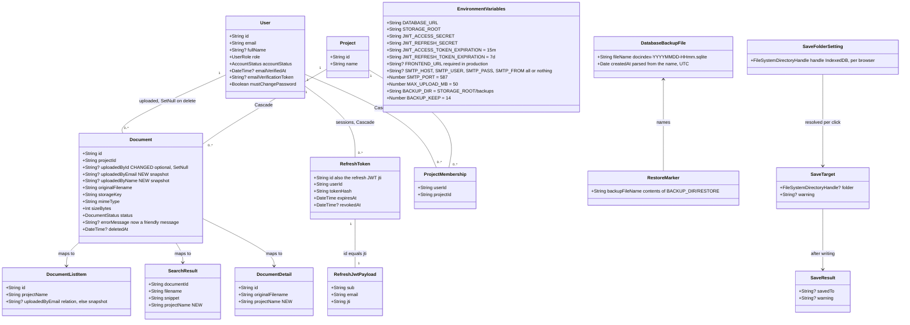

# Phase 4.5 — Pilot readiness

## Change Summary

- **Database**: migration `keep_documents_on_user_delete`. `Document.uploadedById` becomes optional (`onDelete: SetNull`), and new nullable `uploadedByEmail` and `uploadedByName` are backfilled from `User` in the same migration. ACTIVE users with no pending verification get `emailVerifiedAt`.
- **Stored files**: no document file moves. Database copies are written to `BACKUP_DIR` (default `<STORAGE_ROOT>/backups`).
- **Backend**:
  - **A:** deleting a user keeps their documents; non-ACTIVE accounts are refused on every request and refresh; self and last-admin changes get 409; admin-created users and admin email edits count as verified; email matching ignores case; refresh uses the session id (`jti`); a password change keeps this browser signed in; extraction errors are friendly.
  - **B:** validated config, helmet with a CSP, production-only CORS, `trust proxy`, rate limits, a 50 MB upload limit with a content check, safe download filenames, and no email bodies in production logs.
  - **C:** `start:render` (restore if requested, migrate, start), nightly and startup database copies, and `docs/deploy.md`.
  - **E:** `projectName` on search results and on `GET /documents/:id`.
- **Frontend**:
  - **D:** `apiFetch` with silent refresh in every API file, silent sign-in, `/login?next=`, admin guard UI, new delete and upload copy, and a size check before upload.
  - **E:** a "Files" settings tab. Downloads, ZIP and CSV exports, archive ZIPs and copies of uploads can be saved to a folder.
- **Behaviour users will notice**: everyone stays signed in for up to 7 days per browser, on several devices at once. Files over 50 MB are refused before uploading, and in Chrome or Edge files can be saved to a folder per project. Admins can't delete or demote themselves or the last admin, deleting a user keeps their documents, and users an admin creates can sign in.
- **Deploy steps**: take a manual database copy first. Set two different JWT secrets of 32+ characters, `NODE_ENV=production` and `FRONTEND_URL`. The Build Command installs dev dependencies and runs `prisma generate`, and the Start Command is `npm run start:render`. Deploy only after Group C. Everyone signs in once after the release, and the local `server/.env` needs new secrets.

## Requirements

- **Protect company documents from account changes.** Deleting a user never deletes or hides what they uploaded, and the register still names the uploader.
- **Make account access predictable:**
  - Only ACTIVE accounts can use the system.
  - Admins can't lock themselves or the company out.
  - Accounts an admin creates work on first sign-in.
  - An email address is the same identity whatever its capitals.
- **Keep the pilot user signed in.** Short-lived access tokens refresh silently, each browser and device keeps its own session, and a failed refresh returns the user to where they were after they sign in again.
- **Harden the single public Render instance:**
  - Configuration is checked at start.
  - Security headers, production-only CORS and rate limits are in place.
  - Uploads are limited in size and checked for content, and download filenames are safe.
  - No secrets appear in logs.
- **Make releases and recovery routine.** Migrations run on start, restorable database copies are kept automatically, and a written guide covers deploy, restore and copy-off.
- **Let a user keep files in a folder on their own PC** (Chrome or Edge on desktop). Files are organised per project, never overwritten and never moved, and there's a normal download whenever the folder can't be used.
- **Boundaries:**
  - Out of scope: OneDrive or SharePoint, automatic offsite backups, a phone layout, password reset, verification email resend and expiry, structured logging, a print button, and a UI to deactivate users (RQ8).
  - Self-registration still needs SMTP (RQ4).
  - Exactly two new npm dependencies: `helmet` and `@nestjs/throttler`.

## Entities



**Schema changes**:
- `Document.uploadedById`: `String` → `String?`. The relation becomes `User?` with `onDelete: SetNull`; it was `Cascade`.
- `Document.uploadedByEmail`: new, `String?`, no default. It's filled at upload, and existing rows are backfilled from `User.email`.
- `Document.uploadedByName`: new, `String?`, no default. It's filled at upload from the trimmed `User.fullName`, with an empty name stored as null. Existing rows are backfilled the same way.
- `User`: no schema change. Data backfill: `emailVerifiedAt` = migration time `WHERE accountStatus = 'ACTIVE' AND emailVerifiedAt IS NULL AND emailVerificationToken IS NULL`.
- `RefreshToken`: no schema change. The row `id` is generated by the app (`crypto.randomUUID()`) instead of the `cuid()` default, so it can go into the JWT before the row exists. Existing rows stay valid until they expire, but their cookies lack a `jti`, so refreshing them fails once.
- Not database tables: `DatabaseBackupFile` and `RestoreMarker` are files in `BACKUP_DIR`. `SaveFolderSetting`, `SaveTarget` and `SaveResult` live only in the browser.

## Approach

1. **Data safety (P1)**:
   - Copy who uploaded each document onto the Document (email and name), the same pattern as `DeletionLog.actorEmail` and `Project.deletedByEmail`. Make the uploader relation optional with `SetNull`, so deleting a user nulls the link but keeps the row, its text, its filter values and its file.
   - The register reads the live relation when it exists, otherwise the copy. The response field `uploadedByEmail` keeps its name and becomes nullable; the client already handles null.
   - The backfill runs inside the same migration as the table rebuild, so no released state has documents without an uploader copy.
2. **Account access and admin safety (P2, P3, P4, RQ2, RQ3)**:
   - **One eligibility rule:** `AuthService` refuses non-ACTIVE accounts with 401 in `validateUser` (every request through `JwtStrategy`) and in `refresh`. `UsersService.updateAccountStatus` revokes all refresh tokens when the status leaves ACTIVE, in the same transaction.
   - **Admin safety lives in `UsersService`** (the service layer, per the project rules), with the acting admin's id passed in from the controller.
     - Self changes are refused before any database work.
     - The last-active-admin check and the write run in one interactive `$transaction`, so concurrent requests can't both pass. That pattern is already used in `archive.service.ts` and `filters.service.ts`.
     - Refusals are `ConflictException` (409) with fixed messages.
   - **Email normalisation:**
     - Every DTO email is trimmed and lowercased through `@Transform`.
     - Lookups at sign-in, registration and admin create or edit use a case-insensitive helper, with a fast exact path and a fallback through SQLite's case-insensitive `LIKE`. Stored emails aren't rewritten.
   - **Verification:**
     - `createUser` and an admin's email change set `emailVerifiedAt` (the admin vouches).
     - A self email change is refused with 400 while SMTP isn't configured.
     - A wrong current password becomes 400, not 401, so the client never mistakes it for an expired session.
3. **Sessions (P5, RQ9)**:
   - Each sign-in creates one `RefreshToken` row. The row id is generated first and signed into the refresh JWT as `jti`.
   - Refresh finds that exact row (by id, user, not revoked, not expired), checks the hash, checks eligibility, then claims it with a conditional `updateMany`, so only one concurrent refresh can rotate a given token.
   - Logout still revokes every row.
   - A password change revokes every row and then issues a new session cookie for the browser that made the change. The response stays 204.
   - The cookie `maxAge` comes from `JWT_REFRESH_TOKEN_EXPIRATION`. Every refresh restarts the 7-day window.
4. **Edge hardening (B)**:
   - **Config:** validated once in `ConfigModule.forRoot({ validate })` with class-validator. Empty strings count as unset, defaults are applied, and every problem is listed in one startup error.
   - **Bootstrap:** `main.ts` sets `trust proxy` (production), helmet with a CSP built from what `client/index.html` and the preview actually load, and CORS limited to `FRONTEND_URL` in production. Disallowed origins are refused silently, and `Content-Disposition` is exposed.
   - **Rate limits:** `@nestjs/throttler` as a global guard (300 per minute per IP, per route) with `@Throttle` overrides on four auth routes. Login uses a custom tracker: IP + lowercased email. The module-level `errorMessage` is the user-facing 429 text.
   - **Uploads:** a DI-aware interceptor wraps `FileInterceptor` with multer limits from `MAX_UPLOAD_MB`, so oversize requests are cut off while streaming and rethrown as 413 "File is larger than N MB.". A signature check (magic bytes) runs in the controller before the service, so a mismatched file never creates a row or a blob.
   - **Downloads:** all three use Express `res.attachment()`. The client gets one decoder that prefers `filename*`.
5. **Operations (C)**:
   - **Start command:** `start:render` runs a pre-start restore hook, then `prisma migrate deploy`, then `node dist/src/main` (RQ1).
   - **Restore hook:** does nothing unless `BACKUP_DIR/RESTORE` names a backup file. Render stops the old instance before starting the new one, so the database file is never replaced under a running app.
   - **`BackupService` (`@nestjs/schedule`, like `PurgeTask`):**
     - Writes `VACUUM INTO` copies to a temporary name, renames them, and prunes beyond `BACKUP_KEEP`.
     - Runs at 02:30 server time, plus at startup when the newest copy is older than 24 hours.
     - It's the documented `fs` exception (RQ7).
   - `docs/deploy.md` is the operator guide.
6. **Client sessions (D)**:
   - **`client/src/api/http.ts`:** the only place that reads or writes the token.
     - `apiFetch` adds the bearer header, always sends cookies, refreshes once on 401 and retries once.
     - On failure it clears the token and leaves for `/login?next=…`. It throws 413 and 429 messages unchanged.
     - Refreshes are single-flight per tab and serialised across tabs with `navigator.locks` (RQ9).
   - **Every module** in `client/src/api/` calls `apiFetch` with a path and keeps its own status mapping and messages.
   - **`RequireAuth`** wraps signed-in routes. It waits for one silent refresh when the tab has no token, rather than flashing the login page. `/` and `/login` also try a silent sign-in, so reopening the site after a browser restart doesn't ask for a password.
7. **Admin UI (D)**:
   - A small `.ts` helper works out "own row" and "last active admin" from the loaded user list and the current user context.
   - Row actions are disabled with a `title`. The bulk delete skips protected rows and says so.
   - Server 409 messages are passed through to the existing `InlineAlert`s.
8. **Save to folder (E, client-only except one additive field)**:
   - **Storage:** a folder handle kept in IndexedDB and cached in memory at app start, so a click can call `requestPermission` synchronously, before any `await`.
   - **`saveFile`:**
     - Writes to `<folder>/<project>/<name>`, with Windows-safe names and `name (2).ext` numbering.
     - Never overwrites.
     - Otherwise falls back to the anchor download. It never throws.
   - **Call sites:** every one starts with `beginSave()` and shows `Saved to …` or a one-line warning in the `InlineAlert` it already has.
   - **Project names:**
     - Multi-project exports go to the folder root (RQ6).
     - `projectName` is added to search results (RQ5) and to `GET /documents/:id`, so downloads from Search's table, drawer and preview reach the right project folder.
   - **Upload copies** never fall back to a download and never fail the upload. Their notice reaches the Documents page through router state, because Upload redirects after success.

## Structure

### Interfaces and Implementations
1. `BlobStore` (existing) is unchanged. Document files still go only through `BLOB_STORE`.
2. `DocumentUploadInterceptor` implements Nest's `NestInterceptor` and wraps the `FileInterceptor('file', …)` mixin.
3. `BackupService` implements `OnApplicationBootstrap` (startup catch-up) and has an `@Cron` method (nightly).
4. `EnvironmentVariables` is a class-validator schema class used only by `validateEnv`.
5. The client `SaveTarget` and `SaveResult` are plain TypeScript interfaces in `client/src/utils/saveFile.ts`. `FileSystemHandle.queryPermission`/`requestPermission` and `Window.showDirectoryPicker` are declared in `client/src/types/file-system-access.d.ts` by merging into the DOM interfaces.

### Dependencies
1. `AuthController` injects `AuthService` and `ConfigService` (cookie lifetime).
2. `AuthService` depends on `PrismaService`, `UsersService`, `JwtService`, `ConfigService` and `EmailService` (adds `isConfigured()`).
3. `UsersController` injects `UsersService`. `UsersService` depends on `PrismaService`.
4. `DocumentsController` injects `DocumentsService` and `ExportsService`, and uses `DocumentUploadInterceptor` (which injects `ConfigService`). `DocumentsService` is unchanged in its dependencies.
5. `BackupModule` provides `BackupService`, which depends on `PrismaService` (global) and `ConfigService` (global).
6. `AppModule` imports `ThrottlerModule.forRoot(...)` and `BackupModule`, and registers `ThrottlerGuard` as `APP_GUARD`.
7. `server/src/scripts/restore-database.ts` calls `restoreDatabaseIfRequested` from `server/src/backup/restore-database.ts`. It has no Nest application context.
8. Client:
   - Every file in `client/src/api/` imports `apiFetch` and `readErrorMessage` from `./http`.
   - `RequireAuth`, `Login`, `AppShell`, `AdminGuard`, `ProfileSettingsModal` and `ChangePassword` use `http.ts` and `authService`.
   - Download call sites import `beginSave` and `describeSaveResult` from `utils/saveFile.ts`.
   - `saveFile.ts` uses `utils/saveFolderStore.ts`.

### Layered Architecture
1. **Bootstrap layer** (`main.ts`, `AppModule`): proxy trust, security headers, CORS, global throttling, config validation, static SPA in production.
2. **Controller layer:** routing, `JwtAuthGuard`, `@Throttle` overrides, DTO binding (with email normalisation), the upload interceptor, the file signature check, download headers. It passes the acting user's id to the services.
3. **Service layer:** business rules (eligibility, admin safety, email rules, sessions, uploader snapshot, friendly errors) through `PrismaService`, with interactive transactions where a check and a write must be atomic.
4. **Storage layer:** `BlobStore` for document files. `BackupService` and the restore hook use `fs` for database copies only.
5. **Client API layer:** `client/src/api/http.ts` (`apiFetch`, refresh, redirect) and one resource module per file.
6. **UI layer:**
   - Route guards: `RequireAuth` and `AdminGuard`.
   - Pages: Login, ChangePassword, Documents, Search, Upload, admin Users, Pending and Archive.
   - Feature components: the drawer, preview, export modal, settings modal and `SaveLocationSettings`.
   - Shared `components/ui` primitives.

## Operations

Run the groups in order: A, B, C, D, E. Inside a group, run the operations in the order listed. Each group ends with a **Group gate**: from `server/`, run `npm run build:full` and `npm test`, and don't start the next group until both pass. Production is first deployed after Group C.

---

### Group A — Accounts and data safety (server)

#### A1 Update Schema - `Document` (P1)
1. File: `server/prisma/schema.prisma`, model `Document`.
2. Fields:
   - `uploadedById`: `String?`, previously `String`.
   - `uploadedBy`: `User? @relation("UploadedBy", fields: [uploadedById], references: [id], onDelete: SetNull)`, previously `User` with `Cascade`.
   - `uploadedByEmail`: `String?`, new, no default. The uploader's email at upload time.
   - `uploadedByName`: `String?`, new, no default. The uploader's trimmed full name at upload time, with an empty name stored as null.
   - Keep `@@index([uploadedById])`. No other model changes.
3. Migration:
   - From `server/`, run `npx prisma migrate dev --create-only --name keep_documents_on_user_delete`. Prisma writes a SQLite `RedefineTables` block (`new_Document` with foreign keys off, copy, drop, rename, then recreate the indexes).
   - Append the backfill below to the end of the **new** `migration.sql`, after the generated block. Then run `npx prisma migrate dev` to apply it and regenerate the client.
   - Never edit an already-applied migration.
   ```sql
   -- Backfill the uploader snapshot from the live account (P1).
   UPDATE "Document"
   SET "uploadedByEmail" = (SELECT "email" FROM "User" WHERE "User"."id" = "Document"."uploadedById"),
       "uploadedByName"  = (SELECT NULLIF(TRIM("fullName"), '') FROM "User" WHERE "User"."id" = "Document"."uploadedById")
   WHERE "uploadedById" IS NOT NULL;

   -- Admin-created and approved accounts count as verified (P3).
   UPDATE "User"
   SET "emailVerifiedAt" = strftime('%Y-%m-%dT%H:%M:%f+00:00', 'now')
   WHERE "accountStatus" = 'ACTIVE'
     AND "emailVerifiedAt" IS NULL
     AND "emailVerificationToken" IS NULL;
   ```
4. Backfill: every existing Document has a non-null `uploadedById` today, so every row gets a snapshot. The date format matches what the Prisma 7 SQLite adapter writes (ISO text with `+00:00`).
5. Completion:
   - `npx prisma migrate dev` reports the migration applied.
   - In the dev database, `SELECT COUNT(*) FROM "Document" WHERE "uploadedByEmail" IS NULL` returns 0.
   - `DocumentText` and `DocumentFilterValue` row counts are unchanged.

#### A2 Create Util and Update DTOs - email normalisation (RQ2)
1. File: `server/src/common/email.util.ts` (new).
   - `normalizeEmail(value: unknown): unknown`: returns `value.trim().toLowerCase()` for strings, otherwise `value` unchanged (so `@IsEmail` still reports bad types).
2. DTOs: add `@Transform(({ value }) => normalizeEmail(value))` (from `class-transformer`) directly above `@IsEmail()` on the `email` field of:
   - `server/src/auth/dto/register.dto.ts`
   - `server/src/auth/dto/login.dto.ts`
   - `server/src/auth/dto/UpdateMe.dto.ts` (`ProfileDto`)
   - `server/src/users/dto/CreateUser.dto.ts`
   - `server/src/users/dto/AdminEditUser.dto.ts`
3. Constraint: the global `ValidationPipe` already has `transform: true`, so handlers receive the normalised value. Nothing else in the DTOs changes.

#### A3 Update Service - `UsersService` (P1, P3, P4, RQ2, RQ3)
1. File: `server/src/users/users.service.ts`.
2. Add `private readonly logger = new Logger(UsersService.name);` and these module constants:
   - `SELF_DELETE_MESSAGE = "You can't delete your own account."`
   - `SELF_ROLE_MESSAGE = "You can't change your own role."`
   - `SELF_STATUS_MESSAGE = "You can't change your own account status."`
   - `LAST_ADMIN_MESSAGE = 'At least one active admin is required.'`
3. Methods:
   - `findByEmailInsensitive(email: string): Promise<User | null>` (new):
     1. `normalized = email.trim().toLowerCase()`.
     2. Fast path: `prisma.user.findUnique({ where: { email: normalized } })`. Return it if found.
     3. Fallback for mixed-case emails stored before normalisation: `prisma.user.findMany({ where: { email: { contains: normalized } }, take: 20 })`, then return the first user with `u.email.toLowerCase() === normalized`, else `null`. Add a one-line comment: SQLite `LIKE` (used by `contains`) is case-insensitive for ASCII.
   - `findByEmail`: delete it once A6 has moved its two callers to `findByEmailInsensitive`.
   - `createUser(dto)`:
     - Before hashing, `if (await this.findByEmailInsensitive(dto.email)) throw new ConflictException('User with this email already exists')`. Today a duplicate returns a raw 500.
     - Add `emailVerifiedAt: new Date()` to the `create` data (P3). The other fields are unchanged.
   - `adminEditUser(id, dto)`:
     - Load the current user first: `findUnique({ where: { id }, select: { id: true, email: true } })`, else `NotFoundException('User not found')`.
     - When `dto.email` is given (already normalised by A2) and differs from `current.email.toLowerCase()`:
       - Check uniqueness with `findByEmailInsensitive`. If another user owns it, throw `ConflictException('Email is already in use')`.
       - Set `data.email`, `data.emailVerifiedAt = new Date()` and `data.emailVerificationToken = null` (RQ3: the admin vouches).
     - When `dto.email` equals the current email (case-insensitively), don't touch the email or verification fields.
     - Name and password handling are unchanged.
   - `deleteUser(actorId: string, id: string): Promise<void>`:
     1. `if (actorId === id) throw new ConflictException(SELF_DELETE_MESSAGE)`.
     2. `await this.prisma.$transaction(async (tx) => { … })` that:
        - loads `target` (`id, email, role, accountStatus`), else `NotFoundException('User not found')`;
        - calls `await this.assertNotLastActiveAdmin(tx, target)`;
        - sets `keptDocuments = await tx.document.count({ where: { uploadedById: id } })`;
        - runs `await tx.user.delete({ where: { id } })`;
        - returns `{ email: target.email, keptDocuments }`.
     3. After the transaction: `this.logger.log(\`User ${email} deleted by admin ${actorId}; ${keptDocuments} uploaded document(s) kept\`)`.
     - Memberships and refresh tokens still cascade, and documents are kept through `SetNull`.
   - `setUserRole(actorId: string, id: string, dto: SetUserDto)`:
     1. `if (actorId === id) throw new ConflictException(SELF_ROLE_MESSAGE)`.
     2. In a transaction:
        - load the target (`role, accountStatus`), else `NotFoundException('User not found')`;
        - if `target.role === 'ADMIN' && dto.role !== 'ADMIN'`, call `assertNotLastActiveAdmin(tx, target)`;
        - update with `select: userSelect` and return it.
   - `updateAccountStatus(actorId: string, id: string, status: AccountStatus)`:
     1. `if (actorId === id) throw new ConflictException(SELF_STATUS_MESSAGE)`.
     2. In a transaction:
        - load the target (`role, accountStatus`), else `NotFoundException('User not found')`;
        - if `status !== 'ACTIVE'`, call `assertNotLastActiveAdmin(tx, target)`;
        - update with `select: userSelectWithStatus`;
        - if `target.accountStatus === 'ACTIVE' && status !== 'ACTIVE'`, run `tx.refreshToken.updateMany({ where: { userId: id, revokedAt: null }, data: { revokedAt: new Date() } })` (P2);
        - return the updated user.
   - `private async assertNotLastActiveAdmin(tx: Prisma.TransactionClient, target: { role: UserRole; accountStatus: AccountStatus }): Promise<void>`:
     - Return at once unless `target.role === 'ADMIN' && target.accountStatus === 'ACTIVE'`.
     - Otherwise `count = await tx.user.count({ where: { role: 'ADMIN', accountStatus: 'ACTIVE' } })`, and `if (count <= 1) throw new ConflictException(LAST_ADMIN_MESSAGE)`.
4. Transactions: the three guarded writes each use one interactive `$transaction`, so the check and the write are atomic.
5. Constraints:
   - `create` (self-registration) is unchanged, apart from receiving an email that's already normalised.
   - `findAll`, `searchUsers`, `findByAccountStatus` and `findByIdSafe` are unchanged.

#### A4 Update Controller - `UsersController`
1. File: `server/src/users/users.controller.ts`.
2. Pass the acting admin's id, `req.user.id`, as the first argument:
   - `setUserRole(req.user.id, id, setUserDto)`
   - `updateAccountStatus(req.user.id, id, dto.status)`
   - `deleteUser(req.user.id, id)`
3. The existing admin checks, routes and status codes are unchanged.

#### A5 Create Util - `server/src/auth/duration.util.ts`
1. `parseDurationMs(value: string): number`:
   - Accepts `^(\d+)([smhd])$`.
   - Returns the duration in milliseconds.
   - Throws `new Error(\`Invalid duration "${value}"\`)` otherwise.
2. It replaces `AuthService.calculateExpirationDate`, which is deleted, and it's also used for the cookie `maxAge`.

#### A6 Update Service - `AuthService` (P2, P5, RQ2, RQ3)
1. File: `server/src/auth/auth.service.ts`.
2. Constants:
   - `ACCOUNT_NOT_ACTIVE_MESSAGE = 'Your account is no longer active. Contact an administrator.'`
   - `EMAIL_CHANGE_NEEDS_SMTP_MESSAGE = "Your email can't be changed here right now. Ask an admin to change it for you."`
   - Extend the payload type: `interface RefreshJwtPayload extends JwtPayload { jti?: string }`.
3. Methods:
   - `register(dto)`: the duplicate check uses `this.usersService.findByEmailInsensitive(dto.email)`. Everything else is unchanged.
   - `login(dto)`: the user lookup uses `findByEmailInsensitive(dto.email)`. The checks and messages are unchanged.
   - `validateUser(userId)`:
     - If the user isn't found, throw `UnauthorizedException('User not found')`, as today.
     - New: `if (user.accountStatus !== 'ACTIVE') throw new UnauthorizedException(ACCOUNT_NOT_ACTIVE_MESSAGE)`.
   - `refresh(refreshToken: string | undefined)`:
     1. No token: `UnauthorizedException('Refresh token not provided')`.
     2. Verify with `JWT_REFRESH_SECRET`. On failure: `UnauthorizedException('Invalid refresh token')`.
     3. If `!payload.jti`: `UnauthorizedException('Invalid refresh token')`. This covers cookies issued before the deploy.
     4. `stored = prisma.refreshToken.findFirst({ where: { id: payload.jti, userId: payload.sub, revokedAt: null, expiresAt: { gt: new Date() } } })`. If it's missing: `UnauthorizedException('Refresh token not found or expired')`.
     5. `argon2.verify(stored.tokenHash, refreshToken)`. If false: `UnauthorizedException('Invalid refresh token')`.
     6. Load the user (`UnauthorizedException('User not found')`). If not ACTIVE: `UnauthorizedException(ACCOUNT_NOT_ACTIVE_MESSAGE)`.
     7. Claim the row: `claimed = prisma.refreshToken.updateMany({ where: { id: stored.id, revokedAt: null }, data: { revokedAt: new Date() } })`. If `claimed.count === 0`: `UnauthorizedException('Refresh token not found or expired')`. Only this row is revoked.
     8. `return this.generateTokens(user)`.
   - `logout(userId)`: unchanged (revokes all rows).
   - `private generateTokens(user)`:
     - The access token is unchanged.
     - `sessionId = crypto.randomUUID()`.
     - Sign the refresh token with `{ sub, email }` and options `{ secret: JWT_REFRESH_SECRET, expiresIn: refreshExpiration, jwtid: sessionId }`. `jwtid` sets the `jti` claim.
     - `tokenHash = await argon2.hash(refreshToken)`.
     - `expiresAt = new Date(Date.now() + parseDurationMs(refreshExpiration))`.
     - `prisma.refreshToken.create({ data: { id: sessionId, userId: user.id, tokenHash, expiresAt } })`.
     - Return the same shape as today.
   - `changePassword(userId, dto): Promise<{ refreshToken: string }>`:
     - Wrong current password: `BadRequestException('Current password is incorrect')`. It was 401, which would trigger a client refresh and sign the user out.
     - Hash, update and the "revoke all refresh tokens" step are unchanged.
     - Then `const { refreshToken } = await this.generateTokens(updatedUser)` and return `{ refreshToken }`. This browser stays signed in, and every other session ends.
   - `updateMe(userId, dto)`:
     - `newEmail = dto.email` (already trimmed and lowercased by A2).
     - When `newEmail !== existingUser.email.toLowerCase()`:
       - first, `if (!this.emailService.isConfigured()) throw new BadRequestException(EMAIL_CHANGE_NEEDS_SMTP_MESSAGE)` (RQ3);
       - replace the `contains` candidate loop with `this.usersService.findByEmailInsensitive(newEmail)`. Another owner gives `ConflictException('Email is already in use')`.
     - The rest is unchanged: reset verification, send the email, trim name, language and timezone.
4. Dependency injection: unchanged.

#### A7 Update Service - `EmailService.isConfigured()`
1. File: `server/src/email/email.service.ts`.
2. Add `isConfigured(): boolean { return this.configured; }`. No other change in Group A; B3 changes the fallback logging.

#### A8 Update Controller - `AuthController`
1. File: `server/src/auth/auth.controller.ts`.
2. Inject `private readonly config: ConfigService`.
3. `setRefreshTokenCookie`: `maxAge: parseDurationMs(this.config.get<string>('JWT_REFRESH_TOKEN_EXPIRATION') ?? '7d')`. The other cookie options are unchanged.
4. `changePassword`:
   - Add `@Res({ passthrough: true }) res: Response`.
   - `const { refreshToken } = await this.authService.changePassword(req.user.id, dto); this.setRefreshTokenCookie(res, refreshToken);`.
   - Keep `@HttpCode(HttpStatus.NO_CONTENT)`.
5. The other routes are unchanged.

#### A9 Update Service - `DocumentsService` (P1, extraction errors)
1. File: `server/src/documents/documents.service.ts`.
2. `uploadDocument`:
   - The user lookup selects `{ role: true, email: true, fullName: true }`.
   - `documentCreateData` adds `uploadedByEmail: user.email` and `uploadedByName: user.fullName?.trim() || null`.
   - In the outer `catch`, when `documentId` is set:
     - Log the raw error: `this.logger.error(\`Processing failed for document ${documentId}: ${error instanceof Error ? error.message : String(error)}\`)`.
     - Store `errorMessage: file.mimetype === 'application/pdf' ? "Couldn't read text from this file." : "Couldn't process this image."`.
     - Still rethrow the error (the HTTP response is unchanged).
3. `listDocuments`:
   - The select adds `uploadedByEmail: true`.
   - The mapping becomes `uploadedByEmail: doc.uploadedBy?.email ?? doc.uploadedByEmail ?? null`.
4. Constraints:
   - Visibility, soft-delete filters and project rules are unchanged.
   - Existing FAILED rows keep their stored messages (no data rewrite).

#### A10 Create Tests (Jest, unit level)
1. Follow `archive.service.spec.ts`: construct services directly with `jest.fn()` Prisma mocks, and use a `$transaction` mock that runs the callback with the mock (or `Promise.all` for arrays).
2. `server/src/users/users.service.spec.ts` (new):
   - `deleteUser` with `actorId === id` throws 409 `SELF_DELETE_MESSAGE` and makes no Prisma calls.
   - `deleteUser` of the only ACTIVE ADMIN (count 1) throws 409 `LAST_ADMIN_MESSAGE`. With count 2 it calls `user.delete` and never calls any `document` delete method.
   - `setUserRole` on self throws 409. Demoting the last active admin throws 409. Promoting a USER doesn't count admins.
   - `updateAccountStatus` on self throws 409. Setting the last active admin to `REJECTED` throws 409.
   - `updateAccountStatus` from ACTIVE to REJECTED revokes refresh tokens (`refreshToken.updateMany` with `revokedAt: null` filter). From PENDING to ACTIVE it doesn't.
   - `createUser` sets `emailVerifiedAt`, and throws 409 on a case-insensitive duplicate.
3. `server/src/auth/auth.service.spec.ts` (new):
   - Use a real `JwtService` from `@nestjs/jwt`, real `argon2`, a config mock with two different 32+ character secrets, and an in-memory `refreshToken` store implementing `create`, `findFirst` (by `id`, `userId`, `revokedAt: null`, `expiresAt`) and `updateMany`.
   - `validateUser` rejects a REJECTED user with 401 `ACCOUNT_NOT_ACTIVE_MESSAGE`.
   - `refresh` rejects a valid token whose user is now PENDING with 401.
   - **Two concurrent sessions (P5):** two `login` calls give tokens T1 and T2. `refresh(T1)` and `refresh(T2)` both succeed. A second `refresh(T1)` fails with 401.
   - A refresh token without `jti` fails with 401 `Invalid refresh token`.
   - `changePassword` with the wrong current password throws `BadRequestException`. On success it returns a new `refreshToken` and revokes the earlier rows.
4. `server/src/documents/documents.service.spec.ts` (new):
   - `listDocuments`, with an ADMIN user and no filters, maps `uploadedBy: null, uploadedByEmail: 'gone@site.test'` to `uploadedByEmail: 'gone@site.test'` (deleted uploader). A live relation wins over the snapshot.
   - `uploadDocument` for a PDF passes `uploadedByEmail` and `uploadedByName` to `document.create`.
   - When `extractTextFromPdfBuffer` rejects, the document is updated with `status: FAILED` and `errorMessage: "Couldn't read text from this file."`, and the error is rethrown.

#### Group A gate
- From `server/`, `npm test` and `npm run build:full` pass.
- Dev check (`npm run start:dev`):
  1. As admin, create user B. Sign in as B with the temporary password: it works and goes to change password (AC3).
  2. Add B to a project and upload a document as B.
  3. As admin, delete B. The document is still listed, with B's email as uploader (AC1).
  4. Deleting yourself returns 409 with the self message.
- Two browsers signed in as the same user can both call `POST /auth/refresh`.

---

### Group B — Hardening and config (server)

#### B1 Install Dependencies
1. From `server/`: `npm install helmet @nestjs/throttler`. These are the only new packages in this phase.
2. Completion: both appear under `dependencies` in `server/package.json`, and `package-lock.json` is updated.

#### B2 Create Config Validation - `server/src/config/env.validation.ts`
1. Class `EnvironmentVariables` (class-validator and class-transformer decorators):
   - `NODE_ENV?`: `@IsOptional() @IsIn(['development', 'production', 'test'])`.
   - `DATABASE_URL`, `STORAGE_ROOT`: `@IsString() @IsNotEmpty()`.
   - `JWT_ACCESS_SECRET`, `JWT_REFRESH_SECRET`: `@IsString() @MinLength(32)`.
   - `JWT_ACCESS_TOKEN_EXPIRATION = '15m'`, `JWT_REFRESH_TOKEN_EXPIRATION = '7d'`: `@IsOptional() @Matches(/^\d+[smhd]$/)`.
   - `FRONTEND_URL?`: `@ValidateIf((e) => e.NODE_ENV === 'production' || e.FRONTEND_URL !== undefined) @IsUrl({ require_tld: false, require_protocol: true, protocols: ['http', 'https'] })`.
   - `PORT?`: `@IsOptional() @IsInt() @Min(1) @Max(65535)`.
   - `SMTP_HOST?`, `SMTP_USER?`, `SMTP_PASS?`, `SMTP_FROM?`: `@ValidateIf(hasAnySmtpValue) @IsString() @IsNotEmpty()`. `hasAnySmtpValue` is true when any of those four is set. `SMTP_PORT` alone doesn't count.
   - `SMTP_PORT = 587`: `@IsOptional() @IsInt() @Min(1) @Max(65535)`.
   - `MAX_UPLOAD_MB = 50`: `@IsOptional() @IsInt() @Min(1) @Max(1024)`.
   - `BACKUP_DIR?`: `@IsOptional() @IsString()`.
   - `BACKUP_KEEP = 14`: `@IsOptional() @IsInt() @Min(1) @Max(365)`.
   - `COMPRESSION_THRESHOLD_BYTES?`: `@IsOptional() @IsInt() @Min(0)`.
   - `COMPRESSION_MIN_SAVINGS_RATIO?`: `@IsOptional() @IsNumber() @Min(0) @Max(1)`.
2. `validateEnv(raw: Record<string, unknown>): EnvironmentVariables`:
   1. Copy `raw`, dropping every key whose value is a string that's empty after trimming. Blank `.env` lines count as unset.
   2. `env = plainToInstance(EnvironmentVariables, cleaned, { enableImplicitConversion: true })`. Unknown keys such as `PATH` are kept.
   3. `problems = validateSync(env).flatMap((e) => Object.values(e.constraints ?? {}))`.
   4. If both secrets are present and equal, push `'JWT_ACCESS_SECRET and JWT_REFRESH_SECRET must be different'`.
   5. If `problems.length > 0`, throw `new Error(\`Invalid environment configuration:\n${problems.map((p) => \`  - ${p}\`).join('\n')}\`)`.
   6. Normalise: `env.FRONTEND_URL = env.FRONTEND_URL?.replace(/\/+$/, '')` and `env.BACKUP_DIR = path.resolve(env.BACKUP_DIR ?? path.join(env.STORAGE_ROOT, 'backups'))`.
   7. Return `env`.
3. Wire-up: `server/src/app.module.ts` → `ConfigModule.forRoot({ isGlobal: true, envFilePath: …, validate: validateEnv })`.
4. Test file: `server/src/config/env.validation.spec.ts` (new).
   - Missing secrets: one error lists both secret problems.
   - Equal secrets are rejected.
   - Production without `FRONTEND_URL` is rejected.
   - `SMTP_HOST` set without `SMTP_PASS` is rejected.
   - Blank strings are ignored.
   - Defaults are applied (`MAX_UPLOAD_MB` 50, `BACKUP_KEEP` 14, `BACKUP_DIR` under `STORAGE_ROOT`).
   - A trailing slash is removed from `FRONTEND_URL`.
5. Update `server/.env.example` to match, with no real values:
   - Secrets are blank, with a comment: "at least 32 characters each, different from each other; generate with `node -e "console.log(require('crypto').randomBytes(48).toString('hex'))"`".
   - Every `SMTP_*` line is blank except `SMTP_PORT=587`, with the comment "all or nothing; leave all blank to disable email".
   - Add `MAX_UPLOAD_MB=50` ("keep the client's `VITE_MAX_UPLOAD_MB` the same"), `BACKUP_DIR=` ("default `<STORAGE_ROOT>/backups`") and `BACKUP_KEEP=14`.
   - The `STORAGE_ROOT`, `FRONTEND_URL` and compression lines stay.

#### B3 Update Service - `EmailService` fallback (P8)
1. File: `server/src/email/email.service.ts`.
2. Constructor:
   - `port = config.get<number>('SMTP_PORT') ?? 587`. It's now a real number, so `secure: port === 465` works as the README already documents.
   - `this.isProduction = config.get<string>('NODE_ENV') === 'production'`.
   - When not configured:
     - in production, log `this.logger.warn('SMTP is not configured: emails will not be sent. Create accounts from the admin page.')`;
     - otherwise keep today's warning.
3. `send(to, subject, html, type: 'verification' | 'admin-approval')`:
   - `sendVerificationEmail` passes `'verification'` and `sendAdminApprovalNotification` passes `'admin-approval'`.
   - When not configured:
     - in production, log only `\`email not sent (SMTP not configured): ${type} to ${to}\``;
     - otherwise keep today's full console log for local development.
4. Constraint: no production code path logs `html`, `link` or a token.

#### B4 Update Bootstrap - `server/src/main.ts`
1. After `NestFactory.create`:
   - `const config = app.get(ConfigService); const isProduction = config.get('NODE_ENV') === 'production'; const frontendUrl = config.get<string>('FRONTEND_URL');`.
   - Replace the module-level `isProduction` constant with this.
2. In production, run `app.set('trust proxy', 1)` before anything else, then the existing `setGlobalPrefix('api')`.
3. `app.use(helmet(buildHelmetOptions(frontendUrl)))`, before CORS. `buildHelmetOptions` lives in `server/src/common/security-headers.ts` (new) and returns:
   ```ts
   {
     contentSecurityPolicy: {
       useDefaults: true,
       directives: {
         defaultSrc: ["'self'"],
         scriptSrc: ["'self'"],
         styleSrc: ["'self'", 'https://fonts.googleapis.com'],
         fontSrc: ["'self'", 'https://fonts.gstatic.com'],
         imgSrc: ["'self'", 'data:', 'blob:'],
         frameSrc: ["'self'", 'blob:'],
         objectSrc: ["'self'", 'blob:'],
         connectSrc: ["'self'"],
         upgradeInsecureRequests: frontendUrl?.startsWith('https://') ? [] : null,
       },
     },
   }
   ```
   - Sources: `client/index.html` loads the Inter and Material Symbols stylesheets from `fonts.googleapis.com`, with font files from `fonts.gstatic.com`.
   - `DocumentPreviewModal` shows images in `` and PDFs in `<iframe src="blob:…">`. Chrome's PDF viewer inside a `blob:` frame inherits the page policy and counts as a plugin, which is why `object-src` allows `blob:`.
   - No inline scripts or styles are allowed (React's `style` props use CSSOM, which CSP doesn't block).
   - `upgrade-insecure-requests` is dropped when the site isn't served over HTTPS, so a local production run on `http://localhost` works.
4. CORS:
   ```ts
   app.enableCors({
     origin: (origin, callback) => {
       if (!origin) return callback(null, true);
       if (frontendUrl && origin === frontendUrl) return callback(null, true);
       if (!isProduction && DEV_ORIGIN_PATTERNS.some((p) => p.test(origin))) return callback(null, true);
       return callback(null, false);
     },
     credentials: true,
     exposedHeaders: ['Content-Disposition'],
   });
   ```
   `DEV_ORIGIN_PATTERNS` is today's three regexes, moved into a constant.
5. Cookie parser, `ValidationPipe`, static serving and `listen` are unchanged, apart from using the local `isProduction`.

#### B5 Add Rate Limiting (P6)
1. File: `server/src/common/throttle.ts` (new):
   - `TOO_MANY_ATTEMPTS_MESSAGE = 'Too many attempts. Wait a few minutes and try again.'`
   - `ONE_MINUTE_MS = 60_000` and `FIFTEEN_MINUTES_MS = 15 * 60_000`.
   - `loginThrottleTracker(req: Record<string, any>): string`: returns `` `${req.ip ?? 'unknown'}|${email}` ``, where `email` is `req.body.email` trimmed and lowercased, or `''` when it isn't a string.
2. `server/src/app.module.ts`:
   - Imports gain `ThrottlerModule.forRoot({ throttlers: [{ name: 'default', ttl: ONE_MINUTE_MS, limit: 300 }], errorMessage: TOO_MANY_ATTEMPTS_MESSAGE })`.
   - Providers gain `{ provide: APP_GUARD, useClass: ThrottlerGuard }`.
3. `server/src/auth/auth.controller.ts`:
   - `login`: `@Throttle({ default: { limit: 10, ttl: FIFTEEN_MINUTES_MS, getTracker: loginThrottleTracker } })`.
   - `register` and `verifyEmail`: `@Throttle({ default: { limit: 10, ttl: FIFTEEN_MINUTES_MS } })`.
   - `refresh`: `@Throttle({ default: { limit: 60, ttl: ONE_MINUTE_MS } })`.
4. Notes:
   - `req.ip` is the real client IP because of `trust proxy` (B4).
   - Storage is the default in-memory store, which suits one instance; counters reset on restart.
   - The static SPA is served by Express middleware and isn't throttled.

#### B6 Create Interceptor - `server/src/documents/upload-file.interceptor.ts` (P7)
1. `@Injectable() export class DocumentUploadInterceptor implements NestInterceptor`.
   - **Constructor** (`config: ConfigService`):
     - `this.maxMb = config.get<number>('MAX_UPLOAD_MB') ?? 50`.
     - `const Inner = FileInterceptor('file', { limits: { fileSize: this.maxMb * 1024 * 1024, files: 1 } }); this.inner = new Inner();`.
   - **`async intercept(context, next)`:**
     - `try { return await this.inner.intercept(context, next); }`.
     - `catch (error)`: if `error instanceof PayloadTooLargeException`, throw `new PayloadTooLargeException(\`File is larger than ${this.maxMb} MB.\`)`. Otherwise rethrow.
2. `server/src/documents/documents.controller.ts`: `@UseInterceptors(FileInterceptor('file'))` becomes `@UseInterceptors(DocumentUploadInterceptor)`.
3. Constraint: memory storage stays. Multer stops reading once the limit is hit, so an oversize file is never fully buffered.

#### B7 Create Util - `server/src/documents/file-signature.util.ts` (P7)
1. `detectFileType(buffer: Buffer): 'application/pdf' | 'image/jpeg' | 'image/png' | null`:
   - **PNG:** the first 8 bytes equal `89 50 4E 47 0D 0A 1A 0A`.
   - **JPEG:** the first 3 bytes equal `FF D8 FF`.
   - **PDF:** `%PDF-` appears within the first 1024 bytes. PDF readers accept a short preamble before the header, so valid files that upload today keep working.
   - Otherwise `null`.
2. `documents.controller.ts` `uploadDocument`, after the existing `allowedMimeTypes` check:
   - `if (detectFileType(file.buffer) !== file.mimetype) throw new BadRequestException("This file isn't a valid PDF, JPG or PNG.")`.
   - The existing type-list message ("Only PDF, JPEG, and PNG files are supported") is unchanged.
3. Test file: `server/src/documents/file-signature.util.spec.ts` (new). Cases:
   - Each valid signature is detected.
   - A PDF with a 10-byte preamble is detected.
   - A text file, an empty buffer and a PNG declared as JPEG don't match.

#### B8 Update Controllers - download headers
1. `server/src/documents/documents.controller.ts` `downloadDocument`: `res.attachment(filename); res.setHeader('Content-Type', mimeType); res.send(buffer);`.
2. `server/src/archive/archive.controller.ts` `downloadArchive`: `res.attachment(filename);` replaces the hand-built `Content-Disposition`. `Content-Type` and `Content-Length` stay set explicitly.
3. `server/src/exports/exports.controller.ts` `createExport`: `res.attachment(filename);` replaces the hand-built header. `Content-Type` stays.
4. Constraint: `res.attachment` sets `Content-Type` from the extension, so any explicit `Content-Type` is set **after** it.

#### B9 Create Client Util - `client/src/utils/contentDisposition.ts`
1. `getFilenameFromContentDisposition(header: string | null, fallback: string): string`:
   1. `filename*=` (`/filename\*\s*=\s*[^']*'[^']*'([^;]+)/i`): return `decodeURIComponent(match.trim())`. If decoding throws, fall through.
   2. Quoted `filename="…"` (`/filename\s*=\s*"((?:\\.|[^"\\])*)"/i`): return it with backslash escapes removed.
   3. Bare `filename=…` (`/filename\s*=\s*([^;]+)/i`): return it trimmed.
   4. Otherwise `fallback`.
2. Use it in place of the three `filename="?(.+?)"?$` regexes:
   - `client/src/api/exports.ts` (`getDocumentBlob` and `exportDocuments`);
   - `client/src/api/archive.ts` (`downloadProjectArchive`).
   - The fallbacks are unchanged.

#### Group B gate
- **Local `.env` first.** The local `server/.env` must have two different secrets of 32+ characters (generate with the command in `.env.example`). The current ones are too short, and the server refuses to start until they're replaced. This also signs out local sessions.
- From `server/`, `npm test` and `npm run build:full` pass.
- **Start-up checks:**
  - Starting with a 20-character secret prints one error listing the problem (AC7).
  - `curl -I http://localhost:3000/documents` shows `Content-Security-Policy`, `X-Content-Type-Options` and `Strict-Transport-Security`.
- **Uploads and downloads:**
  - Uploading a 60 MB file returns 413 "File is larger than 50 MB.".
  - A `.txt` renamed to `.pdf` returns 400 "This file isn't a valid PDF, JPG or PNG.".
  - A file named `Café d'été №1.pdf` downloads with that exact name (AC6). Windows doesn't allow `"` in file names. Double-quote escaping is covered by `res.attachment` and the quoted branch of B9.
- **Rate limit:** the 11th wrong sign-in for one email within 15 minutes returns 429 with `TOO_MANY_ATTEMPTS_MESSAGE`. Another email still works.

---

### Group C — Deployment and backups (server and docs)

#### C1 Update Scripts - `server/package.json` (RQ1)
1. `"start:prod": "node dist/src/main"` (was `dist/main`, which doesn't exist; the build writes `dist/src/main.js` because `prisma.config.ts` sits at the server root).
2. Add `"start:render": "node dist/src/scripts/restore-database.js && prisma migrate deploy && node dist/src/main"`.
3. Remove `"test:e2e"`. Delete `server/test/app.e2e-spec.ts` and `server/test/jest-e2e.json`, and with them the empty `server/test/` folder (RQ10: the full app won't boot in tests without real secrets after B2).
4. Check `prisma migrate deploy` with the Prisma 7 config:
   - `$env:DATABASE_URL='file:./deploy-check.db'; npx prisma migrate deploy` applies every migration to a fresh file, which proves `prisma.config.ts` (and its `dotenv/config` import) loads outside Nest.
   - Delete `deploy-check.db` afterwards.

#### C2 Create Restore Hook - `server/src/backup/restore-database.ts` and `server/src/scripts/restore-database.ts`
1. `server/src/backup/restore-database.ts` exports `restoreDatabaseIfRequested(env: NodeJS.ProcessEnv, now = new Date()): Promise<{ restored: boolean; message: string }>`:
   1. If `DATABASE_URL` is missing or doesn't start with `file:`, return `{ restored: false, message: 'Restore skipped: DATABASE_URL is not a SQLite file URL' }`.
   2. `dbPath = path.resolve(env.DATABASE_URL.slice('file:'.length))`.
   3. `backupDir = path.resolve(env.BACKUP_DIR?.trim() || path.join(env.STORAGE_ROOT?.trim() || './data', 'backups'))`. This is the same default as B2.
   4. `markerPath = path.join(backupDir, 'RESTORE')`. If it doesn't exist, return `{ restored: false, message: 'No restore requested' }`.
   5. `fileName = (await fs.readFile(markerPath, 'utf8')).trim()`. It must match `/^[A-Za-z0-9._-]+\.sqlite$/`, otherwise throw `new Error('RESTORE must contain only the name of a .sqlite file in the backups folder')`. That rule blocks path separators.
   6. `source = path.join(backupDir, fileName)`. If it's missing, throw `new Error(\`Backup ${fileName} was not found in the backups folder\`)`.
   7. Copy `source` to `${dbPath}.restore-tmp`. Remove `${dbPath}-journal` with `force` (a stale hot journal would otherwise be replayed onto the restored file). Rename the temp file over `dbPath`.
   8. Rename the marker to `RESTORE.done-YYYYMMDD-HHmm` (UTC), so a restart doesn't restore again.
   9. Return `{ restored: true, message: \`Database restored from ${fileName}\` }`.
2. `server/src/scripts/restore-database.ts` (runner, no Nest context):
   - Call it with `process.env`.
   - On success, log `message` with `new Logger('RestoreDatabase')` when `restored`.
   - On error, log `Database restore failed: <message>` and `process.exit(1)`, so a failed restore never continues into migrate or start.
3. Test file: `server/src/backup/restore-database.spec.ts` (new), using a temp directory. Cases:
   - No marker: nothing changes.
   - A valid marker replaces the database file, removes `-journal` and renames the marker.
   - A marker containing `../x.sqlite` throws.
   - A missing backup throws.
4. The restore hook and `BackupService` (C3) are the only server code outside `LocalBlobStore` that use `fs` (RQ7). Each file starts with a one-line comment saying so.

#### C3 Create Module and Service - `server/src/backup/` (P9)
1. File: `server/src/backup/backup.service.ts`.
   - `@Injectable() export class BackupService implements OnApplicationBootstrap`, with a `logger` and `isRunning = false`.
   - `backupDir = config.get<string>('BACKUP_DIR')` (already resolved in B2) and `keep = config.get<number>('BACKUP_KEEP') ?? 14`.
   - `export function backupFileName(date: Date): string` returns `docindex-YYYYMMDD-HHmm.sqlite` in UTC. `BACKUP_FILE_PATTERN = /^docindex-(\d{8})-(\d{4})\.sqlite$/`.
   - **`onApplicationBootstrap(): void`:** `void this.runStartupBackupIfStale()`. It doesn't block start-up.
   - **`@Cron('30 2 * * *', { name: 'database-backup' }) async handleNightlyBackup()`:** runs `await this.runBackup('nightly')`. That's 02:30 server time (UTC on Render), before the 03:00 purge.
   - **`async runStartupBackupIfStale(now = new Date())`:** if there's no backup, or the newest is more than 24 hours older than `now`, run `this.runBackup('startup')`.
   - **`async runBackup(reason: 'nightly' | 'startup'): Promise<string | null>`:**
     1. If `isRunning`, warn `Database backup already running; skipping ${reason} run` and return `null`.
     2. Set `isRunning`. `finalPath = path.join(backupDir, backupFileName(new Date()))` and `tempPath = \`${finalPath}.tmp\``.
     3. Run `fs.mkdir(backupDir, { recursive: true })`. If `finalPath` already exists, log that and return it.
     4. Run `fs.rm(tempPath, { force: true })`, then `await this.prisma.$executeRaw\`VACUUM INTO ${tempPath}\``. That's a bound parameter, and the path is built only from config and the time.
        - If the adapter rejects a bound parameter for `VACUUM INTO`, use `$executeRawUnsafe(\`VACUUM INTO '${tempPath.replace(/'/g, "''")}'\`)` instead. The same rule applies: the path never contains user input.
     5. Rename `tempPath` to `finalPath`. Read its size and log `Database backup (${reason}) written: ${fileName} (${size} bytes)`.
     6. Run `await this.pruneOldBackups()` and return `finalPath`.
     7. **On any error:** `fs.rm(tempPath, { force: true })`, log `Database backup (${reason}) failed: ${String(error)}`, return `null`. It never throws.
     8. **Finally:** set `isRunning = false`.
   - **`private async listBackups(): Promise<{ name: string; createdAt: Date }[]>`:**
     - Reads the folder (a missing folder gives `[]`).
     - Keeps only names matching the pattern, with the UTC date parsed from the name.
     - Sorts newest first.
     - Manual copies such as `manual-…sqlite` are never listed, so they're never pruned.
   - **`private async pruneOldBackups()`:** deletes `listBackups().slice(this.keep)` and logs each deletion.
2. File: `server/src/backup/backup.module.ts`: `@Module({ providers: [BackupService] })`. `server/src/app.module.ts` imports `BackupModule`.
3. File: `server/src/scripts/migrate-storage-layout.ts`: add `'backups'` to the list of top-level folders the clean-up skips.
4. Test file: `server/src/backup/backup.service.spec.ts` (new). It uses a temp directory and a Prisma mock whose `$executeRaw` writes a file at the bound path. Cases:
   - The file name matches the pattern.
   - Pruning keeps the newest `keep` copies and never touches `manual-x.sqlite`.
   - A startup run is skipped when the newest copy is less than 24 hours old, and runs when it's older.
   - A failing `$executeRaw` leaves no `.tmp` file and returns `null`.

#### C4 Create Docs - `docs/deploy.md`
Write it for an operator. Commands are shown, but real values are never written down. Sections:
1. **Overview:**
   - One Render web service, with Nest serving the built client.
   - A persistent disk mounted at `/data`, holding the SQLite database, document files and backups.
   - It must stay one instance: rate limits are in memory, scheduled jobs run in-process, and Render disks attach to one instance.
2. **Render settings:**
   - Root Directory: `server`.
   - Node version: from `.nvmrc`.
   - Build Command: `npm install --include=dev && npx prisma generate && npm run build:full`. Dev dependencies are needed at start for the `prisma` CLI.
   - Start Command: `npm run start:render`.
   - Disk mount path: `/data`.
   - Health check path: `/`.
3. **Environment variables:** a table with name, when it's required, and description. Never list values.
   - **Server:** `NODE_ENV` (must be `production`), `DATABASE_URL` (absolute `file:` path on the disk), `STORAGE_ROOT`, `BACKUP_DIR`, `BACKUP_KEEP`, `JWT_ACCESS_SECRET`, `JWT_REFRESH_SECRET` (32+ characters, different), `JWT_ACCESS_TOKEN_EXPIRATION`, `JWT_REFRESH_TOKEN_EXPIRATION`, `FRONTEND_URL` (exact site origin, no trailing slash), `MAX_UPLOAD_MB`, `SMTP_HOST`/`SMTP_PORT`/`SMTP_USER`/`SMTP_PASS`/`SMTP_FROM` (all or nothing), `COMPRESSION_THRESHOLD_BYTES`, `COMPRESSION_MIN_SAVINGS_RATIO`, and `PORT` (set by Render).
   - **Client build:** `VITE_API_URL` (the site's own origin followed by `/api`) and `VITE_MAX_UPLOAD_MB` (same as `MAX_UPLOAD_MB`).
   - Include the secret-generation command.
4. **Before deploying a migration:** take a manual backup from the Render Shell:
   - `cd /opt/render/project/src/server && node -e "require('better-sqlite3')(process.env.DATABASE_URL.replace(/^file:/,'')).exec(\"VACUUM INTO '/data/backups/manual-YYYYMMDD-HHmm.sqlite'\")"`, replacing the date.
   - Manual copies aren't pruned automatically.
5. **First deploy of Phase 4.5:**
   - Take the manual backup.
   - Set the new environment variables, plus the Build and Start Commands.
   - Deploy and check the logs show the migrations applied and a startup backup written.
   - Everyone signs in once.
   - Check that the client IP in a rate-limit test matches your public IP (see "Proxy check").
6. **Automatic backups:**
   - They run at 02:30 server time (UTC) and at startup when the newest is more than 24 hours old. The newest `BACKUP_KEEP` copies are kept in `BACKUP_DIR`.
   - Render's daily disk snapshot (kept at least 7 days) contains these copies.
   - Check space with `du -sh /data/backups` and on the service's Disk page.
7. **Copy a backup off Render:**
   - Use `scp -s <service-ssh-address>:/data/backups/<file> .` after setting up Render SSH.
   - Or, in the Render Shell, run `wormhole send /data/backups/<file>` and then `wormhole receive` on your PC.
   - Keep offsite copies somewhere other than Render.
8. **Restore the database from a backup copy:**
   1. In the Render Shell, `ls -lh /data/backups` and pick a file.
   2. Optionally take a manual backup of the current state first.
   3. Run `echo docindex-YYYYMMDD-HHmm.sqlite > /data/backups/RESTORE` (use `BACKUP_DIR` if it's set).
   4. Dashboard → Manual Deploy → Restart service. Render stops the app, and the start command restores the file before migrations and start-up, then renames the marker to `RESTORE.done-…`.
   5. Check the logs for "Database restored from …".
   - Document files aren't part of a database copy. Files uploaded after the copy stay on disk but aren't listed.
9. **Restore from a Render snapshot:**
   - Disk page → Snapshots → Restore. This restores the database, files and backups together, and everything after the snapshot is lost.
   - Prefer a database copy unless the files are damaged.
10. **Proxy check:**
    - Sign in with a wrong password 11 times from one network: the 11th gets "Too many attempts…".
    - A different network must still be able to sign in. If not, the proxy hop count is wrong.
11. **Email:**
    - SMTP is optional. Without it, the server logs only "email not sent (SMTP not configured)…".
    - Self-registration can't complete without SMTP (RQ4), so create pilot accounts from the admin Users page.

#### C5 Update Docs - plan, backlog, README
1. `docs/project-plan.md`:
   - Add a section `## Phase 4.5 – Pilot readiness` between Phase 4 and Phase 5. It has a status table with these rows:
     - user deletion keeps documents;
     - account status lockout;
     - admin self and last-admin protection;
     - admin-created users verified;
     - case-insensitive email;
     - refresh by session id;
     - config validation;
     - security headers and CORS;
     - rate limits;
     - upload limit and content check;
     - safe download filenames;
     - migrations at start and restore hook;
     - database backups;
     - deploy guide;
     - silent session refresh (planned, group D);
     - admin guard UI (planned, group D);
     - save to folder (planned, group E).
   - Mark everything from Groups A–C ✅ done.
   - In Phase 5's list, note that "Backup strategy" and "Environment-based configuration" were brought forward into Phase 4.5 (automatic offsite backups stay in Phase 5).
   - In "Known Technical Notes", remove the `AuthService.refresh` bullet, which is now resolved.
2. `docs/BACKLOG.md`:
   - **"To Confirm With Stakeholder":** strike the "Upload size limit" bullet and mark it decided: 50 MB by default, configurable with `MAX_UPLOAD_MB`.
   - **Move to "Resolved", each with a one-line "done in Phase 4.5" note:** "User Deletion Cascades to Uploaded Documents", "Refresh Token Lookup" and "Protect Admin Accounts From Deletion".
   - **Rename** "Email Verification Token Expiry" to "Verification Email Resend and Token Expiry". Add that there's no way to resend a verification email, and keep the existing expiry text.
   - **Add** "Offsite Backups (Automatic)": nightly copies stay on the Render disk, so copy them off automatically to separate storage.
   - **Under "Restrict Self-Registration",** add that registration can't complete while SMTP is unconfigured (RQ4).
3. `README.md`:
   - The sample `server/.env` adds `STORAGE_ROOT` and uses blank secrets with the "32+ characters, different" note.
   - The environment variables table adds `NODE_ENV`, `MAX_UPLOAD_MB`, `BACKUP_DIR`, `BACKUP_KEEP` and `VITE_MAX_UPLOAD_MB`. `FRONTEND_URL` now reads "Site origin, used for CORS in production and email links", and `SMTP_*` "all or nothing".
   - The API Overview row for upload becomes "Uploads PDF/JPEG/PNG up to `MAX_UPLOAD_MB` (413 if larger, 400 if the content doesn't match)". Add a line under the table: login, register, verify-email and refresh are rate-limited (429).
   - The account lifecycle note says admin-created users count as verified, and only an ACTIVE account can use the app.
   - Phase Status adds "Phase 4.5 – Pilot readiness" and links `docs/deploy.md`. The Phase 2 sentence about the removed 50 MB limit gets "(reinstated as a configurable limit in Phase 4.5)".

#### Group C gate
- From `server/`, `npm test` and `npm run build:full` pass.
- `npm run start:render` runs locally (in PowerShell, with `DATABASE_URL` pointing at a copy of `dev.db`). With no marker it starts normally, and a `docindex-*.sqlite` file appears under `BACKUP_DIR`.
- Write a `RESTORE` marker naming that file and run `start:render` again: the log shows "Database restored from …", and the marker is renamed.
- Every doc change in C4 and C5 is present.
- **Production can now be deployed** (first deploy), following `docs/deploy.md`.

---

### Group D — Sessions and admin guards (client)

#### D1 Create Client API Helper - `client/src/api/http.ts` (P5, RQ9)
1. Exports:
   - `API_URL = import.meta.env.VITE_API_URL || 'http://localhost:3000'`. This is the only definition; the per-file constants are removed in D2.
   - `TOO_MANY_ATTEMPTS_MESSAGE = 'Too many attempts. Wait a few minutes and try again.'` and `SESSION_ENDED_MESSAGE = 'Your session has ended. Sign in again.'`.
   - `getAccessToken(): string | null`, `setAccessToken(token: string): void` and `clearAccessToken(): void`. They use `sessionStorage` key `'accessToken'` (unchanged, so open tabs keep working). Nothing else in the client touches this key.
   - `readErrorMessage(response: Response, fallback: string): Promise<string>`:
     - Parses JSON (`.catch(() => null)`).
     - Returns `message` when it's a string, `message.join(' ')` when it's a string array, else `fallback`.
   - `refreshAccessToken(): Promise<string | null>`:
     - **Single-flight:** a module-level `inFlight` promise is reused by concurrent callers in this tab and cleared in `finally`.
     - **The refresh itself:** `fetch(\`${API_URL}/auth/refresh\`, { method: 'POST', credentials: 'include' })`.
       - On `ok`, `setAccessToken(body.accessToken)` and return it.
       - On any failure (non-ok, or a network error), return `null`.
     - **Across tabs:** when `'locks' in navigator`, run the refresh inside `navigator.locks.request('docindex-auth-refresh', run)`, so tabs sharing the cookie rotate it one after another. Otherwise run it directly.
   - `ensureSession(): Promise<boolean>`: true if `getAccessToken()`, else `(await refreshAccessToken()) !== null`.
   - `apiFetch(path: string, init: RequestInit & { auth?: boolean } = {}): Promise<Response>`:
     1. Split out `auth` (default `true`) and `headers`.
     2. `send(token)` builds `new Headers(headers)`, sets `Authorization: Bearer <token>` when `auth && token`, and calls `fetch(\`${API_URL}${path}\`, { ...rest, headers, credentials: 'include' })`.
     3. When `auth`, `token = getAccessToken() ?? await refreshAccessToken()`. If it's still null, run `handleSessionEnded()` and throw `new Error(SESSION_ENDED_MESSAGE)`.
     4. `response = await send(token)`.
     5. When `auth && response.status === 401`, refresh once.
        - If that gives `null`: `handleSessionEnded()` and throw.
        - Otherwise retry once with the new token. A second 401 also leads to `handleSessionEnded()` and a throw.
     6. `413` → throw `new Error(await readErrorMessage(response, 'The file is too large to upload.'))`.
     7. `429` → throw `new Error(await readErrorMessage(response, TOO_MANY_ATTEMPTS_MESSAGE))`.
     8. Otherwise return `response`. Callers keep their own `ok` / status handling.
   - `handleSessionEnded()` (not exported):
     - `clearAccessToken()`.
     - If a module flag `redirecting` is set, or the current path is public (`/login`, `/register`, `/verify-email`), return.
     - Otherwise set the flag and `window.location.assign('/login?next=' + encodeURIComponent(pathname + search))`.
2. Constraints:
   - Request and response shapes stay unchanged.
   - Bodies are strings or `FormData`, so retrying is safe. `Content-Type` isn't set for `FormData`.

#### D2 Migrate Every Client API Module to `apiFetch`
1. Rules for every function:
   - Remove the local `API_URL`, the `sessionStorage` reads, the `if (!accessToken) throw …` guards, the `Authorization` headers and `credentials`.
   - Call `apiFetch('/path', { method, headers: { 'Content-Type': … } when JSON, body })`.
   - Keep every existing non-ok branch and message, apart from the changes listed below.
2. `client/src/api/auth.ts`:
   - `register`, `login` and `verifyEmail` use `{ auth: false }`.
   - `getMe()`, `logout()`, `updateMe(profileData)` and `changePassword(currentPassword, newPassword)` lose their `accessToken` parameter.
   - The `User`, `LoginResponse` and `RegisterResponse` types are unchanged.
3. `client/src/api/documents.ts`: all methods.
   - In `uploadDocument`, delete the `401` and `413` branches, which `apiFetch` now handles. Keep the `400` branch and the generic fallback.
4. `client/src/api/exports.ts`: `getDocumentBlob`, `downloadDocument` and `exportDocuments`. The filename decoding from B9 stays.
5. `client/src/api/archive.ts`: delete `authHeaders` and `readError`. Use `apiFetch` with `readErrorMessage`, keeping the same fallbacks.
6. `client/src/api/filters.ts`, `projects.ts` and `recycleBin.ts`: all functions. Each file's local token helper is deleted.
7. `client/src/api/users.ts`: all functions, plus these changes:
   - `setUserRole`: `throw new Error(await readErrorMessage(response, 'Failed to update user role'))`.
   - `deleteUser`: `throw new Error(await readErrorMessage(response, 'Failed to delete user'))`.
   - `bulkDeleteUsers` returns `{ succeeded, failed, firstError?: string }`. `firstError` is the `message` of the first rejected result.
8. Completion: a grep of `client/src` for `sessionStorage.getItem('accessToken')` and `sessionStorage.setItem('accessToken'` matches only `api/http.ts`.

#### D3 Create Route Guard - `client/src/components/layout/RequireAuth.tsx`, and update `App.tsx`
1. `RequireAuth({ children }: { children: ReactNode })`:
   - State: `'checking' | 'signed-in' | 'signed-out'`, initialised to `getAccessToken() ? 'signed-in' : 'checking'`.
   - Effect: while `'checking'`, `ensureSession()` sets the result, with an `active` flag for unmount. Under StrictMode the second effect reuses D1's in-flight refresh.
   - While checking, render `<div className="flex h-screen items-center justify-center bg-canvas"><Spinner label="Checking your session" /></div>`.
   - When signed out, render `<Navigate to={\`/login?next=${encodeURIComponent(location.pathname + location.search)}\`} replace />`.
   - Otherwise render `children`.
2. `client/src/App.tsx`:
   - Wrap every `AppShell` route element in `RequireAuth`: `/search`, `/search/:id`, `/upload`, `/documents`, `/documents/:id`, `/jobs`, `/jobs/:id`.
   - Wrap `/change-password` in `RequireAuth`.
   - The admin route becomes `<RequireAuth><AdminGuard><AppShell><AdminLayout /></AppShell></AdminGuard></RequireAuth>`.
   - The `/` route becomes `<RequireAuth><Navigate to="/documents" replace /></RequireAuth>`, so reopening the site silently signs back in (AC4).
   - `AdminGuard`: `isChecking` starts `true`, it calls `authService.getMe()` (no token argument), and it no longer reads `sessionStorage`.

#### D4 Update Pages and Shell - token plumbing
1. `client/src/pages/Login.tsx`:
   - Read `next` from `useSearchParams()`. A local `safeNextPath(value)` accepts it only if it starts with `/`, doesn't start with `//` and doesn't start with `/login`; otherwise `null`.
   - On mount: state `isCheckingSession = true`, then `ensureSession()`. If true, `navigate(safeNext ?? '/documents', { replace: true })`; otherwise show the form. While checking, render the `AuthLayout` with a centred `Spinner` instead of the form.
   - On submit: `setAccessToken(accessToken)`. Then `navigate('/change-password')` when `mustChangePassword`, else `navigate(safeNext ?? '/documents', { replace: true })`.
   - A 429 shows in the existing error `InlineAlert` through `err.message` (`TOO_MANY_ATTEMPTS_MESSAGE`).
2. `client/src/pages/ChangePassword.tsx`: remove the token read and the redirect, and call `authService.changePassword(currentPassword, newPassword)`. The server keeps this browser signed in (A8).
3. `client/src/components/layout/AppShell.tsx`:
   - `userState` starts as `{ status: 'loading' }`.
   - The mount effect and `refreshCurrentUser` call `authService.getMe()` with no token checks.
4. `client/src/components/layout/ProfileSettingsModal.tsx`:
   - Remove every `sessionStorage` read and the "not authenticated" branches.
   - `getMe()`, `updateMe(payload)` and `changePassword(currentPw, newPw)` are called with no token.
   - Sign out: `try { await authService.logout(); } catch { /* ignore */ }`, then `clearAccessToken(); onClose(); navigate('/login');`.

#### D5 Create Helper and Update Admin Users UI (P4)
1. File: `client/src/components/admin/userProtection.ts` (new):
   - Constants: `OWN_ACCOUNT_DELETE_REASON = "You can't delete your own account"`, `OWN_ROLE_REASON = "You can't change your own role"` and `LAST_ADMIN_REASON = 'At least one admin is required'`.
   - `countActiveAdmins(users: UserSummary[]): number`: counts `role === 'ADMIN' && accountStatus === 'ACTIVE'`.
   - `getUserProtection(user, currentUserId: string | null, activeAdminCount: number): { deleteBlockedReason: string | null; roleBlockedReason: string | null }`:
     - `user.id === currentUserId` → `{ OWN_ACCOUNT_DELETE_REASON, OWN_ROLE_REASON }`.
     - An ACTIVE admin while `activeAdminCount <= 1` → both are `LAST_ADMIN_REASON`.
     - Otherwise both are `null`.
2. `client/src/pages/admin/AdminUsers.tsx`:
   - `currentUserId` comes from `useCurrentUser()`: the `id` when `status === 'ready'`, else `null`. Compute `activeAdminCount` with `useMemo` over `users`.
   - **Row actions:** the Change role and Delete `IconButton`s get `disabled={Boolean(reason)}` and, **only when there is a reason**, `title={reason}`. That's written as `{...(reason ? { title: reason } : {})}`, because `IconButton` spreads `rest` after its own `title={label}`. Edit stays enabled.
   - **Bulk:** `bulkDeletableIds` is the selected ids without a `deleteBlockedReason`, and `bulkSkippedCount` is the rest. The BulkBar Delete action is `disabled: bulkDeletableIds.length === 0`.
   - **Bulk confirm** (`ConfirmDialog`):
     - Title: `Delete ${formatCountLabel(bulkDeletableIds.length, 'user', 'users')}?`.
     - Message, first paragraph: "They'll lose access straight away. Documents they uploaded stay in the register." The title already asks the question from the brief's sentence.
     - When `bulkSkippedCount > 0`, a second `<p>`: `${formatCountLabel(bulkSkippedCount, 'selected user', 'selected users')} will be skipped: you can't delete your own account or the last active admin.`
   - **`handleBulkDelete`:**
     - Deletes only `bulkDeletableIds`.
     - Builds `pageAlert` from up to two sentences joined by a space:
       - when `failed > 0`: `${formatCountLabel(res.failed, 'user', 'users')} couldn't be deleted.`, followed by `res.firstError` when it's set;
       - when `bulkSkippedCount > 0`: `${formatCountLabel(bulkSkippedCount, 'user', 'users')} skipped: you can't delete your own account or the last active admin.`
     - Selection keeps the failed and skipped ids.
3. `client/src/components/admin/ChangeRoleModal.tsx`: the catch becomes `setError(err instanceof Error ? err.message : 'Failed to update role. Please try again.')`, so a server 409 is shown in its `InlineAlert`.
4. `client/src/components/admin/DeleteUserModal.tsx` already shows `err.message`. With D2 that's the server's 409 text.

#### D6 Update Copy - delete user
1. `client/src/components/admin/DeleteUserModal.tsx`: the message becomes `<p>Delete {displayName}? They'll lose access straight away. Documents they uploaded stay in the register.</p>`. The bold "and every document they uploaded" clause is removed.
2. `client/src/pages/admin/AdminPending.tsx`:
   - The single delete message becomes `<p>Delete {singleDisplayName}? They'll lose access straight away. Documents they uploaded stay in the register.</p>`.
   - The bulk delete message becomes `<p>They'll lose access straight away. Documents they uploaded stay in the register.</p>` (the title keeps `Delete N users?`).
   - Reject copy is unchanged.
3. `client/src/components/admin/CreateUserModal.tsx`: unchanged. Its "They can sign in straight away…" is true after A3.

#### D7 Create Util and Update Upload Page - size limit (P7)
1. File: `client/src/utils/uploadLimits.ts` (new):
   - `MAX_UPLOAD_MB`: `Number(import.meta.env.VITE_MAX_UPLOAD_MB)` when it's a finite number above 0, else `50`.
   - `MAX_UPLOAD_BYTES = MAX_UPLOAD_MB * 1024 * 1024`.
2. `client/src/pages/Upload.tsx`:
   - **`addFiles`:**
     - A file whose type isn't allowed goes to `rejected` (as today).
     - Otherwise a file with `size > MAX_UPLOAD_BYTES` goes to a new `oversize` list.
     - Otherwise it's accepted.
     - `setOversizeFileNames(oversize)` is set next to `setRejectedFileNames`.
   - **New state** `oversizeFileNames: string[]`. `clearList` resets it.
   - **New alert:** a dismissible warning `InlineAlert` after the existing rejected-type alert: `These files are larger than {MAX_UPLOAD_MB} MB and weren't added: {names.join(', ')}`.
   - **Drop-zone hint:** `PDF, JPG or PNG` becomes `PDF, JPG or PNG, up to {MAX_UPLOAD_MB} MB`.
   - A server 413 (if the limits differ) still shows on the file's row through `err.message`.

#### Group D gate
- From `server/`, `npm run build:full` passes. No unused imports or parameters remain after the token parameters are removed.
- **Session checks** (set `JWT_ACCESS_TOKEN_EXPIRATION="1m"` in the local `.env` for this):
  - After 2 minutes idle, the next action works without signing in again.
  - A new tab opens signed in.
  - Closing and reopening the browser at `/` lands on Documents.
  - Two different browsers both stay signed in.
  - Revoking a session (sign out in the other browser) and then acting sends you to `/login?next=…`, and signing in returns to that page (AC4).
  - In dev (StrictMode), opening a new tab triggers exactly one `/auth/refresh` request.
- **Admin checks** in `/admin/users`:
  - Your own row has Delete and Change role disabled, with the tooltips.
  - A bulk selection including yourself reports one skipped.
  - Rejecting your own account through the API returns 409.
- **Upload check:** a 60 MB file is refused when added, with the listed alert. The hint reads "PDF, JPG or PNG, up to 50 MB".
- **Wrong password** in account settings shows "Current password is incorrect" and doesn't sign you out.

---

### Group E — "Save to folder" setting (client, P10)

#### E1 Update Service and Client Types - `projectName` for Search downloads (RQ5)
1. `server/src/documents/documents.service.ts`:
   - `searchDocuments`: the `findMany` gains `include.project: { select: { name: true } }`, and each result gains `projectName: doc.project.name`.
   - `getDocument`: the `include` gains `project: { select: { name: true } }`, and the response gains `projectName: document.project.name`.
   - Both changes are additive. Visibility and soft-delete filters are unchanged.
2. `client/src/api/documents.ts`: `SearchResult` gains `projectName: string`. The API `Document.projectName?` already exists, so `toUiDocument` now fills it for drawer and preview documents loaded by id.
3. Completion: the Search drawer and preview modal of a document both have `document.projectName` set.

#### E2 Create Types - `client/src/types/file-system-access.d.ts`
1. A global declaration file (no imports or exports) that adds only what TypeScript 5.9's DOM library lacks:
   ```ts
   type FileSystemPermissionMode = 'read' | 'readwrite';
   interface FileSystemHandlePermissionDescriptor { mode?: FileSystemPermissionMode }
   interface FileSystemHandle {
     queryPermission(descriptor?: FileSystemHandlePermissionDescriptor): Promise<PermissionState>;
     requestPermission(descriptor?: FileSystemHandlePermissionDescriptor): Promise<PermissionState>;
   }
   interface DirectoryPickerOptions { id?: string; mode?: FileSystemPermissionMode }
   interface Window { showDirectoryPicker?: (options?: DirectoryPickerOptions) => Promise<FileSystemDirectoryHandle> }
   ```
2. Constraints:
   - Don't redeclare `FileSystemDirectoryHandle`, `FileSystemFileHandle`, `createWritable` or `navigator.locks`; they already exist.
   - No `@types` package.

#### E3 Create Util - `client/src/utils/saveFolderStore.ts` (IndexedDB)
1. The database is `'docindex'`, version 1. It has object store `'settings'` (created in `onupgradeneeded`) and key `'saveFolder'`.
2. Exports:
   - `loadSaveFolderHandle(): Promise<FileSystemDirectoryHandle | null>`
   - `storeSaveFolderHandle(handle: FileSystemDirectoryHandle): Promise<void>`
   - `deleteSaveFolderHandle(): Promise<void>`
3. Each one opens the database, runs one request in a transaction, and resolves on success. On any IndexedDB error or when IndexedDB is unavailable, `load` resolves `null` and the others resolve quietly. No library.

#### E4 Create Util - `client/src/utils/saveFile.ts`
1. Types: `SaveTarget { folder: FileSystemDirectoryHandle | null; warning: string | null }` and `SaveResult { savedTo: string | null; warning: string | null }`.
2. Constants:
   - `PERMISSION_WARNING = "Permission to use your save folder wasn't given, so the file went to your Downloads folder."`
   - `WRITE_WARNING = "Couldn't save to your folder, so the file went to your Downloads folder."`
3. The module cache holds `cachedFolder: FileSystemDirectoryHandle | null` and `cachedPermission: PermissionState | null`.
4. Exports:
   - `isSaveFolderSupported(): boolean`: `typeof window !== 'undefined' && typeof window.showDirectoryPicker === 'function'`.
   - `initSaveFolder(): Promise<void>`: when supported, loads the handle into `cachedFolder` and sets `cachedPermission = await handle.queryPermission({ mode: 'readwrite' })`. Errors are swallowed.
   - `getSaveFolderName(): string | null`: `cachedFolder?.name ?? null`.
   - `chooseSaveFolder(): Promise<string | null>`:
     - Calls `window.showDirectoryPicker!({ id: 'docindex-save-folder', mode: 'readwrite' })`.
     - An `AbortError` returns `null`. Other errors are rethrown.
     - On success it stores the handle, sets `cachedFolder` and `cachedPermission = 'granted'`, and returns `handle.name`.
   - `clearSaveFolder(): Promise<void>`: deletes from IndexedDB and clears both cached values.
   - `beginSave(): Promise<SaveTarget>`. **Call it as the first statement of a click handler, before any `await`.**
     - When there's no support or no `cachedFolder`, resolve `{ folder: null, warning: null }`.
     - Otherwise, call `cachedFolder.queryPermission({ mode: 'readwrite' })` when `cachedPermission === 'granted'`, or `cachedFolder.requestPermission({ mode: 'readwrite' })` otherwise. Either call is made **synchronously** inside the click.
     - Map the result: update `cachedPermission`. `'granted'` gives `{ folder: cachedFolder, warning: null }`; anything else, or a rejection, gives `{ folder: null, warning: PERMISSION_WARNING }`.
   - `sanitiseFileName(name: string, fallback: string): string`:
     1. Remove `<>:"/\|?*` and characters `\x00`–`\x1F`.
     2. Trim, then remove trailing dots and spaces.
     3. If the part before the first dot is a Windows reserved device name (`CON`, `PRN`, `AUX`, `NUL`, `COM1`–`COM9`, `LPT1`–`LPT9`, case-insensitive), append `_` to that part.
     4. If the result is empty, return `fallback`.
   - `commonProjectName(names: Array<string | null | undefined>): string | undefined`: returns the single distinct non-empty name, else `undefined` (RQ6).
   - `triggerBrowserDownload(blob: Blob, fileName: string): void`: the existing anchor and object-URL download, moved here unchanged.
   - `saveFile(blob: Blob, fileName: string, options: { projectName?: string; target?: Promise<SaveTarget>; fallbackToDownload?: boolean } = {}): Promise<SaveResult>`:
     1. `target = await (options.target ?? beginSave())`. `fallbackToDownload` defaults to `true`.
     2. If `target.folder` is set, in a `try`:
        - `dir = target.folder`.
        - If there's a `projectName`, `folderName = sanitiseFileName(projectName, 'Project')` and `dir = await dir.getDirectoryHandle(folderName, { create: true })`.
        - `finalName = await nextFreeName(dir, sanitiseFileName(fileName, 'file'))`.
        - `fileHandle = await dir.getFileHandle(finalName, { create: true })`.
        - `writable = await fileHandle.createWritable()`, then write the blob and close.
        - If writing fails, run `writable.abort()` and `dir.removeEntry(finalName)` (both ignoring errors), then rethrow.
        - Return `{ savedTo: [target.folder.name, folderName].filter(Boolean).join('/'), warning: null }`.
        - The `catch` sets `warning = WRITE_WARNING`.
     3. If `fallbackToDownload`, call `triggerBrowserDownload(blob, fileName)`.
     4. Return `{ savedTo: null, warning: target.warning ?? warning ?? null }`. It never throws.
   - `nextFreeName(dir, name)` (not exported):
     - Splits off the extension at the last dot, when that dot isn't the first character.
     - Tries `name`, then `base (2).ext`, `base (3).ext` and so on up to 999.
     - A name counts as taken when `dir.getFileHandle(candidate)` resolves, or rejects with `TypeMismatchError` (a folder of that name). A `NotFoundError` means it's free.
     - It throws after 999 attempts.
   - `describeSaveResult(result: SaveResult): { tone: 'success' | 'warning'; message: string } | null`:
     - When `savedTo` is set, `{ tone: 'success', message: \`Saved to ${savedTo}\` }`.
     - When `warning` is set, `{ tone: 'warning', message: warning }`.
     - Otherwise `null`.
5. Constraints:
   - It never overwrites (it only creates a name that's free) and never moves or deletes anything except the half-written file it just created.

#### E5 Initialise - `client/src/main.tsx`
1. Run `void initSaveFolder();` before `createRoot(...).render(...)`. Clicks before it resolves simply download normally.

#### E6 Create Component and Update Modal - Files tab
1. File: `client/src/components/layout/SaveLocationSettings.tsx` (new, named export, `SaveLocationSettingsProps` with no props).
   - **State:** `folderName = getSaveFolderName()`, `isBusy` and `error`.
   - **Content:**
     - `<h3 className="text-panel text-ink">Save location</h3>`.
     - `<p className="text-body text-ink-body">`: "Choose a folder on this computer. Files you download, and copies of files you upload, are saved there in a folder per project. Changing the folder doesn't move files you've already saved."
     - The current folder: a `text-label uppercase text-ink-muted` "Current folder" label, then either `folderName` in `text-body font-medium text-ink`, or "Not set — files go to your browser's Downloads folder" in `text-body text-ink-muted`.
     - Buttons:
       - `Button variant="primary"`, labelled "Choose folder" when there's no folder and "Change folder" when there is one. On click it calls `chooseSaveFolder()`. On success it updates `folderName`. On an error other than cancel, it sets `error` to "Couldn't use that folder. Choose another one."
       - `Button variant="secondary"` "Stop saving to a folder", disabled when there's no folder. On click it runs `clearSaveFolder()` and sets `folderName` to `null`.
     - A note: `<p className="text-small text-ink-muted">` "Only works in Chrome or Edge on a computer. The setting is saved in this browser only."
     - `error` is shown in `InlineAlert tone="error"`.
   - **When `!isSaveFolderSupported()`:** both buttons are disabled, and the note is shown as `InlineAlert tone="info"` with the same text.
2. `client/src/components/layout/ProfileSettingsModal.tsx`:
   - `SettingsTab` becomes `'profile' | 'security' | 'files'`. The `Tabs` items add `{ value: 'files', label: 'Files' }`.
   - Add a `files` tab panel (`role="tabpanel"`, ids from `getTabPanelId`/`getTabId`, `className="space-y-4 pt-4"`) rendering `<SaveLocationSettings />`. The existing panels move from a two-way to a three-way conditional.
   - The modal description becomes "Manage your profile, password and where files are saved."
   - The footer stays profile-only.

#### E7 Wire Downloads and Exports Through `saveFile`
1. Client API (each returns `Promise<SaveResult>` and takes a trailing `options: { projectName?: string; target?: Promise<SaveTarget> } = {}`):
   - `client/src/api/exports.ts`:
     - `downloadDocument(documentId, options)` runs `getDocumentBlob`, then `saveFile(blob, filename, options)`.
     - `exportDocuments(documentIds, options)` runs the fetch, decodes the name, then `saveFile(blob, filename, options)`.
   - `client/src/api/archive.ts`: `downloadProjectArchive(id, fallbackName, options)` uses `saveFile(blob, filename, { target: options.target })`. Archives always go to the folder root.
   - `client/src/utils/csv.ts`: `downloadCsv(fileName, content, options)` uses `saveFile(new Blob([content], { type: 'text/csv;charset=utf-8' }), fileName, options)`.
   - The anchor code in these three files is deleted in favour of `triggerBrowserDownload` inside `saveFile`.
2. Call sites. Each handler's **first statement** is `const target = beginSave();`. A non-null `describeSaveResult(result)` is shown in the alert the place already has. Errors keep today's handling.
   - **`client/src/pages/Documents.tsx`:**
     - `PageAlert.tone` widens to `'error' | 'warning' | 'success'`.
     - `handleDownloadDocument(docId)` passes `{ projectName: rows.find((d) => d.id === docId)?.projectName, target }`.
     - `handleExportShownCsv` and `handleExportSelectedCsv` pass `{ projectName: commonProjectName(rows/selectedRows.map((d) => d.projectName)), target }` and show the result with `.then`.
     - `<ExportModal projectName={commonProjectName(selectedRows.map((d) => d.projectName))} onSaved={showSaveResult} …/>`.
   - **`client/src/pages/Search.tsx`:**
     - `handleDownload(documentId)` passes `{ projectName: results.find((r) => r.documentId === documentId)?.projectName, target }`.
     - `ExportModal` gets `projectName={commonProjectName(<selected results>.map((r) => r.projectName))}` and `onSaved` routed to `pageAlert`.
   - **`client/src/components/documents/ExportModal.tsx`:**
     - New optional props: `projectName?: string` and `onSaved?: (result: SaveResult) => void`.
     - `handleExport` starts with `const target = beginSave();`, calls `exportDocuments(documentIds, { projectName, target })`, then `onSaved?.(result)` and `handleClose()`.
   - **`client/src/components/documents/DocumentDrawer.tsx`:**
     - `handleDownload` starts with `beginSave()` and passes `projectName: readyDocument.projectName`.
     - New state `downloadNotice: { documentId: string; tone: 'success' | 'warning'; message: string } | null` is rendered as an `InlineAlert` where `downloadError` renders, for the current document only. It's cleared at the start of each download.
   - **`client/src/components/documents/DocumentPreviewModal.tsx`:**
     - `handleDownload` starts with `beginSave()` and passes `projectName: document.projectName`.
     - New state `downloadNotice` is rendered as a dismissible `InlineAlert` above the grid, next to `downloadError`.
   - **`client/src/pages/admin/AdminArchive.tsx`:** `handleDownload(project)` starts with `beginSave()`, calls `downloadProjectArchive(project.id, project.name, { target })`, and sets `pageAlert` from `describeSaveResult`.
3. Constraint: when no folder is set, every download behaves exactly as today, with no new messages.

#### E8 Update Upload Page and Documents Notice - upload copies
1. File: `client/src/utils/routeNotice.ts` (new):
   - `RouteNotice { tone: 'success' | 'warning'; message: string }`.
   - `readRouteNotice(state: unknown): RouteNotice | null`: returns `state.notice` when it has a valid `tone` and a string `message`.
2. `client/src/pages/Upload.tsx` `handleUploadAll`:
   - **First statement:** `const saveTarget = beginSave();`. Set `projectName = projects.find((p) => p.id === selectedProjectId)?.name`.
   - **After each successful upload:**
     - `const copy = await saveFile(item.file, item.file.name, { projectName, target: saveTarget, fallbackToDownload: false })`.
     - Count `copiesSaved` when `copy.savedTo` is set, remembering `savedTo`. Count `copiesFailed` when `copy.warning` is set.
     - A copy never changes the item's upload status.
   - **When every upload succeeded:**
     - `message` starts as `${formatCountLabel(n, 'file', 'files')} uploaded`.
       - If `copiesFailed > 0`, append `, but ${formatCountLabel(copiesFailed, 'copy', 'copies')} couldn't be saved to your folder.` with tone `warning`.
       - Else, if `copiesSaved > 0`, append `. Copies saved to ${savedTo}.` with tone `success`.
       - Otherwise keep today's message and tone `success`.
     - Show it in `runResult`, then after 1.5 s run `navigate('/documents', { state: { notice: { tone, message } } })`.
   - **When some uploads failed:** keep today's warning. If `copiesFailed > 0`, append ` ${formatCountLabel(copiesFailed, 'copy', 'copies')} couldn't be saved to your folder.`
3. `client/src/pages/Documents.tsx`:
   - `pageAlert`'s initial state is `readRouteNotice(location.state)`.
   - A mount effect clears the history state when there was a notice: `navigate(location.pathname + location.search, { replace: true, state: null })`. This stops a reload showing it again.

#### E9 Update Docs
1. `docs/BACKLOG.md`: "Project and Uploader on GET /documents/:id" becomes "Uploader on GET /documents/:id". `projectName` is now returned; the uploader still isn't.
2. `docs/project-plan.md`:
   - Mark the Phase 4.5 rows "silent session refresh", "admin guard UI" and "save to folder" ✅ done.
   - Set "Current Position" to "Phases 2, 3, 4 and 4.5 are complete. Phase 5 is next."
3. `README.md`: under "What It Does", add "In Chrome or Edge, downloads and copies of uploads can be saved straight into a chosen folder on the computer, one folder per project".

#### Group E gate
- From `server/`, `npm test` and `npm run build:full` pass.
- **In Chrome** (AC9):
  1. Choose a folder in Account settings → Files.
  2. Download a document from Documents, from the drawer, from the preview and from Search. Each lands in `<folder>/<project>/` and shows "Saved to …".
  3. Download the same document twice: you get `name (2).pdf`, and nothing is overwritten.
  4. Export a ZIP and a CSV from one project: they go to the project folder. Export from two projects: they go to the folder root.
  5. Upload two files: copies appear in `<folder>/<project>/`, and Documents shows "Copies saved to …".
  6. Change the folder: earlier files stay where they were, and new files go to the new folder.
  7. Click "Stop saving to a folder": downloads go to Downloads again.
- **In Firefox:** the Files tab shows the explanation with disabled buttons, and downloads work as before.
- **Final grep over touched client files:** no `dark:`, `window.confirm`, `window.alert` or `opacity-0` (AC10).

## Norms

1. **Server structure:**
   - Feature modules: `auth`, `users`, `documents`, `backup`, `config`, `common`.
   - Services call `PrismaService` directly; there's no repository layer.
   - Role, ownership and admin-safety checks live in services, with the acting user's id passed from the controller.
   - Use only NestJS built-in exceptions (`BadRequestException`, `UnauthorizedException`, `ConflictException`, `NotFoundException`, `PayloadTooLargeException`). Messages are user-facing, in sentence case, with a full stop, and never include paths or stack traces.
2. **Transactions:** wherever a check must hold at the moment of a write (last active admin, revoking on a status change), use one interactive `prisma.$transaction(async (tx) => …)`. A refresh-token claim uses a conditional `updateMany` and checks `count`.
3. **Configuration:**
   - Read settings through `ConfigService.get` after `validateEnv`, never `process.env` in services.
   - Exceptions: `main.ts` reads through `app.get(ConfigService)`. The restore runner reads `process.env`, because it runs before Nest.
   - Defaults are defined once, in `EnvironmentVariables`.
4. **Validation:** DTOs use class-validator. Emails are normalised with `@Transform(normalizeEmail)`, and every accepted field is declared (`whitelist` and `forbidNonWhitelisted` stay on).
5. **Files:**
   - Document files go only through `BLOB_STORE`.
   - `fs` is allowed only in `LocalBlobStore`, `BackupService`, the restore hook and the existing storage-migration script (RQ7). Each file says so in its header comment.
   - Paths are built from config and constants, never from request data.
6. **Logging:**
   - Use Nest `Logger` per class.
   - Never log passwords, tokens, cookies, verification links or email bodies in production. Email fallback logs carry only the type and recipient. The user-deletion log carries only the deleted email, the acting admin's id and a count.
7. **Tests:**
   - `*.spec.ts` sits next to the code, under `server/src`.
   - Services are constructed directly with `jest.fn()` Prisma mocks (the `archive.service.spec.ts` pattern), with real `argon2` and `JwtService` where behaviour depends on them.
   - File-system tests use `os.tmpdir()` folders and clean up.
8. **Client API:**
   - Every request goes through `apiFetch` in `client/src/api/http.ts`, and only `http.ts` touches the access token.
   - One module per resource. Modules keep their own error mapping and pass server messages through with `readErrorMessage` where they already show them.
9. **Client UI:**
   - Build from `components/ui` (barrel import outside `components/ui`). Use `InlineAlert` for every notice, `ConfirmDialog` for destructive confirmations, `IconButton` with `disabled` and a conditional `title` for blocked actions, and `Spinner` while checking a session.
   - Helpers and constants live in `.ts` files.
   - Tailwind role tokens only. No `dark:`, no hex values, no native dialogs, no hover-only actions.
   - UK English, sentence case. Numbers and counts use `utils/format.ts`.
10. **Save helper:** any click that may write to the save folder calls `beginSave()` as its first statement and passes the result to the API or `saveFile`. Nothing awaits before it.
11. **Migrations:**
    - Use `prisma migrate dev --create-only` and add the backfill SQL before applying.
    - Never edit an applied migration.
    - New columns are nullable or have defaults.
12. **Comments:** only where the reason isn't obvious: the SQLite `LIKE` fallback, `jwtid`, the `object-src blob:` reason, the `fs` exceptions, and calling `beginSave` before `await`.

## Safeguards

1. **Functional constraints:**
   - Deleting a user never deletes, soft-deletes or hides a Document, its `DocumentText`, its filter values or its file. The list shows the uploader from the relation, or else from the snapshot.
   - A non-ACTIVE account gets 401 on its next authenticated request and on refresh. Leaving ACTIVE revokes every refresh token for that user.
   - An admin can't delete, change the role of, or change the status of their own account. The last ACTIVE admin can't be deleted, demoted or set to non-ACTIVE. Each case returns 409 with the fixed messages from A3.
   - Admin-created users can sign in with their temporary password and are sent to change it.
   - Sessions: access tokens last 15 minutes and refresh silently. Each browser keeps a sliding 7-day session. Several devices work at once. Logout ends all sessions. A password change ends the others and keeps the current one.
   - Uploads over `MAX_UPLOAD_MB` get 413 "File is larger than N MB." and are blocked in the client. Content that doesn't match the declared type gets 400 "This file isn't a valid PDF, JPG or PNG.".
   - "Save to folder" never overwrites, never moves existing files, never fails the upload or download it accompanies, and falls back to a normal download whenever the folder can't be used. Upload copies are the exception: they don't fall back to a download.
2. **Performance constraints:**
   - Login is limited to 10 attempts per 15 minutes per IP + email. Register and verify-email: 10 per 15 minutes per IP. Refresh: 60 per minute per IP. Everything else: 300 per minute per IP, per route.
   - Uploads are capped at `MAX_UPLOAD_MB` (default 50) while streaming.
   - A backup runs at most once at a time, doesn't block start-up, and keeps at most `BACKUP_KEEP` automatic copies.
   - Concurrent refreshes in one tab make one network request.
3. **Security constraints:**
   - Only ACTIVE accounts act. Admin endpoints keep their existing role checks. Non-admin visibility rules for documents and projects are unchanged.
   - Production CORS allows only the normalised `FRONTEND_URL` and requests with no origin. Other origins are refused without an error page.
   - Security headers are on every response.
   - The CSP allows only the app's own origin, plus `fonts.googleapis.com` styles, `fonts.gstatic.com` fonts, and `blob:`/`data:` images and frames for previews. No inline scripts.
   - `trust proxy` is `1` in production only.
   - JWT secrets are at least 32 characters and different from each other.
   - The refresh cookie stays `httpOnly`, `sameSite: 'strict'`, and `secure` in production. Its `maxAge` comes from `JWT_REFRESH_TOKEN_EXPIRATION`.
   - The restore marker accepts only a bare `.sqlite` file name, so there's no path traversal. Backup paths never contain request data. There's no HTTP endpoint for backups or restore.
   - No secret, token, link or email body is logged in production.
4. **Integration constraints:**
   - Request and response shapes are unchanged except for these additive fields: `projectName` on search results and on `GET /documents/:id`, a nullable `uploadedByEmail` on the list, and a `Set-Cookie` on the 204 from `PATCH /auth/me/password`.
   - Status codes change in these places:
     - 409 on guarded admin actions.
     - 400 for a wrong current password (was 401).
     - 400 for a self email change without SMTP.
     - 413 and 400 on upload.
     - 429 on the rate limits.
     - 401 for non-ACTIVE accounts.
   - Stored files and storage keys are unchanged, so no file migration is needed.
   - Refresh cookies issued before the deploy fail once (no `jti`), and the user signs in again.
   - The `/api` prefix stays production-only. Static SPA serving is unchanged.
5. **Business rule constraints:**
   - The uploader snapshot is written once at upload (and by the migration backfill) and never updated afterwards.
   - Emails are compared case-insensitively. Stored emails are not rewritten.
   - A self email change is refused while SMTP isn't configured. An admin's email change marks the address verified.
   - Multi-project exports go to the save folder's root. Archives always go to the root.
6. **Error handling constraints:**
   - Use NestJS built-in exceptions with clear, user-facing messages.
   - Error messages must not expose file paths, stack traces or other internal details. Extraction failures store "Couldn't read text from this file." or "Couldn't process this image.", and the raw error goes only to the log.
   - Failed operations must not leave files or database rows half-finished:
     - A rejected upload (size or signature) creates no row or blob.
     - A failed backup leaves no `.tmp` file.
     - A failed restore stops the start command before migrations.
     - A failed folder write removes its own partial file.
   - The client never shows a native dialog. Session failures redirect once to `/login?next=…`. Auth endpoints never trigger refresh-on-401.
7. **Technical constraints:**
   - Exactly two new dependencies (`helmet` and `@nestjs/throttler`).
   - No IndexedDB wrapper and no File System Access `@types` package.
   - The `server/.env` file is never committed.
   - `npm run build:full` passes after every group, as does `npm test` from `server/`.
   - The client keeps `noUnusedLocals` and `noUnusedParameters` clean.
8. **Data constraints:**
   - The migration backfill fills every Document's snapshot and verifies only ACTIVE users with no pending verification token.
   - Dates written in SQL use the adapter's ISO format (`strftime('%Y-%m-%dT%H:%M:%f+00:00','now')`).
   - Backup files follow the `docindex-YYYYMMDD-HHmm.sqlite` pattern (UTC). Manual copies use other names and are never pruned.
   - Saved file and folder names are sanitised for Windows, including reserved device names.
9. **API constraints:**
   - 429 bodies carry "Too many attempts. Wait a few minutes and try again.".
   - Download endpoints send `Content-Disposition` built by `res.attachment`, which is RFC 6266 and 5987 safe and includes `filename*` for non-ASCII names. In development the header is exposed through CORS.
   - No new endpoints. Existing routes, methods and guards are unchanged apart from the throttling decorators and the changes listed above.


## Review amendments (these override anything above that conflicts)

### R1 — Only a real sign-out may sign the user out (affects D1, D3, D4)
- `refreshAccessToken()` returns `{ kind: 'ok'; token: string } | { kind: 'signed-out' } | { kind: 'unavailable' }`:
  - Only a **401 or 403** from `/auth/refresh` means `signed-out`.
  - A 429, any 5xx or a network error means `unavailable`.
- **`apiFetch`:**
  - On `signed-out`, it behaves as specified (`handleSessionEnded()` + throw).
  - On `unavailable`, it does NOT clear the token or redirect. It throws `new Error("Can't reach the server right now. Try again in a moment.")`.
- **`ensureSession()`** returns `'signed-in' | 'signed-out' | 'unavailable'`.
  - On `'unavailable'`, `RequireAuth` and the Login session check show that message in an `InlineAlert` with a "Try again" button that re-runs the check. They don't redirect and don't show the sign-in form.
- **Why:** Render stops the app for a few seconds on every deploy, because a disk is attached, and the whole office shares one IP for rate limits. Without this, both of those would sign people out.

### R2 — Login rate-limit key (replaces the tracker wiring in B5)
- `@Throttle()` only documents `limit` and `ttl`, so don't pass `getTracker` in the decorator.
- Create `server/src/common/app-throttler.guard.ts`: `AppThrottlerGuard extends ThrottlerGuard`. Register it as `APP_GUARD` instead of `ThrottlerGuard`.
- It overrides `protected async getTracker(req: Record<string, any>): Promise<string>`:
  - For `POST` requests whose path ends with `/auth/login`, return `loginThrottleTracker(req)` (IP + lowercased email).
  - Otherwise return `req.ip ?? 'unknown'`.
- The `@Throttle({ default: { limit, ttl } })` overrides on the routes stay.

### R3 — No special refresh limit (changes B5 and the P6 table)
- Remove the `refresh` route's `@Throttle` override. It uses the global 300 per minute per IP.
- **Why:** every new tab, every visit to `/login` and every 15-minute expiry calls refresh, and the office shares one IP. Refresh tokens are signed and unguessable, so a tight limit adds nothing.

### R4 — Cheap refresh-token hashing and clean-up (changes A6, A10 and the purge task)
- **Hashing:**
  - Store `tokenHash = sha256(refreshToken)` (hex) instead of argon2.
  - In `refresh`, compare with `crypto.timingSafeEqual` on equal-length buffers.
  - argon2 stays for passwords.
- **Why:** argon2's default settings use about 64 MB of memory per hash, and every refresh would do a verify and a hash on a small Render instance. Refresh tokens are random signed JWTs, so SHA-256 is the standard choice. Old argon2 rows are unusable after the deploy anyway (no `jti`).
- **Clean-up:** in `server/src/recycle-bin/purge.task.ts`, at the end of the daily run, add `prisma.refreshToken.deleteMany({ where: { OR: [{ expiresAt: { lt: now } }, { revokedAt: { lt: oneDayAgo } }] } })` and log the count. Every refresh adds a row, so this stops the table growing forever.
- **Tests:** update the auth tests to match. The two-session test and the reuse test stay.

### R5 — Production API URL default (changes D1, C4)
- `API_URL = import.meta.env.VITE_API_URL || (import.meta.env.PROD ? '/api' : 'http://localhost:3000')`.
- A production build without the variable then still works, on any hostname.
- In `docs/deploy.md`, `VITE_API_URL` becomes optional in production.

### R6 — Group A gate addition
- After the migration, sign in as an **existing** user whose `emailVerifiedAt` was set by the backfill SQL, then open Admin → Users.
- This proves the adapter reads the date format the SQL wrote. If it errors, fix the backfill format before going any further.

### R7 — Restore hook (C2)
- Also remove `${dbPath}-wal` and `${dbPath}-shm` with `force`. This is harmless today and future-proof.

### R8 — Copying backups off Render (C4 section 7)
- `scp` runs on your own PC over Render SSH, after you add an SSH key in Render. It doesn't run from the Render shell.
- `wormhole` may not be installed in the Render shell. Tell the reader to check with `which wormhole` before relying on it.
